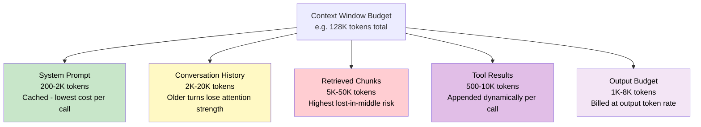

# Context Windows and Token Management

> [!abstract] TL;DR
> A context window is the total number of tokens an LLM can process in a single forward pass — input and output combined. Managing this budget well determines system cost, latency, and whether the model "sees" the information it needs to answer correctly.

---

## Intuition

**Analogy:** Imagine working with a whiteboard that holds exactly 500 sticky notes. You can read everything on the board while answering a question — but the board never scrolls. Anything older than 500 notes has been peeled off and thrown away; the model has no access to it at all.

The token budget is that whiteboard. System prompts, past conversation turns, retrieved documents, tool outputs, and the model's own reply all compete for space on it. When the board is full, you must decide what to peel off.

---

## How It Works

### What a Context Window Is

A context window is the **maximum number of tokens a model can attend to in one forward pass**. It is a hard limit set by the model's positional encoding range and architecture:

- **Input tokens** — system prompt + conversation history + retrieved context + tool results
- **Output tokens** — the tokens the model generates in response
- Both count against the **same total budget**: `input_tokens + output_tokens ≤ context_limit`

If you send 120,000 input tokens to a 128K-context model, it can generate at most 8,000 tokens of output. If you send 128,001 tokens, the request errors or the provider silently truncates.

### Token vs Word

A **token** is the smallest unit the model processes — not a character, not a word, but a learned subword unit from the tokenizer's vocabulary.

| Language / Content | Tokens per Word | Rule of Thumb |
|---|---|---|
| English (common words) | ~1.3 tokens / word | 100 words ≈ 133 tokens |
| English (overall) | ~1 token per 4 chars | 1 page (~500 words) ≈ 650 tokens |
| Code (Python) | ~1.5-3 tokens / word | Code tokenizes less efficiently |
| Chinese / Japanese | ~1-2 tokens / character | Each character is often its own token |
| Rare or technical words | Up to 5 tokens / word | "antidisestablishmentarianism" → 6 tokens |

The standard OpenAI rule: **1 token ≈ 0.75 English words** (or ¾ of a word). So 100 tokens ≈ 75 words. Different models use different tokenizers, so the same text produces different token counts — never assume counts are portable across providers.

### Context Window Sizes (2025)

| Model | Context Window | Notes |
|---|---|---|
| GPT-4o | 128K tokens | ~96K words; standard for most workloads |
| Claude 3.5 Sonnet / Opus | 200K tokens | ~150K words; strong long-doc performance |
| Gemini 1.5 Pro / Flash | 1M–2M tokens | Entire codebases or book-length docs |
| Llama 3.1 (8B, 70B, 405B) | 128K tokens | Open-weight; matches GPT-4o window |
| Mistral Large | 128K tokens | Via RoPE extension |
| GPT-3.5-turbo | 16K tokens | Older; largely superseded |

Context windows have roughly doubled every 12 months. The architectural bottleneck is now cost and the "lost in the middle" problem, not raw sequence length.

### What Fits in a Context

Every token in the context window competes for the model's attention. The typical decomposition:

```
[System Prompt] [Conv. History] [Retrieved Chunks] [Tool Results] ← Input
[Generated Reply]                                                  ← Output
|___________________________________________________________|
                Total context window budget
```

| Component | Typical Size | Stability |
|---|---|---|
| System prompt | 200–2,000 tokens | Static; ideal for prompt caching |
| Conversation history | 2K–20K tokens | Grows with turns; must be managed |
| RAG / retrieved chunks | 5K–50K tokens | Dynamic; highest "lost in middle" risk |
| Tool results (function calls) | 500–10K tokens | Appended per tool call |
| Output budget | 1K–8K tokens | Must be explicitly reserved |

### Flow / Architecture



---

## Token Counting and Pricing

### Counting Tokens

Use the model's native tokenizer — counts are not interchangeable across models:

- **OpenAI models**: `tiktoken` library (`cl100k_base` for GPT-4/4o, `o200k_base` for GPT-4o newer checkpoint)
- **Llama / HuggingFace models**: `AutoTokenizer.from_pretrained(model_name)`
- **Anthropic Claude**: `anthropic` Python SDK's `client.messages.count_tokens()`

### Token-Based Pricing

All major providers bill separately for input and output tokens, with output tokens costing 3–5x more than input tokens (generation requires more compute per token):

| Provider / Model | Input (per 1M) | Output (per 1M) | Cached Input |
|---|---|---|---|
| GPT-4o | ~$5.00 | ~$15.00 | ~$2.50 (50% off) |
| Claude 3.5 Sonnet | ~$3.00 | ~$15.00 | ~$0.30 (90% off) |
| Gemini 1.5 Pro | ~$3.50 | ~$10.50 | ~$0.875 (75% off) |
| Llama 3.1 (self-hosted) | GPU cost only | GPU cost only | No API billing |

*Prices are approximate mid-2025 values and change frequently. Check provider pricing pages.*

### Prompt Caching

When you send identical prefix tokens (e.g., the same system prompt) across many API calls, providers can cache the KV activations server-side and charge a steep discount on the cached portion:

- **Anthropic**: 90% discount on cached tokens; cache persists for 5 minutes; minimum prefix of 1,024 tokens
- **Google Gemini**: 75–95% discount; minimum 32K tokens to qualify; explicit `context_caching` API
- **OpenAI**: 50% discount on cached tokens; applied automatically for prompts with a common prefix > 1,024 tokens

**Practical impact**: a system with a 2,000-token system prompt and 10,000 API calls/day sees the system prompt tokens cost 90% less. At $3/M input, that saves ~$0.054 per 10,000 calls from caching alone — meaningful at scale.

---

## The "Lost in the Middle" Problem

Research by Liu et al. (2023) revealed a critical degradation pattern in how LLMs use long contexts: **models pay strong attention to the beginning and end of the context window, but attention degrades significantly for content placed in the middle**.

This is not a bug — it emerges from the U-shaped attention pattern where:
- Tokens at **position 0** (start of context) receive recency-like attention due to the causal mask and positional encoding
- Tokens at the **end** (most recent) receive the strongest attention from the query position
- Tokens in the **middle** are attended to weakly

**Practical consequences:**
- If you put critical facts at position 40K of a 128K context, the model may ignore them even though they fit in the window
- RAG chunks placed in the middle of a long context degrade more than those placed first or last
- Performance on retrieval tasks drops from ~80% accuracy (information at edges) to ~40-60% (information at middle) in controlled experiments

**Mitigation strategies:**
- Place the most important context at the beginning (system prompt) or end (most recent user turn)
- Use shorter contexts where possible — a 20K context outperforms a 100K context if the 20K contains the same information
- Prefer RAG over stuffing: retrieve only the top-k most relevant chunks rather than the entire document

---

## Context Management Strategies

When conversation history or document context grows beyond what the window can hold, or when placing content in the middle degrades quality, apply these strategies:

### 1. Sliding Window

Keep only the last `N` tokens of conversation history. Discard the oldest turns first. Simple but loses early context entirely.

```
Turn 1: User asks background question  ← Discarded
Turn 2: Assistant explains             ← Discarded
Turn 3: User references Turn 1...      ← Now context is broken
```

Best for: chatbots where recent context is all that matters.

### 2. Summarization

Compress older turns into a running summary and replace the raw turns with the summary. Preserves semantic content at a fraction of the token cost.

```
[Summary of turns 1-20: User asked about X, assistant covered Y, Z was agreed upon]
[Turn 21 raw]
[Turn 22 raw]
```

Best for: long-running agents or support chat sessions.

### 3. RAG — Selective Retrieval

Rather than loading a full document into context, retrieve only the top-k relevant chunks based on the user's current query. The context window contains only what is semantically relevant.

See [[RAG_Overview]] for the full retrieval pipeline.

### 4. Context Compression

Tools like **LLMLingua** (Microsoft, 2023) apply a small LM to identify and remove redundant tokens from a prompt — typically achieving 3–10x compression with minimal quality loss. The compressed prompt is then sent to the large model.

### 5. Hierarchical Summarization

For very long documents: chunk the document, summarize each chunk independently, then summarize the summaries. Navigate the hierarchy to answer specific questions.

---

## KV Cache and VRAM

Every token in the context window requires its Key and Value tensors to be stored in GPU memory during inference. The KV cache grows **linearly** with context length:

$$\text{KV cache (GB)} = \frac{2 \times n_{layers} \times n_{KV\_heads} \times d_{head} \times \text{seq\_len} \times \text{batch\_size} \times \text{bytes}}{10^9}$$

For **LLaMA 3.1-8B** (32 layers, 8 GQA KV heads, 128 head dim, BF16):

| Context Length | KV Cache per Request | Batch of 8 |
|---|---|---|
| 4K tokens | 0.13 GB | 1.1 GB |
| 16K tokens | 0.53 GB | 4.2 GB |
| 32K tokens | 1.1 GB | 8.4 GB |
| 128K tokens | 4.2 GB | 33.5 GB |

**Key insight**: doubling the context length doubles the KV cache memory. At 128K context with a batch of 8, the KV cache alone rivals or exceeds the model weights (~16 GB for the 8B model). This is why [[KV_Cache]] management (GQA, PagedAttention, quantized KV) is the primary memory bottleneck for long-context serving.

---

## Long Context vs RAG

Both approaches let a model "see" more information, but they trade off very differently:

| Dimension | Long Context (1M tokens) | RAG (Selective Retrieval) | Summarization |
|---|---|---|---|
| Information coverage | Entire document, always | Only retrieved chunks | Lossy compression |
| Accuracy at edges | High | N/A (always recent) | Depends on summary quality |
| Accuracy in middle | Degraded (lost in middle) | High (recent context) | High |
| TTFT latency | High (large prefill) | Low (small prompt) | Low |
| Cost per query | Very high (tokens billed) | Low (small input) | Low-medium |
| Needs retrieval tuning | No | Yes (embedding quality, top-k) | No |
| Handles multi-hop queries | Naturally | Requires re-ranking / iterative RAG | Loses details |
| Knowledge update | Re-send whole doc | Update vector DB only | Regenerate summary |

**Rule of thumb**:
- **Use long context** when the document is small enough (~<100K tokens) to fit comfortably, the query requires holistic understanding, or retrieval is difficult to set up.
- **Use RAG** when the knowledge base exceeds any context window, real-time updates are needed, or cost is a primary concern.
- **Use summarization** for managing conversational history that grows indefinitely.

---

## Context Extension Techniques

Models are trained at a fixed context length (e.g., 8K). Extending to 128K at inference requires adapting the **positional encoding** — specifically the [[Positional_Encoding#RoPE|RoPE]] frequencies that encode position information:

### RoPE Linear Scaling (Position Interpolation)

Scale all position indices by `training_length / target_length`. If trained at 8K and targeting 32K, divide all position IDs by 4. This compresses positions into the trained range. Requires short fine-tuning (~1K steps) to adapt the model; without fine-tuning, quality degrades.

$$\text{position\_scale} = \frac{\text{original\_context}}{\text{target\_context}}$$

Used by: CodeLlama (16K extension from 4K LLaMA 2), many open-weight fine-tunes.

### YaRN (Yet Another RoPE Extension)

Peng et al. (2023). Applies **adaptive temperature scaling** to the attention softmax based on context length, and uses non-uniform interpolation — high-frequency RoPE dimensions are scaled more conservatively than low-frequency ones.

$$\theta_i^{\text{YaRN}} = \frac{1}{10000^{2i/d} \cdot s(i)}$$

Where $s(i)$ is a per-dimension scale factor. YaRN achieves better perplexity than linear scaling at the same extended length and requires less fine-tuning. Used by: Mistral 7B v0.2 (32K), Qwen models.

### LongRoPE

Microsoft (2024). Piecewise interpolation — different position ranges use different scaling factors, tuned by evolutionary search. Achieves 2M-token context extension with minimal quality loss for LLaMA 2. The model is fine-tuned in two stages: short fine-tuning at the extended length, then long fine-tuning with documents at full length.

**Bottom line**: all three techniques modify the RoPE base frequency $\theta$ or the position indices; YaRN is the current best practice for open-weight models; LongRoPE demonstrates the upper bound. None eliminates the lost-in-the-middle degradation problem.

---

## Code Demo

```python
# Demonstrates: token counting with tiktoken, cost estimation,
# and KV cache memory growth with context length.

import tiktoken
from transformers import AutoTokenizer

# ── 1. Token counting with tiktoken (OpenAI models) ───────────────────────
enc = tiktoken.encoding_for_model("gpt-4o")

system_prompt = "You are a helpful assistant specializing in data science."
user_message = "Explain the difference between precision and recall with an example."
long_rag_chunk = "Precision and recall are evaluation metrics for classification. " * 200

def count_tokens(text: str, encoder) -> int:
    return len(encoder.encode(text))

sp_tokens   = count_tokens(system_prompt, enc)
usr_tokens  = count_tokens(user_message, enc)
rag_tokens  = count_tokens(long_rag_chunk, enc)
word_count  = len(user_message.split())

print(f"System prompt : {sp_tokens} tokens")
print(f"User message  : {usr_tokens} tokens ({word_count} words → "
      f"{word_count / usr_tokens:.2f} words/token)")
print(f"RAG chunk     : {rag_tokens} tokens")

# ── 2. Cost estimation with prompt caching ────────────────────────────────
# Approximate GPT-4o pricing (mid-2025); verify at platform.openai.com
INPUT_PRICE_PER_M  = 5.00   # USD per million input tokens
OUTPUT_PRICE_PER_M = 15.00  # USD per million output tokens
CACHE_RATE         = 0.50   # OpenAI: 50% off cached tokens
                             # Anthropic: use 0.10 (90% off)

daily_calls       = 10_000
output_tokens_est = 300     # average response length

# Without caching: every call sends full input
total_input_no_cache  = (sp_tokens + usr_tokens) * daily_calls
cost_no_cache = (
    total_input_no_cache / 1_000_000 * INPUT_PRICE_PER_M
    + output_tokens_est * daily_calls / 1_000_000 * OUTPUT_PRICE_PER_M
)

# With caching: system prompt is cached; only user message is billed fresh
cached_tokens = sp_tokens * daily_calls
fresh_tokens  = usr_tokens * daily_calls
cost_with_cache = (
    cached_tokens / 1_000_000 * INPUT_PRICE_PER_M * CACHE_RATE
    + fresh_tokens / 1_000_000 * INPUT_PRICE_PER_M
    + output_tokens_est * daily_calls / 1_000_000 * OUTPUT_PRICE_PER_M
)

print(f"\nDaily cost (no caching):   ${cost_no_cache:.2f}")
print(f"Daily cost (with caching): ${cost_with_cache:.2f}")
print(f"Daily saving:              ${cost_no_cache - cost_with_cache:.2f}")

# ── 3. KV cache memory vs context length ──────────────────────────────────
def kv_cache_gb(
    n_layers: int,
    n_kv_heads: int,
    head_dim: int,
    seq_len: int,
    batch_size: int = 1,
    bytes_per_el: int = 2,  # BF16 = 2 bytes
) -> float:
    return (
        2 * n_layers * n_kv_heads * head_dim * seq_len * batch_size * bytes_per_el
    ) / (1024 ** 3)

# LLaMA 3.1-8B: 32 layers, 8 KV heads (GQA), 128 head_dim
print("\n--- LLaMA 3.1-8B KV cache vs context length (batch=1) ---")
for ctx in [4_096, 16_384, 32_768, 65_536, 131_072]:
    mem = kv_cache_gb(n_layers=32, n_kv_heads=8, head_dim=128, seq_len=ctx)
    print(f"  {ctx:7,} tokens → {mem:.2f} GB")

# ── 4. HuggingFace tokenizer (Llama, open-weight) ─────────────────────────
tokenizer = AutoTokenizer.from_pretrained("meta-llama/Llama-3.1-8B-Instruct")
code_snippet = "def quicksort(arr): return arr if len(arr) <= 1 else quicksort([x for x in arr[1:] if x <= arr[0]]) + [arr[0]] + quicksort([x for x in arr[1:] if x > arr[0]])"
english_text = "Quicksort is a divide and conquer sorting algorithm."

code_tok   = tokenizer.encode(code_snippet)
eng_tok    = tokenizer.encode(english_text)
code_words = len(code_snippet.split())
eng_words  = len(english_text.split())

print(f"\nCode  ({code_words} words): {len(code_tok)} tokens "
      f"({len(code_tok) / code_words:.2f} tokens/word)")
print(f"English ({eng_words} words): {len(eng_tok)} tokens "
      f"({len(eng_tok) / eng_words:.2f} tokens/word)")
# Code tokenizes less efficiently than English prose
```

---

## Real-World Example

> **Example:** Anthropic's production API for Claude demonstrates the interplay of all these concepts. When an enterprise customer calls Claude with a 10,000-token legal system prompt + a 2,000-token user query 50,000 times per day, Anthropic's prompt caching (90% discount on the static system prompt prefix) reduces that customer's daily bill from ~$1,800 to ~$300 — a 6x cost reduction. The 200K context window allows entire contracts to be analyzed in a single call instead of chunked RAG, but Anthropic advises placing the contract text near the end of the context (just before the user question) to avoid the lost-in-the-middle penalty on critical clauses. Meanwhile, each 200K-token request occupies roughly 4–5 GB of KV cache on Anthropic's serving cluster per inflight sequence — the primary reason long-context pricing carries a premium even with input-token discounts.

---

## Trade-offs

| Approach | Latency (TTFT) | Cost | Quality at Middle | Setup Complexity | Max Coverage |
|---|---|---|---|---|---|
| Long context (full doc) | High — large prefill | High — all tokens billed | Degraded past 50K | None | Bounded by window |
| RAG — selective retrieval | Low — small prompt | Low — only top-k chunks | High — always recent | High (embeddings, vector DB) | Unlimited |
| Sliding window history | Low | Low | Loses old context entirely | Minimal | Last N tokens only |
| Summarization | Medium | Medium — summary generation | High — semantically compressed | Medium (summarize prompt) | Lossy; misses fine detail |
| Context compression (LLMLingua) | Medium | Lower — fewer tokens sent | Moderate | Medium (extra LM step) | 3-10x compression |

---

## When to Use vs Avoid

**Use long context when:**
- The full document is under 50K tokens and must be understood holistically
- Multi-hop reasoning requires the model to cross-reference sections throughout the document
- Retrieval is ambiguous — you cannot write a good query to find the right chunk
- Cost is a secondary concern and accuracy is paramount

**Avoid long context when:**
- The knowledge base is larger than the context window (RAG is the only option)
- You need fresh or real-time information (vector DB updates are cheaper than re-sending docs)
- You are placing critical information in the middle of a 100K+ context (lost in the middle)
- Budget constraints dominate — prefer RAG + short context

**Use prompt caching when:**
- System prompts, tool schemas, or reference documents repeat across many API calls
- You are using Anthropic or Google Gemini (90%+ discounts dwarf OpenAI's 50%)
- Minimum prefix length requirements are met (1,024 tokens for Anthropic)

---

## Common Pitfalls

- **Confusing context limit with output limit** — the context window is `input + output` combined. Sending 126K input tokens to a 128K model leaves only 2,000 tokens for the output; the response will be truncated. Always reserve explicit headroom for output.
- **Token count portability** — 1,000 tokens in `tiktoken` (GPT-4o) is not 1,000 tokens in LLaMA's tokenizer. The same text can differ by 10–30% between tokenizers. Never hardcode token counts across model providers.
- **Ignoring KV cache costs in VRAM budgets** — at 128K context, KV cache alone can occupy 4–8 GB per inflight request. Plan GPU memory allocation around both model weights and KV cache, not just weights.
- **Stuffing retrieved context in the middle** — placing RAG chunks at position 20K–80K of a 128K context puts them squarely in the lost-in-the-middle zone. Prepend the most critical chunk or append it just before the user's question.
- **Assuming prompt caching applies immediately** — Anthropic's cache requires the prefix to appear unchanged in consecutive requests; any modification resets the cache. Use a static system prompt block and keep dynamic content after the static prefix.
- **Skipping output token budget planning** — applications that allow unbounded `max_tokens` can over-generate, driving up cost. Set explicit per-call output limits (e.g., 512 or 1,024 tokens) and let users request more if needed.

---

## Related Concepts

- [[_MOC_NLP|Section MOC]]

- [[KV_Cache]] — context length directly controls KV cache memory: every extra token adds to the K/V tensors stored per layer; the memory formula is linear in `seq_len`
- [[Tokenization]] — how raw text is split into tokens; token counts depend on the model's vocabulary and subword algorithm
- [[Tokenization_Algorithms]] — BPE (GPT/Llama), WordPiece (BERT), and SentencePiece differ in efficiency; the algorithm determines tokens-per-word ratios
- [[LLM_Architecture_Deep_Dive]] — GQA reduces KV cache 4–8x, directly enabling longer practical context; RoPE is the positional mechanism that context extension techniques modify
- [[Positional_Encoding]] — RoPE, YaRN, and LongRoPE are all positional encoding extensions; a model's context limit is bounded by its PE's extrapolation ability
- [[RAG_Overview]] — the primary alternative to long context; retrieves only relevant chunks instead of placing entire documents in the window
- [[LLM_Inference_Optimization]] — prefill phase (processing input tokens) is where long-context latency hits; Flash Attention and continuous batching reduce the cost of long prefills
- [[Speculative_Decoding]] — works alongside the KV cache; draft model generates candidate tokens over the existing context, which is verified by the target model in one pass
- [[Memory_in_Agents]] — agent systems must manage context across many turns and tool calls; the strategies covered here (sliding window, summarization, RAG) are the implementation primitives

---

## Review Questions

1. A user sends a 110,000-token prompt to a model with a 128K context window and requests `max_tokens=20000`. What happens, and what is the correct way to budget the context for long documents with substantial expected outputs?

2. You are building a customer support chatbot. After 50 conversation turns, the history exceeds the context window. Compare sliding window, summarization, and RAG-based memory as solutions — what does each lose and what does each preserve? Which would you choose if the most common failure mode is "the user refers back to something they said 30 turns ago"?

3. A retrieval pipeline places 40,000 tokens of retrieved documents at positions 30,000–70,000 in a 128,000-token context window (surrounded by the system prompt at the start and the user query at the end). Explain the "lost in the middle" failure mode and redesign the context layout to mitigate it without reducing total retrieved content.

---

## Sources

- [Liu et al. (2023). Lost in the Middle: How Language Models Use Long Contexts](https://arxiv.org/abs/2307.03172)
- [Peng et al. (2023). YaRN: Efficient Context Window Extension of Large Language Models](https://arxiv.org/abs/2309.00071)
- [Chen et al. (2023). Extending Context Window of Large Language Models via Positional Interpolation](https://arxiv.org/abs/2306.15595)
- [Ding et al. (2024). LongRoPE: Extending LLM Context Window Beyond 2 Million Tokens](https://arxiv.org/abs/2402.13753)
- [OpenAI Tokenizer Guide](https://platform.openai.com/docs/concepts/tokens)
- [Anthropic Prompt Caching Documentation](https://docs.anthropic.com/en/docs/build-with-claude/prompt-caching)
- [tiktoken GitHub](https://github.com/openai/tiktoken)

---

#context-window #tokens #llm #long-context #prompt-engineering #token-management #lost-in-the-middle #rag #kv-cache #rope-extension
