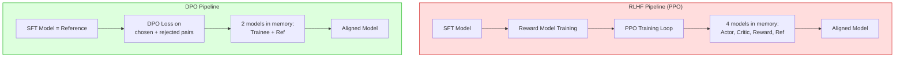

# ⚖️ Direct Preference Optimization (DPO)

> [!abstract] TL;DR
> DPO eliminates the reward model and RL loop from RLHF. Instead, it directly fine-tunes the language model on preference data (`chosen` vs `rejected` response pairs) using a simple cross-entropy-style loss. The LM itself acts as an implicit reward model. DPO is more stable, cheaper, and produces competitive or better results than PPO-based RLHF. It has become the default alignment method for open-source LLMs.

---

## Intuition — Analogy First

**RLHF says**: train a separate judge (reward model), then have the LLM play a game to maximise that judge's score (RL). Two models, two training loops, notoriously unstable.

**DPO says**: skip the middleman. Instead of training a judge and then optimising against it, just **directly show the model examples of preferred vs rejected responses**. "When you see this question, write an answer like *this* (chosen), not like *that* (rejected)."

It's like teaching a student by showing comparative examples — "here are two essays; the first is better, learn why" — instead of first training a professor to grade essays and then having the student write hundreds of essays to maximise their grade.

---

## How It Works — Mechanics

### The RLHF Bottleneck

Classical RLHF (as in InstructGPT) requires:
1. Collect human preference pairs: `(prompt, chosen, rejected)`
2. Train a **reward model** $r_\phi$ to assign higher scores to `chosen`
3. Fine-tune the LLM with **PPO** to maximise $r_\phi$ while staying close to the SFT reference model (KL regularisation)

Step 3 is notoriously unstable — PPO requires careful hyperparameter tuning, is sensitive to reward hacking, and needs 4 models simultaneously (actor, critic, reward, reference).

### The DPO Insight

Rafailov et al. (2023) showed that the optimal RLHF policy has a **closed-form expression** in terms of the reference policy:

$$r^*(x, y) = \beta \log \frac{\pi^*(y \mid x)}{\pi_{\text{ref}}(y \mid x)} + \beta \log Z(x)$$

This means: given the optimal reward function, the optimal policy *is* the reward function (up to normalisation). We can therefore **reparameterise** the reward model in terms of the language model directly, and derive a loss that only requires the LLM — no separate reward model needed.

### DPO Loss Derivation

The Bradley-Terry preference model says:

$$P(y_w \succ y_l \mid x) = \sigma(r(x, y_w) - r(x, y_l))$$

Substituting the reparameterised reward:

$$\mathcal{L}_\text{DPO}(\pi_\theta; \pi_\text{ref}) = -\mathbb{E}_{(x, y_w, y_l) \sim \mathcal{D}} \left[ \log \sigma\!\left( \beta \log \frac{\pi_\theta(y_w \mid x)}{\pi_\text{ref}(y_w \mid x)} - \beta \log \frac{\pi_\theta(y_l \mid x)}{\pi_\text{ref}(y_l \mid x)} \right) \right]$$

Where:
- $y_w$ = chosen (preferred) response
- $y_l$ = rejected (dispreferred) response
- $\pi_\theta$ = the model being trained
- $\pi_\text{ref}$ = frozen reference model (SFT checkpoint)
- $\beta$ = KL penalty strength (typically 0.1–0.5)

**Intuition of the loss**: increase the (log-prob ratio) of the chosen response relative to the reference, while decreasing it for the rejected response. $\beta$ controls how far from the reference you're allowed to move.

### SimPO Variant

**SimPO** (Simple Preference Optimization, 2024) removes the reference model entirely, replacing it with the model's own average log-probability as a normaliser. Even simpler — no reference model forward pass needed, cutting memory requirements roughly in half.

### Mermaid: RLHF vs DPO Pipelines



---

## The Math

### Full DPO Loss

$$\mathcal{L}_\text{DPO} = -\mathbb{E}_\mathcal{D}\!\left[\log \sigma\!\left(\beta \underbrace{\log\frac{\pi_\theta(y_w|x)}{\pi_\text{ref}(y_w|x)}}_{\text{chosen reward}} - \beta \underbrace{\log\frac{\pi_\theta(y_l|x)}{\pi_\text{ref}(y_l|x)}}_{\text{rejected reward}}\right)\right]$$

### Implicit Reward

The implicit reward assigned by the trained DPO model to a response $y$ given prompt $x$:

$$\hat{r}(x, y) = \beta \log \frac{\pi_\theta(y \mid x)}{\pi_\text{ref}(y \mid x)}$$

This means the DPO-trained model can itself be used to score preferences — no separate reward model needed.

### KL Divergence Constraint

DPO implicitly constrains:

$$\mathbb{E}_x \left[ \text{KL}(\pi_\theta(\cdot \mid x) \| \pi_\text{ref}(\cdot \mid x)) \right] \leq \epsilon$$

$\beta$ controls the tightness: high $\beta$ → stay close to reference; low $\beta$ → allow larger divergence.

---

## Code Demo

### TRL DPOTrainer

```python
from datasets import load_dataset
from transformers import AutoModelForCausalLM, AutoTokenizer, BitsAndBytesConfig
from trl import DPOTrainer, DPOConfig
from peft import LoraConfig
import torch

# ── 1. Models ──
model_name = "meta-llama/Llama-3.2-3B-Instruct"  # SFT checkpoint

bnb_config = BitsAndBytesConfig(
    load_in_4bit=True,
    bnb_4bit_quant_type="nf4",
    bnb_4bit_compute_dtype=torch.bfloat16,
)

# Policy model (trained)
model = AutoModelForCausalLM.from_pretrained(
    model_name,
    quantization_config=bnb_config,
    device_map="auto",
)
tokenizer = AutoTokenizer.from_pretrained(model_name)
tokenizer.pad_token = tokenizer.eos_token

# Reference model is automatically created from model_name by DPOTrainer
# (frozen copy of the SFT checkpoint)

# ── 2. LoRA config ──
lora_config = LoraConfig(
    r=16,
    lora_alpha=32,
    target_modules=["q_proj", "k_proj", "v_proj", "o_proj"],
    lora_dropout=0.05,
    bias="none",
    task_type="CAUSAL_LM",
)

# ── 3. Dataset — must have "prompt", "chosen", "rejected" columns ──
# Each is a list of message dicts OR a plain string
dataset = load_dataset("HuggingFaceH4/ultrafeedback_binarized", split="train_prefs[:5000]")
eval_dataset = load_dataset("HuggingFaceH4/ultrafeedback_binarized", split="test_prefs[:500]")

# Dataset format expected by DPOTrainer:
# {
#   "prompt": "What is 2+2?",
#   "chosen": "The answer is 4.",
#   "rejected": "I'm not sure, maybe 5?"
# }
# OR in messages format (list of {role, content} dicts)
# DPOTrainer handles both via apply_chat_template

# ── 4. DPO Config ──
dpo_config = DPOConfig(
    output_dir="./dpo_llama3_checkpoints",
    num_train_epochs=1,
    per_device_train_batch_size=2,
    gradient_accumulation_steps=8,
    learning_rate=5e-5,
    beta=0.1,                          # KL penalty — how far from reference model
    lr_scheduler_type="cosine",
    warmup_ratio=0.1,
    bf16=True,
    max_length=1024,
    max_prompt_length=512,
    logging_steps=10,
    save_steps=200,
    eval_steps=200,
    report_to="wandb",
    loss_type="sigmoid",               # "sigmoid" = DPO; "ipo" = IPO variant
)

# ── 5. Train ──
trainer = DPOTrainer(
    model=model,
    ref_model=None,          # None → auto-create frozen copy of model
    args=dpo_config,
    train_dataset=dataset,
    eval_dataset=eval_dataset,
    tokenizer=tokenizer,
    peft_config=lora_config,
)

trainer.train()

# ── 6. Inspect implicit rewards ──
# DPOTrainer logs "rewards/chosen", "rewards/rejected", "rewards/margins"
# Watch that margin increases and rejected rewards decrease during training
```

### Checking Preference Dataset Format

```python
# Inspect your dataset to verify format
sample = dataset[0]
print("Keys:", sample.keys())
# Expected: dict_keys(['prompt', 'chosen', 'rejected'])

print("Prompt:", sample["prompt"][:200])
print("\nChosen (first 200 chars):", sample["chosen"][:200])
print("\nRejected (first 200 chars):", sample["rejected"][:200])

# Compute reward margin for a batch (diagnosis tool)
import torch
from torch.nn.functional import log_softmax

def compute_dpo_rewards(model, ref_model, batch, beta=0.1):
    """Compute implicit DPO rewards for debugging."""
    with torch.no_grad():
        # Policy model log-probs
        policy_logits_w = model(**batch["chosen_input"]).logits
        policy_logits_l = model(**batch["rejected_input"]).logits

        # Reference model log-probs
        ref_logits_w = ref_model(**batch["chosen_input"]).logits
        ref_logits_l = ref_model(**batch["rejected_input"]).logits

    # Compute per-token log-probs then sum over sequence
    # (simplified — actual implementation handles masking)
    reward_w = beta * (policy_logits_w.mean() - ref_logits_w.mean())
    reward_l = beta * (policy_logits_l.mean() - ref_logits_l.mean())
    margin = reward_w - reward_l
    return reward_w.item(), reward_l.item(), margin.item()
```

---

## Real-World Example

**LLaMA 3 Instruct (Meta, 2024):** The Llama 3 alignment pipeline uses iterative DPO — multiple rounds of DPO training where the model from the previous round is used to generate new preference pairs (rejection sampling fine-tuning + DPO). This "iterative DPO" approach addresses the limitation that DPO overfits to static preference datasets.

**Mistral / Mixtral Instruct:** Uses DPO as the primary alignment step after SFT. Most open-source model fine-tuning projects (Nous Research, cognitivecomputations, WizardLM) have standardised on DPO.

**Zephyr-7B-beta (HuggingFace H4):** Trained with dDPO (distilled DPO on UltraFeedback data). Demonstrated that a 7B model can match or exceed GPT-3.5 on instruction-following benchmarks via DPO.

---

## Trade-offs

| Factor | DPO | RLHF (PPO) |
|---|---|---|
| Training stability | High — no RL instability | Low — PPO requires careful tuning |
| Memory requirement | 2 models (policy + ref) | 4 models (actor + critic + reward + ref) |
| Infrastructure complexity | Low — standard fine-tuning | High — RL training loop |
| Performance | Competitive/better on most tasks | Slightly better on complex reasoning |
| Reward hacking | Implicit — harder to game | Explicit — can overfit reward model |
| Data requirement | Preference pairs (chosen/rejected) | Same preference pairs |
| Iteration speed | Fast (same as SFT) | Slow (PPO steps) |

---

## When to Use vs Avoid

**Use DPO when:**
- You have preference pairs `(prompt, chosen, rejected)` from human feedback or AI feedback
- You want alignment without RL infrastructure
- Your team lacks RL expertise
- You want to quickly iterate on alignment objectives
- Fine-tuning a model up to 70B parameters

**Consider RLHF/PPO when:**
- You need online RL (generating responses during training based on current policy)
- Your task requires exploration (DPO is offline — fixed dataset)
- You need very precise reward shaping (e.g., verifiable correctness in math)
- You have a dedicated ML infrastructure team

**Avoid DPO when:**
- Your preference dataset is small (< 1K pairs) — DPO will overfit
- Your `chosen` responses are barely better than `rejected` (low signal margin)
- You haven't done SFT first — DPO without an SFT foundation rarely works well

---

## Common Pitfalls

1. **Skipping the SFT step** — DPO requires a good SFT model as the reference. Running DPO on a raw base model almost never works.
2. **β too low** — small β allows the model to diverge far from the reference, leading to mode collapse or degenerate outputs. Start with β = 0.1 and increase if outputs degrade.
3. **Contaminated chosen/rejected pairs** — if the quality gap between chosen and rejected is small, DPO learns nothing. Filter pairs where the reward gap (from a reward model) is < 0.5.
4. **Not monitoring reward margin** — the metric `rewards/margin = rewards/chosen - rewards/rejected` should increase during training. Flat or decreasing margin means DPO isn't learning.
5. **Static dataset distribution shift** — after one round of DPO, the model has shifted from the reference, so the preference dataset is now "stale." Use iterative DPO (re-generate rejected samples from the updated policy) for best results.
6. **Using DPO to fix hallucinations** — DPO aligns *style and preferences*, not *factuality*. Use RAG or RLHF with factuality-specific reward models for hallucination reduction.

---

## Related Concepts

- [[_MOC_NLP|↑ Section MOC]]

- [[RLHF]] — the predecessor alignment approach DPO was designed to simplify
- [[Instruction_Tuning]] — the SFT stage that must precede DPO
- [[Constitutional_AI]] — Anthropic's approach using AI-generated preference data (RLAIF), which can feed DPO
- [[PPO]] — the RL algorithm used in classical RLHF, replaced by DPO in most modern pipelines
- [[LoRA]] — typically used with DPO to make fine-tuning feasible on a single GPU

---

## Review Questions

1. DPO's loss function includes a reference model $\pi_\text{ref}$. What is the purpose of this reference model, and what happens mathematically if $\beta \to 0$ or $\beta \to \infty$?

2. Explain why skipping the SFT step and running DPO directly on a base pretrained model typically fails, even if you have high-quality preference data.

3. Compare DPO and RLHF (PPO) on the dimension of "online vs offline" learning. What advantage does online RL have that DPO lacks, and in what types of tasks does this matter most?

---

## Sources

- Rafailov et al. (2023). *Direct Preference Optimization: Your Language Model is Secretly a Reward Model*. [arXiv:2305.18290](https://arxiv.org/abs/2305.18290)
- Tunstall et al. (2023). *Zephyr: Direct Distillation of LM Alignment*. [arXiv:2310.16944](https://arxiv.org/abs/2310.16944)
- Meng et al. (2024). *SimPO: Simple Preference Optimization with a Reference-Free Reward*. [arXiv:2405.14734](https://arxiv.org/abs/2405.14734)
- Meta AI (2024). *LLaMA 3 Technical Report*.
- TRL DPO Trainer Documentation: [huggingface.co/docs/trl/dpo_trainer](https://huggingface.co/docs/trl/dpo_trainer)

#llm #dpo #alignment #rlhf #fine-tuning #preferences #trl
