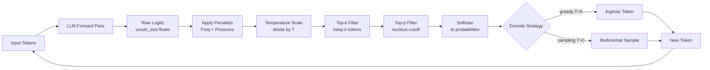

# 🎛️ Generation Controls and Sampling Parameters

> [!abstract] TL;DR
> At every generation step an LLM outputs a score vector (logits) over its entire vocabulary — sampling parameters control *how* you draw one token from that distribution. Temperature sets randomness, top-k/top-p/min-p filter the candidate pool before sampling, frequency/presence penalties discourage repetition, and stopping criteria end the loop. Getting these right is the difference between a model that hallucinates confidently and one that reliably completes tasks.

---

## Intuition

**Analogy:** Imagine a DJ with a ranked catalogue of 50,000 songs who must pick the next track after every song ends. Three knobs are available:

1. **Temperature** — how far down the ranked list are you willing to go? Turn it to zero and the DJ always plays #1. Turn it high and songs #1–#500 get nearly equal consideration.
2. **Top-k** — "only ever choose from my top 100 songs, no exceptions." Hard cutoff regardless of how confident the model is.
3. **Top-p** — "only choose from the songs that together cover 90% of tonight's audience preferences." The number of eligible songs shrinks on obvious nights and expands on adventurous ones.

An LLM generating the next token is that DJ, and sampling parameters are those knobs. Penalties add a fourth rule: "don't play a song I've already played tonight unless nothing else fits."

---

## How It Works

### Core Mechanics

Every autoregressive generation step follows this fixed pipeline:

1. **Forward pass** — input tokens pass through all transformer layers, producing one hidden state per token position
2. **Logit projection** — the final linear (unembedding) layer maps the last hidden state to a vector of size `vocab_size` (typically 32k–128k), one unnormalized score per token
3. **Penalty application** — frequency/presence penalties adjust logits for tokens already present in the context
4. **Temperature scaling** — divide all logits by scalar T
5. **Top-k filtering** — zero out (set to −∞) all but the k highest-logit tokens
6. **Top-p (nucleus) filtering** — zero out tokens outside the probability nucleus
7. **Softmax** — convert surviving logits to a valid probability distribution
8. **Sampling** — draw one token index; or take argmax for greedy decoding
9. **Append and repeat** — the sampled token is appended to the context and the loop restarts

### Temperature

Temperature T rescales logits *before* softmax:

```
P(token_i | context) = exp(logit_i / T) / Σ_j exp(logit_j / T)
```

- **T → 0**: distribution collapses to a Dirac spike on the highest-logit token (greedy decoding)
- **T = 1.0**: raw model distribution, unchanged from training
- **T > 1.0**: distribution flattens; low-probability tokens become more reachable

Practical ranges:

| Range | Character |
|-------|-----------|
| 0.0 | Fully deterministic (argmax) |
| 0.1–0.4 | Factual Q&A, structured data extraction, code |
| 0.6–0.8 | General-purpose chat |
| 0.9–1.1 | Creative writing, brainstorming |
| > 1.2 | Experimental; quality degrades rapidly |

> [!warning] Temperature alone is not enough
> If the model assigns 99% probability to one token, even T=2.0 will not meaningfully diversify the output. Temperature reshapes the distribution; top-p determines which part of it you can reach.

### Top-k Sampling

Discard all but the k tokens with the highest logits, then sample from the remainder.

```
keep_indices = argsort(logits, descending=True)[:k]
logits[all_other_indices] = -inf
```

- **k = 1**: greedy decoding — always the most probable token
- **k = 50**: GPT-2's default, a reasonable creative breadth
- **Problem with fixed k**: when the model is highly confident (peaked distribution), k=50 includes many near-zero-probability tokens that pollute sampling; when the model is uncertain (flat distribution), k=50 might exclude important candidates

### Top-p (Nucleus) Sampling

Sort tokens by probability descending, then keep the *smallest* subset whose cumulative probability reaches p. Discard everything else.

```
probs = softmax(logits)
sorted_probs, sorted_idx = sort(probs, descending=True)
cumulative_probs = cumsum(sorted_probs)
# Include up to and including the token that crosses the threshold
cutoff = first index where cumulative_probs >= p
logits[sorted_idx[cutoff+1:]] = -inf
```

- **p = 0.9**: keep tokens covering 90% of probability mass
- **p = 1.0**: no filtering
- **Key advantage over top-k**: the nucleus size adapts dynamically — small when the model is confident, large when uncertain

### Min-p Sampling

Min-p sets a threshold relative to the top token's probability:

```
threshold = min_p × max(probabilities)
keep tokens where probability >= threshold
```

If the top token has P = 0.80 and min_p = 0.05, the threshold is 0.04. Any token with P < 0.04 is discarded.

- More principled than top-p for heavy-tailed distributions — doesn't accidentally clip important low-probability tokens when the model is uncertain
- Adopted in llama.cpp, Ollama, and most local-model runtimes as a modern alternative to top-p
- Still experimental in cloud APIs; check provider support before relying on it

### Frequency Penalty

Penalizes tokens in proportion to how many times they have already appeared:

```
adjusted_logit[i] = logit[i] − frequency_penalty × count_in_output[i]
```

- **Range (OpenAI)**: 0.0–2.0
- A token used 3 times incurs 3× the penalty compared to a token used once
- Effective for long-form content where exact phrase repetition is the problem

### Presence Penalty

Flat penalty for any token that has appeared *at least once*, regardless of count:

```
adjusted_logit[i] = logit[i] − presence_penalty × (1 if count[i] > 0 else 0)
```

- **Range (OpenAI)**: −2.0 to 2.0
- Pushes the model toward new topics and vocabulary rather than staying in the same semantic neighbourhood
- Frequency penalty handles over-repetition of phrases; presence penalty handles topic diversity — they complement each other

### Repetition Penalty (GGUF / llama.cpp)

A multiplicative variant used in local runtimes (GGUF format, llama.cpp, Ollama):

```python
for each token i that appeared in context:
    if logit[i] > 0:
        logit[i] /= repetition_penalty   # shrink positive logits
    else:
        logit[i] *= repetition_penalty   # push negative logits more negative
```

- **1.0**: no effect
- **1.1–1.3**: mild, reliable repetition reduction — good general default
- **> 1.5**: can destabilise generation; model begins choosing unusual tokens to avoid repeats, producing incoherent text

### Stopping Criteria

Generation terminates when any criterion fires:

| Criterion | Behaviour |
|-----------|-----------|
| **EOS token** | Model generates its end-of-sequence token (`<\|endoftext\|>`, `<\|im_end\|>`, etc.) |
| **Stop sequences** | User-defined strings (e.g., `"\n\n"`, `"###"`, `"</answer>"`) halt generation immediately when produced |
| **max_tokens** | Hard cap on total tokens in the response |
| **max_new_tokens** | Cap on newly generated tokens only, excluding the prompt length |

> [!tip] Always set stop sequences in multi-turn pipelines
> Without them, the model may hallucinate the next user turn and then respond to it — producing a synthetic conversation that escapes your application's control.

### Beam Search

Beam search is a **deterministic** decoding strategy that tracks k candidate sequences (beams) simultaneously:

1. Initialise: one beam containing the prompt
2. Expand: for every beam, compute next-token probabilities over the full vocabulary → k × vocab_size candidates
3. Score: rank all candidates by their cumulative log-probability
4. Prune: retain only the k highest-scoring candidates as the new beam set
5. Repeat until all beams hit EOS or max_length
6. Return the beam with the highest total log-probability

Properties: deterministic, not subject to temperature or sampling variance, produces the highest-probability sequence under the model. The trade-off: high-probability sequences tend to be safe and generic — engaging, surprising, or creative text has lower probability by definition.

### Greedy vs Sampling vs Beam Search

| Strategy | Mechanism | Deterministic | Strength | Weakness |
|----------|-----------|:---:|----------|----------|
| Greedy | argmax each step | Yes | Fastest | Myopic; falls into repetition loops |
| Sampling | draw from distribution | No | Diversity, creativity | Quality varies; needs tuning |
| Beam Search | k-best sequences | Yes | Highest-probability output | Slow (k × vocab per step); dull text |
| Top-p + Temp | filtered sampling | No | Balanced quality and diversity | Requires parameter tuning |

---

### Flow / Architecture



---

## Code Demo

### OpenAI API

```python
from openai import OpenAI

client = OpenAI()

# Creative writing: high temperature + presence penalty
creative = client.chat.completions.create(
    model="gpt-4o",
    messages=[{"role": "user", "content": "Write an opening paragraph for a noir detective story."}],
    temperature=0.9,        # high randomness
    top_p=0.95,             # broad nucleus
    max_tokens=200,
    presence_penalty=0.6,   # push toward new vocabulary
    frequency_penalty=0.3,  # mild anti-repetition
    stop=["\n\n"],          # stop at first blank line
)
print(creative.choices[0].message.content)

# Code / factual: near-deterministic, no penalties
factual = client.chat.completions.create(
    model="gpt-4o",
    messages=[{"role": "user", "content": "Write a Python function to reverse a singly linked list."}],
    temperature=0.1,        # near-deterministic
    top_p=1.0,              # no nucleus filtering at low temp
    max_tokens=400,
    presence_penalty=0.0,
    frequency_penalty=0.0,
)
print(factual.choices[0].message.content)
```

### Hugging Face Transformers

```python
from transformers import AutoTokenizer, AutoModelForCausalLM
import torch

model_name = "meta-llama/Llama-3.2-3B-Instruct"
tokenizer = AutoTokenizer.from_pretrained(model_name)
model = AutoModelForCausalLM.from_pretrained(model_name, torch_dtype=torch.bfloat16)
model.eval()

prompt = "Explain backpropagation in three sentences."
inputs = tokenizer(prompt, return_tensors="pt")

with torch.no_grad():
    # Nucleus sampling
    sampled_ids = model.generate(
        **inputs,
        do_sample=True,           # enable sampling; False = greedy
        temperature=0.7,
        top_k=50,                 # top-k filter
        top_p=0.9,                # nucleus filter
        repetition_penalty=1.1,
        max_new_tokens=150,
        eos_token_id=tokenizer.eos_token_id,
    )

    # Beam search (deterministic)
    beam_ids = model.generate(
        **inputs,
        do_sample=False,
        num_beams=4,              # beam width
        early_stopping=True,
        max_new_tokens=150,
    )

print("--- Sampled ---")
print(tokenizer.decode(sampled_ids[0], skip_special_tokens=True))
print("--- Beam Search ---")
print(tokenizer.decode(beam_ids[0], skip_special_tokens=True))
```

### Manual Top-p + Temperature (from scratch)

```python
import torch
import torch.nn.functional as F

def sample_next_token(
    logits: torch.Tensor,
    temperature: float = 1.0,
    top_k: int = 0,
    top_p: float = 1.0,
) -> int:
    """Sample one token index from a logit vector."""
    if temperature == 0.0:
        return int(logits.argmax().item())

    logits = logits / temperature

    # Top-k: zero out all but top-k
    if top_k > 0:
        k = min(top_k, logits.size(-1))
        kth_value = logits.topk(k).values[-1]
        logits[logits < kth_value] = float("-inf")

    probs = F.softmax(logits, dim=-1)

    # Top-p: keep smallest subset with cumulative prob >= p
    if top_p < 1.0:
        sorted_probs, sorted_idx = torch.sort(probs, descending=True)
        cumulative = sorted_probs.cumsum(dim=-1)
        # Shift right so the token that crosses p is included
        remove = (cumulative - sorted_probs) > top_p
        sorted_probs[remove] = 0.0
        probs = torch.zeros_like(probs).scatter_(0, sorted_idx, sorted_probs)

    return int(torch.multinomial(probs, num_samples=1).item())

# Example
logits = torch.randn(32000)  # vocab_size = 32000
token_id = sample_next_token(logits, temperature=0.8, top_k=50, top_p=0.9)
print(f"Sampled token ID: {token_id}")
```

---

## Real-World Example

> **Example — Production defaults across systems:** OpenAI's ChatGPT API defaults to `temperature=1.0, top_p=1.0`, relying on the model's own distribution without truncation; the production system applies context-dependent adjustments internally. GitHub Copilot uses low temperature (~0.1–0.2) for inline completions where correctness is critical, but higher temperature in Copilot Chat for exploratory suggestions. llama.cpp ships with `temp=0.8, top_k=40, top_p=0.95, repeat_penalty=1.1` as defaults — a conservative middle ground that degrades gracefully across diverse model families. OpenAI's o1/o3 reasoning models lock `temperature=1.0` and prohibit user changes; their internal chain-of-thought tokens require genuine stochasticity to explore reasoning paths, and forcing determinism there harms benchmark performance.

---

## Trade-offs

| Use Case | Temperature | Top-p | Freq Pen | Strategy | Notes |
|----------|-------------|-------|----------|----------|-------|
| Code generation | 0.0–0.2 | 1.0 | 0.0 | Greedy / low-temp | Correctness over diversity |
| Factual Q&A | 0.1–0.3 | 0.9 | 0.1 | Low-temp sampling | Mild anti-repetition |
| General chat | 0.7 | 0.9 | 0.3 | Nucleus sampling | Balanced quality |
| Creative writing | 0.9–1.1 | 0.95 | 0.5 | Nucleus sampling | Max vocabulary diversity |
| Summarization | 0.3–0.5 | 0.9 | 0.3 | Low-temp sampling | Faithful to source |
| Translation | — | — | — | Beam search (k=4) | Deterministic, structure-preserving |

---

## When to Use vs Avoid

**Use sampling (temperature > 0) when:**
- Output quality benefits from diversity — creative writing, brainstorming, varied suggestions
- You need multiple different completions for the same prompt (run n=5, pick the best)
- The "right answer" is subjective or stylistically flexible

**Use greedy / very low temperature when:**
- Correctness is the primary objective: code, math, structured data extraction
- Reproducibility matters: deterministic eval pipelines, regression tests
- The model must follow strict output format constraints (JSON, YAML, regex-validated)

**Use beam search when:**
- The task has a single best answer: machine translation, question answering from a retrieval set
- You need the globally highest-probability sequence, not a sample
- Output length is bounded and predictable (beam search is O(k × vocab × length))

**Avoid high temperature when:**
- Generating factual claims — hallucination rate increases super-linearly with temperature
- The output is parsed programmatically — JSON/YAML syntax breaks before quality degrades
- Running the model as a classifier or scorer — stochasticity introduces evaluation noise

---

## Common Pitfalls

- **Temperature=0 for long creative tasks** — greedy decoding falls into repetition loops because once a phrase is chosen, all subsequent context makes that phrase even more likely; even T=0.05 breaks the degeneracy
- **High temperature without top-p** — unfiltered high-temperature sampling can reach near-zero-probability tokens (typos, gibberish, random Unicode); always pair T > 0.8 with top_p ≤ 0.95
- **Stacking penalties too aggressively** — combining frequency_penalty=2.0 + presence_penalty=2.0 + repetition_penalty=1.5 causes the model to desperately avoid any used token, producing incoherent token sequences
- **max_tokens too low** — the model is truncated mid-sentence; set it to at least 2× the expected response length, or use `max_new_tokens` to decouple from prompt length
- **Missing stop sequences in pipelines** — without `stop=["\nUser:"]`, a chat model will simulate the next user turn and respond to it, generating an entire phantom conversation
- **Assuming temperature is the only diversity knob** — if the model assigns 99% probability to one token, T=2.0 cannot meaningfully diversify output; top-p or min-p are essential for reaching alternative tokens
- **Beam search for open-ended chat** — beam search maximises cumulative log-probability, which favours safe, high-probability phrases; engaging, surprising chat responses are structurally low-probability and will never win a beam search

---

## Related Concepts

- [[LLM_Architecture_Deep_Dive]] — explains how the transformer forward pass produces the raw logit vector that all sampling parameters operate on; covers the unembedding layer and softmax in detail
- [[LLM_Inference_Optimization]] — covers KV cache, continuous batching, and quantization; generation speed and sampling happen in the same autoregressive loop
- [[Tokenization]] — tokens are the atomic unit being sampled; vocabulary size sets the dimension of the logit vector and the granularity of top-k/top-p cuts
- [[GPT_Family]] — decoder-only autoregressive models are the primary architecture where these parameters apply; GPT introduced the generate-one-token-at-a-time loop
- [[Prompt_Engineering_Basics]] — prompt design and sampling parameters are complementary control surfaces; the prompt shapes which part of the distribution matters, parameters shape how you draw from it
- [[Language_Model_Basics]] — covers next-token prediction and perplexity; sampling is the inference-time counterpart to the training objective
- [[Speculative_Decoding]] — inference acceleration technique that uses the same sampling semantics to accept or reject draft tokens from a smaller model

---

## Review Questions

1. A user says their creative writing assistant gives nearly identical stories on every run. Walking through the generation pipeline, name two parameters you would change, what values you would set, and what new risk each change introduces.
2. You are building a pipeline that extracts structured JSON from unstructured support tickets. A colleague proposes temperature=0.8 for "flexibility." Write a counterargument citing the generation pipeline and propose a concrete alternative parameter configuration.
3. Explain why top-p is generally preferred over top-k in production LLM deployments, then describe a scenario where min-p would outperform both top-k and top-p.

---

## Sources

- [OpenAI API Reference — Chat Completions](https://platform.openai.com/docs/api-reference/chat/create)
- [Hugging Face — Generation Strategies Guide](https://huggingface.co/docs/transformers/generation_strategies)
- [The Curious Case of Neural Text Degeneration (Holtzman et al., 2020 — top-p paper)](https://arxiv.org/abs/1904.09751)
- [Globally Optimal Sampling (min-p paper, 2024)](https://arxiv.org/abs/2407.01082)
- [llama.cpp Generation Parameters Reference](https://github.com/ggerganov/llama.cpp/blob/master/examples/main/README.md)

---

#nlp #llm #sampling #generation #inference #decoding
