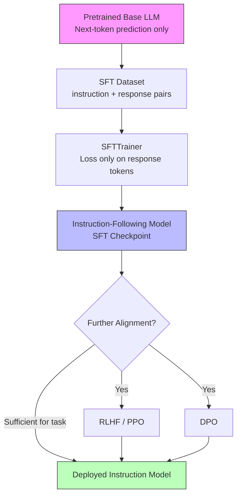

# 📋 Instruction Tuning

> [!abstract] TL;DR
> Instruction tuning (SFT — Supervised Fine-Tuning) transforms a raw pretrained language model into an assistant that follows natural-language instructions. The model already has the knowledge; SFT teaches it the format: respond to requests helpfully and coherently. It precedes and enables RLHF alignment. Even a few thousand high-quality instruction-response pairs dramatically improves usability.

---

## Intuition — Analogy First

Imagine hiring a brilliant generalist — they've read everything: history, medicine, law, code. But left alone, they'll just ramble associations. Now you give them a **crash course in following instructions**: "When asked a question, answer it directly. When asked to write code, write code. Be concise. Don't make things up." Suddenly, all that knowledge is useful on demand.

That's instruction tuning. The knowledge was already there from pretraining. SFT teaches the model **how to apply it in response to requests**.

---

## How It Works — Mechanics

### The Core Idea

A base LLM trained with CLM generates text that continues whatever prompt it's given — useful for completion, not for dialogue. Instruction tuning shifts the distribution: given `(instruction, response)` pairs, fine-tune the model to **maximise likelihood of the response given the instruction**.

The loss mask is critical: during instruction tuning, loss is computed **only on the response tokens**, not the instruction tokens. The model learns to generate good responses, not to predict the instruction.

### FLAN — The Task Diversity Insight

FLAN (Fine-tuned Language Net, Wei et al. 2021) was the landmark paper showing that fine-tuning on a **diverse mixture of tasks** (NLI, translation, summarisation, QA, etc.) phrased as instructions dramatically improves zero-shot performance on held-out tasks. The key insight: **task diversity, not just data volume**, is what generalises.

FLAN-T5 and FLAN-UL2 remain strong baselines for instruction following.

### Self-Instruct and Alpaca

**Self-Instruct** (Wang et al. 2022): use a powerful LLM (GPT-3/4) to generate `(instruction, response)` pairs from seed examples, then use those to fine-tune a smaller model. Enables instruction-following capability to be distilled cheaply.

**Alpaca** (Stanford, 2023): fine-tuned LLaMA-7B on 52K GPT-3.5-generated instruction pairs. Showed a 7B model could match GPT-3 instruction following at a fraction of the cost. Sparked the open-source fine-tuning movement.

### Chat Templates

Modern instruction-tuned models use structured chat templates to distinguish roles:

```
<|system|>
You are a helpful assistant.
<|user|>
Explain gradient descent in one sentence.
<|assistant|>
Gradient descent iteratively updates model parameters in the direction that most reduces the loss function.
```

Different models use different templates (ChatML, LLaMA-3 special tokens, Alpaca `### Instruction:` style). The tokenizer's `apply_chat_template` method handles this.

### Why Instruction Tuning ≠ RLHF

| Property | Instruction Tuning (SFT) | RLHF |
|---|---|---|
| Signal | Binary — is the response correct? | Comparative — which of two responses is better? |
| Data | `(instruction, response)` pairs | `(prompt, chosen, rejected)` pairs |
| Optimisation | Standard cross-entropy loss | RL (PPO) or implicit (DPO) |
| Alignment | Teaches task format | Aligns values, reduces harm |
| Order | First | Second (after SFT) |

SFT is the prerequisite for RLHF — you cannot run RL on a model that doesn't yet know how to follow instructions.

### Mermaid Diagram



---

## The Math

### SFT Loss (response-masked cross-entropy)

Given instruction tokens $x_{\text{inst}} = (x_1, \ldots, x_m)$ and response tokens $x_{\text{resp}} = (x_{m+1}, \ldots, x_n)$:

$$\mathcal{L}_{SFT}(\theta) = -\sum_{t=m+1}^{n} \log P_\theta(x_t \mid x_1, \ldots, x_{t-1})$$

The sum starts at $m+1$ (first response token) — instruction tokens are fed as context but excluded from loss.

### Effect of Low Learning Rate

SFT typically uses LR = $1\text{e-5}$ to $5\text{e-5}$ (vs $3\text{e-4}$ at pretraining). This preserves pretrained representations while shifting output distribution:

$$\theta_{\text{SFT}} = \theta_{\text{pretrained}} - \eta \nabla_\theta \mathcal{L}_{SFT}$$

Too high LR → catastrophic forgetting of world knowledge. Too low LR → insufficient format shift.

---

## Code Demo

### HuggingFace SFTTrainer (TRL Library)

```python
from datasets import load_dataset
from transformers import AutoModelForCausalLM, AutoTokenizer, BitsAndBytesConfig
from trl import SFTTrainer, SFTConfig
from peft import LoraConfig, get_peft_model
import torch

# ── 1. Load model (with optional 4-bit quantisation for memory efficiency) ──
model_name = "meta-llama/Llama-3.2-3B"  # base model, not instruct

bnb_config = BitsAndBytesConfig(
    load_in_4bit=True,
    bnb_4bit_quant_type="nf4",
    bnb_4bit_compute_dtype=torch.bfloat16,
)

model = AutoModelForCausalLM.from_pretrained(
    model_name,
    quantization_config=bnb_config,
    device_map="auto",
)
tokenizer = AutoTokenizer.from_pretrained(model_name)
tokenizer.pad_token = tokenizer.eos_token
tokenizer.padding_side = "right"

# ── 2. LoRA config (PEFT — only train adapters, not full model) ──
lora_config = LoraConfig(
    r=16,
    lora_alpha=32,
    target_modules=["q_proj", "k_proj", "v_proj", "o_proj"],
    lora_dropout=0.05,
    bias="none",
    task_type="CAUSAL_LM",
)

# ── 3. Dataset — format as chat template ──
dataset = load_dataset("HuggingFaceH4/ultrachat_200k", split="train_sft[:10000]")

def format_chat(example):
    """Apply tokenizer's chat template to conversations."""
    messages = example["messages"]
    formatted = tokenizer.apply_chat_template(
        messages,
        tokenize=False,
        add_generation_prompt=False,
    )
    return {"text": formatted}

dataset = dataset.map(format_chat, remove_columns=dataset.column_names)

# ── 4. SFTTrainer ──
sft_config = SFTConfig(
    output_dir="./sft_llama3_checkpoints",
    num_train_epochs=2,
    per_device_train_batch_size=4,
    gradient_accumulation_steps=4,     # effective batch = 16
    learning_rate=2e-4,
    lr_scheduler_type="cosine",
    warmup_ratio=0.05,
    bf16=True,
    logging_steps=10,
    save_steps=500,
    max_seq_length=2048,
    dataset_text_field="text",
    packing=True,                       # pack sequences to reduce padding waste
    report_to="wandb",
)

trainer = SFTTrainer(
    model=model,
    args=sft_config,
    train_dataset=dataset,
    peft_config=lora_config,
    tokenizer=tokenizer,
)

trainer.train()
trainer.save_model("./sft_llama3_final")

# ── 5. Merge LoRA weights for deployment ──
from peft import PeftModel

base_model = AutoModelForCausalLM.from_pretrained(model_name, torch_dtype=torch.bfloat16)
merged_model = PeftModel.from_pretrained(base_model, "./sft_llama3_final")
merged_model = merged_model.merge_and_unload()
merged_model.save_pretrained("./sft_llama3_merged")
```

### Dataset Formatting — Manual Chat Template

```python
# If dataset isn't in messages format, format manually
def format_alpaca(example):
    """Format Alpaca-style instruction-response pairs."""
    instruction = example["instruction"]
    input_text = example.get("input", "")
    output = example["output"]

    if input_text:
        prompt = f"### Instruction:\n{instruction}\n\n### Input:\n{input_text}\n\n### Response:\n"
    else:
        prompt = f"### Instruction:\n{instruction}\n\n### Response:\n"

    # Full text for training — loss computed on response only via SFTTrainer
    return {"text": prompt + output + tokenizer.eos_token}

alpaca_dataset = load_dataset("tatsu-lab/alpaca", split="train")
alpaca_formatted = alpaca_dataset.map(format_alpaca)
```

---

## Real-World Example

**InstructGPT (OpenAI, 2022):** The SFT stage used ~13K human-written `(prompt, response)` pairs from OpenAI labellers to fine-tune GPT-3. This SFT model then served as the starting point for RLHF training. The result was a model dramatically more preferred by humans despite being 100x smaller than the base GPT-3.

**Vicuna-13B:** Fine-tuned LLaMA-13B on ~70K ChatGPT conversation logs (scraped from ShareGPT). Achieved ~90% of ChatGPT quality on MT-Bench with <$300 in training cost.

**Alpaca:** Stanford fine-tuned LLaMA-7B on 52K GPT-3.5-generated instruction pairs. Training cost: ~$100. Demonstrated instruction tuning is democratised.

---

## Trade-offs

| Aspect | Advantage | Limitation |
|---|---|---|
| Data efficiency | 1K–100K examples sufficient | Quality matters more than quantity |
| Cost | Much cheaper than pretraining | Still needs GPU hours |
| Catastrophic forgetting | Low at correct LR | High if LR too large |
| Generalisation | Improves zero-shot instruction following | Doesn't improve factual accuracy |
| Task diversity | Broader dataset generalises more | Narrow dataset overfits to format |
| Alignment | Teaches format | Does not align values — needs RLHF/DPO |

---

## When to Use vs Avoid

**Use instruction tuning when:**
- You need a model to follow specific instruction formats or domain conventions
- You have 1K–1M high-quality `(instruction, response)` pairs
- Your task requires a specific output structure (JSON, SQL, medical reports)
- You want to distil capabilities of a large teacher model into a smaller student

**Avoid (or supplement) when:**
- You need genuine value alignment or harmlessness — add RLHF/DPO after SFT
- Your dataset has low quality responses — garbage in, garbage out; SFT will overfit to bad patterns
- You have < 500 examples — consider few-shot prompting instead

---

## Common Pitfalls

1. **Including loss on instruction tokens** — the most common mistake. Always mask out the instruction/prompt tokens so loss is only on the response. SFTTrainer does this via `dataset_text_field` + response format detection, or set `response_template` explicitly.
2. **Too high learning rate** — LR > `5e-4` causes catastrophic forgetting of world knowledge. Keep at `1e-5` to `2e-4`.
3. **Ignoring chat template consistency** — different models expect different special tokens. Always use `tokenizer.apply_chat_template` — never manually hardcode `[INST]` tags unless you're sure.
4. **Low-quality synthetic data without filtering** — GPT-4-generated data for self-instruct can include refusals, disclaimers, and verbosity that the small model will mimic. Filter aggressively.
5. **Not evaluating on held-out instructions** — SFT can easily overfit to training formats. Evaluate on diverse held-out tasks (MT-Bench, AlpacaEval) to catch overfitting.

---

## Related Concepts

- [[_MOC_NLP|↑ Section MOC]]

- [[RLHF]] — the alignment step that follows SFT; uses human preference data to fine-tune values
- [[DPO]] — replaces RLHF's RL step with a direct preference loss; often used after SFT
- [[Full_Fine_Tuning]] — update all model parameters during SFT (vs LoRA which is parameter-efficient)
- [[LoRA]] — the most common PEFT method used to reduce GPU memory during SFT
- [[Pretraining]] — the upstream phase that produces the base model SFT is applied to
- [[Constitutional_AI]] — Anthropic's RLAIF approach, which also starts with SFT (SL-CAI stage)

---

## Review Questions

1. Why is the loss mask crucial in instruction tuning, and what happens if you compute loss on both instruction and response tokens?

2. The Alpaca paper trained on 52K GPT-3.5-generated examples rather than human-written ones. What are the advantages and risks of using synthetic instruction data for SFT?

3. FLAN (2021) showed that task diversity during instruction tuning improves zero-shot generalisation. Explain the mechanism: why does training on 60 diverse tasks make the model better at a 61st held-out task?

---

## Sources

- Wei et al. (2021). *Finetuned Language Models are Zero-Shot Learners* (FLAN). [arXiv:2109.01652](https://arxiv.org/abs/2109.01652)
- Ouyang et al. (2022). *Training language models to follow instructions with human feedback* (InstructGPT). [arXiv:2203.02155](https://arxiv.org/abs/2203.02155)
- Wang et al. (2022). *Self-Instruct: Aligning Language Models with Self-Generated Instructions*. [arXiv:2212.10560](https://arxiv.org/abs/2212.10560)
- Taori et al. (2023). *Alpaca: A Strong, Replicable Instruction-Following Model*. Stanford CRFM.
- Chiang et al. (2023). *Vicuna: An Open-Source Chatbot*. LMSYS.
- TRL Documentation: [huggingface.co/docs/trl](https://huggingface.co/docs/trl)

#llm #instruction-tuning #sft #alignment #fine-tuning #trl #huggingface
