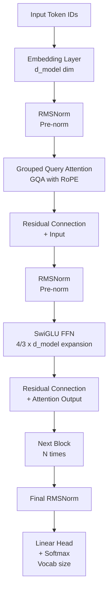

# 🏗️ LLM Architecture Deep Dive

> [!abstract] TL;DR
> Modern LLMs (LLaMA 3, Mistral, Gemma, Falcon) share a decoder-only transformer architecture with key departures from the original 2017 transformer: RMSNorm instead of LayerNorm (simpler, faster), SwiGLU activation instead of ReLU/GELU (empirically better), Grouped Query Attention (GQA) instead of Multi-Head Attention (reduces KV memory 4–8x), and Rotary Position Embeddings (RoPE) instead of learned absolute positions (handles longer contexts better). The KV cache at inference avoids recomputing attention for all previous tokens. Understanding these choices explains why LLaMA-3 outperforms GPT-2 at the same parameter count.

---

## Intuition — Analogy First

Think of the original 2017 Transformer as a perfectly functional skyscraper built from standard materials. It works great but uses expensive marble floors (LayerNorm), fluorescent lighting (ReLU activations), and keeps a full copy of every tenant's file cabinet for every meeting (full MHA KV memory).

Modern LLMs like LLaMA 3 are the same building redesigned by efficiency engineers who:
- Replaced marble with polished concrete (**RMSNorm** — same function, less computation)
- Installed LED lighting (**SwiGLU** — empirically better gradient flow)
- Consolidated file cabinets across floors (**GQA** — share KV heads across query heads)
- Built a smart addressing system so rooms know their floor *relative to the building* (**RoPE** — relative positions scale better)
- Created a lobby that stores recent files so nobody has to retrieve them again (**KV cache** — don't recompute past tokens)

Each change is modest individually. Together, they enable models 10x–100x larger to be trained and deployed at the same hardware cost.

---

## How It Works — Mechanics



### RMSNorm (Root Mean Square Normalization)

**Original LayerNorm:** Centers and scales each feature:
$$\text{LayerNorm}(\mathbf{x}) = \frac{\mathbf{x} - \mu}{\sigma} \cdot \gamma + \beta, \quad \mu = \frac{1}{d}\sum x_i, \quad \sigma = \sqrt{\frac{1}{d}\sum(x_i - \mu)^2}$$

**RMSNorm:** Removes the mean-centering (re-centering hypothesis says it's unnecessary):
$$\text{RMSNorm}(\mathbf{x}) = \frac{\mathbf{x}}{\text{RMS}(\mathbf{x})} \cdot \gamma, \quad \text{RMS}(\mathbf{x}) = \sqrt{\frac{1}{d}\sum_{i=1}^{d} x_i^2}$$

**Why it matters:**
- Eliminates mean computation (saves ~37% of LayerNorm compute)
- No shift parameter $\beta$ needed (fewer learned parameters)
- Empirically equivalent or better performance in LLM pretraining
- Used by: LLaMA, Mistral, Gemma, Falcon, OLMo

### SwiGLU Activation (Swish-Gated Linear Unit)

**Original FFN in transformer:**
$$\text{FFN}(\mathbf{x}) = \text{ReLU}(\mathbf{x} W_1 + b_1) W_2 + b_2$$

**GLU variant:**
$$\text{GLU}(\mathbf{x}) = (\mathbf{x} W + b) \otimes \sigma(\mathbf{x} V + c)$$

**SwiGLU (Shazeer, 2020):**
$$\text{SwiGLU}(\mathbf{x}, W, V, W_2) = (\text{Swish}(\mathbf{x} W) \otimes \mathbf{x} V) W_2$$

Where $\text{Swish}(x) = x \cdot \sigma(x)$ — a smooth, non-monotonic activation.

The gating mechanism ($\otimes$ is element-wise multiplication) allows the FFN to selectively amplify or suppress features. SwiGLU uses three matrices ($W, V, W_2$) instead of two — to keep parameter count equal, the expansion dimension is reduced from $4d$ to $\frac{8}{3}d \approx 2.67d$.

**Why it matters:** SwiGLU consistently improves perplexity by ~1–2 points over ReLU/GELU in LLM pretraining. Used by: LLaMA, Mistral, PaLM, Gemini.

### Grouped Query Attention (GQA)

**Multi-Head Attention (MHA):** Each attention head has its own Q, K, V matrices. With 32 heads:
- 32 Q matrices, 32 K matrices, 32 V matrices
- KV cache grows: `batch × seq_len × 2 × num_heads × head_dim × bytes`

**Multi-Query Attention (MQA):** All query heads share a single K and V head:
- 32 Q matrices, 1 K matrix, 1 V matrix
- Memory reduction: 32x for KV, but quality drops slightly

**Grouped Query Attention (GQA):** Split the middle ground. $h$ query heads grouped into $g$ groups, each group sharing one KV head.

```
MHA:  Q1 K1 V1 | Q2 K2 V2 | ... | Q32 K32 V32
MQA:  Q1..Q32  |     K1 V1      (all share one KV pair)
GQA:  Q1..Q4   | K1 V1 | Q5..Q8 | K2 V2 | ...   (g=8 groups)
```

**Memory saving:** With 32 query heads and 8 KV heads: KV cache reduced 4x vs MHA. This directly translates to larger batch sizes or longer context at the same GPU memory.

**Why it matters:** GQA enables longer context windows without proportionally growing KV cache. Used by: LLaMA-2, LLaMA-3, Mistral, Gemma 2, Gemini.

### Rotary Position Embeddings (RoPE)

**Original transformer:** Absolute learned position embeddings — each position index has a learned vector added to the token embedding. Doesn't generalize to sequences longer than training length.

**RoPE:** Instead of adding position info, rotate Q and K vectors by an angle proportional to their position:

$$\text{RoPE}(\mathbf{q}_m, m) = R_m \mathbf{q}_m, \quad R_m = \begin{pmatrix} \cos(m\theta_1) & -\sin(m\theta_1) & \cdots \\ \sin(m\theta_1) & \cos(m\theta_1) & \cdots \end{pmatrix}$$

**Key property:** The dot product $\mathbf{q}_m^T \mathbf{k}_n$ (which drives attention) depends only on the *relative* position $m - n$, not absolute positions:

$$(\text{RoPE}(\mathbf{q}_m))^T \cdot \text{RoPE}(\mathbf{k}_n) = f(m-n, \mathbf{q}, \mathbf{k})$$

This means the model naturally learns relative positions and can generalize to longer sequences via position interpolation. Used by: LLaMA, Mistral, Gemma, GPT-NeoX, Falcon.

### KV Cache at Inference

During autoregressive generation, each new token attends to all previous tokens. Without caching:
- Generating token 1: compute attention over 1 token
- Generating token 2: recompute attention over tokens 1–2
- Generating token N: recompute attention over tokens 1–N → O(N²) total work

**KV cache:** Store key and value matrices for all previously processed tokens. For each new token, only compute Q for the new token and concatenate with cached K, V:

```python
# Each generation step:
new_K = self.W_K(new_token_emb)   # only new token
new_V = self.W_V(new_token_emb)
K = torch.cat([cached_K, new_K], dim=1)   # append to cache
V = torch.cat([cached_V, new_V], dim=1)
attn = softmax(Q @ K.T / sqrt(d)) @ V
```

**Memory cost:** KV cache = `2 × num_layers × num_kv_heads × head_dim × seq_len × bytes_per_element`

For LLaMA-3-8B (32 layers, 8 KV heads, 128 head_dim, bfloat16):
- KV cache per token ≈ 2 × 32 × 8 × 128 × 2 bytes = 131KB
- For 8K context: 131KB × 8192 ≈ 1GB of KV cache alone

This is why GQA's 4–8x KV reduction is so critical at scale.

---

## The Math

**Full decoder block forward pass:**

$$\mathbf{h}_0 = \text{Embedding}(\mathbf{x})$$

For each layer $l = 1, ..., L$:
$$\mathbf{h}_l' = \mathbf{h}_{l-1} + \text{GQA}(\text{RMSNorm}(\mathbf{h}_{l-1}))$$
$$\mathbf{h}_l = \mathbf{h}_l' + \text{SwiGLU\_FFN}(\text{RMSNorm}(\mathbf{h}_l'))$$

$$\text{output} = \text{softmax}(W_{vocab} \cdot \text{RMSNorm}(\mathbf{h}_L))$$

Note: pre-norm (normalize before the sublayer) vs post-norm (normalize after): modern LLMs use pre-norm because gradients flow more stably during deep network training.

---

## Code Demo

```python
import torch
import torch.nn as nn
import torch.nn.functional as F
import math
from typing import Optional

# ── RMSNorm ────────────────────────────────────────────────────────────────────
class RMSNorm(nn.Module):
    def __init__(self, dim: int, eps: float = 1e-6):
        super().__init__()
        self.eps = eps
        self.weight = nn.Parameter(torch.ones(dim))  # learnable scale γ

    def forward(self, x: torch.Tensor) -> torch.Tensor:
        # x: (batch, seq_len, dim)
        rms = torch.sqrt(x.pow(2).mean(dim=-1, keepdim=True) + self.eps)
        return x / rms * self.weight

# ── SwiGLU Feed-Forward Network ───────────────────────────────────────────────
class SwiGLU_FFN(nn.Module):
    def __init__(self, dim: int, hidden_dim: Optional[int] = None):
        super().__init__()
        # LLaMA: hidden_dim = 2/3 * 4 * dim, rounded to multiple of 256
        hidden_dim = hidden_dim or int(2/3 * 4 * dim)
        hidden_dim = ((hidden_dim + 255) // 256) * 256  # round up to multiple of 256

        self.w1 = nn.Linear(dim, hidden_dim, bias=False)  # gate projection
        self.w2 = nn.Linear(hidden_dim, dim, bias=False)  # down projection
        self.w3 = nn.Linear(dim, hidden_dim, bias=False)  # up projection

    def forward(self, x: torch.Tensor) -> torch.Tensor:
        # SwiGLU: Swish(xW1) ⊗ (xW3), then project down
        gate = F.silu(self.w1(x))  # Swish activation = x * sigmoid(x)
        up = self.w3(x)
        return self.w2(gate * up)  # element-wise gate

# ── Rotary Position Embedding ─────────────────────────────────────────────────
def precompute_freqs_cis(dim: int, max_seq_len: int, theta: float = 10000.0):
    """Precompute RoPE rotation frequencies."""
    freqs = 1.0 / (theta ** (torch.arange(0, dim, 2).float() / dim))
    t = torch.arange(max_seq_len, dtype=torch.float32)
    freqs = torch.outer(t, freqs)   # (max_seq_len, dim/2)
    freqs_cis = torch.polar(torch.ones_like(freqs), freqs)  # complex exponential
    return freqs_cis

def apply_rotary_emb(xq: torch.Tensor, xk: torch.Tensor, freqs_cis: torch.Tensor):
    """Apply RoPE to query and key tensors."""
    xq_r = xq.float().reshape(*xq.shape[:-1], -1, 2)
    xk_r = xk.float().reshape(*xk.shape[:-1], -1, 2)
    xq_c = torch.view_as_complex(xq_r)
    xk_c = torch.view_as_complex(xk_r)
    freqs_cis = freqs_cis[:xq.shape[1], :].unsqueeze(0).unsqueeze(2)  # broadcast
    xq_out = torch.view_as_real(xq_c * freqs_cis).flatten(-2)
    xk_out = torch.view_as_real(xk_c * freqs_cis).flatten(-2)
    return xq_out.to(xq.dtype), xk_out.to(xk.dtype)

# ── Grouped Query Attention ───────────────────────────────────────────────────
class GroupedQueryAttention(nn.Module):
    def __init__(self, dim: int, n_heads: int, n_kv_heads: int):
        super().__init__()
        self.n_heads = n_heads
        self.n_kv_heads = n_kv_heads
        self.n_rep = n_heads // n_kv_heads   # how many Q heads share each KV head
        self.head_dim = dim // n_heads

        self.wq = nn.Linear(dim, n_heads * self.head_dim, bias=False)
        self.wk = nn.Linear(dim, n_kv_heads * self.head_dim, bias=False)
        self.wv = nn.Linear(dim, n_kv_heads * self.head_dim, bias=False)
        self.wo = nn.Linear(n_heads * self.head_dim, dim, bias=False)

    def forward(self, x: torch.Tensor, freqs_cis: torch.Tensor,
                mask: Optional[torch.Tensor] = None,
                cache_kv: Optional[tuple] = None):
        B, T, _ = x.shape

        # Project to Q, K, V
        xq = self.wq(x).view(B, T, self.n_heads, self.head_dim)
        xk = self.wk(x).view(B, T, self.n_kv_heads, self.head_dim)
        xv = self.wv(x).view(B, T, self.n_kv_heads, self.head_dim)

        # Apply RoPE
        xq, xk = apply_rotary_emb(xq, xk, freqs_cis)

        # KV Cache: append new K,V to cached
        if cache_kv is not None:
            cached_k, cached_v = cache_kv
            xk = torch.cat([cached_k, xk], dim=1)
            xv = torch.cat([cached_v, xv], dim=1)

        # Repeat KV heads to match Q heads (GQA expansion)
        xk = xk.repeat_interleave(self.n_rep, dim=2)  # (B, T, n_heads, head_dim)
        xv = xv.repeat_interleave(self.n_rep, dim=2)

        # Transpose for attention: (B, heads, T, head_dim)
        xq = xq.transpose(1, 2)
        xk = xk.transpose(1, 2)
        xv = xv.transpose(1, 2)

        # Scaled dot-product attention with causal mask
        attn = torch.matmul(xq, xk.transpose(-2, -1)) / math.sqrt(self.head_dim)
        if mask is not None:
            attn = attn + mask
        attn = F.softmax(attn.float(), dim=-1).to(xq.dtype)
        output = torch.matmul(attn, xv)

        output = output.transpose(1, 2).contiguous().view(B, T, -1)
        return self.wo(output), (xk, xv)  # return updated KV cache

# ── Full LLaMA-style Decoder Block ────────────────────────────────────────────
class LlamaDecoderBlock(nn.Module):
    def __init__(self, dim: int, n_heads: int, n_kv_heads: int):
        super().__init__()
        self.attention_norm = RMSNorm(dim)
        self.attention = GroupedQueryAttention(dim, n_heads, n_kv_heads)
        self.ffn_norm = RMSNorm(dim)
        self.ffn = SwiGLU_FFN(dim)

    def forward(self, x, freqs_cis, mask=None, cache_kv=None):
        # Pre-norm + residual connection (attention)
        h, new_cache = self.attention(self.attention_norm(x), freqs_cis, mask, cache_kv)
        x = x + h
        # Pre-norm + residual connection (FFN)
        x = x + self.ffn(self.ffn_norm(x))
        return x, new_cache

# Test the block
dim, n_heads, n_kv_heads, seq_len = 512, 8, 2, 16
block = LlamaDecoderBlock(dim, n_heads, n_kv_heads)
freqs_cis = precompute_freqs_cis(dim // n_heads, max_seq_len=1024)

x = torch.randn(2, seq_len, dim)  # batch=2, seq_len=16
out, kv = block(x, freqs_cis)
print(f"Input shape:  {x.shape}")
print(f"Output shape: {out.shape}")
print(f"KV cache K shape: {kv[0].shape}")
```

---

## Real-World Example

**LLaMA 3 architecture choices**

LLaMA 3 (Meta, 2024) uses exactly this architecture:
- **Vocabulary:** 128K SentencePiece BPE (4x LLaMA-2's 32K)
- **RMSNorm:** Pre-norm before every attention and FFN sublayer
- **GQA:** 8 KV heads vs 32 query heads (LLaMA-3-8B) → 4x KV memory reduction
- **RoPE:** $\theta = 500{,}000$ (vs $10{,}000$ in LLaMA-2), enabling longer context extrapolation
- **SwiGLU:** $\frac{8}{3} d_{model}$ expansion dimension, no bias terms
- **Context:** 8,192 tokens (8K) for base; 128K via fine-tuning

**Mistral 7B (2023):** Added "sliding window attention" on top of GQA+RoPE, where attention is limited to a local window of tokens. This reduces attention computation from $O(L^2)$ to $O(L \cdot w)$ where $w$ is the window size. The combination enables competitive performance with LLaMA-2 13B at 7B parameters.

---

## Trade-offs

| Component | Original Transformer | Modern LLM | Gain |
|---|---|---|---|
| Normalization | Post-LayerNorm | Pre-RMSNorm | Training stability, ~37% faster norm |
| Activation | ReLU/GELU | SwiGLU | ~1–2 PPL improvement |
| Positional encoding | Learned absolute | RoPE | Better length generalization |
| Attention | MHA (32 KV heads) | GQA (8 KV heads) | 4x KV memory reduction |
| KV Cache | Recompute each step | Cached K, V | $O(1)$ per generation step |

---

## When to Use vs Avoid

**Pre-norm (RMSNorm before sublayer):** Always use for deep networks (24+ layers). Post-norm becomes numerically unstable at depth.

**GQA:** Use when serving with long contexts (>2K tokens) or large batches where KV memory is the bottleneck. If sequence lengths are short (<512) and batch size is 1, full MHA is fine.

**RoPE vs ALiBi:** RoPE is generally preferred for dense autoregressive generation. ALiBi (Attention with Linear Biases) is an alternative that doesn't encode positions in the embeddings, making extrapolation more predictable but sometimes worse in practice.

**KV cache:** Always enable at inference time. The only reason to disable is when running activation checkpointing during training to save memory.

---

## Common Pitfalls

1. **Not accounting for KV cache memory in deployment planning** — When profiling GPU memory for inference, the model weights are fixed but KV cache grows linearly with sequence length. For an 8B model on 40GB GPU, KV cache for 8K context and batch size 8 can consume ~8GB — leaving less room for the model weights themselves.

2. **Confusing GQA with MQA** — MQA (Multi-Query Attention) uses a single KV head; GQA uses $g > 1$ KV heads. GQA is a generalization: setting $g = 1$ gives MQA, setting $g = n_{heads}$ gives MHA. GQA with $g = 8$ tends to match MHA quality while providing most of MQA's memory savings.

3. **Implementing RoPE without complex number arithmetic** — The naive implementation of RoPE applies rotation matrices, which is $O(d^2)$. Using complex number multiplication (as shown above) reduces this to $O(d)$.

4. **Forgetting that SwiGLU uses 3 weight matrices not 2** — The SwiGLU FFN has $W_1$, $W_2$, $W_3$, not just $W_1$, $W_2$. The standard FFN parameter count formula ($2 \times d_{model} \times d_{ffn}$) must be updated to $3 \times d_{model} \times d_{ffn}$ for SwiGLU. This affects total parameter count calculations.

---

## Related Concepts

- [[_MOC_NLP|↑ Section MOC]]

- [[Transformer_Architecture]] — the baseline architecture that all these components modify
- [[Attention_Mechanism]] — GQA and RoPE are modifications to the attention mechanism
- [[GPT_Family]] — GPT-2/3 use the original transformer; GPT-4 likely uses GQA/RoPE
- [[Scaling_Laws]] — architectural efficiency improvements allow more compute budget to go to scale
- [[RLHF]] — architectural training is separate from alignment; RLHF modifies the same architecture

---

## Review Questions

1. RMSNorm removes the mean-centering step from LayerNorm. The hypothesis is that re-centering is unnecessary. What does LayerNorm's mean-centering actually do mathematically, and why might it be safe to omit in transformer models specifically (hint: consider residual connections)?

2. GQA reduces the number of KV heads from 32 to 8 in a 32-head attention model. Walk through exactly how KV memory grows as a function of batch size, sequence length, and number of KV heads. If you double the batch size, what happens to KV cache memory?

3. RoPE encodes position by rotating Q and K vectors, ensuring the attention score $q_m^T k_n$ depends on relative position $m - n$ rather than absolute positions. Why is this property useful for length generalization — i.e., for processing sequences longer than those seen during training?

---

## Sources

- Zhang, B., & Sennrich, R. (2019). Root Mean Square Layer Normalization. *NeurIPS 2019*. https://arxiv.org/abs/1910.07467
- Shazeer, N. (2020). GLU Variants Improve Transformer. https://arxiv.org/abs/2002.05202
- Ainslie, J., et al. (2023). GQA: Training Generalized Multi-Query Transformer Models from Multi-Head Checkpoints. https://arxiv.org/abs/2305.13245
- Su, J., et al. (2021). RoFormer: Enhanced Transformer with Rotary Position Embedding. https://arxiv.org/abs/2104.09864
- Touvron, H., et al. (2023). LLaMA 2: Open Foundation and Fine-Tuned Chat Models. https://arxiv.org/abs/2307.09288

#nlp #llm #architecture #rmsnorm #swiglu #gqa #rope #kv-cache #advanced
