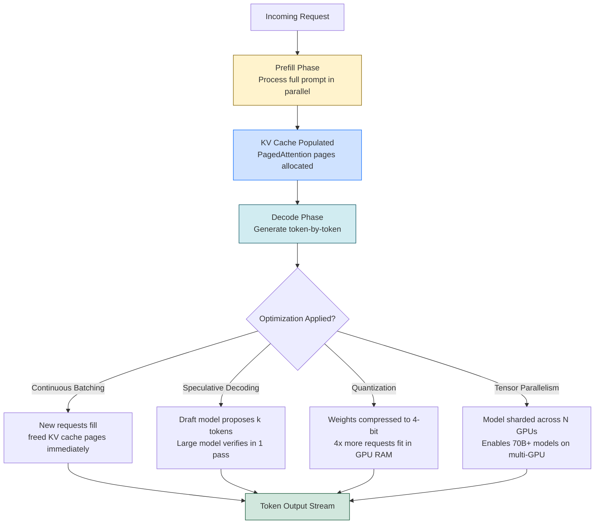

# ⚡ LLM Inference Optimization

> [!abstract] TL;DR
> LLM inference is dominated by two bottlenecks: GPU **memory bandwidth** (loading model weights per token) and **KV cache memory** (storing attention keys/values for each request). Key optimizations: KV cache (avoid recomputing attention), continuous batching with PagedAttention (vLLM — 10-50x throughput), speculative decoding (draft model proposes, large model verifies), and quantization (GPTQ/AWQ/GGUF — 2-4x memory reduction). Serving LLMs at scale is as much systems engineering as ML.

---

## Intuition — Analogy First

Imagine a **busy restaurant kitchen** (the GPU) and customers arriving for lunch (inference requests):

- **Naive serving**: one customer at a time, kitchen idles between orders — terrible utilisation
- **Static batching**: wait until you have a full table of 8, then serve everyone — some wait 20 minutes while others arrive late
- **Continuous batching (PagedAttention)**: the moment one customer finishes their appetiser, immediately start a new customer's order in that slot — no idle time, maximum throughput

The kitchen's bottleneck isn't cooking speed (FLOPS) — it's how fast the chefs can read the recipe books (memory bandwidth loading weights) and how many dishes they can keep warm simultaneously (KV cache).

---

## How It Works — Mechanics

### The Two Bottlenecks

#### 1. Memory Bandwidth Bottleneck (Weight Loading)

During autoregressive generation, the model generates **one token per forward pass**. Each forward pass must load all model weights from GPU HBM (High Bandwidth Memory) to compute units. For a 70B model in bf16:
- Model size: 70B × 2 bytes = ~140GB
- A100 80GB HBM bandwidth: ~2TB/s
- Time to load weights: 140GB / 2TB/s = 70ms per token
- Maximum throughput (single request): ~14 tokens/second

This is the **memory-bound** regime — the GPU is not compute-limited, it's bandwidth-limited. Batching amortises this cost: with batch size 16, all 16 tokens share one weight load.

#### 2. KV Cache Memory Bottleneck

Attention requires storing key-value tensors for all past tokens:

$$\text{KV cache size} = 2 \times n_\text{layers} \times n_\text{heads} \times d_\text{head} \times \text{seq\_len} \times \text{batch\_size} \times \text{bytes}$$

For LLaMA 3 70B with seq_len=8192, batch=16, bf16:
$$= 2 \times 80 \times 8 \times 128 \times 8192 \times 16 \times 2 \approx 42\text{GB}$$

The KV cache can exceed the model weights in memory. Naive implementations waste KV cache memory when requests have variable lengths.

### Key Optimizations

#### Flash Attention

IO-aware attention algorithm (Dao et al., 2022): compute attention in tiles that fit in SRAM, avoiding expensive HBM reads/writes of the full attention matrix. **Reduces attention memory from O(n²) to O(n)**. Not an approximation — exact same result, just computed efficiently. Critical for long-context models.

#### KV Cache

Store computed K,V tensors after the prefill phase (processing the prompt). During generation, only compute K,V for the new token and append to the cache — avoid recomputing the entire context each step.

**Without KV cache**: O(n²) compute per token (recompute all past attention)
**With KV cache**: O(n) compute per token (only new token's K,V needed)

#### Continuous Batching + PagedAttention (vLLM)

**Problem with static batching**: a request with sequence length 100 and one with length 2000 leave 1900 empty KV cache slots wasted.

**PagedAttention** (Kwon et al., 2023): stores KV cache in non-contiguous **pages** (like OS virtual memory). Different requests can share pages when they have the same prompt prefix. New requests fill immediately when any page becomes free.

**Continuous batching**: instead of waiting for all requests in a batch to finish, immediately add new requests as slots free up — **iteration-level scheduling** rather than request-level.

Result: **10-50x throughput improvement** over naive batching.

#### Speculative Decoding

A small **draft model** (e.g., 7B) generates $k$ candidate tokens quickly, then the **large model** (e.g., 70B) verifies all $k$ tokens in **one forward pass** (using a tree attention mask). Accepted tokens are kept; the first rejected token's correction is sampled from the large model.

- If all $k$ tokens are accepted: effectively $k$ tokens at the cost of 1 large-model pass + 1 small-model pass
- Acceptance rate ~70-80% in practice on typical text
- Best speedup for tasks with predictable continuations (code, structured text)

#### Quantization for Inference

| Format | Bits | Size Reduction | Accuracy Loss | Notes |
|---|---|---|---|---|
| BF16 (baseline) | 16 | 1x | None | Training precision |
| INT8 (LLM.int8) | 8 | 2x | Minimal | Per-channel quantisation |
| GPTQ | 4 | 4x | Small | Post-training, calibration needed |
| AWQ | 4 | 4x | Minimal | Activation-aware, better than GPTQ |
| GGUF (llama.cpp) | 2-8 | 2-8x | Varies by bit | CPU-optimised, variable bit-width |

#### Tensor Parallelism for Large Models

Shard the model across GPUs (split attention heads, FFN dimensions). Each GPU holds a slice of each weight matrix. NVLink required for low-latency all-reduce between passes. Used when the model doesn't fit on a single GPU.

### Mermaid Diagram



---

## The Math

### Compute vs Memory Bandwidth Trade-off

**Arithmetic intensity** = FLOPs / bytes moved

For a transformer forward pass with batch size $b$, sequence length $s$, and hidden dimension $d$:

$$\text{Arithmetic intensity} = \frac{2bsd^2}{2d^2 + 2bsd} = \frac{bsd}{d + bs}$$

- $b=1, s=1$ (single token generation): intensity ≈ very low → **memory-bound**
- $b=64, s=1$ (batched decoding): intensity much higher → approaches **compute-bound**

Conclusion: **batch larger to escape the memory wall**.

### KV Cache Memory Formula

$$\text{KV cache (GB)} = \frac{2 \times n_L \times n_\text{KV} \times d_h \times s \times b \times p}{10^9}$$

- $n_L$ = number of transformer layers
- $n_\text{KV}$ = number of KV heads (GQA: fewer than Q heads)
- $d_h$ = head dimension
- $s$ = sequence length
- $b$ = batch size
- $p$ = bytes per element (2 for bf16)

### Speculative Decoding Speedup

Expected tokens per large-model forward pass:

$$\mathbb{E}[\text{tokens per step}] = \frac{1 - \alpha^{k+1}}{1 - \alpha}$$

Where $\alpha$ is the acceptance rate per token and $k$ is the number of draft tokens. At $\alpha = 0.8, k = 4$: expected ~3.4 tokens per large-model step → ~3x speedup.

---

## Code Demo

### vLLM Serving

```python
# Install: pip install vllm

# ── Option 1: Python API ──
from vllm import LLM, SamplingParams

llm = LLM(
    model="meta-llama/Llama-3.1-8B-Instruct",
    gpu_memory_utilization=0.90,   # use 90% of GPU RAM for KV cache
    max_model_len=8192,
    tensor_parallel_size=1,        # increase for multi-GPU
    quantization="awq",            # use AWQ 4-bit quantized version
    dtype="auto",
)

sampling_params = SamplingParams(
    temperature=0.7,
    top_p=0.9,
    max_tokens=512,
)

prompts = [
    "Explain backpropagation in simple terms.",
    "Write a Python function to reverse a linked list.",
    "What is the capital of France?",
]

outputs = llm.generate(prompts, sampling_params)

for output in outputs:
    print(f"Prompt: {output.prompt[:50]}...")
    print(f"Generated: {output.outputs[0].text}")
    print(f"Tokens/s: {output.metrics.tokens_per_second:.1f}\n")


# ── Option 2: OpenAI-compatible REST server ──
# Launch: python -m vllm.entrypoints.openai.api_server \
#   --model meta-llama/Llama-3.1-8B-Instruct \
#   --quantization awq \
#   --gpu-memory-utilization 0.9

import openai

client = openai.OpenAI(
    base_url="http://localhost:8000/v1",
    api_key="token-abc123",   # arbitrary when running locally
)

response = client.chat.completions.create(
    model="meta-llama/Llama-3.1-8B-Instruct",
    messages=[{"role": "user", "content": "Explain attention mechanisms."}],
    max_tokens=200,
)
print(response.choices[0].message.content)
```

### llama.cpp — Quantized CPU/GPU Inference

```bash
# Install llama.cpp (C++ binary, runs on CPU or GPU)
# Download a GGUF quantized model from HuggingFace
# e.g., bartowski/Llama-3.2-3B-Instruct-GGUF

# Run with GPU offload (n-gpu-layers = number of layers to offload to GPU)
./llama-cli \
  -m ./Llama-3.2-3B-Instruct-Q4_K_M.gguf \
  --n-gpu-layers 28 \
  --threads 8 \
  --ctx-size 4096 \
  --temp 0.7 \
  -p "Explain what a transformer is:"
```

```python
# llama.cpp Python bindings (llama-cpp-python)
from llama_cpp import Llama

llm = Llama(
    model_path="./Llama-3.2-3B-Instruct-Q4_K_M.gguf",
    n_gpu_layers=28,       # offload 28 layers to GPU
    n_ctx=4096,            # context window
    n_threads=8,
)

response = llm.create_chat_completion(
    messages=[
        {"role": "system", "content": "You are a helpful assistant."},
        {"role": "user", "content": "What is quantization?"},
    ],
    max_tokens=256,
    temperature=0.7,
)
print(response["choices"][0]["message"]["content"])
```

### TGI (Text Generation Inference) — HuggingFace's Production Server

```bash
# Docker launch
docker run --gpus all --shm-size 1g \
  -p 8080:80 \
  -v $PWD/models:/data \
  ghcr.io/huggingface/text-generation-inference:latest \
  --model-id meta-llama/Llama-3.1-8B-Instruct \
  --quantize awq \
  --max-concurrent-requests 128 \
  --max-input-length 4096 \
  --max-total-tokens 8192
```

### Memory Usage Comparison

```python
import torch
from transformers import AutoModelForCausalLM, BitsAndBytesConfig

def get_model_memory_gb(model) -> float:
    param_bytes = sum(p.numel() * p.element_size() for p in model.parameters())
    buffer_bytes = sum(b.numel() * b.element_size() for b in model.buffers())
    return (param_bytes + buffer_bytes) / (1024**3)

model_name = "meta-llama/Llama-3.2-3B"

# BF16 baseline
model_bf16 = AutoModelForCausalLM.from_pretrained(model_name, torch_dtype=torch.bfloat16)
print(f"BF16: {get_model_memory_gb(model_bf16):.1f} GB")

# 4-bit NF4
bnb_config = BitsAndBytesConfig(load_in_4bit=True, bnb_4bit_quant_type="nf4")
model_4bit = AutoModelForCausalLM.from_pretrained(model_name, quantization_config=bnb_config)
print(f"4-bit NF4: {get_model_memory_gb(model_4bit):.1f} GB")

# Expected output:
# BF16:   6.4 GB
# 4-bit:  1.7 GB  (~4x reduction)
```

---

## Real-World Example

**vLLM at OpenAI and Anyscale:** vLLM was developed at UC Berkeley and immediately adopted by Anyscale (creators of Ray) and reportedly inspires OpenAI's serving infrastructure. Benchmarks show vLLM achieves 10-50x higher throughput than naive HuggingFace `model.generate()` for the same hardware at the same quality.

**Groq LPU:** Groq's custom Language Processing Unit achieves >500 tokens/second for LLaMA 3 70B by designing hardware specifically for the memory-bandwidth-bound inference workload — SRAM-heavy, compute-light architecture.

**Together AI / Fireworks AI:** production inference companies that implement all these techniques (PagedAttention, speculative decoding, AWQ quantization) to serve 100+ models efficiently on shared GPU infrastructure.

---

## Trade-offs

| Technique | Throughput Gain | Latency Impact | Quality Impact | Complexity |
|---|---|---|---|---|
| Continuous batching | 10-50x | Neutral | None | High |
| KV Cache | 10-100x | Large reduction | None | Medium |
| Flash Attention | 2-4x | Reduction | None | Medium |
| Speculative decoding | 2-4x | Reduction | None (exact) | High |
| INT8 quantization | 1.5-2x memory | Slight increase | Minimal | Low |
| AWQ 4-bit | 3-4x memory | Slight increase | Small | Medium |
| Tensor parallelism | Enables larger models | Increases (NVLink) | None | High |

---

## When to Use vs Avoid

**Use vLLM / continuous batching when:**
- Serving multiple concurrent users (production API)
- Throughput is more important than per-request latency
- You have A10G, A100, H100 GPUs

**Use llama.cpp / GGUF when:**
- Running on CPU or consumer GPUs (RTX 3090/4090)
- Developing locally without data centre hardware
- Edge/embedded deployment

**Use speculative decoding when:**
- Serving a large model where latency is critical
- You have a small "draft" model in the same model family available
- Task has predictable patterns (code completion, structured output)

**Avoid over-quantizing when:**
- Task requires precise numerical reasoning or factual recall (quantization can degrade)
- You have sufficient GPU memory for higher precision

---

## Common Pitfalls

1. **Measuring throughput with batch_size=1** — always benchmark at realistic concurrency levels. Single-request throughput is meaningless for production serving.
2. **Ignoring prefill latency** — for long prompts (RAG context), prefill dominates TTFT (Time to First Token). KV cache prefix sharing helps when prompts share prefixes.
3. **Not setting `gpu_memory_utilization` correctly in vLLM** — leaving KV cache pool too small causes OOM; too large leaves no room for model weights.
4. **Quantizing without calibration** — GPTQ requires a calibration dataset to determine quantisation scales. Using the wrong calibration data degrades quality.
5. **Tensor parallelism across slow interconnect** — TP requires all-reduce between every layer. Over PCIe (no NVLink), the communication cost eliminates the benefit. Only use TP with NVLink GPUs.

---

## Related Concepts

- [[_MOC_NLP|↑ Section MOC]]

- [[KV_Cache]] — the attention key-value cache that enables efficient autoregressive generation
- [[Speculative_Decoding]] — draft + verify decoding strategy for latency reduction
- [[Quantization]] — weight precision reduction (GPTQ, AWQ, GGUF) for memory efficiency
- [[Flash_Attention]] — IO-aware attention algorithm; prerequisite for long-context efficiency
- [[Distributed_Training_Overview]] — tensor/pipeline parallelism used at both training and inference

---

## Review Questions

1. Explain why LLM inference is "memory-bandwidth bound" rather than "compute bound" for small batch sizes. What happens to arithmetic intensity as batch size increases, and why does this matter for throughput?

2. PagedAttention (vLLM) is inspired by virtual memory in operating systems. Explain the analogy: what corresponds to pages, what corresponds to page tables, and what problem does fragmentation cause without paging?

3. Speculative decoding uses a small draft model to generate $k$ tokens which a large model then verifies. If the acceptance rate $\alpha = 0.9$ and $k = 5$, what is the expected number of tokens accepted per large-model forward pass? How does this change if $\alpha$ drops to 0.5?

---

## Sources

- Kwon et al. (2023). *Efficient Memory Management for Large Language Model Serving with PagedAttention*. [arXiv:2309.06180](https://arxiv.org/abs/2309.06180)
- Dao et al. (2022). *FlashAttention: Fast and Memory-Efficient Exact Attention with IO-Awareness*. [arXiv:2205.14135](https://arxiv.org/abs/2205.14135)
- Leviathan et al. (2022). *Fast Inference from Transformers via Speculative Decoding*. [arXiv:2211.17192](https://arxiv.org/abs/2211.17192)
- Frantar et al. (2022). *GPTQ: Accurate Post-Training Quantization for Generative Pre-trained Transformers*. [arXiv:2210.17323](https://arxiv.org/abs/2210.17323)
- Lin et al. (2023). *AWQ: Activation-aware Weight Quantization*. [arXiv:2306.00978](https://arxiv.org/abs/2306.00978)
- vLLM Documentation: [docs.vllm.ai](https://docs.vllm.ai)

#llm #inference #optimization #vllm #quantization #serving #pagedattention #speculative-decoding
