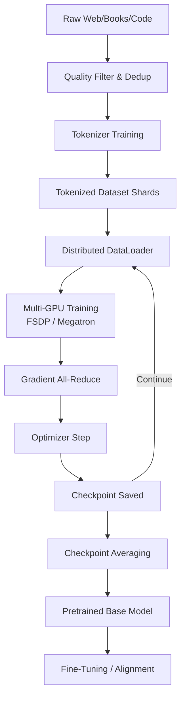

# 🧠 LLM Pretraining

> [!abstract] TL;DR
> Pretraining is the compute-intensive phase where a language model learns general world knowledge by predicting the next token across hundreds of billions of tokens. It is expensive once ($1M–$100M+) but the resulting checkpoint is reused forever via fine-tuning. Everything downstream — instruction tuning, RLHF, RAG — depends on the quality of this foundation.

---

## Intuition — Analogy First

Imagine building a **generalist brain by reading the entire internet** — every Wikipedia article, book, GitHub repo, forum thread, and scientific paper ever written. The brain doesn't memorise them verbatim; instead it builds compressed representations of language, reasoning, facts, and code. It costs a fortune to "build the brain" once, but once built, you can cheaply specialise it for surgery, law, or cooking by showing it a few thousand examples.

That's pretraining: one massive, expensive investment whose checkpoint is reused forever.

---

## How It Works — Mechanics

### Data Collection and Curation

| Source | Examples | Scale |
|---|---|---|
| Web crawls | Common Crawl, C4, RefinedWeb | Petabyte-scale raw HTML |
| Books | Books3, Project Gutenberg | Long-form coherent text |
| Code | GitHub (The Stack), CodeParrot | 100B+ tokens |
| Wikipedia | All language editions | ~4B tokens per language |
| Scientific papers | ArXiv, PubMed, S2ORC | High-quality reasoning |

**Quality filtering pipeline:**
1. Language detection (keep target language)
2. Deduplication (MinHash at document and n-gram level — duplicates hurt generalisation)
3. Heuristic filters (remove low-content pages, profanity thresholds, perplexity filters)
4. Model-based quality scoring (train small classifier on curated vs random data)

### Tokenization at Scale

Byte Pair Encoding (BPE) or SentencePiece is trained on a **representative sample** of the data before pretraining. Vocabulary size is typically 32K–128K tokens. Tokenizer is frozen for the life of the model family.

### Training Objective

Standard **causal language modelling (CLM)** — predict the next token given all previous tokens:

$$\mathcal{L} = -\sum_{t=1}^{T} \log P(x_t \mid x_{<t}; \theta)$$

No labels required. The training data is its own supervision.

### Training Infrastructure

- **Model parallelism**: Tensor parallelism (split weight matrices across GPUs), pipeline parallelism (split layers across GPU nodes)
- **Data parallelism**: Each GPU processes different micro-batches; gradients are all-reduced
- **FSDP** (Fully Sharded Data Parallelism): ZeRO-3 style — shards optimizer states, gradients, and parameters across data-parallel ranks
- **Megatron-LM**: NVIDIA's framework combining tensor + pipeline + data parallelism for multi-thousand GPU runs
- **Flash Attention**: IO-aware attention that reduces GPU memory traffic, critical at long context

### Learning Rate Schedule

```
Warmup (linear): 0 → peak LR over ~2000 steps
Cosine decay: peak LR → 10% of peak over remaining steps
```

Typical peak LR: `3e-4` for smaller models, lower for larger. Batch size is often ramped up during warmup.

### Checkpoint Averaging (Model Souping)

Final model weights are often averaged across the last N checkpoints along the loss curve — reduces variance without extra training cost.

### Mermaid Diagram



---

## The Math

### Next-Token Prediction Loss

$$\mathcal{L}_{CLM}(\theta) = -\mathbb{E}_{x \sim \mathcal{D}} \left[ \sum_{t=1}^{T} \log P_\theta(x_t \mid x_1, \ldots, x_{t-1}) \right]$$

### Perplexity (evaluation metric)

$$\text{PPL} = \exp\!\left(-\frac{1}{T}\sum_{t=1}^{T} \log P_\theta(x_t \mid x_{<t})\right)$$

Lower perplexity = better language model. GPT-2 achieved ~29 on WikiText-103; modern LLMs achieve <10.

### Scaling Laws (Chinchilla)

For a compute budget $C$ (FLOPs):

$$N^* = \frac{C}{6D^*}, \quad D^* = \frac{C}{6N^*}$$

Optimal model size $N$ and training tokens $D$ scale equally. Rule of thumb: **train on 20 tokens per parameter** (Chinchilla-optimal).

---

## Code Demo

### High-Level Training Config (LLaMA-style)

```python
# Approximate reproduction of LLaMA 3 training config
training_config = {
    "model_size": "70B",
    "architecture": "transformer_decoder",
    "vocab_size": 128_256,          # tiktoken cl100k extended
    "context_length": 8192,
    "hidden_dim": 8192,
    "num_layers": 80,
    "num_heads": 64,
    "num_kv_heads": 8,              # GQA — grouped query attention
    "ffn_dim": 28672,               # ~3.5x hidden
    "activation": "SwiGLU",
    "positional_encoding": "RoPE",
    "training_tokens": 15_000_000_000_000,  # 15T tokens
    "batch_size_tokens": 4_000_000,  # 4M tokens per step
    "learning_rate": 3e-4,
    "lr_schedule": "cosine",
    "warmup_steps": 2000,
    "weight_decay": 0.1,
    "gradient_clipping": 1.0,
    "optimizer": "AdamW",
    "adam_beta1": 0.9,
    "adam_beta2": 0.95,
    "precision": "bf16",
    "parallelism": "FSDP + tensor_parallel",
    "gpu_count": 2048,              # H100 80GB
    "estimated_compute_flops": "~1.9e24",
}
```

### Data Loading Pipeline Sketch

```python
import torch
from torch.utils.data import IterableDataset
from datasets import load_dataset
import numpy as np

class PretrainingDataset(IterableDataset):
    """
    Streaming dataset for pretraining — never loads all data into RAM.
    Each item is a packed sequence of tokens (no padding).
    """
    def __init__(self, tokenizer, seq_len: int = 4096, sources: list = None):
        self.tokenizer = tokenizer
        self.seq_len = seq_len
        self.sources = sources or [
            ("HuggingFaceFW/fineweb", "sample-10BT"),
            ("bigcode/the-stack-v2-train-smol-ids", None),
        ]

    def __iter__(self):
        buffer = []
        for dataset_name, config in self.sources:
            ds = load_dataset(dataset_name, config, streaming=True, split="train")
            for sample in ds:
                tokens = self.tokenizer.encode(sample["text"])
                buffer.extend(tokens)
                # Yield full sequences (packing — no wasted padding tokens)
                while len(buffer) >= self.seq_len + 1:
                    chunk = buffer[: self.seq_len + 1]
                    buffer = buffer[self.seq_len + 1:]
                    x = torch.tensor(chunk[:-1], dtype=torch.long)
                    y = torch.tensor(chunk[1:], dtype=torch.long)
                    yield {"input_ids": x, "labels": y}


# FSDP training loop (simplified)
from torch.distributed.fsdp import FullyShardedDataParallel as FSDP

def train_step(model: FSDP, batch: dict, optimizer, scaler):
    with torch.autocast(device_type="cuda", dtype=torch.bfloat16):
        outputs = model(
            input_ids=batch["input_ids"],
            labels=batch["labels"],
        )
        loss = outputs.loss

    scaler.scale(loss).backward()
    scaler.unscale_(optimizer)
    torch.nn.utils.clip_grad_norm_(model.parameters(), max_norm=1.0)
    scaler.step(optimizer)
    scaler.update()
    optimizer.zero_grad()
    return loss.item()
```

---

## Real-World Example

| Model | Tokens Trained | Cost (est.) | Key Innovation |
|---|---|---|---|
| GPT-3 (175B) | 300B tokens | ~$4M | Scale alone emergent abilities |
| LLaMA 1 (65B) | 1.4T tokens | ~$2M (A100s) | Open weights; Chinchilla-optimal |
| LLaMA 3 (70B) | 15T tokens | ~$8M | GQA, 128K vocab, instruct-ready data mix |
| Mistral 7B | 1T tokens | <$1M | Sliding window attention, MoE follow-up |
| Falcon 180B | 3.5T tokens | ~$20M | RefinedWeb data curation |

GPT-3's training run cost ~$4.6M in 2020. LLaMA 3's 70B model trained on 15T tokens — 50x more data than GPT-3 — demonstrating the shift toward data-compute balance after Chinchilla scaling laws.

---

## Trade-offs

| Factor | More Is Better | More Is Costly |
|---|---|---|
| Training tokens | Generalisation, knowledge | Compute, time |
| Model size | Capacity, reasoning | Memory, inference latency |
| Data quality | Downstream task perf | Expensive curation |
| Context length | Long-doc understanding | Quadratic attention cost |
| Vocab size | Tokenisation efficiency | Embedding table memory |

---

## When to Use vs Avoid

**Pretrain from scratch when:**
- You have proprietary data that public models were never trained on (medical records, legal documents, code)
- Your domain has a fundamentally different tokenization need (genomics, chemistry SMILES)
- You need full control over data and model weights for compliance/IP reasons
- Budget: $500K–$100M available

**Avoid pretraining from scratch when:**
- You can achieve your goal with fine-tuning a public checkpoint (99% of cases)
- You have < 100B tokens of domain data
- Timeline is weeks, not months
- You don't have distributed training infrastructure (100+ GPUs)

---

## Common Pitfalls

1. **Loss spike mid-training** — caused by a bad data shard (corrupted tokens, encoding error). Solution: gradient clipping + data deduplication; resume from last checkpoint.
2. **Forgetting to deduplicate** — duplicated documents inflate benchmark performance (test contamination) and waste compute. Always MinHash-dedup.
3. **Fixed batch size throughout** — warmup both LR and batch size together. Large batch early training is unstable.
4. **Not packing sequences** — padding tokens are wasted compute. Pack multiple documents into each sequence, separated by a special `<|endoftext|>` token.
5. **Ignoring tokenizer quality** — a mismatched tokenizer for a domain (e.g., code) causes inefficient tokenisation and higher effective perplexity.
6. **Checkpoint only at end** — always checkpoint frequently. A hardware failure 90% through a $1M run is catastrophic without mid-run checkpoints.

---

## Related Concepts

- [[_MOC_NLP|↑ Section MOC]]

- [[Scaling_Laws]] — the empirical relationship between compute, data, and model size that governs pretraining decisions
- [[LLM_Architecture_Deep_Dive]] — transformer architecture internals (attention, RoPE, SwiGLU, GQA)
- [[Distributed_Training_Overview]] — FSDP, Megatron, tensor/pipeline/data parallelism in depth
- [[Tokenization]] — BPE, SentencePiece, tiktoken; vocabulary design choices
- [[Instruction_Tuning]] — the next step after pretraining
- [[Mixed_Precision_Training]] — bf16/fp16 training to reduce memory and increase throughput

---

## Review Questions

1. A team has a compute budget of 6×10²³ FLOPs and wants to train a model following Chinchilla-optimal scaling. If they choose a 30B parameter model, how many training tokens should they use, and why?

2. Explain why sequence packing is preferred over padding during pretraining, and describe one risk it introduces that must be mitigated.

3. Compare FSDP and standard data parallelism (DDP) in terms of memory efficiency. When does FSDP provide the most benefit over DDP?

---

## Sources

- Brown et al. (2020). *Language Models are Few-Shot Learners* (GPT-3). [arXiv:2005.14165](https://arxiv.org/abs/2005.14165)
- Hoffmann et al. (2022). *Training Compute-Optimal Large Language Models* (Chinchilla). [arXiv:2203.15556](https://arxiv.org/abs/2203.15556)
- Touvron et al. (2023). *LLaMA: Open and Efficient Foundation Language Models*. [arXiv:2302.13971](https://arxiv.org/abs/2302.13971)
- Touvron et al. (2023). *LLaMA 2*. [arXiv:2307.09288](https://arxiv.org/abs/2307.09288)
- Meta AI (2024). *LLaMA 3 Technical Report*.
- Penedo et al. (2023). *The RefinedWeb Dataset for Falcon LLM*. [arXiv:2306.01116](https://arxiv.org/abs/2306.01116)
- Rajbhandari et al. (2020). *ZeRO: Memory Optimizations Toward Training Trillion Parameter Models*. [arXiv:1910.02054](https://arxiv.org/abs/1910.02054)

#llm #pretraining #distributed-training #nlp #transformers #scaling
