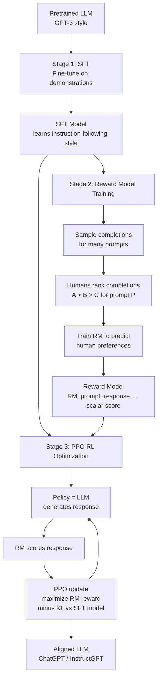

# 🎯 RLHF

> [!abstract] TL;DR
> RLHF (Reinforcement Learning from Human Feedback) is the process that transforms a pretrained language model into a helpful, harmless, and honest assistant. The pipeline: (1) Supervised Fine-Tuning (SFT) on human-written demonstrations, (2) training a Reward Model (RM) on human preference rankings, (3) RL optimization (PPO) of the language model to maximize RM score while staying close to the SFT model (KL divergence penalty). RLHF turned GPT-3 into InstructGPT (and ultimately ChatGPT). It's unstable and expensive; DPO (Direct Preference Optimization, 2023) is a simpler supervised alternative that often matches PPO quality.

---

## Intuition — Analogy First

Imagine training a new employee at a customer service desk:

**Stage 1 — Supervised Fine-Tuning (SFT):** The manager sits down and writes out 10,000 example conversations: "If a customer asks X, the correct response is Y." The new employee reads these demonstrations and learns the style, tone, and format of good responses. This is SFT.

**Stage 2 — Reward Model:** Instead of writing more examples, the manager now reads pairs of responses the employee wrote and ranks them: "Response A was better than Response B because it was clearer." A separate model is trained to predict these rankings — this becomes the automated "manager scorecard."

**Stage 3 — PPO optimization:** The employee keeps practicing, getting scored by the automated scorecard after every response. They gradually learn to maximize the score. But there's a safeguard: they can't drift too far from what they learned in Stage 1 (the KL penalty), or they'd optimize for gaming the scorecard in bizarre ways ("reward hacking").

The result: an employee who gives helpful, polished responses — not because they were explicitly taught every answer, but because they've internalized what "good" looks like through the feedback loop.

---

## How It Works — Mechanics



### Stage 1: Supervised Fine-Tuning (SFT)

Human labelers write demonstrations of ideal assistant behavior for a diverse set of prompts. The pretrained LLM is fine-tuned on these (prompt, demonstration) pairs using standard cross-entropy loss.

**Why SFT is necessary:** A pretrained LLM trained on internet text will continue internet text when prompted. Given "Tell me how to bake bread:", it might output a recipe, a discussion forum response, or an unrelated continuation. SFT teaches the model to respond like an assistant, not like a general text continuation engine.

**Data quality > quantity:** OpenAI reported that ~13,000 SFT examples were enough for InstructGPT. Quality matters far more than volume at this stage.

### Stage 2: Reward Model (RM)

Labelers are shown a prompt and 2–9 model completions. They rank all completions from best to worst. The reward model is trained on these pairwise comparisons.

**RM architecture:** A language model (often smaller than the policy, e.g., 6B for a 175B policy) with a linear regression head on the `[EOS]` token. Takes (prompt + response) as input, outputs a scalar reward.

**Training objective** — Bradley-Terry pairwise ranking:

$$\mathcal{L}_{RM} = -\mathbb{E}_{(x, y_w, y_l)} \left[ \log \sigma(r_\theta(x, y_w) - r_\theta(x, y_l)) \right]$$

Where $y_w$ is the preferred response and $y_l$ is the less preferred response for prompt $x$.

### Stage 3: PPO Optimization

PPO (Proximal Policy Optimization) treats the LLM as the policy, the reward model as the environment reward signal, and optimizes the LLM's parameters to maximize expected reward.

**KL divergence penalty:** Critical for stability. Without it, the policy would diverge catastrophically — it would find degenerate text that the reward model scores highly but is not actually good (reward hacking).

$$\mathcal{L}_{\text{PPO}} = \mathbb{E}_x \left[ r_\theta(x, y) - \beta \cdot \text{KL}[\pi_\phi(y|x) \| \pi_{\text{SFT}}(y|x)] \right]$$

Where:
- $r_\theta(x, y)$ = reward model score for response $y$ to prompt $x$
- $\beta$ = KL coefficient (typically 0.01–0.1)
- $\pi_\phi$ = policy (the LLM being trained)
- $\pi_{\text{SFT}}$ = the SFT reference model (frozen)

### DPO: Direct Preference Optimization (Alternative)

DPO (Rafailov et al., 2023) shows that RLHF can be reformulated as a supervised learning problem without an explicit reward model or RL:

The key insight: the reward model and the optimal policy are in direct correspondence. Given preference data (prompt, $y_w$, $y_l$), you can directly fine-tune the LLM:

$$\mathcal{L}_{\text{DPO}} = -\mathbb{E}_{(x, y_w, y_l)} \left[ \log \sigma\!\left( \beta \log \frac{\pi_\theta(y_w|x)}{\pi_{\text{ref}}(y_w|x)} - \beta \log \frac{\pi_\theta(y_l|x)}{\pi_{\text{ref}}(y_l|x)} \right) \right]$$

**DPO advantages:** No separate reward model, no PPO loop, no KL penalty hyperparameter, simple supervised training. Quality typically matches RLHF-PPO.

**DPO limitation:** Requires offline preference data; cannot explore (generate new responses to get feedback). RLHF with PPO can improve the policy iteratively by generating new responses.

---

## The Math

**Bradley-Terry pairwise ranking model:**

Given a reward function $r$, the probability that response $y_w$ is preferred over $y_l$ is:

$$P(y_w \succ y_l \mid x) = \sigma(r(x, y_w) - r(x, y_l)) = \frac{e^{r(x,y_w)}}{e^{r(x,y_w)} + e^{r(x,y_l)}}$$

Training minimizes the negative log-likelihood over all human preference pairs.

**PPO objective** (simplified RLHF version):

$$\mathcal{L}(\phi) = \mathbb{E}_{x \sim D, y \sim \pi_\phi} \left[ r_\theta(x, y) \right] - \beta \cdot \text{KL}\left[ \pi_\phi \| \pi_{\text{SFT}} \right]$$

The optimal policy in closed form:

$$\pi^*(y|x) = \frac{1}{Z(x)} \pi_{\text{SFT}}(y|x) \exp\!\left(\frac{r(x,y)}{\beta}\right)$$

DPO derives its objective by substituting this closed-form solution into the RM loss, eliminating the need to train RM explicitly.

**KL divergence** (measures how far policy has drifted from SFT):

$$\text{KL}[\pi_\phi \| \pi_{\text{SFT}}] = \mathbb{E}_{y \sim \pi_\phi} \left[ \log \frac{\pi_\phi(y|x)}{\pi_{\text{SFT}}(y|x)} \right]$$

---

## Code Demo

```python
from trl import PPOTrainer, PPOConfig, AutoModelForCausalLMWithValueHead
from trl import DPOTrainer, DPOConfig
from transformers import AutoTokenizer, AutoModelForSequenceClassification
from datasets import Dataset
import torch

# ── Reward Model Training ─────────────────────────────────────────────────────
# Simplified pairwise RM training

class RewardModel(torch.nn.Module):
    """Simple reward model: LM backbone + scalar head."""
    def __init__(self, backbone_name: str):
        super().__init__()
        from transformers import AutoModel
        self.backbone = AutoModel.from_pretrained(backbone_name)
        d = self.backbone.config.hidden_size
        self.reward_head = torch.nn.Linear(d, 1)

    def forward(self, input_ids, attention_mask):
        outputs = self.backbone(input_ids=input_ids, attention_mask=attention_mask)
        # Use last token hidden state (EOS position)
        last_hidden = outputs.last_hidden_state
        # Index of last real token (not padding)
        seq_lengths = attention_mask.sum(dim=1) - 1
        last_token = last_hidden[torch.arange(last_hidden.size(0)), seq_lengths]
        reward = self.reward_head(last_token).squeeze(-1)  # (batch_size,)
        return reward

def pairwise_loss(reward_w: torch.Tensor, reward_l: torch.Tensor) -> torch.Tensor:
    """Bradley-Terry pairwise ranking loss."""
    return -torch.log(torch.sigmoid(reward_w - reward_l)).mean()

# Example usage:
# rm = RewardModel("distilbert-base-uncased")
# reward_w = rm(chosen_input_ids, chosen_attention_mask)
# reward_l = rm(rejected_input_ids, rejected_attention_mask)
# loss = pairwise_loss(reward_w, reward_l)

# ── RLHF with PPO (using TRL library) ────────────────────────────────────────
ppo_config = PPOConfig(
    model_name="gpt2",
    learning_rate=1.41e-5,
    log_with=None,
    mini_batch_size=1,
    batch_size=4,
    gradient_accumulation_steps=1,
    optimize_cuda_cache=True,
    early_stopping=False,
    target_kl=0.1,           # KL divergence target
    ppo_epochs=4,
    seed=0,
    init_kl_coef=0.2,        # initial KL coefficient β
    adap_kl_ctrl=True,       # adaptively adjust KL coefficient
    kl_penalty="kl",
)

# Load model with value head (critic for PPO)
model = AutoModelForCausalLMWithValueHead.from_pretrained("gpt2")
tokenizer = AutoTokenizer.from_pretrained("gpt2")
tokenizer.pad_token = tokenizer.eos_token

ppo_trainer = PPOTrainer(ppo_config, model, ref_model=None, tokenizer=tokenizer)

# Dummy reward function (replace with actual RM)
def get_reward(responses: list[str]) -> list[torch.Tensor]:
    """Return scalar reward for each response."""
    rewards = []
    for response in responses:
        # Simple heuristic: longer, punctuated responses get higher reward
        score = len(response.split()) * 0.01 + response.count('.') * 0.5
        rewards.append(torch.tensor(score, dtype=torch.float32))
    return rewards

# PPO training loop
prompts = ["Tell me about climate change."] * ppo_config.batch_size
query_tensors = [tokenizer.encode(p, return_tensors="pt")[0] for p in prompts]

# Single PPO step
response_tensors = ppo_trainer.generate(
    query_tensors,
    return_prompt=False,
    max_new_tokens=64,
    do_sample=True,
    top_k=50,
)
responses = tokenizer.batch_decode(response_tensors, skip_special_tokens=True)
rewards = get_reward(responses)
stats = ppo_trainer.step(query_tensors, response_tensors, rewards)
print("PPO step stats:", {k: v for k, v in stats.items() if 'reward' in k or 'kl' in k})

# ── DPO Training (simpler alternative) ───────────────────────────────────────
from datasets import Dataset

# DPO preference dataset format
preference_data = {
    "prompt": [
        "What is the capital of France?",
        "How do I make pasta?",
        "Explain quantum computing.",
    ],
    "chosen": [
        "The capital of France is Paris, a major European city and cultural hub.",
        "To make pasta, boil water with salt, add pasta, cook for 8-10 minutes, then drain.",
        "Quantum computing uses quantum mechanical phenomena like superposition and entanglement to process information in ways classical computers cannot.",
    ],
    "rejected": [
        "Paris, it's in France.",
        "I don't know, maybe look it up.",
        "It's like a computer but quantum.",
    ],
}
dataset = Dataset.from_dict(preference_data)

dpo_config = DPOConfig(
    beta=0.1,               # KL penalty coefficient
    max_length=512,
    max_prompt_length=256,
    num_train_epochs=1,
    per_device_train_batch_size=2,
    learning_rate=5e-7,     # very small LR for DPO (fine-tuning, not pretraining)
    output_dir="./dpo-model",
)

base_model = AutoModelForCausalLMWithValueHead.from_pretrained("gpt2")
dpo_trainer = DPOTrainer(
    model=base_model,
    ref_model=None,  # DPOTrainer creates reference model from model snapshot
    args=dpo_config,
    train_dataset=dataset,
    tokenizer=tokenizer,
)
dpo_trainer.train()

# ── Reward hacking detection ──────────────────────────────────────────────────
def check_reward_hacking(responses: list[str], rewards: list[float]) -> None:
    """Detect potential reward hacking patterns."""
    for resp, reward in zip(responses, rewards):
        word_count = len(resp.split())
        # High reward but repetitive or very long response = possible hacking
        unique_ratio = len(set(resp.split())) / max(word_count, 1)
        if reward > 3.0 and unique_ratio < 0.3:
            print(f"WARNING: Possible reward hacking! Reward={reward:.2f}, Unique ratio={unique_ratio:.2f}")
            print(f"  Response: {resp[:100]}...")
```

---

## Real-World Example

**InstructGPT: GPT-3 → ChatGPT**

The paper "Training language models to follow instructions with human feedback" (Ouyang et al., 2022) showed that a 1.3B InstructGPT model was preferred over a 175B GPT-3 model by human evaluators — a 100x parameter reduction that beat raw scale.

**Process at OpenAI:**
1. **SFT:** ~13,000 prompt-demonstration pairs written by 40 expert contractors
2. **RM:** ~33,000 comparison pairs (human raters ranking model outputs 1–9). Reward model = GPT-3 6B fine-tuned for regression
3. **PPO:** Ran for ~32,000 steps with $\beta = 0.01$ KL penalty

**Key finding:** Human evaluators preferred InstructGPT (1.3B+RLHF) over GPT-3 (175B) 85% of the time for "following instructions" and "truthfulness." The RLHF process contributed more to usability than 100x more parameters.

**Claude (Anthropic):** Anthropic uses a variant of RLHF called CAI (Constitutional AI), where a set of principles (the "constitution") guides the reward model training. Instead of only human rankings, the model generates self-critiques based on the constitution and learns from those. This reduces the need for human labelers at scale.

---

## Trade-offs

| Method | Complexity | Quality | Stability | Data Needed | Exploration |
|---|---|---|---|---|---|
| SFT only | Simple | Good (no alignment) | Stable | 10K demonstrations | None |
| RLHF + PPO | Complex | Best | Unstable | 30K+ preference pairs | Yes (online RL) |
| DPO | Moderate | Matches RLHF | Stable | 30K+ preference pairs | No (offline) |
| RLAIF | Moderate | Good | Moderate | LLM generates feedback | Limited |
| Constitutional AI | Moderate | Good | Moderate | Principles document | Limited |
| Best-of-N sampling | Simple | Good | Stable | Just a reward model | No |

---

## When to Use vs Avoid

**Use RLHF (PPO) when:**
- You need the highest possible alignment quality and have the infrastructure
- Online learning from fresh human feedback is possible
- You have a large human labeler workforce and long training cycles

**Use DPO when:**
- You have offline preference data and want a simpler training loop
- Your team doesn't have RL expertise
- Training stability is a priority
- Budget is limited (no need for separate RM infrastructure)

**Use SFT-only when:**
- Task is narrow and well-defined (code completion, structured extraction)
- RLHF data collection is too expensive
- You have high-quality demonstration data

**Use RLAIF (AI feedback) when:**
- Scaling human labelers is cost-prohibitive
- The task can be evaluated by a larger LLM (e.g., GPT-4 as judge)
- Acceptable to have AI-defined preferences rather than human ones

---

## Common Pitfalls

1. **Reward hacking** — The reward model is imperfect. PPO will find inputs that score high on the RM but are not actually good. Common failure modes: very long responses score higher → model becomes verbose; responses with certain keywords score higher → model keyword-stuffs. Mitigation: KL penalty (prevents large deviations from SFT), reward clipping, iterative RM updates.

2. **Catastrophic forgetting of factual knowledge** — RLHF fine-tuning can degrade factual accuracy even while improving helpfulness. The KL penalty mitigates this, but monitor factual benchmarks (TruthfulQA, MMLU) alongside preference scores.

3. **Mode collapse** — PPO can cause the model to converge to a small set of "safe" responses that reliably score well, losing diversity. Monitor response diversity metrics (entropy over completions, unique response rate).

4. **Labeler disagreement** — Human preferences are noisy. Different annotators give conflicting rankings for the same pair. The RM learns an average that may not reflect any individual's preferences. Careful annotator selection, calibration, and inter-annotator agreement measurement are essential.

5. **Undertrained SFT model** — If the SFT model hasn't converged properly, the PPO stage has a weak starting point. The most common mistake is spending too little on SFT and too much on PPO. The SFT stage must produce a model that already follows instructions reasonably well before RL begins.

6. **Not monitoring KL divergence** — During PPO, if KL divergence grows unchecked, the model drifts far from the SFT model and often collapses to incoherent outputs. Monitor KL at every step; if it spikes, reduce learning rate or increase the KL penalty coefficient.

---

## Related Concepts

- [[_MOC_NLP|↑ Section MOC]]

- [[GPT_Family]] — RLHF transforms pretrained GPT-style models into assistants
- [[Scaling_Laws]] — RLHF quality improvements are partially orthogonal to scaling; InstructGPT 1.3B beat raw GPT-3 175B
- [[LLM_Architecture_Deep_Dive]] — the architecture doesn't change; RLHF fine-tunes the same weights
- [[Language_Model_Basics]] — pretraining creates the base model; RLHF steers it

---

## Review Questions

1. A pretrained GPT-3 model generates text that continues the distribution of the internet. InstructGPT (GPT-3 + RLHF) follows instructions and is preferred by users. The architecture is identical. What specifically does RLHF change, and why can't this be achieved by simply adding more pretraining data containing instructions?

2. During PPO training you observe: (a) reward model score increasing steadily, (b) KL divergence growing from 0.02 to 2.5 over 10,000 steps, (c) human evaluator ratings starting to drop after step 7,000. What is happening, and what hyperparameter or training change would you make?

3. DPO achieves alignment with a simple supervised objective, eliminating the reward model and PPO. But DPO has a fundamental limitation compared to PPO. What does it mean that DPO is "offline" and why does this limit its ability to improve over the pretrained model in the way that RLHF can?

---

## Sources

- Ouyang, L., et al. (2022). Training language models to follow instructions with human feedback (InstructGPT). *NeurIPS 2022*. https://arxiv.org/abs/2203.02155
- Rafailov, R., et al. (2023). Direct Preference Optimization: Your Language Model is Secretly a Reward Model (DPO). *NeurIPS 2023*. https://arxiv.org/abs/2305.18290
- Bai, Y., et al. (2022). Constitutional AI: Harmlessness from AI Feedback (Anthropic). https://arxiv.org/abs/2212.08073
- Schulman, J., et al. (2017). Proximal Policy Optimization Algorithms (PPO). https://arxiv.org/abs/1707.06347
- Stiennon, N., et al. (2020). Learning to summarize from human feedback. *NeurIPS 2020*. https://arxiv.org/abs/2009.01325

#nlp #llm #rlhf #alignment #ppo #reward-model #dpo #instructgpt #advanced
