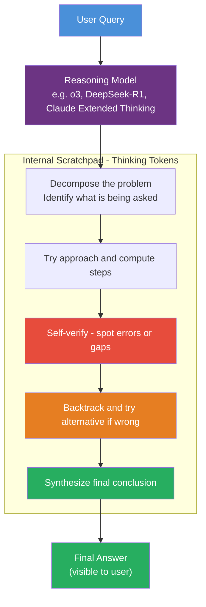

# Reasoning Models

> [!abstract] TL;DR
> Reasoning models are LLMs trained — via reinforcement learning on verifiable rewards (RLVR) — to generate an extended internal chain-of-thought "scratchpad" before producing a final answer. Unlike standard LLMs that emit an answer in a single autoregressive pass, reasoning models invest additional inference-time compute (thinking tokens) to decompose problems, explore approaches, self-correct, and verify. This trades latency and token cost for dramatically higher accuracy on hard multi-step tasks: math, formal proof, competitive coding, and complex planning.

---

## Intuition

**Analogy:** Picture two students sitting the same hard math exam. The first reads the problem and immediately writes the answer — fast, but error-prone on anything requiring multiple steps. The second writes scratch work on the margin: "Let x = the ball's cost. Then bat = x + 1.00. Total = 2x + 1.00 = 1.10. So x = 0.05." — slower, more paper, but far more reliable on hard problems.

A standard LLM is the first student: it predicts answer tokens directly conditioned on the question. A reasoning model is the second student: it first generates a scratchpad of thinking tokens before committing to an answer. The scratchpad is real computation — each thinking token narrows and conditions what comes next — not cosmetic output.

---

## How It Works

### Core Mechanics

Reasoning model inference inserts a **thinking phase** between the user query and the final answer:

1. **Query arrives** — the model enters thinking mode automatically (driven by training, not a user instruction).
2. **Thinking tokens generated** — the model produces an internal scratchpad, often thousands of tokens long. This is wrapped in special markers (e.g., `<think>...</think>` for DeepSeek-R1, `thinking` blocks for Claude). The scratchpad freely explores approaches, catches errors mid-way, and reverts.
3. **Final answer generated** — conditioned on both the original query and the full thinking trace, the model produces the final visible answer. This is typically concise and correct.
4. **Visibility tier** — thinking tokens are: hidden from users and summarized (OpenAI o-series), available to developers as thinking blocks but hidden from end-users by default (Claude), or fully exposed as `<think>` content (DeepSeek-R1 open weights).

**Self-consistency amplification:** For maximum accuracy, sample the same query multiple times (N=5–20 runs, high temperature), let each run produce its own thinking chain, then take the majority vote over final answers. Incorrect chains tend to diverge across runs; correct chains converge on the same answer. This is expensive — N× the already-high reasoning model cost — so reserve it for the highest-stakes problems with a single verifiable answer.

### Training: RLVR and GRPO

Reasoning behaviour is not prompted at inference — it is baked into weights at training time via **Reinforcement Learning with Verifiable Rewards (RLVR)**:

1. **Problem selection** — train on tasks with objectively correct answers: math competitions (AMC, AIME, GSM8K), competitive programming (LeetCode hard, Codeforces), formal logic. The problem statement is its own reward signal: is the final answer correct?

2. **Generate and verify** — the model generates a full response (thinking + answer). An automated verifier checks the final answer against ground truth. Correct → positive reward. Wrong → zero or negative reward. No human labellers are needed.

3. **Policy optimization with GRPO** — DeepSeek-R1 introduced GRPO (Group Relative Policy Optimization) as a more efficient alternative to PPO. For each prompt, GRPO samples a group of K responses, computes the mean reward of the group as a baseline, and uses reward-minus-baseline as the advantage. This eliminates the need for a separate value/critic network, reducing GPU memory by ~30% vs PPO and making training feasible at scale.

4. **Emergent reasoning** — with sufficient scale and RL training, the model spontaneously learns strategies it was never explicitly taught: re-examining prior steps ("wait, I made an error in step 3..."), trying alternative approaches when stuck, and verifying intermediate results against known constraints. These "aha moments" emerge from RL exploration, not from demonstrations.

### Key Reasoning Models

| Model | Developer | Open? | Thinking Visibility | Notes |
|-------|-----------|-------|---------------------|-------|
| o1, o1-pro | OpenAI | No | Hidden (summarized) | First widely-deployed reasoning model |
| o3, o3-pro | OpenAI | No | Hidden (summarized) | 96.7% AIME 2024; breakthrough ARC-AGI score |
| o4-mini | OpenAI | No | Hidden (summarized) | Efficient; best AIME despite smaller size |
| Claude Extended Thinking | Anthropic | No | Developer-visible thinking blocks | `budget_tokens` parameter; used in Claude 3.7+ |
| DeepSeek-R1 | DeepSeek | Yes (weights) | Full `<think>` exposed | Open-source; matches o1 on math/code |
| Qwen QwQ-32B | Alibaba | Yes (weights) | Full `<think>` exposed | 32B model; strong on math |
| Gemini 2.0 Flash Thinking | Google | No | Shown in AI Studio | Fastest latency among frontier reasoning models |

### Process Reward Models vs Outcome Reward Models

RLVR uses an Outcome Reward Model (ORM) by default, but a richer alternative exists:

| Aspect | Outcome Reward Model (ORM) | Process Reward Model (PRM) |
|--------|---------------------------|---------------------------|
| What it scores | Final answer only | Each intermediate reasoning step |
| Signal density | Sparse — 1 reward per problem | Dense — reward at every step |
| Training data | Correct/incorrect answers (auto) | Step-level labels (expensive to obtain) |
| Cost | Low — verifiable problems self-label | High — human or LLM step annotations |
| Risk | Model may reach right answer via wrong path | Harder to scale labelling |
| Used by | DeepSeek-R1, most open models | OpenAI's Math-Shepherd; process supervision research |

**Why ORM works despite sparse signal:** RL explores a huge space of reasoning chains. Problems hard enough that random guessing fails force the model to genuinely discover effective strategies. Scale (millions of training problems) compensates for sparse per-problem signal.

### DeepSeek-R1 Training Pipeline

The DeepSeek-R1 recipe became the reference pipeline for open-source reasoning models:

```
Stage 1 — Cold Start SFT
  Fine-tune on a curated set of high-quality long CoT demonstrations.
  Purpose: teach the model the format of extended reasoning (structure,
  self-verification, language consistency) before exposing it to RL.

Stage 2 — GRPO Reasoning RL  (RLVR)
  Rule-based verifiable rewards: math/code accuracy + output format + language consistency.
  Model explores reasoning strategies via RL; "aha moments" emerge organically.
  DeepSeek-R1-Zero variant skips Stage 1 and goes directly here — still effective,
  demonstrating that CoT reasoning can emerge from RL alone.

Stage 3 — Rejection Sampling SFT
  Stage-2 model generates many outputs per prompt; best are selected via rejection sampling.
  Mix ~800K curated reasoning examples with general-purpose data.
  SFT fine-tuning restores general capabilities (chat, instruction-following) degraded by RL.

Stage 4 — Final RL (All-Scenario)
  Second GRPO phase adds preference-based rewards (helpfulness, safety) alongside
  verifiable rewards. Produces a model that is both a strong reasoner and a good assistant.
```

### Flow / Architecture



### Test-Time Compute Scaling

The central insight behind reasoning models is that **inference-time compute (thinking tokens) trades directly against accuracy** — a new scaling axis orthogonal to pretraining:

- **Pretraining scaling** (Chinchilla / GPT-4): larger model + more data → better base capability. Cost paid once at training time.
- **Test-time compute scaling**: more thinking tokens at inference → better accuracy on hard problems, for the same model. Cost paid at inference, per query.

Empirically: o3 scored 96.7% on AIME 2024 and 87.5% on ARC-AGI (high compute setting) — not because o3 has 10× more parameters than o1, but because it invests far more inference-time compute. The accuracy improvement from high vs low reasoning effort on hard math can be 20–40 percentage points.

**Budget control** — reasoning models expose a thinking budget:
- **OpenAI o-series:** `reasoning_effort = "low" | "medium" | "high"` — maps to different token budgets internally
- **Anthropic Claude:** `budget_tokens: int` — explicit cap on thinking tokens (typically 1,000–16,000)

Increasing the budget monotonically improves accuracy on hard problems up to a saturation point. For easy problems, additional thinking budget has negligible effect. Start low and escalate only when the model fails.

---

## Code Demo

```python
# Demonstrates reasoning model APIs:
# Part 1 — OpenAI o4-mini with reasoning_effort
# Part 2 — Anthropic Claude with extended thinking budget_tokens

# ── Part 1: OpenAI o4-mini ────────────────────────────────────────────────────
from openai import OpenAI

openai_client = OpenAI()  # reads OPENAI_API_KEY from environment

def solve_with_o4mini(problem: str, effort: str = "medium") -> dict:
    """
    Call o4-mini with controllable reasoning effort.
    effort: "low" | "medium" | "high"
    Higher effort = more thinking tokens = better accuracy on hard tasks.
    """
    response = openai_client.chat.completions.create(
        model="o4-mini",
        messages=[{"role": "user", "content": problem}],
        reasoning_effort=effort,         # controls internal thinking budget
        max_completion_tokens=4000,      # must cover thinking + visible answer tokens
    )
    usage = response.usage
    result = {
        "answer": response.choices[0].message.content,
        "input_tokens": usage.prompt_tokens,
        "total_output_tokens": usage.completion_tokens,
    }
    # Reasoning tokens are billed but the thinking text is NOT returned
    if hasattr(usage, "completion_tokens_details") and usage.completion_tokens_details:
        d = usage.completion_tokens_details
        result["reasoning_tokens"] = getattr(d, "reasoning_tokens", 0)
        result["visible_tokens"] = getattr(d, "accepted_prediction_tokens", 0)
    return result


# Classic cognitive reflection test — intuitive wrong answer is $0.10
bat_and_ball = (
    "A bat and ball together cost $1.10. "
    "The bat costs $1.00 more than the ball. "
    "How much does the ball cost? Show your reasoning."
)

for effort_level in ["low", "high"]:
    r = solve_with_o4mini(bat_and_ball, effort=effort_level)
    print(f"\n--- effort={effort_level} ---")
    print("Answer:", r["answer"])
    print(f"Reasoning tokens: {r.get('reasoning_tokens', 'N/A')}")
    # Correct answer: $0.05 (not the intuitive $0.10)


# ── Part 2: Anthropic Claude with Extended Thinking ───────────────────────────
import anthropic

anthropic_client = anthropic.Anthropic()  # reads ANTHROPIC_API_KEY from environment

def solve_with_claude_thinking(problem: str, budget_tokens: int = 5000) -> dict:
    """
    Call Claude with extended thinking enabled.
    budget_tokens: max tokens Claude can spend in the internal scratchpad.
    max_tokens must be greater than budget_tokens to leave room for the answer.
    """
    response = anthropic_client.messages.create(
        model="claude-opus-4-5",
        max_tokens=budget_tokens + 2000,    # budget for thinking + answer
        thinking={
            "type": "enabled",
            "budget_tokens": budget_tokens,  # explicit thinking budget cap
        },
        messages=[{"role": "user", "content": problem}],
    )

    thinking_text = ""
    answer_text = ""

    for block in response.content:
        if block.type == "thinking":
            thinking_text = block.thinking    # internal scratchpad (developer-visible)
        elif block.type == "text":
            answer_text = block.text          # final answer for the user

    return {
        "thinking_preview": thinking_text[:400] + "..." if len(thinking_text) > 400 else thinking_text,
        "answer": answer_text,
        "input_tokens": response.usage.input_tokens,
        "output_tokens": response.usage.output_tokens,
    }


proof_problem = (
    "Prove that the square root of 2 is irrational using proof by contradiction. "
    "Show every logical step."
)

result = solve_with_claude_thinking(proof_problem, budget_tokens=4000)
print("\n=== Claude Extended Thinking Demo ===")
print("Thinking (first 400 chars):")
print(result["thinking_preview"])
print("\nFinal answer:")
print(result["answer"])
print(f"\nTokens — input: {result['input_tokens']}, output: {result['output_tokens']}")


# ── Comparing thinking budgets — accuracy vs cost ─────────────────────────────
hard_problem = (
    "Find all integer solutions to: x^3 + y^3 = z^3 + 1, "
    "where 1 <= x, y, z <= 10. List every solution."
)

for budget in [1000, 5000, 10000]:
    r = solve_with_claude_thinking(hard_problem, budget_tokens=budget)
    print(f"\nbudget_tokens={budget}: output_tokens={r['output_tokens']}")
    print("Answer snippet:", r["answer"][:200])
```

---

## Real-World Example

> **Example: OpenAI o3 on ARC-AGI (2024).** ARC-AGI (Abstraction and Reasoning Corpus) consists of visual pattern puzzles that require generalizing abstract rules from a handful of examples — tasks specifically designed to resist LLMs that rely on surface-level pattern matching. GPT-4 scored approximately 7%. OpenAI o3 (high compute setting) scored 87.5%, crossing the informal "human-level" threshold of 85%. The gain was attributed not to new architecture or more parameters, but to RL-trained extended reasoning combined with test-time compute scaling. o3 spent hundreds of reasoning tokens exploring candidate rule mappings per puzzle.

> **Example: DeepSeek-R1 economics.** DeepSeek-R1 (671B MoE parameters) matches o1 performance on math and coding benchmarks while being fully open-source and dramatically cheaper per token. GRPO eliminated the critic/value network required by PPO, reducing training GPU memory by roughly 30%. At release, API pricing was approximately $0.55 per million input tokens vs o1's $15 per million — a 27× cost difference at comparable accuracy. This demonstrated that RL algorithm efficiency (GRPO) and architecture choice (sparse MoE) can substitute for closed-source scale advantages.

---

## Trade-offs

| Dimension | Standard LLM | Standard LLM + CoT Prompt | Reasoning Model (low budget) | Reasoning Model (max budget) |
|-----------|-------------|--------------------------|------------------------------|------------------------------|
| **Accuracy (simple tasks)** | High | Same | Same | Same |
| **Accuracy (hard multi-step)** | Low | Moderate | High | Highest |
| **Latency** | Lowest | Low–moderate | High (5–30 s typical) | Very high (30–120 s) |
| **Token cost** | 1x | 3–6x | 10–50x | 50–200x |
| **Thinking visible?** | N/A | Yes (in output) | Partial or hidden | Partial or hidden |
| **Setup effort** | None | Add "think step by step" | API parameter (effort/budget) | Tune budget_tokens carefully |
| **Self-corrects?** | Rarely | Occasionally | Yes (trained behaviour) | Yes (more thoroughly) |
| **Representative model** | GPT-4o | GPT-4o + zero-shot CoT | o4-mini low / Gemini Flash Thinking | o3 high / DeepSeek-R1 |

---

## When to Use vs Avoid

**Use reasoning models when:**
- Multi-step math: competition problems, symbolic manipulation, formal proof
- Complex coding: debugging non-obvious bugs, designing algorithms from scratch, competitive programming
- Logic and constraint satisfaction: planning problems, scheduling with many dependencies
- Scientific reasoning: interpreting experimental results, hypothesis generation, cross-domain synthesis
- Verification matters: tasks where the model double-checking its own work is valuable
- Batch processing: accuracy priority over latency; high-stakes decisions where errors are costly

**Avoid reasoning models when:**
- Simple tasks — summarization, translation, sentiment classification, direct lookup: reasoning adds token cost with zero accuracy improvement
- Real-time applications — autocomplete, interactive chat, streaming UI: thinking tokens add 5–120 seconds of latency per turn
- High-volume production pipelines — most workloads don't justify 10–100× cost premium
- Creative open-ended tasks — writing, brainstorming: RLVR optimizes for correctness, not creativity
- Very short context tasks — classification, extraction: the overhead is disproportionate

---

## Common Pitfalls

- **Using reasoning models on simple tasks** — calling o3 to rephrase a sentence costs ~50× more than GPT-4o with identical output. Profile task difficulty before selecting model tier. If GPT-4o + CoT prompt achieves 95%+ accuracy, reasoning models add nothing.

- **Ignoring the thinking budget** — using `budget_tokens=16000` for every query will exhaust API budgets quickly. Most hard problems resolve correctly at medium budget. Start low, measure accuracy on a validation set, and escalate only where the model fails.

- **Setting max_tokens too low** — reasoning models consume tokens for internal thinking AND the final answer. If `max_tokens` is set below `budget_tokens + expected_answer_length`, the model gets truncated mid-thought, producing garbled or incomplete answers. Always ensure `max_tokens > budget_tokens + headroom`.

- **Treating thinking text as faithful reasoning** — thinking tokens are generated autoregressively by the same next-token prediction mechanism as the answer. The scratchpad may contain plausible-looking but wrong intermediate steps that happen to lead to the correct answer, or correct-looking steps that mask an error elsewhere. Do not use thinking text as a ground-truth audit trail.

- **Confusing RLVR with RLHF** — RLHF trains on subjective human preference rankings (helpful/harmless); RLVR trains on objective verifiable correctness (math/code). They are complementary post-training steps. DeepSeek-R1's Stage 4 runs both: RLVR for reasoning quality and preference RL for helpfulness/safety.

- **Applying self-consistency to open-ended tasks** — majority vote over N reasoning chains requires a convergent correct answer. On math or logic, wrong chains diverge and correct chains converge. On creative writing or opinion questions, there is no convergence signal and self-consistency just amplifies the most common mediocre output at N× the cost.

- **Mistaking verbosity for quality** — a longer thinking trace does not guarantee a better answer. Some models produce long but circular reasoning that loops back to the same wrong conclusion. Evaluate on held-out benchmarks; don't use thinking token count as a quality proxy.

---

## Related Concepts

- [[_MOC_NLP|↑ Section MOC]]

- [[RLHF]] — the foundational post-training RL paradigm; RLVR (used for reasoning models) replaces human preference labels with verifiable correctness signals, eliminating the need for human annotators
- [[DPO]] — a supervised alternative to PPO-based RL alignment; not typically used for reasoning model training because DPO requires offline data and lacks the online exploration that RLVR needs to discover reasoning strategies
- [[Chain_of_Thought]] — CoT prompting elicits step-by-step reasoning at inference time via prompt engineering; reasoning models bake extended CoT into weights via RL training, making it automatic and more reliable
- [[Scaling_Laws]] — pretraining scaling (more params/data) and test-time compute scaling (more thinking tokens) are two orthogonal axes; reasoning models are the primary vehicle for the second axis
- [[Pretraining]] — reasoning models start from a pretrained base; RLVR is a post-training phase that builds specialized reasoning ability on top of the pretrained representations
- [[Instruction_Tuning]] — the cold-start SFT stage of reasoning model training (stage 1 of DeepSeek-R1) is a form of instruction tuning specialized for long CoT demonstrations
- [[LLM_Architecture_Deep_Dive]] — reasoning models use the identical Transformer architecture as standard LLMs; the difference is entirely in training signal and inference-time token budget allocation
- [[Context_Windows_and_Tokens]] — thinking tokens consume context budget alongside the prompt and answer; a 16,000-token thinking trace on a complex proof is a significant fraction of a 128K context window
- [[Generation_Controls]] — `reasoning_effort` (OpenAI) and `budget_tokens` (Anthropic) are new generation control parameters specific to reasoning models, analogous to temperature for standard models
- [[GPT_Family]] — o1, o3, o3-pro, and o4-mini are the reasoning model branch of the OpenAI GPT lineage, trained with RLVR on top of GPT-4-class base models
- [[Constitutional_AI]] — CAI (RLAIF) and RLVR are complementary RL-based post-training techniques; CAI optimizes for helpfulness/harmlessness via AI preference feedback, RLVR optimizes for correctness via verifiable rewards

---

## Review Questions

1. A reasoning model and a standard LLM with CoT prompting both produce step-by-step reasoning before the final answer. Explain the fundamental difference in how this reasoning behaviour was acquired in each case, and why this distinction matters for reliability on distribution-shifted problems the model has not seen before.

2. You are building an AI tutoring system for undergraduate calculus. Students submit problem sets and expect responses within 2 seconds. Budget is $0.01 per query. Your accuracy requirement is 90%+ on AMC-10 level problems. Should you use o3 (high reasoning), o4-mini (low reasoning), or GPT-4o with CoT prompting? Justify with reference to latency, cost, and accuracy trade-offs.

3. RLVR trains exclusively on verifiable rewards from math and code correctness. Yet reasoning models also show improved performance on tasks like logical reasoning, structured planning, and scientific hypothesis evaluation that were not in the training distribution. Propose a mechanistic explanation for why reasoning ability generalizes beyond the training domain.

---

## Sources

- DeepSeek-AI. (2025). *DeepSeek-R1: Incentivizing Reasoning Capability in LLMs via Reinforcement Learning*. [arXiv:2501.12948](https://arxiv.org/abs/2501.12948)
- OpenAI. (2024). *Learning to Reason with LLMs* (o1 System Card). [openai.com](https://openai.com/index/learning-to-reason-with-llms/)
- Lightman, H., et al. (2023). *Let's Verify Step by Step* (Process Reward Models). [arXiv:2305.20050](https://arxiv.org/abs/2305.20050)
- Anthropic. (2025). *Extended Thinking Documentation*. [docs.anthropic.com](https://docs.anthropic.com/en/docs/build-with-claude/extended-thinking)
- Schmid, P. (2025). *How DeepSeek-R1 was trained*. [philschmid.de](https://www.philschmid.de/deepseek-r1)
- Zylos Research. (2026). *AI Reasoning Models 2026: From OpenAI o3 to DeepSeek-R1 and the Test-Time Compute Revolution*. [zylos.ai](https://zylos.ai/research/2026-01-24-ai-reasoning-models/)
- Raschka, S. (2025). *The State of Reinforcement Learning for LLM Reasoning*. [magazine.sebastianraschka.com](https://magazine.sebastianraschka.com/p/the-state-of-llm-reasoning-model-training)

#nlp #llm #reasoning #rlvr #test-time-compute #chain-of-thought #reinforcement-learning #deepseek #openai #advanced
