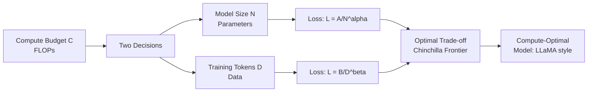

# 📈 Scaling Laws

> [!abstract] TL;DR
> Scaling laws (Kaplan et al., 2020; Hoffmann et al., 2022) describe how language model loss decreases as a predictable power law when you increase model size (N), training tokens (D), or compute (C). Kaplan showed loss scales as $L \propto N^{-0.076}$ and $L \propto D^{-0.095}$. The Chinchilla paper (2022) showed GPT-3 was dramatically undertrained: for a fixed compute budget, you should train smaller models on more data. Chinchilla optimal: $N_{opt} \propto C^{0.49}$, $D_{opt} \propto C^{0.51}$ — roughly equal exponents, meaning model size and token count should scale roughly together. This insight drove LLaMA: 7B params trained on 1T tokens outperforms GPT-3 (175B params, 300B tokens) on many benchmarks.

---

## Intuition — Analogy First

Think of building a factory:

**Kaplan (2020):** "Bigger factories produce more per hour." Doubling factory size (parameters) reduces defect rate predictably. The relationship is smooth, predictable, and follows a power law. There's no threshold where things suddenly break — you can keep scaling and keep improving.

**But Chinchilla (2022) asked the smarter question:** "Given a fixed construction budget, what's the optimal trade-off between factory size and raw materials?" A huge factory with insufficient raw materials (a giant model trained on few tokens) is wasteful. A tiny factory drowning in raw materials (a small model trained on enormous amounts of data) is equally wasteful. There's an **optimal ratio** given your budget.

The factory analogy breaks down to this: GPT-3 was the computing equivalent of building a 175-story skyscraper but only furnishing 10 floors. Chinchilla said: "Build a 70-story building and furnish all 70 floors — you get more usable space per construction dollar." This is exactly what LLaMA demonstrated empirically.

---

## How It Works — Mechanics



### Kaplan et al. (2020) — OpenAI Scaling Laws

Key findings from training models from 768M to 1.5B parameters:

**Loss scales as power laws:**
$$L(N) = \left(\frac{N_c}{N}\right)^{\alpha_N}, \quad L(D) = \left(\frac{D_c}{D}\right)^{\alpha_D}, \quad L(C) = \left(\frac{C_c}{C}\right)^{\alpha_C}$$

Estimated exponents from the paper:
- $\alpha_N \approx 0.076$ — doubling parameters reduces loss by ~5%
- $\alpha_D \approx 0.095$ — doubling training tokens reduces loss by ~7%
- $\alpha_C \approx 0.050$ — doubling compute reduces loss by ~3.5%

**Key Kaplan insight:** For a fixed compute budget, spend most of it on a larger model (undertrain it). A 10x larger model trained on 10x fewer tokens still outperforms a smaller model trained on 10x more tokens. This led to the GPT-3 decision: 175B parameters on 300B tokens.

### Chinchilla (2022) — DeepMind Rebuttal

Hoffmann et al. trained 400+ models ranging from 70M to 16B parameters on 4B to 400B tokens and found:

**Kaplan was wrong about the optimal ratio.** The error was that Kaplan's experiments held training steps (not compute budget) fixed, which biased results toward larger models. When compute budget is truly fixed:

**Chinchilla optimal allocation:**
$$N_{opt} \approx \left(\frac{C}{6}\right)^{0.49}, \quad D_{opt} \approx \left(\frac{C}{6}\right)^{0.51}$$

The exponents are nearly equal (~0.5 each), meaning **model parameters and training tokens should scale proportionally** with compute. For $10\times$ more compute: train a model $\sim 3.2\times$ larger on $\sim 3.2\times$ more data.

**Chinchilla (70B params, 1.4T tokens)** outperformed Gopher (280B params, 300B tokens) at 4x fewer parameters — proving GPT-3 and Gopher were dramatically undertrained.

### Emergent Abilities at Scale

Beyond smooth loss reduction, certain capabilities appear suddenly at critical scales:

| Capability | Approximate Scale Threshold |
|---|---|
| Few-shot arithmetic (3-digit addition) | ~10B parameters |
| Chain-of-thought reasoning | ~100B parameters |
| Instruction following | ~7B + RLHF |
| Truthful QA improvements | ~70B+ parameters |
| Code generation (HumanEval >50%) | ~7B code-specialized or 70B+ general |

These "emergent abilities" (Wei et al., 2022) appear as step functions in capability benchmarks vs. log(compute), unlike the smooth improvement in perplexity. This is controversial — some argue they're artifacts of evaluation metric choice.

---

## The Math

**Power law loss formulation:**

$$L(N, D) = E + \frac{A}{N^\alpha} + \frac{B}{D^\beta}$$

Where:
- $E$ = irreducible entropy of natural language (lower bound)
- $A, B$ = fitted constants
- $\alpha \approx 0.34$, $\beta \approx 0.28$ (Hoffmann et al., 2022 estimates)

**Compute budget constraint:**

$$C \approx 6ND \quad \text{(FLOPs = 6 × parameters × tokens, approximate)}$$

This comes from counting: for each token, each parameter is multiplied twice (forward + backward), and there are ~2 FLOPs per multiply-add, giving $6ND$ total FLOPs.

**Chinchilla optimal allocation:** Minimize $L(N, D)$ subject to $C = 6ND$:

$$\frac{\partial L}{\partial N} = -\alpha \frac{A}{N^{\alpha+1}} = \lambda \cdot 6D$$
$$\frac{\partial L}{\partial D} = -\beta \frac{B}{D^{\beta+1}} = \lambda \cdot 6N$$

Solving this constrained optimization:
$$N_{opt} = G \left(\frac{C}{6}\right)^{0.49}, \quad D_{opt} = G^{-1} \left(\frac{C}{6}\right)^{0.51}$$

Where $G = \left(\frac{\alpha A}{\beta B}\right)^{1/(\alpha+\beta)} \approx 0.1$ (empirically fitted).

**Practical rule of thumb:** Train 20 tokens per parameter.

| Model | Params | Tokens | Tokens/Param | Assessment |
|---|---|---|---|---|
| GPT-3 | 175B | 300B | 1.7 | Severely undertrained |
| Chinchilla | 70B | 1.4T | 20 | Compute-optimal |
| LLaMA-1 7B | 7B | 1T | 143 | Overtrained for inference efficiency |
| LLaMA-3 8B | 8B | 15T | 1875 | Very overtrained for inference |
| Mistral 7B | 7B | ~8T | 1143 | Very overtrained for inference |

LLaMA-1 and LLaMA-3 deliberately overtrain small models because they optimize for **inference efficiency**, not training efficiency. Once trained, a smaller overtrained model is cheaper to serve than a larger Chinchilla-optimal model with the same capability.

---

## Code Demo

```python
import numpy as np
import matplotlib.pyplot as plt
from scipy.optimize import minimize

# ── Kaplan scaling law: L(N) = (Nc/N)^alpha_N ────────────────────────────────
def kaplan_loss_N(N: np.ndarray, alpha_N: float = 0.076, N_c: float = 8.8e13) -> np.ndarray:
    """Loss as function of model parameters (holding data constant)."""
    return (N_c / N) ** alpha_N

def kaplan_loss_D(D: np.ndarray, alpha_D: float = 0.095, D_c: float = 5.4e13) -> np.ndarray:
    """Loss as function of training tokens (holding model size constant)."""
    return (D_c / D) ** alpha_D

# ── Chinchilla formulation: L(N, D) = E + A/N^α + B/D^β ─────────────────────
def chinchilla_loss(N: float, D: float,
                    E: float = 1.69, A: float = 406.4, B: float = 410.7,
                    alpha: float = 0.34, beta: float = 0.28) -> float:
    return E + A / (N ** alpha) + B / (D ** beta)

def compute_optimal_ND(C_flops: float, tokens_per_flop: float = 1/6):
    """
    Given compute budget C (FLOPs), find optimal (N, D).
    C = 6ND  →  D = C / (6N)
    Chinchilla: N_opt ≈ 0.1 * (C/6)^0.49
    """
    G = 0.1  # empirical constant from Chinchilla
    N_opt = G * (C_flops / 6) ** 0.49
    D_opt = C_flops / (6 * N_opt)
    return N_opt, D_opt

# ── Compute-optimal frontier ─────────────────────────────────────────────────
compute_budgets = np.logspace(20, 26, 100)   # 10^20 to 10^26 FLOPs
N_opts = []
D_opts = []
losses = []

for C in compute_budgets:
    N, D = compute_optimal_ND(C)
    N_opts.append(N)
    D_opts.append(D)
    losses.append(chinchilla_loss(N, D))

# ── Compare real models to Chinchilla optimal ─────────────────────────────────
real_models = {
    'GPT-3 (175B)':     {'N': 175e9, 'D': 300e9},
    'Chinchilla (70B)': {'N': 70e9,  'D': 1.4e12},
    'LLaMA-1 (7B)':     {'N': 7e9,   'D': 1e12},
    'LLaMA-3 (8B)':     {'N': 8e9,   'D': 15e12},
    'Gopher (280B)':    {'N': 280e9, 'D': 300e9},
}

print(f"{'Model':<25} {'Params':<12} {'Tokens':<12} {'Tok/Param':<12} {'Loss':<8}")
print("-" * 75)
for name, m in real_models.items():
    tok_per_param = m['D'] / m['N']
    loss = chinchilla_loss(m['N'], m['D'])
    C_opt_N, C_opt_D = compute_optimal_ND(6 * m['N'] * m['D'])
    print(f"{name:<25} {m['N']/1e9:>8.0f}B    {m['D']/1e9:>8.0f}B    {tok_per_param:>10.1f}    {loss:.3f}")

# ── Scaling curve visualization ───────────────────────────────────────────────
fig, axes = plt.subplots(1, 2, figsize=(14, 5))

# N vs loss (Kaplan)
N_range = np.logspace(7, 11, 100)
axes[0].plot(N_range, kaplan_loss_N(N_range), 'b-', linewidth=2)
axes[0].set_xscale('log')
axes[0].set_xlabel('Model Parameters')
axes[0].set_ylabel('Loss')
axes[0].set_title('Loss vs Model Size (Kaplan scaling)')
axes[0].grid(True, alpha=0.3)

# Chinchilla optimal frontier
axes[1].scatter(N_opts[::5], D_opts[::5], c=losses[::5], cmap='viridis', alpha=0.6)
# Mark real models
for name, m in real_models.items():
    axes[1].scatter(m['N'], m['D'], s=200, zorder=5, label=name.split('(')[0].strip())
axes[1].set_xscale('log')
axes[1].set_yscale('log')
axes[1].set_xlabel('Model Parameters')
axes[1].set_ylabel('Training Tokens')
axes[1].set_title('Chinchilla Compute-Optimal Frontier')
axes[1].legend(fontsize=8)
axes[1].grid(True, alpha=0.3)

plt.tight_layout()
plt.savefig('scaling_laws.png', dpi=150)
print("Saved scaling_laws.png")
```

---

## Real-World Example

**Chinchilla's impact on the LLM industry**

The Chinchilla paper (April 2022) had immediate and measurable industry impact:

**Before Chinchilla:** The prevailing wisdom was "bigger is better" — GPT-3 (175B), Gopher (280B), PaLM (540B) were celebrated mainly for their parameter counts. Training data was treated as secondary.

**After Chinchilla:** Entire strategies shifted.

- **Meta LLaMA (Feb 2023):** Explicitly cited Chinchilla. LLaMA-7B was trained on 1T tokens (143 tokens/param vs Chinchilla's 20) — deliberately overtrained for deployment efficiency. The 13B model matched or beat GPT-3 (175B) on most benchmarks. This was the first major public validation of Chinchilla.

- **Google Gemini:** Architecture choices and training data were redesigned around compute-optimal principles.

- **Inflection-2 (Pi.ai):** Inflection trained a 3B model on an undisclosed but large token count, citing compute-optimal training as the design principle. Achieved GPT-4 parity on several benchmarks with much fewer parameters.

**The inference twist:** Chinchilla optimizes training FLOPs, not inference FLOPs. A startup serving millions of inference requests per day cares more about inference cost (smaller model = faster serving) than training cost (one-time). This is why LLaMA-3 (8B on 15T tokens) is more valuable commercially than a 70B Chinchilla-optimal model — you pay training cost once, but inference cost forever.

---

## Trade-offs

| Strategy | Params | Tokens | Use Case | Weakness |
|---|---|---|---|---|
| Kaplan-optimal | Large | Small | Research: explore capabilities | Expensive to serve |
| Chinchilla-optimal | Moderate | Large | Research: maximize capability per compute | Still large for inference |
| Inference-optimal (LLaMA) | Small | Very large | Production: cheap serving | Very expensive to pretrain |
| Distillation | Tiny | Student learns from teacher | Edge / on-device | Quality ceiling |

| Scaling axis | Kaplan exponent | Chinchilla exponent |
|---|---|---|
| Parameters (N) | 0.076 (per doubling: ~5% loss reduction) | ~0.34 |
| Data (D) | 0.095 (per doubling: ~7% loss reduction) | ~0.28 |
| Compute (C) | 0.050 | ~0.50 |

---

## When to Use vs Avoid

**Apply Chinchilla scaling when:**
- You have a fixed compute budget and must decide how to allocate it between model size and data
- Training a new model from scratch
- You're comparing pre-existing models and trying to explain performance differences

**Go inference-optimal (LLaMA-style overtrain) when:**
- The model will be served to millions of users (inference dominates total cost)
- Latency is a hard constraint (smaller model = faster inference)
- The additional pretraining cost is a one-time investment

**Beware scaling law extrapolation when:**
- The task has emergent abilities (scaling laws predict perplexity, not capability)
- The data distribution changes significantly with scale (web data quality degrades)
- You're extrapolating beyond the compute range the laws were fit on

---

## Common Pitfalls

1. **Conflating Chinchilla compute budget with inference compute** — Chinchilla minimizes training FLOPs. When people say "LLaMA is better than Chinchilla-optimal for real applications," they mean inference FLOPs (serving cost), not training FLOPs.

2. **Using tokens/param as the only proxy for Chinchilla alignment** — The 20 tokens/param rule is a rough heuristic. The actual Chinchilla computation depends on the loss function, the specific model architecture, and the compute budget. Don't over-optimize for this ratio.

3. **Ignoring data quality in scaling laws** — Scaling laws assume i.i.d. data from a fixed distribution. Real datasets contain duplicates, low-quality content, and distribution shifts. Chinchilla's estimates may not hold when data quality degrades at scale.

4. **Applying scaling laws to fine-tuned or RL-trained models** — Scaling laws were derived for pretraining. The relationship between scale and downstream task performance after RLHF or instruction tuning is much less clean.

5. **Treating emergent abilities as scaling law violations** — The fact that certain capabilities appear suddenly doesn't contradict scaling laws — those laws predict perplexity, not specific capabilities. The emergence is a property of evaluation metrics, not loss curves.

---

## Related Concepts

- [[_MOC_NLP|↑ Section MOC]]

- [[LLM_Architecture_Deep_Dive]] — architectural improvements shift the scaling law constants without changing the functional form
- [[GPT_Family]] — GPT-3 was the poster child of Kaplan scaling; Chinchilla showed it was undertrained
- [[Language_Model_Basics]] — perplexity is what scaling laws predict
- [[RLHF]] — applies after pretraining; scaling laws govern the pretraining phase only
- [[Pretraining]] — the training phase where scaling laws apply

---

## Review Questions

1. Kaplan et al. (2020) recommended allocating most of a compute budget to model size, resulting in GPT-3 (175B params, 300B tokens). Chinchilla (2022) overturned this. What was the methodological flaw in Kaplan's experimental design that led to the wrong conclusion about optimal allocation?

2. LLaMA-3-8B is trained on 15T tokens (1875 tokens/param), far exceeding Chinchilla's 20 tokens/param recommendation. If Chinchilla says this is inefficient use of compute, why do organizations choose to overtrain small models? Quantify the inference-side benefit.

3. The Chinchilla formula gives $N_{opt} \propto C^{0.49}$, meaning model size should scale roughly as the square root of compute. If you have 10x more compute than a previous run, by what factor should you increase (a) model size, (b) training tokens, and (c) what is the expected loss reduction? Show the calculation.

---

## Sources

- Kaplan, J., et al. (2020). Scaling Laws for Neural Language Models. https://arxiv.org/abs/2001.08361
- Hoffmann, J., et al. (2022). Training Compute-Optimal Large Language Models (Chinchilla). *NeurIPS 2022*. https://arxiv.org/abs/2203.15556
- Touvron, H., et al. (2023). LLaMA: Open and Efficient Foundation Language Models. https://arxiv.org/abs/2302.13971
- Wei, J., et al. (2022). Emergent Abilities of Large Language Models. *TMLR 2022*. https://arxiv.org/abs/2206.07682
- Muennighoff, N., et al. (2023). Scaling Data-Constrained Language Models. *NeurIPS 2023*. https://arxiv.org/abs/2305.16264

#nlp #llm #scaling-laws #chinchilla #compute-optimal #pretraining #emergent-abilities #advanced
