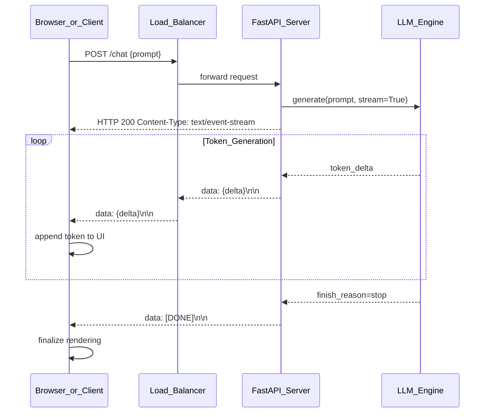

# Streaming Responses in LLM Applications

> [!abstract] TL;DR
> Instead of waiting for an LLM to finish generating its entire response before sending anything, streaming pushes each token to the client the moment it is produced — transforming a 10-second blank wait into a typewriter effect that users experience as instant. The protocol underneath is almost always Server-Sent Events (SSE); the engineering challenge is keeping that pipe open all the way from GPU to browser without a buffering proxy silently killing it.

---

## Intuition

**Analogy:** Imagine ordering a custom pizza. Non-streaming means the kitchen waits until the pizza is fully baked, boxed, and sliced before telling you anything — you stare at the order screen for 15 minutes. Streaming is the kitchen calling out each step as it happens: "dough done," "sauce on," "cheese melted," "out of the oven" — same total time, but you feel progress immediately and can start eating the first slice while the rest is still cutting.

LLMs generate text one token at a time in an autoregressive loop. Streaming simply forwards each token over the network as it is sampled rather than buffering all tokens server-side and flushing the buffer only after generation completes. The total generation time is identical either way — the perceived latency drops dramatically.

---

## How It Works

### Core Mechanics

**Key metrics distinguished by streaming:**
- **TTFT (Time to First Token):** How long the user waits before seeing any output. Streaming collapses TTFT to the time needed to generate the first token — typically 200–800ms. Without streaming, TTFT equals total generation time, which can be 30+ seconds for long outputs.
- **TTLT (Time to Last Token):** Total generation time. Streaming does not change this — it is determined by model size, hardware, and output length.
- **Perceived latency:** What the user actually experiences. Streaming makes TTFT the dominant perception driver, not TTLT.

**SSE Protocol mechanics:**

The server sends a response with `Content-Type: text/event-stream`. The connection remains open (HTTP long-lived connection). Each token or chunk is sent as an SSE event:

```
data: {"choices":[{"delta":{"content":"Hello"}}]}\n\n
data: {"choices":[{"delta":{"content":" world"}}]}\n\n
data: [DONE]\n\n
```

SSE is one-directional (server → client), text-based, built on HTTP/1.1, and automatically reconnects on drop. The `\n\n` double newline terminates each event. A line starting with `data:` carries the payload.

**When to stream vs not stream:**

| Scenario | Use Streaming? | Reason |
|---|---|---|
| Interactive chat UI | Yes | User sees progress; TTFT dominates perception |
| Long document generation | Yes | Avoids timeout on slow connections |
| Batch processing / ETL | No | Throughput matters more; overhead of SSE wastes cycles |
| Structured JSON output | No | Partial JSON is unparseable mid-stream; parse on completion |
| Tool call orchestration | Conditional | Stream for display; buffer tool arguments until complete |
| Automated pipelines (no user) | No | Adds complexity with no UX benefit |

### Flow / Architecture



---

## Streaming Across Frameworks

### OpenAI Python SDK

```python
from openai import OpenAI

client = OpenAI()

# stream=True returns an iterator over chunks
stream = client.chat.completions.create(
    model="gpt-4o-mini",
    messages=[{"role": "user", "content": "Explain attention mechanisms in 3 sentences."}],
    stream=True,
)

# Each chunk has the same shape as a non-streaming response,
# but delta.content contains only the new tokens in this chunk.
full_response = ""
for chunk in stream:
    delta_content = chunk.choices[0].delta.content
    if delta_content is not None:
        print(delta_content, end="", flush=True)
        full_response += delta_content

# finish_reason appears on the last chunk: "stop", "length", "tool_calls"
print(f"\nFinish reason: {chunk.choices[0].finish_reason}")
```

### Anthropic Python SDK

```python
import anthropic

client = anthropic.Anthropic()

# Context manager pattern — automatically handles stream lifecycle
with client.messages.stream(
    model="claude-opus-4-5",
    max_tokens=512,
    messages=[{"role": "user", "content": "Explain KV caching."}],
) as stream:
    # text_stream is an iterator that yields only the text content,
    # stripping event metadata automatically.
    for text_chunk in stream.text_stream:
        print(text_chunk, end="", flush=True)

# stream.get_final_message() gives the assembled Message after the loop
final = stream.get_final_message()
print(f"\nInput tokens: {final.usage.input_tokens}")
print(f"Output tokens: {final.usage.output_tokens}")
```

### HuggingFace Transformers — TextIteratorStreamer

HuggingFace's `generate()` is synchronous and blocks until generation completes. The `TextIteratorStreamer` solves this with a threading pattern: generation runs in a background thread and pushes decoded text into a queue that the main thread iterates over.

```python
from transformers import AutoTokenizer, AutoModelForCausalLM, TextIteratorStreamer
from threading import Thread
import torch

model_name = "gpt2"
tokenizer = AutoTokenizer.from_pretrained(model_name)
model = AutoModelForCausalLM.from_pretrained(model_name, torch_dtype=torch.float32)

inputs = tokenizer("The transformer architecture", return_tensors="pt")

# skip_prompt=True omits the prompt from the stream; skip_special_tokens=True
# removes <eos>, <pad>, etc. from the yielded text.
streamer = TextIteratorStreamer(tokenizer, skip_prompt=True, skip_special_tokens=True)

# Run generation in a background thread so the main thread can consume tokens
generation_kwargs = {
    **inputs,
    "streamer": streamer,
    "max_new_tokens": 80,
    "do_sample": False,
}
thread = Thread(target=model.generate, kwargs=generation_kwargs)
thread.start()

# Main thread iterates the streamer — blocks only long enough for each token
for token_text in streamer:
    print(token_text, end="", flush=True)

thread.join()
print()
```

### LangChain Streaming

LangChain's `Runnable` interface provides `.stream()` for synchronous streaming and `.astream()` for async. All LCEL chains composed with `|` inherit streaming automatically — each component passes chunks downstream as they arrive.

```python
from langchain_openai import ChatOpenAI
from langchain_core.prompts import ChatPromptTemplate
from langchain_core.output_parsers import StrOutputParser

llm = ChatOpenAI(model="gpt-4o-mini", streaming=True)
prompt = ChatPromptTemplate.from_messages([
    ("system", "You are a concise technical explainer."),
    ("user", "{question}"),
])
chain = prompt | llm | StrOutputParser()

# .stream() yields string chunks through the entire chain
for chunk in chain.stream({"question": "What is backpropagation?"}):
    print(chunk, end="", flush=True)

print()

# Async variant for use in async frameworks (FastAPI, etc.)
import asyncio

async def stream_async():
    async for chunk in chain.astream({"question": "What is a transformer?"}):
        print(chunk, end="", flush=True)

asyncio.run(stream_async())
```

### LangGraph Stream Modes

LangGraph exposes graph execution via `graph.stream()` with five distinct modes:

| Mode | What is Yielded | Best For |
|---|---|---|
| `"values"` | Full graph state snapshot after each node | Debugging; seeing entire state at every step |
| `"updates"` | Only the state delta from each node | Dashboards; bandwidth-efficient progress monitoring |
| `"messages"` | Individual LLM token deltas (token-level) | Chat UIs needing real-time typewriter effect |
| `"custom"` | User-defined data emitted via `StreamWriter` | Progress bars, structured notifications |
| `"debug"` | All internal events including task scheduling | Development tracing |

```python
from langgraph.graph import StateGraph, END
from langchain_openai import ChatOpenAI
from typing import TypedDict

class State(TypedDict):
    messages: list

llm = ChatOpenAI(model="gpt-4o-mini", streaming=True)

def chat_node(state: State) -> State:
    response = llm.invoke(state["messages"])
    return {"messages": state["messages"] + [response]}

graph = StateGraph(State)
graph.add_node("chat", chat_node)
graph.set_entry_point("chat")
graph.add_edge("chat", END)
app = graph.compile()

initial_state = {"messages": [{"role": "user", "content": "What is RAG?"}]}

# "messages" mode: yields token-level LLM output for chat display
for event in app.stream(initial_state, stream_mode="messages"):
    if hasattr(event[0], "content"):
        print(event[0].content, end="", flush=True)
```

---

## Code Demo

**FastAPI streaming endpoint with SSE** — the production pattern for serving streaming LLM responses over HTTP.

```python
import asyncio
from fastapi import FastAPI, Request
from fastapi.responses import StreamingResponse
from openai import AsyncOpenAI
import json

app = FastAPI()
openai_client = AsyncOpenAI()


async def sse_token_generator(prompt: str, model: str = "gpt-4o-mini"):
    """
    Async generator that calls OpenAI with stream=True and yields
    SSE-formatted lines. Each 'data:' event carries a JSON payload.
    The [DONE] sentinel signals the client to close the EventSource.
    """
    try:
        stream = await openai_client.chat.completions.create(
            model=model,
            messages=[{"role": "user", "content": prompt}],
            stream=True,
            max_tokens=512,
        )
        async for chunk in stream:
            delta = chunk.choices[0].delta.content
            finish = chunk.choices[0].finish_reason
            if delta is not None:
                payload = json.dumps({"delta": delta, "done": False})
                yield f"data: {payload}\n\n"
            if finish is not None:
                yield f"data: {json.dumps({'delta': '', 'done': True, 'finish_reason': finish})}\n\n"
    except Exception as e:
        yield f"data: {json.dumps({'error': str(e)})}\n\n"


@app.post("/chat/stream")
async def chat_stream(request: Request):
    body = await request.json()
    prompt = body.get("prompt", "")

    return StreamingResponse(
        sse_token_generator(prompt),
        media_type="text/event-stream",
        headers={
            "Cache-Control": "no-cache",
            "Connection": "keep-alive",
            # Disables nginx proxy buffering — critical for SSE to work
            # through a reverse proxy. Without this, nginx buffers the
            # entire response before forwarding it.
            "X-Accel-Buffering": "no",
        },
    )


# Client consumption example (Python httpx)
# import httpx
# with httpx.stream("POST", "http://localhost:8000/chat/stream",
#                   json={"prompt": "Explain LLM streaming"}) as r:
#     for line in r.iter_lines():
#         if line.startswith("data: "):
#             payload = json.loads(line[6:])
#             if not payload.get("done"):
#                 print(payload["delta"], end="", flush=True)
```

---

## Advanced Topics

### Streaming with Tool Calls

When a model decides to call a tool mid-generation, the stream produces `delta.tool_calls` chunks instead of `delta.content`. Tool call arguments arrive as partial JSON fragments — you must **accumulate them** before parsing.

```python
from openai import OpenAI
import json

client = OpenAI()

tools = [{
    "type": "function",
    "function": {
        "name": "get_weather",
        "description": "Get current weather for a city",
        "parameters": {
            "type": "object",
            "properties": {"city": {"type": "string"}},
            "required": ["city"],
        },
    },
}]

stream = client.chat.completions.create(
    model="gpt-4o-mini",
    messages=[{"role": "user", "content": "What's the weather in Tokyo?"}],
    tools=tools,
    stream=True,
)

# Accumulate tool call argument fragments
tool_call_accumulator = {}

for chunk in stream:
    delta = chunk.choices[0].delta

    if delta.tool_calls:
        for tc_delta in delta.tool_calls:
            idx = tc_delta.index
            if idx not in tool_call_accumulator:
                tool_call_accumulator[idx] = {
                    "id": tc_delta.id or "",
                    "name": tc_delta.function.name or "",
                    "arguments": "",
                }
            # arguments arrive as partial JSON strings — must concatenate
            if tc_delta.function.arguments:
                tool_call_accumulator[idx]["arguments"] += tc_delta.function.arguments

    elif delta.content:
        print(delta.content, end="", flush=True)

# Parse only after stream is complete (arguments are now full JSON)
for idx, tc in tool_call_accumulator.items():
    args = json.loads(tc["arguments"])
    print(f"\nTool call: {tc['name']}({args})")
    # → Tool call: get_weather({'city': 'Tokyo'})
```

### Reasoning Model Streaming (Thinking Tokens)

Models like Claude 3.7 Sonnet (extended thinking) and DeepSeek-R1 emit "thinking" tokens before the final response. In streaming, these arrive as a separate content block.

```python
import anthropic

client = anthropic.Anthropic()

with client.messages.stream(
    model="claude-opus-4-5",
    max_tokens=16000,
    thinking={"type": "enabled", "budget_tokens": 10000},
    messages=[{"role": "user", "content": "Solve: if 2^x = 5, find x."}],
) as stream:
    for event in stream:
        # content_block_start tells you the block type
        if hasattr(event, "type"):
            if event.type == "content_block_start":
                block_type = event.content_block.type
                print(f"\n[Block: {block_type}]")
            elif event.type == "content_block_delta":
                delta = event.delta
                # thinking deltas: show or hide based on UX needs
                if hasattr(delta, "thinking"):
                    pass  # optionally surface to UI as collapsible
                elif hasattr(delta, "text"):
                    print(delta.text, end="", flush=True)
```

### WebSocket vs SSE for LLM Streaming

| Dimension | SSE (text/event-stream) | WebSocket |
|---|---|---|
| Direction | Server → Client only | Bidirectional |
| Protocol | HTTP/1.1 or HTTP/2 | Upgraded HTTP → WS |
| Reconnection | Automatic (browser EventSource) | Manual |
| Proxy support | Wide (standard HTTP) | Requires proxy config |
| LLM chat fit | Excellent — response is unidirectional | Overkill unless client sends mid-stream |
| Multiplexing | HTTP/2 multiplexes multiple streams | One connection handles many channels |
| Complexity | Low — works with any HTTP stack | Higher — needs WS server |

**Verdict for LLM applications:** SSE is almost always the right choice. WebSockets make sense only when the client needs to interrupt generation mid-stream or send real-time data back to the server while generation is ongoing (e.g., voice interruption in voice agents).

### Backpressure

Backpressure occurs when the client cannot consume tokens as fast as the LLM generates them. With SSE over TCP:
- The server's `send()` buffer fills up.
- The kernel blocks `write()` on the server side.
- The LLM generation loop stalls waiting for network I/O.
- Eventually the OS closes the connection if the buffer stays full too long.

In practice, LLMs generate at 40–150 tokens/second, which is much slower than network throughput. Backpressure is rarely a bottleneck for individual users. It becomes relevant when many concurrent slow clients (e.g., mobile on 2G) hold connections while a GPU is generating — vLLM's continuous batching handles this by decoupling generation from delivery.

---

## Real-World Example

> **Example:** ChatGPT uses SSE for every chat response. When you send a message, the browser opens an `EventSource` connection. The server streams tokens as they are generated by the model. This is why you see text appear word by word. Internally, OpenAI uses their own optimized inference stack (likely inspired by vLLM) that decouples the GPU generation from the network delivery — the [[KV_Cache]] enables efficient autoregressive generation at each step. The client-side EventSource automatically reconnects if the connection drops, so a brief network blip does not lose the response.

---

## Trade-offs

| Aspect | Streaming | Non-Streaming |
|--------|-----------|---------------|
| Perceived latency | Low — TTFT in milliseconds | High — user waits for full response |
| Server complexity | Higher — async generators, SSE headers | Lower — return JSON response |
| Proxy/infra complexity | Higher — must disable buffering at every hop | Lower — standard HTTP buffering fine |
| Parseable output | No — partial text cannot be JSON-parsed mid-stream | Yes — full response available immediately |
| Tool call handling | Complex — accumulate argument fragments | Simple — complete JSON available |
| Batch throughput | Lower — connections held open per request | Higher — request/response freed immediately |
| Long output UX | Excellent | Poor (blank screen for 30s) |
| Structured output | Poor fit | Better fit |

---

## When to Use vs Avoid

**Use streaming when:**
- Building a chat interface where users read responses as they arrive.
- Generating long outputs (>200 tokens) where users will otherwise stare at a blank screen.
- Latency-sensitive interactive applications (coding assistants, writing tools).
- You control the full stack from LLM to browser and can configure proxy pass-through.

**Avoid streaming when:**
- Processing LLM output programmatically before showing it (structured JSON, tool results).
- Running batch jobs where throughput matters more than latency.
- Your infrastructure includes an HTTP proxy you cannot configure (corporate proxies, some CDNs).
- You need to validate or transform the complete response before delivering it (e.g., safety filtering on full output).

---

## Common Pitfalls

- **Nginx proxy buffering silently absorbs the stream** — Nginx buffers upstream responses by default. Without `proxy_buffering off;` or the `X-Accel-Buffering: no` response header, the client receives the entire response at once after generation completes. This looks identical to non-streaming from the client's perspective and is extremely difficult to diagnose.

- **Load balancer idle timeout kills long responses** — AWS ALB has a default 60-second idle timeout; many load balancers have similar limits. A 2000-token response at 30 tok/s takes 67 seconds — the load balancer closes the connection mid-stream. Fix: increase the idle timeout to 300+ seconds for streaming endpoints, or send a keepalive comment (`: keep-alive\n\n`) every 15 seconds.

- **Broken pipe on client disconnect not handled** — If the user closes the browser tab, the server continues generating and pushing tokens to a closed connection. In FastAPI, `asyncio.CancelledError` is raised in the async generator when the client disconnects. Catch it to stop generation immediately and release GPU resources.

- **Not accumulating tool call arguments before parsing** — Tool call arguments arrive as partial JSON fragments (e.g., `{"city": "To"` then `"kyo"}`). Calling `json.loads()` on a fragment raises a parse error. Always collect all `delta.function.arguments` fragments before parsing.

- **gzip or chunked encoding double-buffering** — Some middleware applies gzip compression to SSE streams. Gzip buffers data to find good compression boundaries, which defeats streaming. Disable gzip for `text/event-stream` content type in your middleware configuration.

- **Missing `flush` on the generator** — Some WSGI frameworks (Gunicorn in sync mode) buffer generator output internally. Use `uvicorn` with async endpoints and `StreamingResponse` to avoid this. In sync contexts, explicitly call `sys.stdout.flush()` or use `flush=True`.

---

## Related Concepts

- [[LLM_Inference_Optimization]] — the server-side engine that generates tokens being streamed; KV cache and continuous batching determine token generation speed
- [[KV_Cache]] — enables efficient autoregressive generation; each streamed token is produced via a single forward pass using the cached K/V state
- [[Generation_Controls]] — temperature, top-p, and max_tokens all apply equally to streamed generation; max_tokens determines when streaming stops
- [[Context_Windows_and_Tokens]] — longer contexts mean more tokens to stream; TTFT includes prefill time which grows with context length
- [[FastAPI_for_ML]] — the recommended framework for building streaming endpoints; `StreamingResponse` with async generators is the core pattern
- [[LangChain]] — provides `.stream()` and `.astream()` on all LCEL chains; streaming callbacks for monitoring individual tokens
- [[AI_Agents_Overview]] — agentic loops benefit from streaming to show which tool is being called and what the model is reasoning

---

## Review Questions

1. A user complains that your chatbot "feels slow" even though your total generation time is only 8 seconds. After investigating, you find TTFT is 7.9 seconds because you are not streaming. Explain how enabling streaming changes the user experience without changing total generation time. What specific server-side changes are required in FastAPI?

2. Your FastAPI streaming endpoint works perfectly in local development but clients report receiving the full response all at once in production (behind Nginx). Walk through every layer where buffering can occur and what configuration change fixes each one.

3. You are building an agent that streams its reasoning to the UI while also making tool calls. Explain why you cannot simply display every `delta.content` chunk, what special handling tool call chunks require, and how you would design the frontend event loop to handle both content tokens and tool call events in the same stream.

---

## Sources

- [OpenAI Streaming API Docs](https://developers.openai.com/api/docs/guides/streaming-responses)
- [Streaming Tool Calls with Anthropic SSE](https://dev.to/gabrielanhaia/streaming-tool-calls-parse-anthropic-sse-without-loading-the-whole-message-2on)
- [Comparing LLM API Streaming Structures](https://medium.com/percolation-labs/comparing-the-streaming-response-structure-for-different-llm-apis-2b8645028b41)
- [LangGraph Streaming Modes](https://docs.langchain.com/oss/python/langgraph/streaming)
- [LangGraph Streaming in Production](https://d2apczqz24upf4.cloudfront.net/courses/langgraph-prod/module-11/)
- [Streaming AI Agent Responses in Production: SSE, WebSocket, and Real-Time Output Patterns](https://niteagent.com/blog/2026-07-09-streaming-agent-responses-production-guide/)
- [How Streaming LLM APIs Work — Simon Willison](https://til.simonwillison.net/llms/streaming-llm-apis)

---

#llm #streaming #sse #inference #fastapi #langchain #production #real-time
