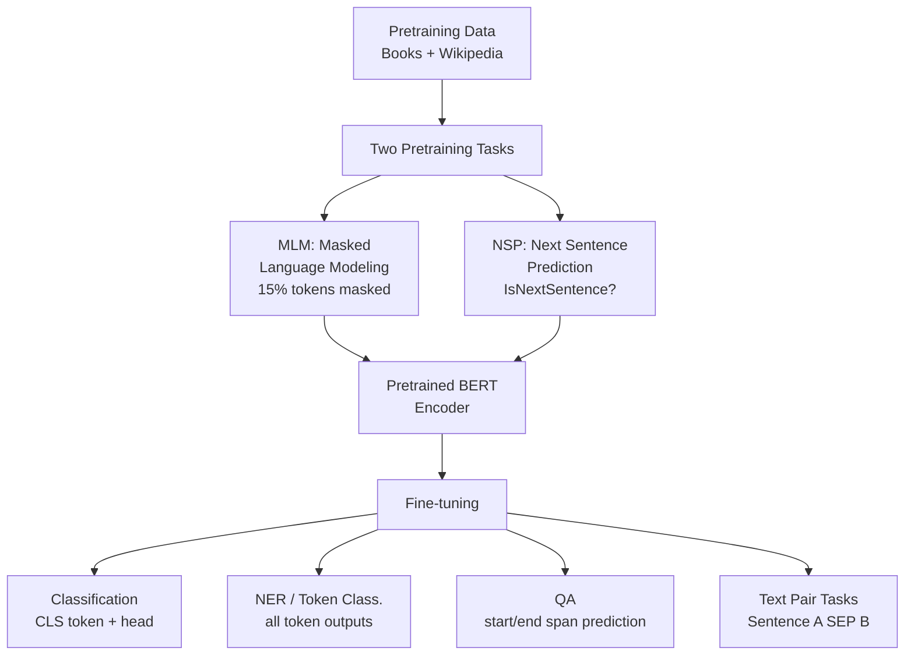

# 🔍 BERT

> [!abstract] TL;DR
> BERT (Devlin et al., 2019) is a bidirectional transformer encoder pretrained on two tasks: Masked Language Modeling (predict randomly masked tokens) and Next Sentence Prediction. Because it reads left AND right simultaneously, BERT builds richer contextual representations than GPT (left-to-right only). The `[CLS]` token representation is used for classification. Fine-tuning: add a task-specific head, train for 2–5 epochs. BERT transformed NLP benchmarks in 2019 and Google Search switched to it that year. Key variants: RoBERTa (better training), DistilBERT (smaller/faster), ALBERT (parameter sharing).

---

## Intuition — Analogy First

Imagine two readers:

**Reader A (GPT-style):** Must predict the next word without peeking ahead. They cover everything to the right with their hand and reason only from what came before. When trying to understand "The bank ___", they only know "The bank" without seeing what follows.

**Reader B (BERT-style):** Before answering any question, reads the ENTIRE paragraph — left to right AND right to left. When they encounter "The bank [MASK] the river", they see both "bank" and "river" simultaneously, making the disambiguation trivial ("the bank *alongside* the river" → LOC, not FIN).

BERT is Reader B. Its bidirectionality is its superpower for understanding and classification tasks. The cost: you can't generate text with BERT the way you can with GPT, because generation requires left-to-right order.

---

## How It Works — Mechanics

### Pretraining



**Masked Language Modeling (MLM):**
- 15% of tokens are randomly selected:
  - 80% replaced with `[MASK]`
  - 10% replaced with a random token
  - 10% left unchanged (forces model not to rely on `[MASK]` signal alone)
- Model must predict original token at masked positions
- The 10% random + 10% unchanged prevents model from only learning to predict `[MASK]`

**Next Sentence Prediction (NSP):**
- Input: `[CLS] Sentence A [SEP] Sentence B [SEP]`
- 50% of time: B is the actual next sentence in the corpus (label: IsNext)
- 50% of time: B is a random sentence (label: NotNext)
- `[CLS]` token representation is trained for this binary prediction
- Note: later work (RoBERTa) found NSP to be unhelpful; dropped in subsequent models

### Input representation

BERT's input is the sum of three embeddings:

$$\text{input} = \text{TokenEmbedding} + \text{SegmentEmbedding} + \text{PositionalEmbedding}$$

- **Token embedding:** WordPiece vocabulary, 30,522 tokens
- **Segment embedding:** Distinguishes sentence A (embedding A) from sentence B (embedding B)
- **Positional embedding:** Learned, absolute positions 0–511

### Fine-tuning paradigm

BERT introduces the "pretrain → fine-tune" paradigm:

| Task | Input Format | Output Used | Head Added |
|---|---|---|---|
| Text classification | `[CLS] text [SEP]` | `[CLS]` representation | Linear(d, num_classes) |
| Token classification (NER) | `[CLS] tokens [SEP]` | All token representations | Linear(d, num_labels) per token |
| Question Answering | `[CLS] question [SEP] passage [SEP]` | All tokens | Start/end span head |
| Sentence pair (NLI) | `[CLS] premise [SEP] hypothesis [SEP]` | `[CLS]` representation | Linear(d, 3) |

---

## The Math

**Masked LM loss** — only computed at masked positions:

$$\mathcal{L}_{\text{MLM}} = -\sum_{m \in \mathcal{M}} \log P(w_m \mid \mathbf{x}_{\setminus \mathcal{M}})$$

Where $\mathcal{M}$ is the set of masked positions and $\mathbf{x}_{\setminus \mathcal{M}}$ is the input with masked tokens.

**Fine-tuning classification loss:**

$$\mathcal{L}_{\text{cls}} = -\sum_{c} y_c \log \hat{y}_c$$

Where $\hat{y} = \text{softmax}(W_c \cdot \mathbf{h}_{[\text{CLS}]} + b_c)$ and $\mathbf{h}_{[\text{CLS}]} \in \mathbb{R}^{768}$ is the `[CLS]` token's final hidden state.

**BERT-base architecture parameters:**
- Layers (transformer blocks): $L = 12$
- Hidden size: $H = 768$
- Attention heads: $A = 12$
- Feed-forward size: $4H = 3072$
- Total parameters: ~110M

**BERT-large:**
- $L = 24$, $H = 1024$, $A = 16$
- Total parameters: ~340M

---

## Code Demo

```python
from transformers import (
    AutoTokenizer,
    BertModel,
    AutoModelForSequenceClassification,
    AutoModelForTokenClassification,
    Trainer,
    TrainingArguments,
)
import torch
from datasets import load_dataset

MODEL = "bert-base-uncased"
tokenizer = AutoTokenizer.from_pretrained(MODEL)

# ── Inspect BERT's tokenization with special tokens ──────────────────────────
text = "The bank by the river is beautiful."
encoding = tokenizer(text, return_tensors="pt")
print("Tokens:", tokenizer.convert_ids_to_tokens(encoding["input_ids"][0]))
# ['[CLS]', 'the', 'bank', 'by', 'the', 'river', 'is', 'beautiful', '.', '[SEP]']

# ── Sentence pair encoding (for NLI, QA) ─────────────────────────────────────
sent_a = "The cat sat on the mat."
sent_b = "The feline rested on the rug."
pair_encoding = tokenizer(sent_a, sent_b, return_tensors="pt")
print("\nPair tokens:", tokenizer.convert_ids_to_tokens(pair_encoding["input_ids"][0]))
# ['[CLS]', 'the', 'cat', ..., '[SEP]', 'the', 'feline', ..., '[SEP]']
print("Token type IDs:", pair_encoding["token_type_ids"])
# 0s for sentence A, 1s for sentence B

# ── Extract [CLS] embedding for classification ───────────────────────────────
bert = BertModel.from_pretrained(MODEL)
bert.eval()

with torch.no_grad():
    outputs = bert(**encoding)
    last_hidden_state = outputs.last_hidden_state   # (1, seq_len, 768)
    cls_embedding = outputs.pooler_output           # (1, 768) — tanh(Linear([CLS]))
    token_embeddings = last_hidden_state[0]          # (seq_len, 768)

print(f"\n[CLS] embedding shape: {cls_embedding.shape}")   # (1, 768)
print(f"All token embeddings: {last_hidden_state.shape}")  # (1, 10, 768)

# ── Fine-tune for sentiment classification (SST-2) ───────────────────────────
dataset = load_dataset("sst2")
model = AutoModelForSequenceClassification.from_pretrained(MODEL, num_labels=2)

def tokenize_fn(examples):
    return tokenizer(
        examples["sentence"],
        truncation=True,
        padding="max_length",
        max_length=128,
    )

tokenized = dataset.map(tokenize_fn, batched=True)

training_args = TrainingArguments(
    output_dir="./bert-sentiment",
    num_train_epochs=3,
    per_device_train_batch_size=16,
    per_device_eval_batch_size=64,
    evaluation_strategy="epoch",
    learning_rate=2e-5,           # BERT fine-tuning: 1e-5 to 5e-5
    weight_decay=0.01,
    warmup_ratio=0.1,             # 10% warmup steps
    load_best_model_at_end=True,
)

trainer = Trainer(
    model=model,
    args=training_args,
    train_dataset=tokenized["train"],
    eval_dataset=tokenized["validation"],
)
trainer.train()
# Typical result: ~92–93% accuracy on SST-2 after fine-tuning

# ── Zero-shot with bert-base using pipeline ───────────────────────────────────
from transformers import pipeline

# Pre-fine-tuned sentiment pipeline
sentiment = pipeline("sentiment-analysis", model="distilbert-base-uncased-finetuned-sst-2-english")
print(sentiment("This movie was absolutely fantastic!"))
# [{'label': 'POSITIVE', 'score': 0.9998}]
```

---

## Real-World Example

**Google Search switched to BERT in 2019**

In October 2019, Google announced that BERT was deployed in Google Search — one of the most significant algorithmic updates in years, affecting ~10% of all search queries in the US.

**The problem BERT solved:** Google's previous ranking algorithms struggled with "long tail" queries where word order and context mattered. Example:

Query: *"Can you get medicine for someone pharmacy"*

Pre-BERT: Google would focus on "pharmacy" and "medicine" and return generic results about pharmacies.

Post-BERT: The word "for someone" (which implies a third party) changed the interpretation entirely. BERT understood that the query was about picking up prescriptions for another person.

BERT is now used for:
- Understanding the intent behind complex queries
- Passage retrieval within documents (Featured Snippets)
- Entity understanding and knowledge graph linkage
- NL understanding in Gmail Smart Reply, Google Assistant

---

## Trade-offs

| Model | Size | Speed | Quality | When to Use |
|---|---|---|---|---|
| BERT-base-uncased | 110M | Fast | Good | Baseline; uncased English tasks |
| BERT-base-cased | 110M | Fast | Good for NER | NER, tasks where case matters |
| BERT-large | 340M | Slow | Better | When compute is not a constraint |
| RoBERTa-base | 125M | Fast | Better than BERT | Drop-in BERT replacement; better pretraining |
| DistilBERT | 66M | 60% faster | ~97% of BERT | Production: latency constraints |
| ALBERT | 12M (shared) | Fast | Comparable | Low memory; parameter efficiency |
| DeBERTa-v3 | 184M | Moderate | Best encoder | Top benchmark scores, complex tasks |

---

## When to Use vs Avoid

**Use BERT (or RoBERTa/DistilBERT) when:**
- Text classification (sentiment, topic, intent)
- Named entity recognition, POS tagging
- Question answering (extractive)
- Sentence similarity / semantic textual similarity
- You have task-specific labeled data for fine-tuning (even 1,000 examples helps)
- Inference latency is 20–100ms is acceptable

**Avoid BERT when:**
- You need to generate new text → use GPT-family
- Sequence length exceeds 512 tokens → use Longformer, BigBird, or chunking
- Mobile/edge deployment with strict size limits → use DistilBERT or domain-specific smaller models
- Zero-shot task with no labeled data → use instruction-tuned LLMs (GPT-4, Claude)

---

## Common Pitfalls

1. **Using uncased BERT for NER** — BERT-base-uncased lowercases everything during tokenization. "Apple" and "apple" become identical. For NER, where capitalization is a critical signal for named entities, always use `bert-base-cased`.

2. **Fine-tuning for too many epochs** — BERT is prone to catastrophic forgetting and overfitting on small datasets when fine-tuned for too long. 2–4 epochs with learning rate 2e-5 to 5e-5 is the standard range. More epochs on small datasets → overfitting.

3. **Confusing `last_hidden_state[0]` with `pooler_output`** — The `[CLS]` token's final hidden state (`last_hidden_state[:, 0, :]`) and `pooler_output` are NOT the same. `pooler_output` passes through a linear+tanh layer trained specifically for NSP. For classification tasks, `pooler_output` is the conventional choice, but mean pooling over all tokens often works better for semantic similarity.

4. **Ignoring the 512-token limit** — BERT was pretrained with a maximum sequence length of 512 tokens. Inputs longer than 512 must be truncated or handled with sliding window approaches. Truncating silently discards the tail of long documents.

5. **Not warming up the learning rate** — Fine-tuning without a warmup phase (first 5–10% of steps with linearly increasing LR) frequently leads to instability in the early steps, because the randomly-initialized classification head has large gradients that destabilize the pretrained weights.

---

## Related Concepts

- [[_MOC_NLP|↑ Section MOC]]

- [[GPT_Family]] — the complementary autoregressive architecture; decoder-only vs BERT's encoder-only
- [[Transformer_Architecture]] — BERT uses the transformer encoder block (self-attention + FFN)
- [[Attention_Mechanism]] — the core operation in each BERT layer
- [[Tokenization]] — BERT uses WordPiece tokenization; `[CLS]`, `[SEP]`, `[MASK]` special tokens
- [[Language_Model_Basics]] — BERT as a masked language model
- [[Sequence_Labeling]] — BERT fine-tuning for NER and POS tagging

---

## Review Questions

1. BERT is pretrained with two tasks: Masked Language Modeling (MLM) and Next Sentence Prediction (NSP). RoBERTa removes NSP entirely and achieves better performance. What does this tell us about the role NSP played in BERT's pretraining? What might explain why NSP was counterproductive?

2. You want to classify customer support tickets into 10 categories. You have 5,000 labeled examples. Would you rather (a) fine-tune BERT with a linear classifier head, or (b) train a logistic regression on TF-IDF features? Defend your choice and specify what learning rate and number of epochs you'd use for BERT.

3. A BERT model for document classification receives a document with 800 tokens. The model's maximum input length is 512. Describe three strategies for handling this, with trade-offs: (a) simple truncation, (b) sliding window with pooling, (c) hierarchical model.

---

## Sources

- Devlin, J., Chang, M.-W., Lee, K., & Toutanova, K. (2019). BERT: Pre-training of Deep Bidirectional Transformers for Language Understanding. *NAACL 2019*. https://arxiv.org/abs/1810.04805
- Liu, Y., et al. (2019). RoBERTa: A Robustly Optimized BERT Pretraining Approach. https://arxiv.org/abs/1907.11692
- Sanh, V., et al. (2019). DistilBERT, a distilled version of BERT. https://arxiv.org/abs/1910.01108
- Nayak, P. (2019). Understanding searches better than ever before. Google Blog. https://blog.google/products/search/search-language-understanding-bert/

#nlp #bert #transformers #masked-lm #fine-tuning #pretraining #classification #intermediate
