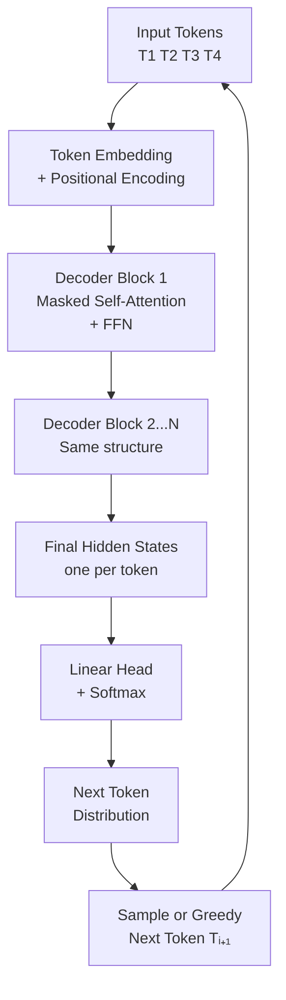

# 🤖 GPT Family

> [!abstract] TL;DR
> GPT (Generative Pre-trained Transformer) models are decoder-only transformers trained on next-token prediction. They generate text left-to-right using masked (causal) self-attention. GPT-1 introduced the pretrain→fine-tune paradigm (2018); GPT-2 showed zero-shot capabilities (2019); GPT-3 (175B) demonstrated emergent few-shot learning without gradient updates (2020); GPT-4 (unknown size, MoE) achieved near-human performance on professional benchmarks (2023). The key unlock at scale: in-context learning — the ability to learn new tasks just from examples in the prompt, no gradient updates needed.

---

## Intuition — Analogy First

Imagine a writer who has read the entire internet and every book ever written. Ask them to continue any text and they'll produce plausible completions because they've seen billions of similar patterns.

GPT is exactly that writer — but operating token by token. It can only see what came before ("left to right") — never what comes after. This is the opposite of BERT, which reads the whole passage before answering.

The scale revelation: GPT-3 discovered that this simple writer, when made 1,000x larger and given 1,000x more text to read, starts **doing things it was never explicitly taught**. Show it two examples of a task in the prompt, and it performs the task correctly on a third. Ask it to write code, and it writes working code — despite never being told "learn programming". These are **emergent abilities** from scale.

The limitation: this writer can only write what comes next. They can't look back and revise. They can't "reason" by reading ahead. They generate one token at a time and commit.

---

## How It Works — Mechanics



### Causal (masked) self-attention

The critical difference from BERT: GPT uses **causal masking** to prevent each token from attending to future tokens.

```
For sequence [T1, T2, T3, T4]:
T1 attends to: [T1]           (only itself)
T2 attends to: [T1, T2]
T3 attends to: [T1, T2, T3]
T4 attends to: [T1, T2, T3, T4]
```

The mask is a lower-triangular matrix of −∞ values applied before softmax:

$$\text{Mask}_{ij} = \begin{cases} 0 & \text{if } j \le i \\ -\infty & \text{if } j > i \end{cases}$$

### GPT evolution

| Model | Year | Params | Training Tokens | Key Innovation |
|---|---|---|---|---|
| GPT-1 | 2018 | 117M | ~1B | Pretrain → fine-tune paradigm |
| GPT-2 | 2019 | 1.5B | 40B | Zero-shot task performance; released cautiously |
| GPT-3 | 2020 | 175B | 300B | Few-shot in-context learning; no gradient updates |
| InstructGPT | 2022 | 175B+ | — | RLHF alignment; follow instructions better |
| GPT-4 | 2023 | Unknown | Unknown | Multimodal; near-human on professional exams |
| GPT-4o | 2024 | Unknown | Unknown | Omni (text+audio+vision), fast inference |

### In-context learning (the GPT-3 breakthrough)

GPT-3 showed that large language models can perform tasks from a few examples given **in the prompt** — without any gradient updates:

```
# Few-shot prompt (3 examples)
Translate English to French:
  English: sea otter → French: loutre de mer
  English: cheese → French: fromage
  English: peppermint → French: menthe poivrée
  English: plush giraffe → French: ?
```

GPT-3 correctly outputs "girafe en peluche". This happens entirely through forward-pass attention over the in-context examples — the model's weights don't change.

### Sampling strategies

| Strategy | How It Works | Temperature | Use Case |
|---|---|---|---|
| Greedy | Always pick highest-probability token | 0 | Deterministic, repetitive |
| Temperature sampling | Scale logits by 1/T before softmax | 0.7–1.2 | Creative generation |
| Top-k sampling | Sample from top k tokens only | 0.8 | Reduces incoherent outputs |
| Top-p (nucleus) | Sample from tokens summing to p probability | 0.9 | Most balanced for generation |
| Beam search | Explore k candidate sequences | 0 | Translation, summarization |

---

## The Math

**Causal language modeling loss:**

$$\mathcal{L} = -\frac{1}{T} \sum_{t=1}^{T} \log P_\theta(w_t \mid w_1, ..., w_{t-1})$$

**Softmax with temperature:**

$$P(w_i) = \frac{\exp(z_i / \tau)}{\sum_j \exp(z_j / \tau)}$$

Where $z_i$ are logits and $\tau$ is temperature:
- $\tau \to 0$: approaches greedy (argmax)
- $\tau = 1$: standard softmax
- $\tau > 1$: flatter distribution, more random

**Top-p (nucleus) sampling:**

Define the nucleus $S$ as the smallest set of tokens such that:

$$\sum_{w \in S} P(w) \ge p$$

Sample uniformly from $S$. At each step, the nucleus adapts: if the model is confident (one token dominates), $S$ might contain just 1–3 tokens; if uncertain, $S$ might contain 50+ tokens.

**Attention complexity:** For a sequence of length $L$, self-attention is $O(L^2 \cdot d)$. This is why long-context generation is expensive and why GPT models have context window limits.

---

## Code Demo

```python
from transformers import (
    AutoTokenizer,
    AutoModelForCausalLM,
    pipeline,
    GenerationConfig,
)
import torch

MODEL = "gpt2"   # Replace with "gpt2-medium", "gpt2-large", etc.
tokenizer = AutoTokenizer.from_pretrained(MODEL)
tokenizer.pad_token = tokenizer.eos_token   # GPT-2 has no pad token

# ── Basic text generation ──────────────────────────────────────────────────
generator = pipeline("text-generation", model=MODEL)

prompt = "The transformer architecture was introduced in 2017 and it"
output = generator(
    prompt,
    max_new_tokens=100,
    do_sample=True,
    temperature=0.8,
    top_p=0.92,
    num_return_sequences=3,
)
for i, seq in enumerate(output):
    print(f"\n[Sample {i+1}] {seq['generated_text']}")

# ── Manual generation with logits inspection ──────────────────────────────
model = AutoModelForCausalLM.from_pretrained(MODEL)
model.eval()

input_text = "Artificial intelligence will"
inputs = tokenizer(input_text, return_tensors="pt")

with torch.no_grad():
    outputs = model(**inputs)
    logits = outputs.logits          # (1, seq_len, vocab_size)
    next_token_logits = logits[0, -1, :]   # logits for next token

# Show top-10 predicted next tokens
top_probs = torch.softmax(next_token_logits, dim=-1)
top_k_probs, top_k_ids = torch.topk(top_probs, 10)
print("\nTop-10 next token predictions:")
for prob, token_id in zip(top_k_probs, top_k_ids):
    token = tokenizer.decode([token_id])
    print(f"  '{token:20}' — {prob.item():.4f}")

# ── Sampling strategies comparison ────────────────────────────────────────
gen_configs = {
    "greedy":       GenerationConfig(do_sample=False, max_new_tokens=50),
    "temp=0.3":     GenerationConfig(do_sample=True, temperature=0.3, max_new_tokens=50),
    "temp=1.2":     GenerationConfig(do_sample=True, temperature=1.2, max_new_tokens=50),
    "top_k=10":     GenerationConfig(do_sample=True, top_k=10, max_new_tokens=50),
    "top_p=0.9":    GenerationConfig(do_sample=True, top_p=0.9, max_new_tokens=50),
}

prompt_ids = tokenizer.encode(input_text, return_tensors="pt")
print(f"\nPrompt: '{input_text}'")
print("-" * 80)

for name, config in gen_configs.items():
    with torch.no_grad():
        ids = model.generate(prompt_ids, generation_config=config)
    generated = tokenizer.decode(ids[0], skip_special_tokens=True)
    continuation = generated[len(input_text):]
    print(f"[{name:12}]: {continuation[:80]}")

# ── Few-shot in-context learning ───────────────────────────────────────────
# GPT-2 is small, but the pattern illustrates in-context learning
few_shot_prompt = """Classify the sentiment as positive or negative.
Review: "I loved this movie, it was fantastic!"
Sentiment: positive

Review: "Terrible experience, waste of money."
Sentiment: negative

Review: "The product works exactly as described, very happy with it."
Sentiment:"""

result = generator(
    few_shot_prompt,
    max_new_tokens=5,
    do_sample=False,     # greedy for classification
    temperature=1.0,
)
print(f"\nFew-shot result: {result[0]['generated_text'][len(few_shot_prompt):]}")
```

---

## Real-World Example

**ChatGPT = GPT-4 + RLHF**

ChatGPT is not a different architecture — it's GPT-4 (or GPT-3.5 Turbo) with:
1. **Supervised Fine-tuning (SFT):** OpenAI employees wrote demonstration conversations showing how a helpful assistant should respond
2. **Reward Model:** Humans ranked multiple responses; a reward model was trained to predict human preferences
3. **PPO:** The language model was fine-tuned to maximize the reward model's score via reinforcement learning

This RLHF process transforms a next-token predictor into a helpful, harmless assistant. The underlying GPT architecture and weights remain the same — the fine-tuning steers the generation toward human-preferred outputs.

**GitHub Copilot = GPT-4 on code**

Copilot fine-tunes a GPT-4 class model on billions of lines of public code from GitHub. The code completion task is identical: predict the next token (in this case, the next code token). The same in-context learning that lets GPT-3 do translation with 3 examples allows Copilot to complete functions based on the existing code in your editor.

---

## Trade-offs

| Consideration | GPT-style (Decoder) | BERT-style (Encoder) |
|---|---|---|
| Text generation | Native — left-to-right | Not natural |
| Classification | Possible but less efficient | Optimized — [CLS] token |
| Bidirectional context | No (causal masking) | Yes |
| Fine-tuning data needed | Less (ICL works) | Need labeled examples |
| Inference cost | Autoregressive (slow) | Single forward pass (fast) |
| Sequence length scaling | O(L²) attention | O(L²) attention |
| Parameter efficiency | Needs large scale for quality | Good quality at 110M–350M |

---

## When to Use vs Avoid

**Use GPT-family when:**
- The primary task is text generation, completion, chat, or summarization
- You want few-shot / zero-shot capabilities without labeled data
- The task is diverse and changes over time (prompting is more flexible than fine-tuning)
- You need code generation (Codex, GPT-4 code, StarCoder)
- Creative writing, ideation, brainstorming

**Avoid (prefer BERT) when:**
- Fixed classification task with thousands of labeled examples
- Inference latency is critical and you have labeled data to fine-tune
- Sequence-to-label tasks (NER, POS) where single-pass encoding suffices
- Extractive QA from a fixed corpus

---

## Common Pitfalls

1. **Expecting GPT to reliably tell you "I don't know"** — GPT's training objective rewards producing probable-sounding continuations. If a question has no clear answer, GPT will still generate a confident-sounding response. This is the hallucination problem. Mitigation: use temperature=0 for factual tasks, implement retrieval-augmented generation, add self-consistency checks.

2. **Treating prompt position as irrelevant** — Studies show GPT-3/4 is sensitive to the order of few-shot examples and where the instruction appears in the prompt. Put instructions at the beginning AND end for best reliability.

3. **Underestimating token limits** — GPT-4's 8K context (32K for GPT-4-32k, 128K for GPT-4-Turbo) is consumed by both input AND output. Long prompts leave less room for output. Count tokens before sending.

4. **Using temperature=1.0 for factual tasks** — Temperature 1.0 introduces randomness proportional to the model's uncertainty. For factual retrieval or classification, use temperature=0 (greedy) to get deterministic, highest-probability answers.

5. **Fine-tuning when prompting suffices** — Fine-tuning GPT models is expensive and requires high-quality data. For most tasks, well-crafted prompts with few-shot examples achieve comparable performance at zero cost. Fine-tune only when prompt engineering has been exhausted.

---

## Related Concepts

- [[_MOC_NLP|↑ Section MOC]]

- [[Transformer_Architecture]] — GPT uses the transformer decoder block (causal self-attention + cross-attention dropped)
- [[BERT]] — the complementary encoder-only architecture; bidirectional, better for understanding
- [[Scaling_Laws]] — GPT-3's emergent abilities were predicted by scaling laws
- [[RLHF]] — how GPT → ChatGPT via human feedback alignment
- [[Language_Model_Basics]] — autoregressive language modeling foundation
- [[T5_and_Encoder_Decoder]] — seq2seq models that combine encoder and decoder

---

## Review Questions

1. GPT uses causal (masked) self-attention while BERT uses full bidirectional attention. Explain why causal masking is necessary for autoregressive text generation. What would happen if you removed the mask and allowed GPT to attend to future tokens during training?

2. GPT-3 can perform 3-shot translation in the prompt without any gradient updates. Explain the mechanism: what is "in-context learning" mechanically, and why does it require large model scale (it doesn't work for GPT-2 175M but works well for GPT-3 175B)?

3. You're choosing between GPT-4 with a few-shot prompt vs fine-tuned BERT-base for a binary email classification task (spam/not-spam) with 10,000 labeled examples. What are the trade-offs in latency, accuracy, cost, and maintainability? Which would you deploy in production?

---

## Sources

- Radford, A., et al. (2018). Improving Language Understanding by Generative Pre-Training (GPT-1). https://openai.com/research/language-unsupervised
- Radford, A., Wu, J., et al. (2019). Language Models are Unsupervised Multitask Learners (GPT-2). https://openai.com/research/language-unsupervised
- Brown, T., et al. (2020). Language Models are Few-Shot Learners (GPT-3). *NeurIPS 2020*. https://arxiv.org/abs/2005.14165
- OpenAI. (2023). GPT-4 Technical Report. https://arxiv.org/abs/2303.08774

#nlp #gpt #decoder-only #autoregressive #in-context-learning #few-shot #text-generation #intermediate
