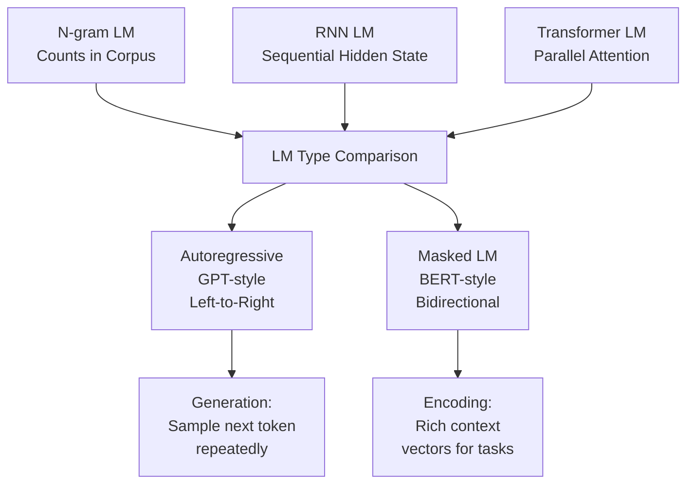

# 📖 Language Model Basics

> [!abstract] TL;DR
> A language model (LM) is a probability distribution over sequences of tokens: it assigns higher probability to natural-sounding text than to random word salad. Training objective: predict the next token given all previous tokens (autoregressive / GPT-style) or predict masked tokens from both directions (masked / BERT-style). The evaluation metric is perplexity — lower is better. N-gram LMs were the first approach (purely statistical); neural LMs (RNN, then Transformer) learned far richer representations. All modern LLMs — ChatGPT, Claude, Gemini — are neural language models trained at scale.

---

## Intuition — Analogy First

A language model is like a very sophisticated autocomplete that has read the entire internet. Your phone's autocomplete might suggest "I'll meet you at the" → "office" because it saw that pattern a few thousand times in your messages. A large language model like GPT-4 has seen that pattern billions of times, across billions of different contexts, and has also learned that "office" is less likely after "I'll meet you at the beach" because beaches and offices belong to different semantic contexts.

More precisely: a language model has learned the **statistical fabric of language**. Given "The stock market ___", it knows that "crashed", "rose", "closed" are far more probable completions than "barked", "swam", or "photosynthesized". This isn't comprehension in the human sense — it's a highly complex learned pattern.

The deeper insight: **everything follows from this single objective.** A model trained to predict the next word on enough text will implicitly learn grammar, facts, reasoning, style, and much more — because all of these affect which next word is most probable.

---

## How It Works — Mechanics



### Three generations of language models

**1. N-gram Language Models (statistical, pre-2013)**

Count n-grams in a corpus and use them to estimate probabilities via the chain rule:

```
P("the dog barked") = P("the") × P("dog"|"the") × P("barked"|"the dog")
```

**Limitation:** "the dog barked" only appears in training if those 3 words appeared together before. Sparse data problem is severe for large n. n=5 is typically the maximum.

**2. RNN/LSTM Language Models (neural, 2013–2017)**

A recurrent network reads tokens sequentially, maintaining a hidden state that encodes "everything seen so far". The hidden state is passed to a softmax layer to predict the next token. Handles variable-length context but suffers from vanishing gradients for long sequences.

**3. Transformer Language Models (neural, 2017–present)**

Self-attention attends to all previous tokens simultaneously. Scales efficiently with model size. Produces all modern LLMs. Two main variants:

| Variant | Architecture | Training Objective | Use Case |
|---|---|---|---|
| Autoregressive (AR) | Decoder-only | Predict next token | Text generation (GPT family) |
| Masked (MLM) | Encoder-only | Predict masked tokens | Text encoding/understanding (BERT) |
| Seq-to-Seq | Encoder + Decoder | Conditional generation | Translation, summarization (T5) |

### Autoregressive generation loop

```python
# Conceptual: how text generation works
generated = [start_token]
for _ in range(max_length):
    next_token_logits = model(generated)      # forward pass
    next_token = sample(next_token_logits)    # sample from distribution
    generated.append(next_token)
    if next_token == end_token:
        break
```

---

## The Math

**Chain rule decomposition** — any sequence probability can be written as:

$$P(w_1, w_2, ..., w_T) = \prod_{t=1}^{T} P(w_t \mid w_1, w_2, ..., w_{t-1})$$

This is exact (no approximation). The challenge is estimating each conditional probability.

**N-gram approximation** (Markov assumption, use only last $n-1$ tokens):

$$P(w_t \mid w_1, ..., w_{t-1}) \approx P(w_t \mid w_{t-n+1}, ..., w_{t-1})$$

**Maximum likelihood estimation** for n-gram:

$$P(w_t \mid w_{t-1}) = \frac{\text{count}(w_{t-1}, w_t)}{\text{count}(w_{t-1})}$$

**Cross-entropy loss** — training objective for neural LMs:

$$\mathcal{L} = -\frac{1}{T} \sum_{t=1}^{T} \log P(w_t \mid w_1, ..., w_{t-1})$$

**Perplexity** — the standard intrinsic evaluation metric:

$$\text{PPL} = \exp\left(-\frac{1}{N} \sum_{i=1}^{N} \log P(w_i \mid w_1, ..., w_{i-1})\right) = \exp(\mathcal{L})$$

**Interpretation:** Perplexity is the *effective vocabulary size* the model is "choosing from" at each step. A perplexity of 20 means the model is as uncertain as if it uniformly chose from 20 words. Lower is better; random model has PPL = |V| ≈ 50,000.

| Model | Perplexity on PTB |
|---|---|
| 5-gram + Kneser-Ney | ~141 |
| LSTM (2016) | ~70 |
| GPT-2 medium | ~26 |
| GPT-3 | ~20 |
| Modern LLMs (2024+) | ~5–15 |

---

## Code Demo

```python
# ── Part 1: N-gram LM from scratch ───────────────────────────────────────────
from collections import defaultdict, Counter
import math
import random

class BigramLM:
    """Bigram language model with Laplace smoothing."""

    def __init__(self, smoothing_alpha: float = 1.0):
        self.alpha = smoothing_alpha
        self.bigram_counts = defaultdict(Counter)
        self.unigram_counts = Counter()
        self.vocab: set[str] = set()

    def train(self, corpus: list[list[str]]):
        for sentence in corpus:
            tokens = ["<s>"] + sentence + ["</s>"]
            for token in tokens:
                self.unigram_counts[token] += 1
                self.vocab.add(token)
            for prev, curr in zip(tokens[:-1], tokens[1:]):
                self.bigram_counts[prev][curr] += 1

    def prob(self, word: str, prev_word: str) -> float:
        """P(word | prev_word) with Laplace smoothing."""
        count_bigram = self.bigram_counts[prev_word][word]
        count_unigram = self.unigram_counts[prev_word]
        V = len(self.vocab)
        return (count_bigram + self.alpha) / (count_unigram + self.alpha * V)

    def perplexity(self, test_corpus: list[list[str]]) -> float:
        log_prob = 0.0
        n_tokens = 0
        for sentence in test_corpus:
            tokens = ["<s>"] + sentence + ["</s>"]
            for prev, curr in zip(tokens[:-1], tokens[1:]):
                log_prob += math.log(self.prob(curr, prev))
                n_tokens += 1
        return math.exp(-log_prob / n_tokens)

    def generate(self, max_len: int = 20) -> str:
        tokens = ["<s>"]
        for _ in range(max_len):
            prev = tokens[-1]
            candidates = list(self.bigram_counts[prev].keys()) or list(self.vocab)
            weights = [self.bigram_counts[prev][c] + self.alpha for c in candidates]
            next_token = random.choices(candidates, weights=weights)[0]
            if next_token == "</s>":
                break
            tokens.append(next_token)
        return " ".join(tokens[1:])

# Train on a tiny corpus
train_corpus = [
    ["the", "cat", "sat", "on", "the", "mat"],
    ["the", "dog", "ran", "in", "the", "park"],
    ["a", "cat", "ran", "fast"],
    ["the", "cat", "ate", "the", "fish"],
]

lm = BigramLM(smoothing_alpha=0.1)
lm.train(train_corpus)

print(f"P(cat | the) = {lm.prob('cat', 'the'):.4f}")
print(f"P(dog | the) = {lm.prob('dog', 'the'):.4f}")
print(f"Perplexity on train: {lm.perplexity(train_corpus):.2f}")
print(f"Generated: {lm.generate()}")

# ── Part 2: GPT-2 text generation with HuggingFace ───────────────────────────
from transformers import pipeline, AutoTokenizer, AutoModelForCausalLM
import torch

# Text generation pipeline
generator = pipeline("text-generation", model="gpt2", device=0 if torch.cuda.is_available() else -1)

prompts = [
    "The future of artificial intelligence is",
    "Once upon a time in a land far away",
]

for prompt in prompts:
    outputs = generator(
        prompt,
        max_new_tokens=50,
        num_return_sequences=2,
        temperature=0.8,        # higher = more random
        top_k=50,               # sample from top-50 tokens
        top_p=0.92,             # nucleus sampling
        do_sample=True,
    )
    print(f"\nPrompt: '{prompt}'")
    for i, out in enumerate(outputs):
        print(f"  [{i+1}] {out['generated_text']}")

# ── Compute perplexity with GPT-2 ────────────────────────────────────────────
tokenizer = AutoTokenizer.from_pretrained("gpt2")
model = AutoModelForCausalLM.from_pretrained("gpt2")
model.eval()

def compute_perplexity(text: str) -> float:
    inputs = tokenizer(text, return_tensors="pt")
    with torch.no_grad():
        outputs = model(**inputs, labels=inputs["input_ids"])
    return math.exp(outputs.loss.item())

sentences = [
    "The quick brown fox jumps over the lazy dog.",         # natural English
    "Sky is the color blue of beautiful.",                   # slightly unnatural
    "Zzz xyz blorp flib snork.",                             # nonsense
]
for sent in sentences:
    ppl = compute_perplexity(sent)
    print(f"PPL={ppl:8.2f} | {sent}")
# PPL≈ 50    | natural sentence
# PPL≈ 300   | unnatural
# PPL≈ 8000  | nonsense
```

---

## Real-World Example

**All LLMs are language models**

ChatGPT, Claude, Gemini, LLaMA, Mistral — every major LLM is a transformer-based language model trained on the next-token prediction objective:

1. **Pretraining phase:** Feed trillions of tokens of text (web, books, code). Train to minimize cross-entropy loss on next-token prediction. The model learns the statistical structure of language.

2. **Fine-tuning phase:** Additional training on instruction-following data, RLHF (for alignment), etc. But the backbone language model is unchanged.

**Google's use case (2020s):** Google's LaMDA and later Gemini both started as language models trained on dialogue-heavy corpora. The pretraining objective was identical: predict the next token. The emergent capabilities (code generation, reasoning, question answering) were not explicitly trained — they arose from predicting text well enough.

**Why scale matters:** GPT-3 (175B parameters, 300B tokens) showed qualitative improvements over GPT-2 (1.5B parameters) not just in perplexity, but in emergent tasks like arithmetic, analogical reasoning, and translation — tasks the model was never explicitly trained on. This is the key mystery and promise of language model scaling.

---

## Trade-offs

| Model Type | Training Speed | Inference Speed | Context | Quality |
|---|---|---|---|---|
| N-gram | Very fast | Very fast | Limited (n-1 tokens) | Poor on rare sequences |
| LSTM/RNN | Fast | Moderate | Theoretically unlimited (degrades) | Good |
| Transformer (small) | Moderate | Fast | ~512–2048 tokens | Good |
| Transformer (large) | Slow | Slow | 4K–128K tokens | State-of-the-art |
| BERT (encoder) | Moderate | Fast | 512 tokens | Excellent for understanding |
| GPT (decoder) | Slow | Moderate | 4K–128K tokens | Excellent for generation |

---

## When to Use vs Avoid

**Use autoregressive LMs (GPT-style) when:**
- The task is text generation, completion, or chat
- You need to condition generation on a prompt
- Few-shot in-context learning is needed

**Use masked LMs (BERT-style) when:**
- The task is classification, NER, QA, or any "understanding" task
- You want rich bidirectional context for encoding
- You're fine-tuning on labeled task data

**Use n-gram LMs when:**
- Extreme inference speed is required (rule-based systems, spell checkers)
- Domain-specific language patterns and small vocabulary
- Interpretability and debugging are paramount

---

## Common Pitfalls

1. **Confusing generation LMs with understanding LMs** — GPT predicts left-to-right and is great at generation. BERT reads bidirectionally and is great at classification. You cannot directly compare perplexity between the two because they compute probabilities differently.

2. **Using perplexity as the only evaluation metric** — Low perplexity on a test set doesn't mean the model generates useful or accurate text. A model could achieve low perplexity by memorizing the training data. Always complement PPL with task-specific metrics.

3. **Forgetting that LLMs are not trained to be "correct"** — The training objective is to predict the most probable next token in the pretraining corpus. If the corpus contains false information, the model learns to reproduce it. LLMs hallucinate because "plausible-sounding" and "true" are different objectives.

4. **Underestimating the data requirement** — A bigram LM trained on 1,000 sentences will perform poorly because most bigrams are unseen. Neural LMs still benefit from massive data — the scaling laws show that data is as important as model parameters.

---

## Related Concepts

- [[_MOC_NLP|↑ Section MOC]]

- [[BERT]] — masked language model; bidirectional encoder
- [[GPT_Family]] — autoregressive language model; decoder-only
- [[Transformer_Architecture]] — the architecture underlying all modern LMs
- [[Tokenization]] — the vocabulary and token ID mapping that feeds into the LM
- [[Scaling_Laws]] — how loss decreases as model size and data increase
- [[RLHF]] — how pretrained LMs are aligned to be helpful and harmless

---

## Review Questions

1. A bigram language model assigns P("The cat sat on the mat") = 0.0002 and P("The cat sat on the hat") = 0.00004. What does this tell us about the training corpus? Now define perplexity and explain what it would mean for this model to have a perplexity of 400 on a test set.

2. GPT (autoregressive) and BERT (masked) are both "language models" but they compute probabilities differently. Explain the key architectural difference, why BERT cannot be used for text generation in the same way as GPT, and why BERT tends to outperform GPT on tasks like sentiment classification.

3. A researcher trains a 100M-parameter transformer LM on 1B tokens and achieves test perplexity of 35. They then train the same architecture on 10B tokens and achieve perplexity of 28. A colleague suggests that doubling the model size to 200M parameters would give a bigger improvement. Based on Chinchilla scaling laws, who is likely right, and why?

---

## Sources

- Bengio, Y., Ducharme, R., Vincent, P., & Jauvin, C. (2003). A Neural Probabilistic Language Model. *JMLR 2003*.
- Brown, T., et al. (2020). Language Models are Few-Shot Learners (GPT-3). *NeurIPS 2020*. https://arxiv.org/abs/2005.14165
- Radford, A., et al. (2019). Language Models are Unsupervised Multitask Learners (GPT-2). https://openai.com/research/language-unsupervised
- Manning, C. D., & Schütze, H. (1999). *Foundations of Statistical Natural Language Processing*. MIT Press.

#nlp #language-models #perplexity #n-gram #autoregressive #masked-lm #pretraining #beginner
