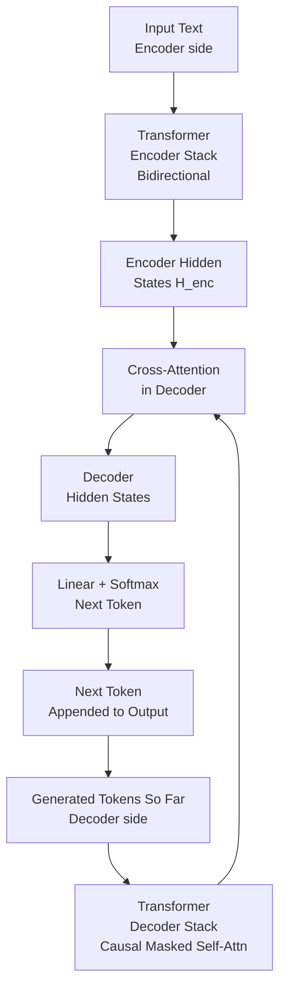

# 🔄 T5 and Encoder-Decoder Models

> [!abstract] TL;DR
> Encoder-decoder (seq2seq) models combine a bidirectional encoder (reads and understands input) with an autoregressive decoder (generates output), connected by cross-attention. T5 (Raffel et al., 2020) unifies every NLP task as "text in → text out": summarization, translation, QA, classification all become the same architecture with different prompt prefixes. BART is the alternative popular for abstractive summarization. Encoder-decoder excels when the output length and structure differs substantially from the input — translation, summarization, QA. For pure generation, decoder-only (GPT) is more efficient.

---

## Intuition — Analogy First

Think of a professional translator working between languages:

1. **Reading phase (encoder):** The translator reads the entire French document carefully, understanding context, tone, idioms, and structure. This is bidirectional — they read forward and backward, referring back to earlier sentences to understand later ones.

2. **Writing phase (decoder):** The translator writes the English translation word by word. At each word, they can refer back to their full understanding of the French text (via cross-attention) and also to everything they've written so far.

This is exactly the encoder-decoder architecture:
- **Encoder:** reads and understands the full input (bidirectional, BERT-like)
- **Cross-attention:** the decoder "looks at" the encoder's representations while generating
- **Decoder:** generates the output left-to-right (autoregressive, GPT-like)

The encoder-decoder is natural for tasks where input and output are in fundamentally different spaces: source language → target language, long document → short summary, question + context → answer.

---

## How It Works — Mechanics



### Three attention mechanisms in the decoder

Each decoder block contains THREE attention operations (vs two in encoder):

1. **Masked self-attention** — decoder attends to its own previously generated tokens (causal, no peeking at future)
2. **Cross-attention** — decoder attends to encoder hidden states (Q from decoder, K/V from encoder)
3. **Feed-forward network** — position-wise MLP

The cross-attention is the "bridge" — it lets the decoder use the full encoded representation of the input at every generation step.

### T5: Text-to-Text Transfer Transformer

T5's key insight: **reframe every NLP task as text → text** by prepending task-specific prefixes:

| Task | Input to T5 | Target Output |
|---|---|---|
| Translation EN→DE | `"translate English to German: The house is wonderful."` | `"Das Haus ist wunderbar."` |
| Summarization | `"summarize: [long article text]"` | `"[summary text]"` |
| Classification | `"sst2 sentence: This movie was great."` | `"positive"` |
| QA (extractive) | `"question: Where was Marie Curie born? context: [passage]"` | `"Warsaw"` |
| Grammar correction | `"cola sentence: The children played outside."` | `"acceptable"` |

This unification means T5 uses one architecture, one training procedure, and one inference function for all tasks. The task identity is encoded in the input text prefix.

**BART (Lewis et al., 2020):** An alternative encoder-decoder model pretrained by corrupting documents and training the model to reconstruct them. Corruption strategies: token masking (BERT-like), token deletion, text infilling, sentence permutation, document rotation. BART is particularly strong at abstractive summarization and text generation tasks.

| Model | Pretraining | Strengths |
|---|---|---|
| T5 | Span masking + text-to-text multitask | Versatile; strong zero/few-shot transfer |
| T5-v1.1 | Improved training details | Better than T5 on most tasks |
| BART | Denoising autoencoder | Abstractive summarization, generation |
| mT5 | Multilingual text-to-text | 101 languages |
| mBART | Multilingual denoising | Translation with low-resource languages |
| FLAN-T5 | T5 + instruction fine-tuning | Strong zero-shot across diverse tasks |

---

## The Math

**Encoder:** Standard bidirectional transformer. For input $\mathbf{X} = (x_1, ..., x_n)$:

$$\mathbf{H}^{enc} = \text{TransformerEncoder}(\mathbf{X}) \in \mathbb{R}^{n \times d}$$

**Decoder cross-attention:** At decoding step $t$, the decoder has generated $(y_1, ..., y_{t-1})$. Cross-attention queries come from the decoder, keys/values from the encoder:

$$\text{CrossAttn}(Q, K, V) = \text{softmax}\!\left(\frac{Q W_Q (K W_K)^T}{\sqrt{d_k}}\right) V W_V$$

Where $Q = \mathbf{h}_t^{dec} W_Q$, $K = \mathbf{H}^{enc} W_K$, $V = \mathbf{H}^{enc} W_V$.

**Seq2seq training loss:** Teacher forcing — use ground-truth previous tokens as decoder input during training:

$$\mathcal{L} = -\sum_{t=1}^{T} \log P_\theta(y_t \mid y_1, ..., y_{t-1}, \mathbf{X})$$

**ROUGE score** — standard evaluation for summarization:

$$\text{ROUGE-N} = \frac{\sum_{\text{ref}} \sum_{n\text{-gram} \in \text{ref}} \text{count\_match}(n\text{-gram})}{\sum_{\text{ref}} \sum_{n\text{-gram} \in \text{ref}} \text{count}(n\text{-gram})}$$

ROUGE-1 measures unigram overlap; ROUGE-2 bigram; ROUGE-L longest common subsequence.

---

## Code Demo

```python
from transformers import (
    AutoTokenizer,
    T5ForConditionalGeneration,
    BartForConditionalGeneration,
    pipeline,
    Seq2SeqTrainingArguments,
    Seq2SeqTrainer,
    DataCollatorForSeq2Seq,
)
import torch

# ── T5 Summarization ──────────────────────────────────────────────────────────
t5_summarizer = pipeline(
    "summarization",
    model="t5-base",
    tokenizer="t5-base",
)

article = """
The transformer architecture, introduced in the paper "Attention is All You Need" 
by Vaswani et al. in 2017, revolutionized natural language processing. Unlike 
recurrent networks, transformers process all tokens in parallel using self-attention 
mechanisms, allowing much faster training on modern hardware. The architecture 
consists of an encoder and decoder, each made up of stacked attention and 
feed-forward layers. This design proved highly scalable, leading to models like 
BERT (encoder-only), GPT (decoder-only), and T5 (encoder-decoder), all of which 
achieved state-of-the-art results on diverse language understanding and generation tasks.
"""

summary = t5_summarizer(
    "summarize: " + article,   # T5 requires the task prefix
    max_length=80,
    min_length=20,
    do_sample=False,            # greedy for summarization
)
print("T5 Summary:", summary[0]["summary_text"])

# ── T5 Translation ────────────────────────────────────────────────────────────
t5_model = T5ForConditionalGeneration.from_pretrained("t5-base")
t5_tokenizer = AutoTokenizer.from_pretrained("t5-base")

def t5_translate(text: str, src_lang: str = "English", tgt_lang: str = "German") -> str:
    prefix = f"translate {src_lang} to {tgt_lang}: "
    inputs = t5_tokenizer(prefix + text, return_tensors="pt", max_length=512, truncation=True)
    with torch.no_grad():
        outputs = t5_model.generate(
            **inputs,
            max_new_tokens=100,
            num_beams=4,           # beam search for translation
            early_stopping=True,
        )
    return t5_tokenizer.decode(outputs[0], skip_special_tokens=True)

print(t5_translate("The weather is beautiful today."))
print(t5_translate("Hello, how are you?", tgt_lang="French"))

# ── BART Abstractive Summarization ────────────────────────────────────────────
bart_summarizer = pipeline(
    "summarization",
    model="facebook/bart-large-cnn",  # fine-tuned BART on CNN/DailyMail
)

news_article = """
Scientists at MIT have developed a new battery technology that could dramatically 
extend the range of electric vehicles. The lithium-sulfur battery achieves energy 
density four times higher than conventional lithium-ion batteries, while also 
being significantly lighter. The research team, led by Professor Chen, says the 
breakthrough could enable electric cars to travel over 1,000 miles on a single 
charge. Unlike previous lithium-sulfur designs that degraded quickly, this new 
formulation uses a novel solid electrolyte that maintains stability through 
thousands of charge cycles.
"""

summary = bart_summarizer(
    news_article,
    max_length=60,
    min_length=20,
    do_sample=False,
)
print("BART Summary:", summary[0]["summary_text"])

# ── Fine-tuning T5 for custom summarization ───────────────────────────────────
from datasets import load_dataset

dataset = load_dataset("cnn_dailymail", "3.0.0")

model = T5ForConditionalGeneration.from_pretrained("t5-small")
tokenizer = AutoTokenizer.from_pretrained("t5-small")

def preprocess(examples):
    inputs = ["summarize: " + doc for doc in examples["article"]]
    model_inputs = tokenizer(inputs, max_length=512, truncation=True, padding="max_length")
    with tokenizer.as_target_tokenizer():
        labels = tokenizer(
            examples["highlights"],
            max_length=128, truncation=True, padding="max_length"
        )
    # Replace padding token id with -100 so it's ignored in loss
    labels["input_ids"] = [
        [(l if l != tokenizer.pad_token_id else -100) for l in label]
        for label in labels["input_ids"]
    ]
    model_inputs["labels"] = labels["input_ids"]
    return model_inputs

tokenized = dataset.map(preprocess, batched=True, remove_columns=dataset["train"].column_names)

args = Seq2SeqTrainingArguments(
    output_dir="./t5-summarization",
    num_train_epochs=3,
    per_device_train_batch_size=8,
    per_device_eval_batch_size=8,
    evaluation_strategy="epoch",
    predict_with_generate=True,     # use model.generate() during evaluation
    generation_max_length=128,
    learning_rate=5e-5,
    fp16=True,
)

trainer = Seq2SeqTrainer(
    model=model,
    args=args,
    train_dataset=tokenized["train"].select(range(10000)),  # subset for demo
    eval_dataset=tokenized["validation"].select(range(1000)),
    tokenizer=tokenizer,
    data_collator=DataCollatorForSeq2Seq(tokenizer, model=model),
)
trainer.train()
```

---

## Real-World Example

**Google Translate — Neural Machine Translation**

Google Translate switched from phrase-based statistical MT to an encoder-decoder transformer (Google NMT, GNMT) in 2016, with significant improvements to T5-style architecture thereafter. The architecture:

- **Encoder:** reads the source sentence in full, building deep contextual representations that capture meaning, idiom, and grammatical structure
- **Cross-attention:** the decoder "looks up" which source tokens to focus on when generating each target word (this can be visualized as alignment)
- **Decoder:** generates target language word by word, conditioned on source encoding

BART is used internally by Facebook/Meta for abstractive summarization of news feeds and long-form content. Unlike extractive summarization (which copies sentences), BART can generate genuinely new sentences that synthesize information from multiple parts of a document — a capability that requires the encoder-decoder separation.

**FLAN-T5 in enterprise NLP:** Google's FLAN-T5 (instruction-tuned T5) has become a popular open-source alternative for deployments where GPT-4 API cost is prohibitive. FLAN-T5-XL (3B params) achieves GPT-3 quality on structured tasks like QA and classification at a fraction of the inference cost.

---

## Trade-offs

| Architecture | Input Handling | Output | Best Tasks | Weakness |
|---|---|---|---|---|
| Encoder-only (BERT) | Bidirectional | Fixed-size vector | Classification, NER, extractive QA | Can't generate free-form text |
| Decoder-only (GPT) | Left-to-right only | Free-form text | Generation, chat, completion | Less efficient for understanding tasks |
| Encoder-Decoder (T5) | Bidirectional encoder | Free-form text | Translation, summarization, conditional gen | Larger than decoder-only; two components |

| Model Size | ROUGE-2 on CNN/DM | Inference Speed |
|---|---|---|
| T5-small (60M) | ~17 | Very fast |
| T5-base (220M) | ~20 | Fast |
| T5-large (770M) | ~21 | Moderate |
| BART-large (400M) | ~21.3 | Moderate |
| PEGASUS-large (568M) | ~21.7 | Moderate |
| GPT-4 (prompted) | ~23+ | Slow |

---

## When to Use vs Avoid

**Use encoder-decoder (T5/BART) when:**
- The output is substantially different from the input (translation, summarization)
- You need conditional generation — the output depends deeply on the full input
- Task-specific fine-tuning with labeled seq2seq pairs (summarization dataset, parallel translation corpus)
- QA where the answer needs to be generated, not just extracted

**Prefer decoder-only (GPT-family) when:**
- Task is open-ended generation without a specific input to condition on
- You need in-context learning (few-shot via prompting)
- Inference cost matters and the input-output structure is similar in length
- Chat / conversational AI

**Prefer encoder-only (BERT) when:**
- Task is classification, NER, or embedding extraction
- You have labeled data for fine-tuning
- Inference speed is critical

---

## Common Pitfalls

1. **Forgetting T5's task prefix** — T5 was trained with explicit task prefixes ("summarize:", "translate English to German:"). Omitting the prefix produces poor, confused outputs because T5 doesn't know which head to activate.

2. **Using `Trainer` instead of `Seq2SeqTrainer`** — For encoder-decoder models, you must use `Seq2SeqTrainer` with `predict_with_generate=True`. The standard `Trainer` computes loss on teacher-forced outputs, which doesn't reflect generation quality.

3. **Setting labels padding to 0 instead of -100** — The padding tokens in labels should be set to -100 so they're ignored in the cross-entropy loss. Setting them to 0 (pad_token_id) trains the model to generate pad tokens, causing output quality to collapse.

4. **Beam search with very high num_beams** — Beam search quality saturates quickly. `num_beams=4` or `num_beams=5` is usually sufficient. Higher values (8+) barely improve quality and are much slower, especially for long outputs.

5. **Truncating the source without checking** — T5-base's max input length is 512 tokens. News articles can easily exceed this. Truncating silently discards the second half of the document. For long documents, use sliding window chunking or a long-context model.

---

## Related Concepts

- [[_MOC_NLP|↑ Section MOC]]

- [[BERT]] — encoder-only architecture; the encoder half of T5 is architecturally similar
- [[GPT_Family]] — decoder-only; compare architectures and task suitability
- [[Transformer_Architecture]] — the shared foundation; cross-attention is the distinguishing addition
- [[Attention_Mechanism]] — cross-attention specifically connects encoder and decoder
- [[Language_Model_Basics]] — encoder-decoder as one of three LM families

---

## Review Questions

1. T5 uses a text-to-text framework where classification tasks like sentiment analysis are reformulated as generating the string "positive" or "negative". Compare this to BERT's approach of adding a classification head on top of `[CLS]`. What are the trade-offs in terms of training stability, output flexibility, and data efficiency?

2. In the encoder-decoder architecture, the decoder uses three attention mechanisms: (1) masked self-attention, (2) cross-attention, and (3) feed-forward. Explain the role of cross-attention: what are the query, key, and value vectors, and why is this mechanism necessary for conditional generation tasks like translation?

3. You are building a news summarization system. You have 50,000 article-summary pairs. Compare: (a) extractive summarization with BERT (select which sentences to include), (b) abstractive summarization with BART fine-tuned on your data, (c) GPT-4 with few-shot prompting. For each, describe the expected quality, training cost, and inference cost at scale (1M articles/day).

---

## Sources

- Raffel, C., et al. (2020). Exploring the Limits of Transfer Learning with a Unified Text-to-Text Transformer (T5). *JMLR 2020*. https://arxiv.org/abs/1910.10683
- Lewis, M., et al. (2020). BART: Denoising Sequence-to-Sequence Pre-training for Natural Language Generation, Translation, and Comprehension. *ACL 2020*. https://arxiv.org/abs/1910.13461
- Wei, J., et al. (2022). Finetuned Language Models Are Zero-Shot Learners (FLAN). *ICLR 2022*. https://arxiv.org/abs/2109.01652

#nlp #t5 #bart #encoder-decoder #seq2seq #summarization #translation #conditional-generation #intermediate
