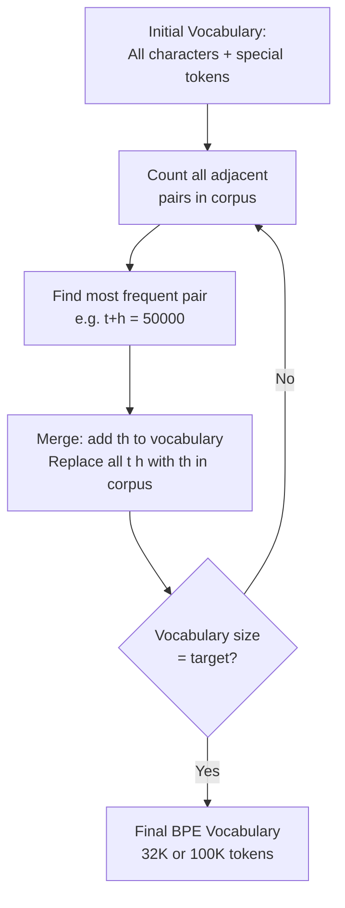

# ⚙️ Tokenization Algorithms

> [!abstract] TL;DR
> Modern NLP tokenizers learn their vocabulary from data using one of four algorithms: BPE (Byte Pair Encoding — iteratively merge most-frequent character pairs; used by GPT/LLaMA), WordPiece (merge pairs that maximize corpus likelihood; used by BERT), SentencePiece (language-agnostic BPE/Unigram treating raw bytes; used by LLaMA/T5), or Unigram LM (probabilistic, prunes vocabulary). All methods balance vocabulary size vs sequence length vs OOV handling. BPE is the most widely used; understanding the differences matters when choosing models or training custom tokenizers.

---

## Intuition — Analogy First

Learning a language starts with letters, then common combinations. A child first learns "t", "h", "e" as separate letters, then recognizes "the" as a single unit because they see it constantly. Later, "the" + "re" → "there", "where" → "where". They've built a compressed representation of language from frequent patterns.

**BPE does exactly this algorithmically:**
1. Start with individual characters: `t`, `h`, `e`, ` `, `d`, `o`, `g`, ...
2. Find the most frequent pair: `t` + `h` → `th` (seen 50,000 times)
3. Merge it into a new token `th`
4. Find the next most frequent pair in the updated corpus: `th` + `e` → `the`
5. Merge again
6. Repeat until vocabulary reaches target size (e.g., 32,000 tokens)

The result: common words are single tokens ("the", "is", "running"), rare/unknown words are split into smaller pieces ("ChatGPT" → ["Chat", "G", "PT"]) — no word is truly out-of-vocabulary.

---

## How It Works — Mechanics

### Byte Pair Encoding (BPE)

Used by: GPT-2, GPT-3, GPT-4 (via tiktoken), LLaMA, Mistral, Falcon, StableLM



**Training example:**
```
Corpus: "low lower newest wildest"
Initial: l o w _ l o w e r _ n e w e s t _ w i l d e s t _
         (underscore marks word boundary)

Iteration 1: Most common pair: (e, s) count=3 → merge to "es"
Corpus: l o w _ l o w e r _ n e w es t _ w i l d es t _

Iteration 2: Most common: (es, t) count=2 → merge to "est"
Corpus: l o w _ l o w e r _ n e w est _ w i l d est _

...continue until vocabulary size reached
Final vocab: {l, o, w, e, r, n, s, t, i, d, low, new, est, newer, lowest, ...}
```

**Inference (tokenizing new text):**
Apply the learned merge rules in the same order they were learned. This is deterministic.

### WordPiece

Used by: BERT, DistilBERT, ALBERT, MobileBERT

Similar to BPE but chooses merges by **maximizing corpus likelihood** rather than raw frequency count.

**Merge score:**
$$\text{score}(A, B) = \frac{\text{count}(AB)}{\text{count}(A) \times \text{count}(B)}$$

Instead of merging the most frequent pair, WordPiece merges the pair that maximizes the increase in corpus likelihood. This prefers pairs where the combined token adds more information than its parts.

**Key difference from BPE:**
- BPE: merge `t` + `h` because "th" appears 50,000 times (raw count)
- WordPiece: merge `##ing` + `##s` only if `ings` likelihood > `##ing` × `##s` likelihood

WordPiece uses `##` prefix to mark continuation subwords within a word:
```
"unhappiness" → ["un", "##happi", "##ness"]
```
This makes word boundaries explicit and helps with word-level alignment in NER.

### SentencePiece

Used by: LLaMA, LLaMA-2, T5, mT5, ALBERT, XLNet

**Key innovation:** Treats the input as a raw byte/character stream (no pre-tokenization at whitespace). This makes it language-agnostic — works equally well for Japanese, Arabic, or English without language-specific rules.

Uses a `▁` (U+2581 lower one eighth block) prefix to mark word boundaries:
```
"Hello world" → ["▁Hello", "▁world"]
"unhappiness" → ["▁un", "happiness"]
"ChatGPT" → ["▁Chat", "G", "PT"]
```

SentencePiece can implement either BPE or Unigram LM as the underlying algorithm.

### Unigram Language Model Tokenization

Used by: mBART, XLNet, FlauBERT (via SentencePiece)

**Approach:** Instead of greedily merging (bottom-up like BPE), start with a large vocabulary and iteratively prune tokens whose removal has the least impact on corpus likelihood.

**Training:**
1. Initialize with a large vocabulary (all characters + many substrings)
2. Compute the likelihood of the corpus with the current vocabulary (using Viterbi decoding)
3. For each token, compute how much likelihood drops if that token is removed
4. Remove the 20% of tokens with the smallest likelihood impact
5. Repeat until target vocabulary size is reached

**Inference:** Use the Viterbi algorithm to find the most likely tokenization of any input. Uniquely, Unigram tokenization is **probabilistic** — the same input can have multiple valid tokenizations with different probabilities.

---

## The Math

**BPE merge criterion:**

$$\text{merge}^* = \arg\max_{(a, b)} \text{count}(a, b)$$

Simply count co-occurrences. No normalization.

**WordPiece merge criterion:**

$$\text{merge}^* = \arg\max_{(a, b)} \frac{\text{count}(a, b)}{\text{count}(a) \cdot \text{count}(b)}$$

Normalizing by unigram counts means the pair `(e, s)` with count 5000 beats `(t, h)` with count 3000 only if the co-occurrence is proportionally high relative to independent frequencies.

**Unigram LM tokenization probability:**

Given vocabulary $V$, each token $x_i$ has probability $p(x_i)$. The probability of tokenization $X = (x_1, ..., x_n)$ is:

$$P(X) = \prod_{i=1}^{n} p(x_i)$$

Training maximizes $\sum_{\text{sentences}} \log P(\text{optimal tokenization of sentence})$ using the EM algorithm.

**Vocabulary compression ratio:** A well-tuned BPE tokenizer with 32K vocabulary typically represents English text at ~4 characters per token (vs 1 for character-level, ~5 for word-level).

---

## Code Demo

```python
from tokenizers import Tokenizer, models, trainers, pre_tokenizers, normalizers, decoders
from transformers import AutoTokenizer
import tiktoken

# ── Part 1: Train a BPE tokenizer from scratch (HuggingFace tokenizers) ──────
def train_bpe_tokenizer(corpus_files: list[str], vocab_size: int = 8000):
    tokenizer = Tokenizer(models.BPE(unk_token="[UNK]"))

    # Normalization: lowercase + strip accents (optional)
    tokenizer.normalizer = normalizers.Sequence([
        normalizers.NFD(),
        normalizers.Lowercase(),
        normalizers.StripAccents(),
    ])

    # Pre-tokenizer: split on whitespace and punctuation first
    tokenizer.pre_tokenizer = pre_tokenizers.ByteLevel(add_prefix_space=False)

    # Decoder: recover original text from tokens
    tokenizer.decoder = decoders.ByteLevel()

    # Train BPE
    trainer = trainers.BpeTrainer(
        vocab_size=vocab_size,
        special_tokens=["[UNK]", "[CLS]", "[SEP]", "[PAD]", "[MASK]"],
        min_frequency=2,        # ignore pairs appearing < 2 times
        show_progress=True,
    )

    # Train from files or in-memory strings
    tokenizer.train(
        files=corpus_files,  # list of text file paths
        trainer=trainer,
    )
    return tokenizer

# ── Part 2: BPE merge iterations (manual illustration) ───────────────────────
from collections import Counter, defaultdict

def get_stats(vocab: dict[str, int]) -> Counter:
    """Count all adjacent pairs in the vocabulary."""
    pairs = Counter()
    for word, freq in vocab.items():
        symbols = word.split()
        for i in range(len(symbols) - 1):
            pairs[(symbols[i], symbols[i+1])] += freq
    return pairs

def merge_vocab(pair: tuple[str, str], vocab: dict[str, int]) -> dict[str, int]:
    """Merge all instances of pair in vocabulary."""
    out_vocab = {}
    bigram = ' '.join(pair)
    replacement = ''.join(pair)
    for word, freq in vocab.items():
        new_word = word.replace(bigram, replacement)
        out_vocab[new_word] = freq
    return out_vocab

# BPE training from scratch
vocab = {
    'l o w </w>': 5,
    'l o w e r </w>': 2,
    'n e w e s t </w>': 6,
    'w i d e s t </w>': 3,
}

num_merges = 10
print("BPE merge iterations:")
for i in range(num_merges):
    pairs = get_stats(vocab)
    if not pairs:
        break
    best = max(pairs, key=pairs.get)
    vocab = merge_vocab(best, vocab)
    print(f"  Merge {i+1}: {best} → {''.join(best)} (count={pairs[best]})")

print("\nFinal vocabulary:", list(vocab.keys()))

# ── Part 3: Compare tokenizers side by side ───────────────────────────────────
test_words = [
    "unhappiness",
    "tokenization",
    "ChatGPT",
    "Mississippian",
    "2023-10-15",
    "hello world",
]

# BERT (WordPiece)
bert_tok = AutoTokenizer.from_pretrained("bert-base-uncased")
# GPT-2 (BPE)
gpt2_tok = AutoTokenizer.from_pretrained("gpt2")
# GPT-4 (tiktoken BPE, cl100k_base)
gpt4_tok = tiktoken.get_encoding("cl100k_base")

print(f"\n{'Word':<20} {'BERT (WordPiece)':<35} {'GPT-2 (BPE)':<35} {'GPT-4 count'}")
print("-" * 110)
for word in test_words:
    bert_tokens = bert_tok.tokenize(word)
    gpt2_tokens = gpt2_tok.tokenize(word)
    gpt4_count = len(gpt4_tok.encode(word))
    print(f"{word:<20} {str(bert_tokens):<35} {str(gpt2_tokens):<35} {gpt4_count}")

# ── Part 4: SentencePiece (LLaMA-style) ──────────────────────────────────────
import sentencepiece as spm

# Train a SentencePiece BPE model
spm.SentencePieceTrainer.train(
    input="corpus.txt",
    model_prefix="my_tokenizer",
    vocab_size=4000,
    model_type="bpe",       # or "unigram"
    pad_id=0,
    bos_id=1,
    eos_id=2,
    unk_id=3,
    character_coverage=0.9995,  # fraction of characters to cover
)

sp = spm.SentencePieceProcessor()
sp.load("my_tokenizer.model")

for word in test_words:
    tokens = sp.encode(word, out_type=str)
    print(f"{word:<20} → {tokens}")
# Output uses ▁ prefix for word-start tokens
```

---

## Real-World Example

**GPT-4's tiktoken vocabulary (cl100k_base, ~100K tokens)**

OpenAI's GPT-4 uses tiktoken with the `cl100k_base` encoding, which has 100,277 tokens — significantly larger than GPT-2's 50,257. The larger vocabulary was designed to:

1. **Reduce sequence lengths for common text:** More common phrases are single tokens, so the same document uses fewer tokens → lower inference cost
2. **Better handle code:** Programming keywords, common patterns like `def `, `self.`, `import ` are typically single tokens
3. **Improved multilingual support:** More non-English text gets reasonable tokenization

**Practical impact:** English prose: ~3–4 characters per token. Python code: ~3 characters per token. Chinese: ~1.5–2 characters per token (less efficient than English). This is why processing Chinese text in GPT-4 costs ~2x more tokens per character than English.

**LLaMA's SentencePiece (32K vocabulary):** LLaMA and LLaMA-2 use SentencePiece BPE with 32K tokens. This smaller vocabulary was chosen for training efficiency — a smaller embedding matrix and output projection. The Llama-3 tokenizer upgraded to 128K tokens for better multilingual and code coverage.

---

## Trade-offs

| Algorithm | Training | Inference | OOV | Multilingual | Used By |
|---|---|---|---|---|---|
| BPE | Greedy bottom-up merges | Apply merge rules in order | Excellent | Good | GPT-2/3/4, LLaMA |
| WordPiece | Likelihood-based merges | Greedy longest match | Excellent | Good | BERT, DistilBERT |
| SentencePiece BPE | Raw byte stream, no pre-tok | Deterministic | Excellent | Excellent (no language rules) | LLaMA, T5 |
| Unigram LM | EM, prune vocabulary | Viterbi (probabilistic) | Excellent | Excellent | mBART, XLNet |
| Character | None (all chars) | Trivial | Perfect | Universal | Byte-level models |

---

## When to Use vs Avoid

**Use the tokenizer that matches your model** — mixing tokenizers produces undefined results. If you're fine-tuning BERT, use `bert-base-uncased`'s WordPiece tokenizer. If you're using LLaMA-2, use LLaMA-2's SentencePiece tokenizer.

**Train a custom tokenizer when:**
- Domain-specific vocabulary (medical jargon, legal terms, code in a specific language) tokenizes poorly with general tokenizers
- Pretraining a new model from scratch
- Multilingual models where the base tokenizer underrepresents target languages

**Use larger vocabulary (100K+) when:**
- Multilingual models
- Code-heavy applications
- Inference cost is manageable (larger embedding matrix)

**Use smaller vocabulary (32K) when:**
- Deployment on edge/resource-constrained devices
- Pretraining from scratch with limited compute (smaller embedding layer = fewer parameters)

---

## Common Pitfalls

1. **Forgetting that tokenizer vocabulary size must match model embedding layer** — If you train a custom tokenizer with a different vocab size than the model was trained with, you must retrain or resize the embedding layer. Mixing tokenizers with pretrained models corrupts the embedding lookup.

2. **Assuming character count = token count** — Token counts diverge significantly from character counts for non-English languages and code. Always compute token counts with the actual tokenizer before estimating API costs or context window usage.

3. **Applying the wrong tokenizer to a fine-tuned model** — Many fine-tuned models on HuggingFace ship with the correct tokenizer embedded. Always load tokenizer with `AutoTokenizer.from_pretrained(model_name)` — not a separate independently-loaded tokenizer.

4. **Ignoring case normalization differences** — BERT-base-uncased applies lowercasing in the tokenizer itself (as part of WordPiece). GPT-2 BPE is case-sensitive. Feeding cased input to an uncased model's tokenizer is fine (it normalizes), but the reverse is not.

5. **Training tokenizer on wrong data distribution** — A BPE tokenizer trained on English Wikipedia will tokenize Python code inefficiently (individual characters for operators, braces). Train domain-specific tokenizers on domain-specific data.

---

## Related Concepts

- [[_MOC_NLP|↑ Section MOC]]

- [[Tokenization]] — what tokenization is and how it fits in the NLP pipeline
- [[GPT_Family]] — uses BPE via tiktoken
- [[BERT]] — uses WordPiece tokenization
- [[T5_and_Encoder_Decoder]] — T5 uses SentencePiece Unigram/BPE
- [[Language_Model_Basics]] — vocabulary size affects model complexity

---

## Review Questions

1. BPE merges pairs based on raw frequency counts, while WordPiece merges based on normalized likelihood. Give a concrete example where these two criteria would make different merge decisions, and explain which is more principled from a probabilistic modeling perspective.

2. SentencePiece differs from standard BPE by processing raw byte streams without language-specific pre-tokenization (no splitting on whitespace first). Why is this beneficial for multilingual models, and what does the `▁` prefix character signify in SentencePiece output?

3. GPT-4's tokenizer has 100K tokens while GPT-2's has 50K. For a fixed-length text document, which model uses fewer tokens? Why might OpenAI have chosen to double the vocabulary size going from GPT-2 to GPT-4, and what is the computational trade-off of a larger vocabulary?

---

## Sources

- Sennrich, R., Haddow, B., & Birch, A. (2016). Neural Machine Translation of Rare Words with Subword Units (BPE). *ACL 2016*. https://arxiv.org/abs/1508.07909
- Schuster, M., & Nakamura, K. (2012). Japanese and Korean Voice Search (WordPiece). *ICASSP 2012*.
- Kudo, T., & Richardson, J. (2018). SentencePiece: A simple and language independent subword tokenizer and detokenizer for Neural Text Processing. *EMNLP 2018*. https://arxiv.org/abs/1808.06226
- Kudo, T. (2018). Subword Regularization: Improving Neural Network Translation Models with Multiple Subword Candidates (Unigram LM). *ACL 2018*. https://arxiv.org/abs/1804.10959
- tiktoken: https://github.com/openai/tiktoken

#nlp #tokenization #bpe #wordpiece #sentencepiece #unigram #algorithms #vocabulary #intermediate
