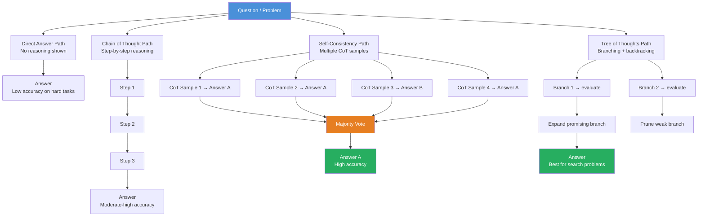

# 🔗 Chain of Thought Prompting

> [!abstract] TL;DR
> **Chain of Thought (CoT)** prompting elicits step-by-step reasoning from an LLM before it produces a final answer. Adding "Let's think step by step" or providing reasoning examples dramatically improves accuracy on complex tasks — math, logic, multi-step planning. CoT works because it gives the model a **scratchpad**: intermediate steps constrain and focus each subsequent token prediction. Extensions include Tree of Thoughts and self-consistency (majority vote over many CoT paths).

---

## Intuition — Analogy First

Picture a student taking a complex math exam.

**Without showing work:** The student jumps straight to the answer. They might get it right by intuition for simple problems, but on a 5-step problem, any wrong mental shortcut leads to a wrong answer. The teacher can't tell where it went wrong.

**With showing work:** The student writes each step explicitly: "First I need to find X. X = 2 × 3 = 6. Now I substitute X into the second equation..." Each step is a commitment — it constrains the next step. Errors are caught early. The final answer is more reliable.

An LLM is the same: when forced to produce intermediate reasoning tokens, each generated token *conditions* the next, building a logical scaffold that constrains the final answer toward correctness. Without the scaffold, the model guesses the answer token directly from the question — a much harder prediction.

**The key insight:** LLMs are not "thinking" and then writing. They are generating tokens sequentially. Making the reasoning explicit in token form gives the model more compute (more token generation) to arrive at the correct final token.

---

## How It Works — Mechanics

### Zero-Shot CoT

Simply append a reasoning trigger to your prompt. Wei et al. showed "Let's think step by step" reliably induces chain-of-thought behavior in large models without any examples.

```
Q: If a car travels at 60 mph for 2.5 hours, then 40 mph for 1 hour, what is
   the total distance?

Let's think step by step.
```

Zero-shot CoT works in models ≥ ~100B parameters. Smaller models often produce incoherent reasoning even when asked.

### Few-Shot CoT

Provide 3–8 examples where each example includes the full reasoning chain, not just the answer. This is the original formulation from Wei et al. (2022) and is more reliable than zero-shot CoT.

### Self-Consistency

Instead of sampling one CoT path, sample multiple ($n = 10$–$40$) CoT reasoning paths at high temperature, then take the **majority vote** on the final answer. This decouples the noisy reasoning from the stable answer:

- Individual chains may take different paths
- Wrong paths tend to produce varied wrong answers
- Correct paths tend to converge on the same right answer

Self-consistency improves CoT accuracy by 5–20% on math benchmarks at the cost of $n$× token usage.

### Tree of Thoughts (ToT)

An extension where the model explores multiple reasoning branches simultaneously (a tree rather than a chain), evaluating partial solutions and backtracking. Useful for search/planning problems where CoT's linear chain is insufficient (e.g., Game of 24, creative writing planning).



---

## The Math

**Why CoT helps — a token probability lens:**

For a question $q$ with correct answer $a$:

*Direct:*
$$P(a \mid q) = \prod_{t} P(a_t \mid q, a_{<t})$$

*Chain of Thought:*
$$P(a \mid q) = \sum_{r} P(a \mid q, r) \cdot P(r \mid q)$$

Where $r$ is the reasoning chain. By marginalizing over all possible reasoning paths, CoT increases the effective probability mass on the correct answer. Each reasoning token narrows the conditional distribution of the final answer.

**Self-consistency — majority vote:**

Sample $n$ independent CoT reasoning paths $r_1, \ldots, r_n$ producing answers $a_1, \ldots, a_n$:

$$\hat{a} = \arg\max_{a} \sum_{i=1}^{n} \mathbf{1}[a_i = a]$$

This is equivalent to a form of marginalizing over the latent reasoning variable — incorrect reasoning paths produce inconsistent (high-variance) answers that cancel out in the vote.

---

## Code Demo

```python
import anthropic
from collections import Counter

client = anthropic.Anthropic()


# ── Zero-Shot CoT ─────────────────────────────────────────────────────────────
def zero_shot_cot(question: str) -> str:
    response = client.messages.create(
        model="claude-opus-4-5",
        max_tokens=512,
        messages=[
            {
                "role": "user",
                "content": f"{question}\n\nLet's think step by step.",
            }
        ],
    )
    return response.content[0].text


result = zero_shot_cot(
    "A factory produces 240 widgets per hour. It runs 8 hours a day, 5 days a week. "
    "If 3% of widgets are defective, how many good widgets does it produce per week?"
)
print("Zero-Shot CoT:\n", result)


# ── Few-Shot CoT ──────────────────────────────────────────────────────────────
FEW_SHOT_COT_PROMPT = """
Solve the following math problems step by step.

Q: A store buys apples at $0.50 each and sells them at $0.80 each.
   If they sell 200 apples, what is the profit?
A: Cost per apple: $0.50. Revenue per apple: $0.80. Profit per apple: $0.80 - $0.50 = $0.30.
   Total profit: 200 × $0.30 = $60.00. The profit is $60.

Q: A train leaves City A at 9 AM traveling at 90 mph toward City B, 270 miles away.
   Another train leaves City B at 10 AM toward City A at 60 mph. When do they meet?
A: Train 1 travels for 1 hour before Train 2 departs: covers 90 × 1 = 90 miles.
   Remaining gap when Train 2 departs: 270 - 90 = 180 miles.
   Combined speed: 90 + 60 = 150 mph.
   Time to close 180 miles: 180 / 150 = 1.2 hours = 1 hour 12 minutes after 10 AM.
   They meet at 11:12 AM.

Q: {question}
A:"""


def few_shot_cot(question: str) -> str:
    prompt = FEW_SHOT_COT_PROMPT.format(question=question)
    response = client.messages.create(
        model="claude-opus-4-5",
        max_tokens=512,
        messages=[{"role": "user", "content": prompt}],
    )
    return response.content[0].text


# ── Self-Consistency ──────────────────────────────────────────────────────────
def extract_final_answer(cot_text: str) -> str:
    """Extract the final answer from a CoT response."""
    lines = cot_text.strip().split("\n")
    for line in reversed(lines):
        if any(keyword in line.lower() for keyword in ["answer is", "= ", "total"]):
            return line.strip()
    return lines[-1].strip()


def self_consistency_cot(question: str, n_samples: int = 8) -> str:
    """Sample n CoT paths and return the majority vote answer."""
    answers = []

    for i in range(n_samples):
        response = client.messages.create(
            model="claude-opus-4-5",
            max_tokens=512,
            temperature=0.7,  # high temperature to get diverse reasoning paths
            messages=[
                {
                    "role": "user",
                    "content": f"{question}\n\nLet's think step by step.",
                }
            ],
        )
        raw = response.content[0].text
        answer = extract_final_answer(raw)
        answers.append(answer)
        print(f"  Sample {i+1}: {answer}")

    # Majority vote
    vote_counts = Counter(answers)
    majority_answer, count = vote_counts.most_common(1)[0]
    print(f"\nMajority vote: '{majority_answer}' ({count}/{n_samples} paths)")
    return majority_answer


print("\nSelf-Consistency:")
self_consistency_cot(
    "What is 17% of 340, rounded to the nearest whole number?",
    n_samples=8,
)
```

---

## Real-World Example

All frontier "reasoning" models use extended chain-of-thought internally:

- **OpenAI o1 / o3:** The model is explicitly trained to generate a long internal reasoning "scratchpad" before producing the final answer. The scratchpad is CoT at scale, optimized via RL.
- **Claude 3.7 Sonnet extended thinking:** Anthropic's extended thinking mode surfaces a `thinking` block containing the model's internal CoT before the response.
- **Google DeepSeek-R1:** Shows that CoT trained via RL can match or exceed models 10× larger on math and reasoning benchmarks.

The pattern is consistent: for complex tasks, LLMs that produce more reasoning tokens before the answer get higher accuracy. The implication is that CoT is not just a prompting trick — it's a fundamental architectural advantage that newer models bake in at training time.

---

## Trade-offs

| Dimension | Direct Answer | Zero-Shot CoT | Few-Shot CoT | Self-Consistency |
|-----------|--------------|--------------|-------------|-----------------|
| **Accuracy (simple tasks)** | High | Same/slightly lower | Same | Same |
| **Accuracy (complex tasks)** | Low | Moderate | High | Highest |
| **Token cost** | 1× | 3–5× | 4–8× | 30–50× |
| **Latency** | Lowest | Moderate | Moderate | Highest |
| **Setup effort** | None | Minimal | Example curation | Minimal + aggregation logic |
| **Small model performance** | Poor | Poor (no CoT ability) | Moderate | Moderate |

---

## When to Use vs Avoid

**Use CoT when:**
- Multi-step reasoning required: math, logic puzzles, code planning, legal analysis
- Direct answers are frequently wrong and you need to debug *why*
- You want interpretability — CoT makes the reasoning auditable
- Model size ≥ ~7B parameters (smaller models produce incoherent CoT)

**Use self-consistency when:**
- Maximum accuracy matters more than cost/latency
- The task has a deterministic correct answer (math, logic, factual QA)
- You can afford 10–40× the token cost

**Avoid CoT when:**
- Task is simple (sentiment classification, direct lookup) — adds tokens with no benefit
- Latency is critical (real-time applications) — CoT adds significant time
- Cost is tightly constrained — CoT 3–5× increases token usage
- Task is subjective — no "correct" answer to converge on via majority vote

---

## Common Pitfalls

1. **Using CoT on small models:** Models below ~7B parameters often produce fluent-sounding but logically incoherent chains. The chain looks right but contains subtle errors. Verify on your specific model.
2. **Accepting the reasoning as ground truth:** CoT is a scaffold, not a proof. The model can construct plausible-looking reasoning that leads to the wrong answer. Always validate outputs on quantitative benchmarks.
3. **Ignoring the reasoning in production:** If you're running CoT and parsing only the final answer, you're wasting tokens. Use the reasoning for debugging and confidence signals.
4. **Too many reasoning steps in few-shot examples:** Long examples consume context window quickly. Keep examples to 3–5 steps for most tasks.
5. **Self-consistency on subjective tasks:** Majority vote assumes a convergent correct answer. For open-ended generation, self-consistency is inappropriate — outputs won't converge.
6. **Not extracting the answer correctly:** CoT ends with a natural language answer, not a structured field. Parsing it requires careful prompt design ("end your response with 'Final answer: X'") or post-processing.

---

## Related Concepts

- [[_MOC_NLP|↑ Section MOC]]

- [[Zero_Shot_and_Few_Shot]] — CoT is an extension of few-shot prompting with reasoning chains
- [[Prompt_Engineering_Basics]] — foundational prompt design principles
- [[ReAct_Pattern]] — combines CoT reasoning with tool use (Reason + Act)
- [[LLM_Architecture_Deep_Dive]] — why token-by-token generation enables CoT
- [[DSPy]] — automates CoT prompt optimization via compilation

---

## Review Questions

1. Why does Chain of Thought improve accuracy on multi-step reasoning tasks? Explain using the token prediction perspective — what specifically changes about the prediction problem.
2. Compare zero-shot CoT and few-shot CoT: when would you prefer each, and what are the practical tradeoffs?
3. You are building a financial document analysis tool that extracts specific numerical values. Would self-consistency be beneficial here? Justify your answer with reference to both the accuracy and cost implications.

---

## Sources

- Wei et al. (2022). *Chain-of-Thought Prompting Elicits Reasoning in Large Language Models*. NeurIPS 2022. arXiv:2201.11903
- Kojima et al. (2022). *Large Language Models are Zero-Shot Reasoners*. arXiv:2205.11916 ("Let's think step by step")
- Wang et al. (2023). *Self-Consistency Improves Chain of Thought Reasoning in Language Models*. ICLR 2023. arXiv:2203.11171
- Yao et al. (2023). *Tree of Thoughts: Deliberate Problem Solving with Large Language Models*. arXiv:2305.10601
- Anthropic. *Extended Thinking*. https://docs.anthropic.com/en/docs/build-with-claude/extended-thinking

#prompt-engineering #chain-of-thought #CoT #reasoning #self-consistency #nlp #ai-ml #intermediate
