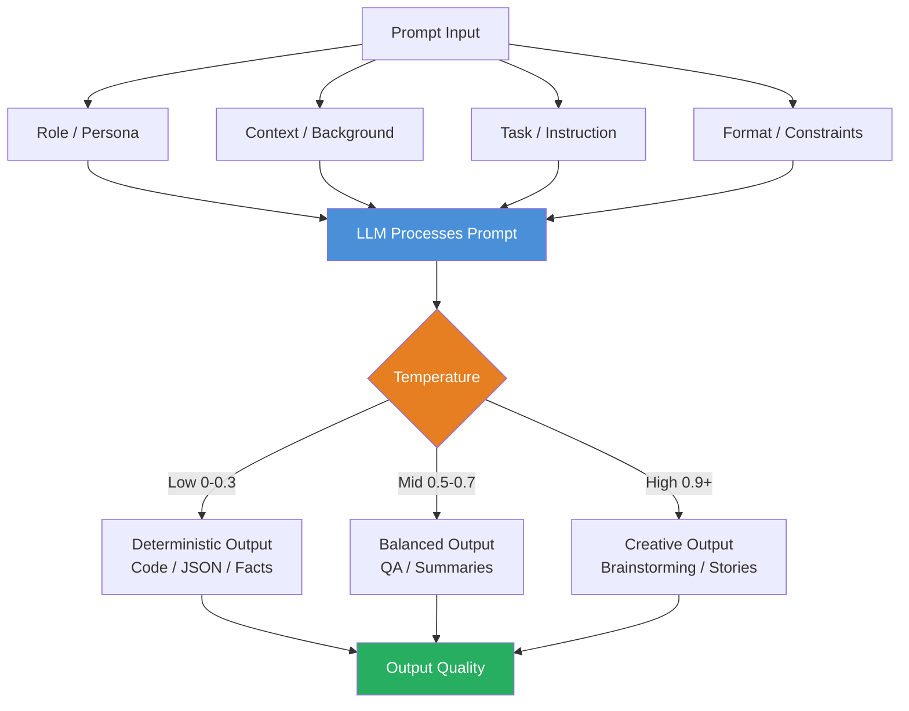

# 🧱 Prompt Engineering Basics

> [!abstract] TL;DR
> A **prompt** is the complete text you send to an LLM — instructions, context, examples, and format guidance bundled together. Because LLMs are probabilistic text completers, the quality and structure of your prompt directly determines the quality of the output. Prompt engineering is the discipline of designing prompts that reliably elicit the behavior you need.

---

## Intuition — Analogy First

Imagine hiring a brilliant contractor who can do almost anything — carpentry, plumbing, coding, writing — but has never met you before and knows nothing about your project.

- **Vague request:** "Fix the house." → The contractor guesses, makes assumptions, and probably does the wrong thing.
- **Specific request:** "Replace the cracked bathroom tile on the second floor with the 4×4 white subway tiles in the garage. Match the existing grout color. Finish by Friday." → You get exactly what you need.

An LLM is that contractor. It is extraordinarily capable but operates entirely on what you tell it in the moment. Prompt engineering is the skill of giving clear, complete, structured instructions so the contractor (LLM) can succeed without guessing.

The key insight: **LLMs don't think — they predict the most likely continuation of your text.** If your prompt looks like the beginning of a careless, ambiguous document, the model continues in kind. If it looks like a precise, expert specification, the model continues with precision.

---

## How It Works — Mechanics

### The Four Components of a Strong Prompt

Every effective prompt has some or all of these elements:

| Component | Purpose | Example |
|-----------|---------|---------|
| **Role / Persona** | Sets the model's identity and expertise level | "You are a senior Python engineer..." |
| **Context** | Background information the model needs | "The codebase uses FastAPI and PostgreSQL..." |
| **Task** | The specific action to perform | "Refactor this function to use async/await..." |
| **Format** | How to structure the output | "Return a JSON object with keys: code, explanation" |

### The Three Message Roles

Modern LLM APIs use a structured conversation with distinct roles:

- **System message:** Persistent instructions that frame the entire conversation. Sets persona, rules, output constraints. The model treats this as a directive from the operator, not the user.
- **User message:** The human turn — the actual request, question, or input.
- **Assistant message:** Prior model responses. Used to continue multi-turn conversations or to pre-fill part of the answer.

### Why Prompt Quality Matters

LLMs are trained to predict the next token given all prior tokens. During training they saw billions of documents — good writing, bad writing, code, dialogue, instructions, gibberish. When you write a prompt, you are essentially querying a massive indexed library of text patterns. A well-structured prompt activates the high-quality patterns; a vague prompt activates an average mixture of everything.

### Temperature and Sampling

Temperature controls the randomness of token selection at inference time:

- **Temperature = 0:** Nearly deterministic. Model always picks the highest-probability token. Best for structured tasks (code, JSON, classification).
- **Temperature = 0.7:** Moderate creativity. Good for general writing, QA.
- **Temperature = 1.0+:** High randomness. Creative writing, brainstorming. May degrade factual accuracy.



---

## The Math

LLMs generate output via autoregressive sampling. At each step, the model produces a probability distribution over the vocabulary:

$$P(w_t \mid w_1, w_2, \ldots, w_{t-1}, \text{prompt})$$

Temperature $T$ reshapes this distribution before sampling:

$$P_T(w_t) = \frac{\exp(z_t / T)}{\sum_j \exp(z_j / T)}$$

Where $z_t$ are the raw logits. As $T \to 0$, the distribution sharpens to a one-hot (greedy decoding). As $T \to \infty$, the distribution flattens to uniform.

**Top-p (nucleus) sampling** — a common alternative — selects the smallest set of tokens whose cumulative probability exceeds threshold $p$, then samples from that set. This prevents the model from picking extremely low-probability tokens while preserving diversity.

---

## Code Demo

```python
import anthropic
import openai

# ── Anthropic API ─────────────────────────────────────────────────────────────
client_anthropic = anthropic.Anthropic()  # reads ANTHROPIC_API_KEY from env

response = client_anthropic.messages.create(
    model="claude-opus-4-5",
    max_tokens=1024,
    system=(
        "You are a senior Python engineer at a fintech startup. "
        "You write clean, idiomatic Python with type hints. "
        "Always explain your reasoning briefly before showing code."
    ),
    messages=[
        {
            "role": "user",
            "content": (
                "Refactor this function to be async and add retry logic "
                "with exponential backoff:\n\n"
                "def fetch_balance(user_id: str) -> float:\n"
                "    resp = requests.get(f'/api/balance/{user_id}')\n"
                "    return resp.json()['balance']"
            ),
        }
    ],
)
print(response.content[0].text)

# ── OpenAI API ────────────────────────────────────────────────────────────────
client_openai = openai.OpenAI()  # reads OPENAI_API_KEY from env

# Temperature comparison: same prompt at different temperatures
prompt = "List three creative names for a machine learning monitoring product."

for temperature in [0.0, 0.7, 1.5]:
    resp = client_openai.chat.completions.create(
        model="gpt-4o",
        temperature=temperature,
        messages=[
            {"role": "system", "content": "You are a creative product naming expert."},
            {"role": "user", "content": prompt},
        ],
    )
    print(f"\n--- Temperature {temperature} ---")
    print(resp.choices[0].message.content)

# ── Structured multi-turn conversation ───────────────────────────────────────
conversation = [
    {"role": "user", "content": "I'm building a RAG pipeline."},
    {"role": "assistant", "content": "Great! What's your vector store?"},
    {"role": "user", "content": "Pinecone. What chunk size should I use?"},
]

resp = client_openai.chat.completions.create(
    model="gpt-4o",
    temperature=0.3,
    messages=[
        {"role": "system", "content": "You are a RAG systems expert."},
        *conversation,
    ],
)
print(resp.choices[0].message.content)
```

---

## Real-World Example

**GitHub Copilot** and **Cursor** are purpose-built prompt engineering products. When you type a comment like `# sort a list of users by last_login descending`, the tool constructs a full prompt behind the scenes:

1. **System message:** Instructions defining the AI's behavior as a code completion assistant, safety rules, output format (pure code, no prose).
2. **Context injection:** The current file's content, surrounding functions, import statements, and sometimes related files from the codebase.
3. **User message:** Your comment or partial code as the task.
4. **Low temperature (≈0.1):** Ensures consistent, deterministic code output rather than creative variation.

The billion-dollar product is largely a carefully engineered prompt plus a fast retrieval system — proof that prompt quality at scale is an engineering discipline, not a soft skill.

---

## Trade-offs

| Approach | Pros | Cons |
|----------|------|------|
| **Minimal prompt** | Fast to write, low token cost | Inconsistent, unpredictable output |
| **Detailed system prompt** | Consistent persona and format | Consumes context window, higher cost |
| **Role-based framing** | Activates domain knowledge | Wrong role can introduce hallucinations |
| **Low temperature (0–0.2)** | Reproducible, deterministic | Less creative, can be overly literal |
| **High temperature (>0.8)** | Creative, diverse outputs | Less reliable for structured tasks |
| **Explicit output format** | Machine-parseable, reliable | More tokens, sometimes model ignores it |

---

## When to Use vs Avoid

**Use prompt engineering when:**
- Adapting a general LLM to a specific task without fine-tuning
- Building production pipelines where consistent output format is required
- Rapid prototyping before investing in fine-tuning
- Cost constraints make fine-tuning impractical

**Avoid relying solely on prompt engineering when:**
- The task requires deep domain knowledge not in the model's pretraining (fine-tune instead)
- You need guaranteed structured output (use function calling / structured output APIs)
- Performance on a task is consistently poor after several prompt iterations (fine-tuning or a different model is needed)
- Sensitive tasks where prompt injection is a real threat without additional defenses

---

## Common Pitfalls

1. **Ambiguous task description:** "Summarize this" — summarize for whom? How long? What format? Always specify audience, length, and format.
2. **Missing context:** Assuming the model knows your codebase, domain conventions, or prior conversation. It does not persist state across API calls.
3. **Instruction overload:** Stuffing 20 rules into a system prompt. Models begin to drop or ignore constraints beyond a certain density. Prioritize the 3–5 most critical rules.
4. **Wrong temperature for the task:** Using high temperature for code generation produces buggy, inconsistent output. Using temperature 0 for creative writing produces repetitive, boring output.
5. **No output format specification:** Free-form LLM output is hard to parse programmatically. Always specify format for production pipelines.
6. **Ignoring token limits:** Very long system prompts + long user messages + long conversation history can exceed the context window, causing truncation of the most important parts.

---

## Related Concepts

- [[_MOC_NLP|↑ Section MOC]]

- [[Zero_Shot_and_Few_Shot]] — adding examples to prompts to guide behavior
- [[Chain_of_Thought]] — prompting the model to reason step-by-step
- [[Structured_Output]] — forcing JSON/schema-conformant output via APIs
- [[LLM_Architecture_Deep_Dive]] — how transformers process prompts internally
- [[Prompt_Injection_and_Safety]] — adversarial attacks on prompts
- [[Tool_Use_and_Function_Calling]] — extending LLMs with external tools via prompts

---

## Review Questions

1. What are the four structural components of a well-designed prompt, and what does each one accomplish?
2. Explain why temperature = 0 is preferred for code generation but not for creative writing tasks. What does temperature mathematically do to the token probability distribution?
3. A colleague says "our LLM feature is unreliable — the output changes every time." What prompt engineering changes would you investigate first, and why?

---

## Sources

- Brown et al. (2020). *Language Models are Few-Shot Learners* (GPT-3 paper). arXiv:2005.14165
- Anthropic. *Prompt Engineering Guide*. https://docs.anthropic.com/en/docs/build-with-claude/prompt-engineering/overview
- OpenAI. *Prompt Engineering Guide*. https://platform.openai.com/docs/guides/prompt-engineering
- White et al. (2023). *A Prompt Pattern Catalog to Enhance Prompt Engineering with ChatGPT*. arXiv:2302.11382
- Sahoo et al. (2024). *A Systematic Survey of Prompt Engineering in Large Language Models*. arXiv:2402.07927

#prompt-engineering #llm #nlp #ai-ml #beginner
