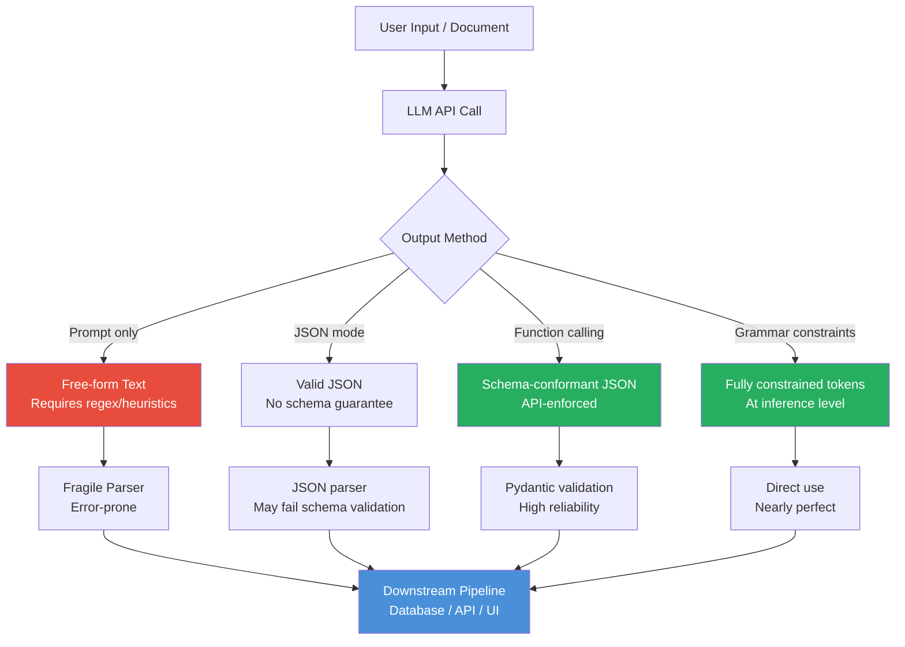

# 📐 Structured Output from LLMs

> [!abstract] TL;DR
> LLM outputs are free-form text by default — unreliable for downstream pipelines. **Structured output** techniques force the model to produce JSON, YAML, or schema-conformant responses that can be parsed and processed programmatically. Approaches range from prompt-level instructions to API-enforced JSON schemas (via function calling / tool use) to grammar-constrained generation at the inference level. Production LLM pipelines almost always require structured output.

---

## Intuition — Analogy First

Imagine you hire a consultant and ask: "Analyze this market and tell me what you think."

You'll get a 10-page free-form essay. Great for reading, useless for inserting into a spreadsheet.

Now ask the consultant to fill out a form: 5 fields, specific types, required values. The form constrains exactly what information you receive, in the exact format you need, ready to process.

**Structured output is that form.** Instead of asking the LLM to "tell you about the customer sentiment," you give it a schema:

```json
{
  "sentiment": "positive | negative | neutral",
  "confidence": 0.0..1.0,
  "key_phrases": ["..."],
  "action_required": true | false
}
```

Now the output goes directly into your database. No parsing heuristics, no regex gymnastics, no silent failures because the model said "The sentiment appears to be positive" instead of "positive."

---

## How It Works — Mechanics

### Approach 1: Prompt-Level Instructions (Least Reliable)

Instruct the model to output JSON in the system message:

```
Always respond with valid JSON matching this schema: {"name": str, "age": int}
```

**Problem:** Models sometimes add explanatory prose before or after the JSON, wrap it in markdown fences, or subtly violate the schema. Requires defensive parsing.

### Approach 2: JSON Mode (API-enforced)

Both OpenAI and Anthropic offer a JSON mode that forces the model to produce valid JSON (but not necessarily a specific schema):

- OpenAI: `response_format={"type": "json_object"}`
- Anthropic: tool use with JSON output (no standalone JSON mode; use tool definitions)

### Approach 3: Function Calling / Tool Use (Recommended)

The most reliable API-level mechanism. You define a JSON Schema describing the output, and the API guarantees the response conforms to it. Under the hood, the API constrains token generation to only allow valid schema-conformant tokens.

The "function" / "tool" is not actually called — it's a schema trick. You define a tool (e.g., `extract_contact`) and the model "calls" it, filling in parameters from the input text. You receive the structured arguments.

### Approach 4: Grammar-Constrained Generation (Libraries)

Libraries like **Outlines** and **LM Format Enforcer** operate at the inference level, using a finite-state machine to constrain the next-token distribution to only tokens that can lead to valid completions of the target schema or grammar. This is the most reliable approach for open-source / self-hosted models.

### Approach 5: Instructor Library

**Instructor** wraps the OpenAI/Anthropic API and uses Pydantic models as the output schema. It automatically converts your Pydantic class to a function call schema, validates the output, and retries on validation failure.



---

## The Math

Grammar-constrained generation works by masking the logit distribution. At each token step:

1. The current partial output is tracked against a finite-state machine derived from the JSON schema.
2. Only tokens that lead to valid completions are assigned non-$-\infty$ logits.
3. All other tokens are masked out before softmax.

$$P(w_t) = \text{softmax}(\mathbf{z}_t \odot \mathbf{m}_t)$$

Where $\mathbf{m}_t$ is a binary mask with 1 for valid tokens at step $t$ and 0 for invalid. This guarantees valid output with zero degradation in generation speed (the FSM transition is $O(1)$ per token).

The schema is typically compiled to a regular grammar (for simple schemas) or a context-free grammar (for recursive schemas), then converted to a token-level automaton.

---

## Code Demo

```python
import anthropic
import openai
import instructor
from pydantic import BaseModel, Field
from typing import Literal

openai_client = openai.OpenAI()
anthropic_client = anthropic.Anthropic()


# ── 1. OpenAI Function Calling ────────────────────────────────────────────────
tools = [
    {
        "type": "function",
        "function": {
            "name": "extract_contact",
            "description": "Extract structured contact information from text.",
            "parameters": {
                "type": "object",
                "properties": {
                    "name": {"type": "string", "description": "Full name"},
                    "email": {"type": "string", "description": "Email address"},
                    "phone": {"type": "string", "description": "Phone number"},
                    "company": {"type": "string", "description": "Company name"},
                    "role": {"type": "string", "description": "Job title/role"},
                },
                "required": ["name", "email"],
            },
        },
    }
]

response = openai_client.chat.completions.create(
    model="gpt-4o",
    messages=[
        {"role": "system", "content": "Extract contact information from the provided text."},
        {
            "role": "user",
            "content": (
                "Hi, I'm Sarah Chen, Lead ML Engineer at DataFlow Inc. "
                "Reach me at sarah.chen@dataflow.io or +1-415-555-0192."
            ),
        },
    ],
    tools=tools,
    tool_choice={"type": "function", "function": {"name": "extract_contact"}},
)

import json
tool_call = response.choices[0].message.tool_calls[0]
contact = json.loads(tool_call.function.arguments)
print("Extracted contact:", contact)


# ── 2. Instructor + Pydantic (OpenAI) ─────────────────────────────────────────
class SentimentAnalysis(BaseModel):
    sentiment: Literal["positive", "negative", "neutral"]
    confidence: float = Field(ge=0.0, le=1.0, description="Confidence score 0-1")
    key_phrases: list[str] = Field(description="Key phrases driving the sentiment")
    action_required: bool = Field(description="Whether human follow-up is needed")
    summary: str = Field(max_length=200, description="One-sentence summary")


instructor_client = instructor.from_openai(openai_client)

analysis: SentimentAnalysis = instructor_client.chat.completions.create(
    model="gpt-4o",
    response_model=SentimentAnalysis,
    messages=[
        {
            "role": "user",
            "content": (
                "Review: 'The product crashed twice during my presentation. "
                "Support took 3 days to respond and didn't resolve the issue. "
                "I'm considering canceling my subscription.'"
            ),
        }
    ],
)
print(f"Sentiment: {analysis.sentiment} ({analysis.confidence:.0%} confidence)")
print(f"Action required: {analysis.action_required}")
print(f"Key phrases: {analysis.key_phrases}")


# ── 3. Anthropic Tool Use for Structured Output ──────────────────────────────
class DocumentSummary(BaseModel):
    title: str
    category: Literal["technical", "business", "legal", "other"]
    key_points: list[str] = Field(min_length=3, max_length=5)
    word_count_estimate: int


# Instructor supports Anthropic too
instructor_anthropic = instructor.from_anthropic(anthropic_client)

doc_summary: DocumentSummary = instructor_anthropic.messages.create(
    model="claude-opus-4-5",
    max_tokens=512,
    response_model=DocumentSummary,
    messages=[
        {
            "role": "user",
            "content": (
                "Summarize this: 'The proposed system architecture uses a microservices "
                "approach with three main components: an API gateway, a message queue, "
                "and a set of independent worker services. Each service communicates "
                "asynchronously via the queue, enabling horizontal scaling. The gateway "
                "handles authentication, rate limiting, and routing. Total estimated "
                "implementation time is 6 weeks with a team of 4 engineers.'"
            ),
        }
    ],
)
print(f"Category: {doc_summary.category}")
print(f"Key points: {doc_summary.key_points}")


# ── 4. Outlines — Grammar-Constrained Generation (local models) ──────────────
# Requires: pip install outlines transformers
# import outlines
# from pydantic import BaseModel
#
# model = outlines.models.transformers("mistralai/Mistral-7B-Instruct-v0.2")
#
# class Product(BaseModel):
#     name: str
#     price: float
#     in_stock: bool
#     category: Literal["electronics", "clothing", "food"]
#
# generator = outlines.generate.json(model, Product)
# result = generator("Extract product info: Blue wireless headphones, $49.99, available.")
# print(result)  # Guaranteed Product instance — no validation needed
```

---

## Real-World Example

Every production LLM pipeline uses structured output. A concrete example:

**LinkedIn's AI job matcher** extracts structured attributes from job postings (skills required, experience level, location type, salary range) using function calling. The extracted JSON is inserted directly into a search index. Without structured output, every downstream consumer would need custom parsing logic — a maintenance nightmare at billions of documents.

Similarly, **Notion AI** and **Cursor** use structured output to generate diffs: instead of asking the model to "rewrite the document," they ask for a JSON object containing `{original: str, replacement: str, reasoning: str}`. The structured response can then be applied programmatically as a precise edit.

---

## Trade-offs

| Approach | Reliability | Flexibility | Complexity | Cost | Best For |
|----------|------------|------------|-----------|------|----------|
| **Prompt only** | Low | High | Low | Low | Quick prototypes |
| **JSON mode** | Medium | Medium | Low | Low | Simple JSON, no strict schema |
| **Function calling** | High | Medium | Medium | Same | Production APIs |
| **Instructor** | High | High | Low | Same + retries | Python apps with Pydantic |
| **Outlines / grammar** | Near-perfect | Medium | High | Same, local only | Self-hosted models |

---

## When to Use vs Avoid

**Use structured output when:**
- Output must be stored in a database or passed to another service
- Building multi-step pipelines where each step consumes the prior step's output
- Extracting specific entities, attributes, or classifications
- Downstream code will break on format variation (always in production)

**Avoid strict structured output when:**
- Output is for direct human reading only (essays, summaries, chat responses)
- The schema is highly dynamic or unknown in advance
- You need maximum creative flexibility (schemas can constrain reasoning quality)
- Using very small models (<3B) — grammar constraints can significantly degrade output quality

---

## Common Pitfalls

1. **Trusting JSON mode without schema validation:** JSON mode guarantees syntactically valid JSON, not semantically correct JSON. Always validate against your schema with Pydantic or jsonschema.
2. **Overly complex schemas:** Deeply nested schemas with many optional fields confuse models. Flatten where possible and use required fields.
3. **Missing retry logic:** Even with function calling, models occasionally produce arguments that fail validation (especially for complex constraints like `ge=0.0, le=1.0`). Use Instructor's built-in retry or implement exponential backoff.
4. **Schema leaks into reasoning:** When you define a function schema, the model sees the field names and descriptions. Poor field naming (e.g., `score` instead of `sentiment_confidence_score`) produces poor values. Document your schema fields clearly.
5. **Forgetting streaming:** Structured output and streaming are partially incompatible — you must buffer the full response before JSON parsing. Design your UX accordingly.

---

## Related Concepts

- [[_MOC_NLP|↑ Section MOC]]

- [[Prompt_Engineering_Basics]] — foundational prompting before adding structure
- [[Tool_Use_and_Function_Calling]] — the broader tool use paradigm that structured output is built on
- [[LangChain]] — provides output parsers and LCEL chain integration
- [[DSPy]] — typed signatures define structured I/O automatically
- [[RAG_Overview]] — RAG pipelines universally require structured output for metadata extraction

---

## Review Questions

1. A colleague uses `response_format={"type": "json_object"}` with OpenAI and claims the output is now reliable for their pipeline. What could still go wrong, and what would you add to make it truly reliable?
2. Explain how grammar-constrained generation (Outlines/LM Format Enforcer) works at the token level. Why does it provide stronger guarantees than API-level function calling?
3. You are extracting structured data from 10,000 legal documents with a 5-field schema. Compare the failure modes and recovery strategies for: (a) prompt-only JSON instructions, (b) function calling with Pydantic validation, and (c) Outlines with a local model.

---

## Sources

- OpenAI. *Structured Outputs Guide*. https://platform.openai.com/docs/guides/structured-outputs
- Anthropic. *Tool Use Guide*. https://docs.anthropic.com/en/docs/build-with-claude/tool-use
- Willard & Louf (2023). *Efficient Guided Generation for Large Language Models*. arXiv:2307.09702 (Outlines paper)
- Instructor library. https://python.useinstructor.com/
- Outlines library. https://github.com/dottxt-ai/outlines

#prompt-engineering #structured-output #json-mode #function-calling #pydantic #nlp #ai-ml #intermediate
