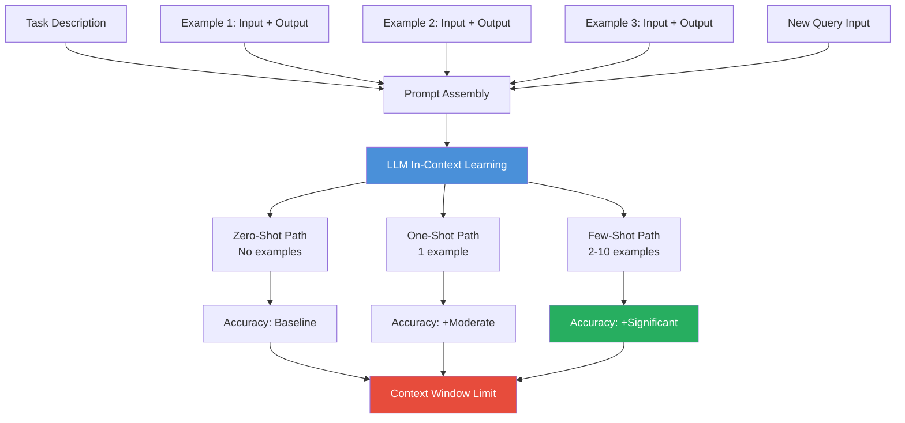

# 🎯 Zero-Shot and Few-Shot Prompting

> [!abstract] TL;DR
> **Zero-shot** prompting asks the model to perform a task with only a description and no examples. **Few-shot** prompting adds 2–10 worked examples directly in the prompt, dramatically improving accuracy on structured or novel tasks. Few-shot works because LLMs perform **in-context learning** — they adapt their behavior to patterns shown in the prompt without any weight updates.

---

## Intuition — Analogy First

Imagine a student taking an exam:

- **Zero-shot:** The student reads the question and answers from general knowledge alone. Works well for common question types they've seen before. Fails on novel or ambiguous formats.
- **One-shot:** The teacher shows one worked example before the test. The student now understands the expected format and level of detail.
- **Few-shot:** The teacher shows 3–5 worked examples. The student has calibrated their understanding of the task well enough to generalize to new questions confidently.

The exam score generally improves with more examples — but only up to a point. Eventually you run out of "paper" (context window), and adding more examples provides diminishing returns or even degrades performance if the examples crowd out the actual question.

---

## How It Works — Mechanics

### Zero-Shot Prompting

The model receives only a task description and input. No examples are provided. This relies entirely on the model's pretraining knowledge and generalization ability.

```
Classify the sentiment of the following review as Positive, Negative, or Neutral.

Review: "The delivery was late but the product itself is great."
Sentiment:
```

Zero-shot works well when:
- The task is common and well-represented in pretraining data (e.g., sentiment analysis, translation)
- The task description is unambiguous
- The output format is simple

### One-Shot Prompting

A single example is provided before the actual input. Even one example dramatically clarifies the expected format and output style.

### Few-Shot Prompting

2–10 input/output pairs (demonstrations) are included before the actual query. The model uses in-context learning to infer the pattern.

**Critical factors for few-shot example quality:**

| Factor | Good Practice | Bad Practice |
|--------|--------------|-------------|
| **Representativeness** | Examples cover the distribution of real inputs | All examples are easy/obvious cases |
| **Diversity** | Examples show varied edge cases | All examples are identical in structure |
| **Format consistency** | Every example uses the exact same format | Inconsistent labeling or spacing |
| **Label balance** | Positive/Negative examples roughly balanced | 9 Positive examples, 1 Negative |
| **Ordering** | Random or diverse ordering | All positive examples first |

### In-Context Learning — Why Does This Work?

This is a profound and still not fully understood phenomenon. During pretraining, the model learned to predict text continuations across trillions of tokens. In doing so, it implicitly learned to recognize and continue *patterns* — including the pattern of (input → output) pairs followed by a new input expecting a similar output.

No gradient updates happen during inference. The "learning" is purely contextual — the model's attention mechanism identifies the demonstrated pattern and applies it to the new input. This is fundamentally different from traditional ML fine-tuning.



### Chain-of-Thought Few-Shot

A powerful extension where examples include not just the answer, but the reasoning chain:

```
Q: Roger has 5 tennis balls. He buys 2 more cans of 3 balls each. How many?
A: Roger starts with 5. 2 cans × 3 balls = 6 new balls. 5 + 6 = 11. The answer is 11.

Q: The cafeteria had 23 apples. They used 20 for lunch and bought 6 more. How many?
A:  ← model fills this in using the demonstrated reasoning pattern
```

---

## The Math

**In-context learning as Bayesian inference (conceptual model):**

Given demonstrations $D = \{(x_1, y_1), \ldots, (x_k, y_k)\}$ and new input $x$:

$$P(y \mid x, D) \propto P(D \mid x, y) \cdot P(y \mid x)$$

The demonstrations $D$ update the model's effective prior over outputs for the new input. The key insight from Xie et al. (2022): in-context learning can be interpreted as implicit Bayesian inference over a latent concept $\theta$ that generated the examples.

**Empirically**, the GPT-3 paper showed few-shot performance scales with model size:

| Model Size | Zero-Shot | One-Shot | Few-Shot |
|-----------|----------|---------|---------|
| 1B params | Low      | Low     | Low     |
| 13B params | Moderate | Moderate | Moderate |
| 175B params | Good   | Better  | Best    |

Emergent few-shot ability appears primarily in large models (>10B parameters), suggesting it requires sufficient pretraining capacity.

---

## Code Demo

```python
import anthropic

client = anthropic.Anthropic()  # reads ANTHROPIC_API_KEY from env

# ── Zero-Shot ─────────────────────────────────────────────────────────────────
zero_shot_response = client.messages.create(
    model="claude-opus-4-5",
    max_tokens=256,
    messages=[
        {
            "role": "user",
            "content": (
                "Classify the intent of the following customer support message. "
                "Categories: BILLING, TECHNICAL, SHIPPING, RETURNS, OTHER\n\n"
                "Message: 'My package shows delivered but I never received it.'\n"
                "Intent:"
            ),
        }
    ],
)
print("Zero-shot:", zero_shot_response.content[0].text)


# ── Few-Shot ──────────────────────────────────────────────────────────────────
def build_few_shot_prompt(examples: list[dict], new_message: str) -> str:
    """Build a few-shot prompt from labeled examples and a new query."""
    lines = [
        "Classify the intent of customer support messages.\n"
        "Categories: BILLING, TECHNICAL, SHIPPING, RETURNS, OTHER\n"
    ]
    for ex in examples:
        lines.append(f"Message: \"{ex['message']}\"")
        lines.append(f"Intent: {ex['intent']}\n")
    lines.append(f"Message: \"{new_message}\"")
    lines.append("Intent:")
    return "\n".join(lines)


examples = [
    {"message": "I was charged twice for my order.", "intent": "BILLING"},
    {"message": "The app crashes when I try to log in.", "intent": "TECHNICAL"},
    {"message": "When will my order arrive?", "intent": "SHIPPING"},
    {"message": "I want to send back my purchase, it's the wrong size.", "intent": "RETURNS"},
    {"message": "Do you have any upcoming sales?", "intent": "OTHER"},
]

new_message = "My package shows delivered but I never received it."
prompt = build_few_shot_prompt(examples, new_message)

few_shot_response = client.messages.create(
    model="claude-opus-4-5",
    max_tokens=64,
    temperature=0,  # deterministic for classification
    messages=[{"role": "user", "content": prompt}],
)
print("Few-shot:", few_shot_response.content[0].text)


# ── Chain-of-Thought Few-Shot ─────────────────────────────────────────────────
cot_prompt = """
Solve the following math word problems step by step.

Q: A store sold 45 items on Monday and 28 on Tuesday. On Wednesday, returns reduced total by 12. How many items total?
A: Monday: 45 items. Tuesday: 28 items. Total before returns: 45 + 28 = 73. Wednesday returns: 73 - 12 = 61. The answer is 61.

Q: There are 8 people sharing a pizza. 3 people eat 2 slices each, the rest eat 1 slice each. How many slices total?
A: 3 people × 2 slices = 6 slices. Remaining people: 8 - 3 = 5 people × 1 slice = 5 slices. Total: 6 + 5 = 11 slices. The answer is 11.

Q: A train travels 60 mph for 2 hours, then 80 mph for 1.5 hours. What is the total distance?
A:"""

cot_response = client.messages.create(
    model="claude-opus-4-5",
    max_tokens=256,
    messages=[{"role": "user", "content": cot_prompt}],
)
print("CoT Few-shot:", cot_response.content[0].text)
```

---

## Real-World Example

The GPT-3 paper (Brown et al., 2020) is the seminal demonstration of few-shot learning at scale. In it, OpenAI showed that a 175B parameter model, given only 3–32 in-context examples, could match or approach fine-tuned smaller models on tasks like SuperGLUE benchmarks — **without any gradient updates**.

This was remarkable because it implied that prompt design alone could substitute for task-specific training. Today, **every enterprise LLM prompt in production uses some form of few-shot prompting** — customer support bots include example conversations, code assistants include example completions, and document parsers include example extractions. The technique is so universal it's almost invisible.

---

## Trade-offs

| Dimension | Zero-Shot | Few-Shot |
|-----------|----------|---------|
| **Setup cost** | None — just describe the task | Must curate, label, and format examples |
| **Token cost** | Minimal | Higher — each example uses tokens |
| **Accuracy** | Lower on novel/ambiguous tasks | Significantly higher on structured tasks |
| **Flexibility** | Works for any task description | Examples can constrain the model too narrowly |
| **Context window pressure** | Low | Medium-high — fewer examples as docs grow |
| **Sensitivity to example quality** | N/A | High — bad examples hurt performance |
| **Maintenance** | Low | Must update examples if task changes |

---

## When to Use vs Avoid

**Use zero-shot when:**
- The task is common and unambiguous (translation, summarization, simple QA)
- Context window is constrained (long documents, many tools already injected)
- Rapid prototyping — start zero-shot, add examples only if needed

**Use few-shot when:**
- Task requires a specific output format that's hard to describe verbally
- Classification with non-obvious label definitions
- Extraction tasks with edge cases the model might miss
- Performance is inconsistent with zero-shot and fine-tuning is too expensive

**Avoid few-shot when:**
- You have hundreds of examples and a clear training signal — fine-tune instead
- The task changes frequently (example maintenance burden becomes high)
- Context window is fully occupied by documents (RAG pipelines)

---

## Common Pitfalls

1. **Unrepresentative examples:** Using only "easy" examples teaches the model an overly simple version of the task. Include challenging edge cases.
2. **Format inconsistency:** Varying the delimiter, spacing, or label format across examples confuses the model. Copy-paste a template and fill in values.
3. **Label imbalance:** If 8/10 examples are class A, the model will be biased toward class A. Balance your examples.
4. **Order effects:** Models can be sensitive to the order of few-shot examples. The last few examples before the query have disproportionate influence. Shuffle to test stability.
5. **Confusing examples with fine-tuning:** Few-shot examples disappear after the API call — they don't persist. If you need permanent learning, you must fine-tune.
6. **Ignoring example quality for CoT:** In chain-of-thought few-shot, if your example reasoning is subtly wrong, the model will learn to reproduce wrong reasoning.

---

## Related Concepts

- [[_MOC_NLP|↑ Section MOC]]

- [[Prompt_Engineering_Basics]] — the foundations of prompt design
- [[Chain_of_Thought]] — extending few-shot with explicit reasoning steps
- [[LLM_Architecture_Deep_Dive]] — why transformers are capable of in-context learning
- [[BERT]] — the earlier era of task-specific fine-tuning that few-shot learning partially replaces
- [[LoRA]] — parameter-efficient fine-tuning for when few-shot isn't enough

---

## Review Questions

1. Why does few-shot prompting improve model accuracy compared to zero-shot, even though no model weights are updated? What mechanism enables this?
2. You are building a few-shot prompt for extracting structured data from medical notes. What five criteria should you use to select your example cases?
3. A team has 500 labeled examples for a classification task. When should they use few-shot prompting versus fine-tuning, and what factors influence that decision?

---

## Sources

- Brown et al. (2020). *Language Models are Few-Shot Learners* (GPT-3). arXiv:2005.14165
- Xie et al. (2022). *An Explanation of In-Context Learning as Implicit Bayesian Inference*. ICLR 2022. arXiv:2111.02080
- Min et al. (2022). *Rethinking the Role of Demonstrations: What Makes In-Context Learning Work?* arXiv:2202.12837
- Wei et al. (2022). *Emergent Abilities of Large Language Models*. TMLR 2022. arXiv:2206.07682
- Dong et al. (2022). *A Survey for In-context Learning*. arXiv:2301.00234

#prompt-engineering #few-shot #zero-shot #in-context-learning #nlp #ai-ml #beginner
