# 🚀 Advanced RAG

> [!abstract] TL;DR
> Advanced RAG addresses naive RAG's failure modes through techniques at every stage of the pipeline. **Query transformation** (HyDE, multi-query) improves retrieval by reformulating the query before searching. **Hybrid search** (dense + BM25) combines semantic and keyword matching. **Reranking** (cross-encoder, Cohere Rerank) re-scores retrieved chunks with a more powerful model before passing to the LLM. **Contextual compression** and **parent-child chunking** improve context quality. Together, these can improve answer quality by 30-60% over naive RAG on standard benchmarks.

---

## Intuition — Analogy First

Naive RAG is like **typing random keywords into Google**: you search literally for what you wrote, take the top 5 results, and copy-paste them into an answer.

Advanced RAG is like using a **research librarian who understands your actual question**. The librarian:
1. Rephrases your question in multiple ways to catch all relevant materials (query transformation)
2. Searches both the keyword index AND the semantic index (hybrid search)
3. Reads the retrieved materials and re-ranks them by actual relevance to your question (reranking)
4. Extracts only the relevant sentences, not the whole document (contextual compression)

The librarian gets dramatically better results — that's advanced RAG.

---

## How It Works — Mechanics

### 1. Query Transformation

The user's query is often a poor search query — too short, too ambiguous, or phrased differently from the documents.

#### HyDE — Hypothetical Document Embeddings

Instead of embedding the query, **ask the LLM to write a hypothetical document that would answer the query**, then embed *that* document. Documents are semantically closer to other documents than queries are.

```
Query: "What causes transformer attention to scale quadratically?"
Hypothetical Document: "The quadratic complexity of transformer attention arises from the full 
pairwise attention computation between all tokens. For a sequence of length n, the attention 
matrix has size n×n, requiring O(n²) compute and memory..."
```

The hypothetical document embedding is much closer to relevant real documents in embedding space.

#### Multi-Query Retrieval

Generate multiple reformulations of the original query, retrieve for each, and merge results:

```
Original: "How does the company handle returns?"
Query 1: "What is the return and refund policy?"
Query 2: "Can I send back a product I purchased?"
Query 3: "Return process and conditions for products"
```

Union the results, deduplicate, and pass all unique relevant chunks to the LLM.

#### Step-Back Prompting

Generate a more general "step-back" question before the specific query to retrieve background knowledge first, then use both for generation.

### 2. Hybrid Search

Combine dense (semantic) and sparse (BM25/keyword) retrieval:

| Method | Catches | Misses |
|---|---|---|
| Dense only | Semantic paraphrases | Exact model numbers, codes, names |
| Sparse only | Exact keyword matches | Semantic paraphrases |
| Hybrid | Both | Minimal |

**Reciprocal Rank Fusion (RRF)**: merge rankings from both systems:

$$\text{RRF\_score}(d) = \frac{1}{k + r_\text{dense}(d)} + \frac{1}{k + r_\text{sparse}(d)}$$

### 3. Reranking

After initial retrieval (fast, coarse), apply a **reranker** to re-score the top-K chunks more accurately.

**Cross-encoder reranker**: unlike bi-encoders (which embed query and document independently), a cross-encoder processes the query + document together, enabling full attention between them. Much more accurate but too slow to apply to the entire corpus — apply only to the top-K candidates.

**Cohere Rerank**: API service that takes `(query, [documents])` and returns relevance scores. High quality, easy to integrate.

**ColBERT**: late interaction model — embed query and document into multi-vector representations; dot product over token embeddings. Better than bi-encoder, faster than cross-encoder.

### 4. Contextual Compression

After retrieval, many retrieved chunks contain a mix of relevant and irrelevant sentences. **Contextual compression** extracts only the relevant sentences from each chunk:

```python
from langchain.retrievers.document_compressors import LLMChainExtractor
compressor = LLMChainExtractor.from_llm(llm)
# Passes retrieved doc + query to LLM: "Extract only sentences relevant to: {query}"
```

Result: shorter, denser context instead of large chunks with noise.

### 5. Parent-Child Chunking

**Index small chunks, retrieve large parent chunks**:
1. Split documents into large "parent" chunks (2000 tokens)
2. Split parents into small "child" chunks (200 tokens)
3. Index and search with child chunks (precise matching)
4. Retrieve the parent chunk (full context) for generation

This combines the precision of small chunks with the context completeness of large chunks.

### 6. FLARE — Forward-Looking Active Retrieval

Instead of retrieving once at the start, FLARE retrieves **during generation**: the LLM generates text token-by-token; when it's about to generate a low-confidence token, it pauses, formulates a query based on what it was about to say, retrieves relevant information, and continues. Iterative retrieval grounded in the generation context.

### 7. RAPTOR — Recursive Abstractive Processing

Build a **hierarchical index**: embed and cluster leaf chunks → summarise each cluster → embed summaries → cluster summaries → summarise again. Creates a tree of abstractions from specific to general. Retrieval at multiple levels of abstraction.

### Mermaid: Advanced RAG vs Naive RAG

```mermaid
graph TD
    subgraph Naive["Naive RAG"]
        N1[User Query] --> N2[Single Query Embedding]
        N2 --> N3[Top-K cosine similarity]
        N3 --> N4[Stuff chunks into prompt]
        N4 --> N5[LLM Generate]
    end

    subgraph Advanced["Advanced RAG"]
        A1[User Query] --> A2[Query Transformation<br/>HyDE / Multi-Query / Step-Back]
        A2 --> A3[Hybrid Search<br/>Dense + BM25 + RRF merge]
        A3 --> A4[Reranking<br/>Cross-encoder / Cohere Rerank]
        A4 --> A5[Contextual Compression<br/>Extract relevant sentences]
        A5 --> A6[Parent Doc Retrieval<br/>Child search → parent context]
        A6 --> A7[LLM Generate<br/>High-quality context]
    end

    style Naive fill:#fdd,stroke:#c00
    style Advanced fill:#d1e7dd,stroke:#0f5132
```



---

## The Math

### Reciprocal Rank Fusion

Given two ranked lists $R_\text{dense}$ and $R_\text{sparse}$, the RRF score for document $d$:

$$\text{RRF}(d; R_1, R_2) = \sum_{r \in \{R_1, R_2\}} \frac{1}{k + r(d)}$$

Where $k=60$ is a constant that softens high-rank advantages. Documents ranked first get score $\frac{1}{61} \approx 0.016$.

### Cross-Encoder vs Bi-Encoder

**Bi-encoder** (naive retrieval):
$$\text{score}(q, d) = f(q)^\top \cdot f(d) \quad \text{(independent embeddings)}$$

**Cross-encoder** (reranking):
$$\text{score}(q, d) = g([q; d]) \quad \text{(full attention between q and d)}$$

Cross-encoder is more accurate because it can attend to fine-grained interactions between query and document tokens, but requires $O(K)$ forward passes (one per retrieved document) vs $O(1)$ for bi-encoder retrieval.

### HyDE Embedding

Standard embedding:
$$\mathbf{e}_q = \text{embed}(q)$$

HyDE embedding:
$$\mathbf{e}_{\text{HyDE}} = \text{embed}\!\left(\text{LLM}(q \to \hat{d})\right)$$

Where $\hat{d}$ is a hypothetical document. The intuition: $\text{embed}(\hat{d}) \approx \text{embed}(d^*)$ for the actual relevant document $d^*$, so HyDE closes the query-document embedding gap.

---

## Code Demo

### HyDE with LangChain

```python
from langchain_openai import ChatOpenAI, OpenAIEmbeddings
from langchain.prompts import PromptTemplate
from langchain_chroma import Chroma
from langchain.retrievers import EnsembleRetriever
from langchain_community.retrievers import BM25Retriever

llm = ChatOpenAI(model="gpt-4o-mini", temperature=0)
embeddings = OpenAIEmbeddings(model="text-embedding-3-small")

# ── HyDE: generate hypothetical document, then embed ──
HYPOTHETICAL_DOC_PROMPT = PromptTemplate(
    template="""Write a detailed technical passage that would directly answer the following question.
Write only the passage, no preamble. The passage should be 2-3 sentences.

Question: {question}

Passage:""",
    input_variables=["question"],
)

def hyde_retrieval(question: str, vectorstore: Chroma, k: int = 5):
    """HyDE: embed a hypothetical document instead of the raw query."""
    # Step 1: Generate hypothetical document
    hypothetical_doc = (HYPOTHETICAL_DOC_PROMPT | llm).invoke({"question": question})
    hypothetical_text = hypothetical_doc.content
    print(f"Hypothetical doc: {hypothetical_text[:200]}...")

    # Step 2: Embed the hypothetical document (not the query)
    retriever = vectorstore.as_retriever(search_kwargs={"k": k})
    docs = retriever.invoke(hypothetical_text)  # search with hypothetical doc text
    return docs

# ── Multi-Query Retrieval ──
from langchain.retrievers.multi_query import MultiQueryRetriever

MULTI_QUERY_PROMPT = PromptTemplate(
    template="""Generate {num_queries} different reformulations of the following question.
The reformulations should cover different phrasings and aspects of the same information need.
Return only the questions, one per line.

Original question: {question}

Reformulations:""",
    input_variables=["question", "num_queries"],
)

multi_query_retriever = MultiQueryRetriever.from_llm(
    retriever=vectorstore.as_retriever(search_kwargs={"k": 3}),
    llm=llm,
    # Internally generates 3 queries and merges results
)

# Multi-query returns union of results from all generated queries
docs = multi_query_retriever.invoke("How do I cancel my subscription?")
print(f"Multi-query retrieved {len(docs)} unique chunks")
```

### Hybrid Search — Dense + BM25

```python
from langchain_community.retrievers import BM25Retriever
from langchain.retrievers import EnsembleRetriever
from langchain_chroma import Chroma
from langchain_openai import OpenAIEmbeddings

# All chunks (needed for both retriever types)
chunks = [...]  # your document chunks

# Dense retriever
embeddings = OpenAIEmbeddings(model="text-embedding-3-small")
dense_vectorstore = Chroma.from_documents(chunks, embedding=embeddings)
dense_retriever = dense_vectorstore.as_retriever(search_kwargs={"k": 10})

# Sparse retriever (BM25)
bm25_retriever = BM25Retriever.from_documents(chunks)
bm25_retriever.k = 10

# Ensemble: combines dense + sparse with RRF
hybrid_retriever = EnsembleRetriever(
    retrievers=[bm25_retriever, dense_retriever],
    weights=[0.4, 0.6],   # slightly prefer dense; tune based on your data
)

# Usage
docs = hybrid_retriever.invoke("GPT-3 architecture transformer parameters")
```

### Cross-Encoder Reranking

```python
from sentence_transformers import CrossEncoder
from langchain_openai import OpenAIEmbeddings
from langchain_chroma import Chroma
from typing import List
from langchain_core.documents import Document

# Load cross-encoder model (runs locally)
cross_encoder = CrossEncoder(
    "cross-encoder/ms-marco-MiniLM-L-6-v2",   # fast, high quality
    max_length=512,
)

def rerank_documents(
    query: str,
    documents: List[Document],
    top_k: int = 3,
) -> List[Document]:
    """Rerank retrieved documents using a cross-encoder."""
    if not documents:
        return []

    # Score each document-query pair
    pairs = [(query, doc.page_content) for doc in documents]
    scores = cross_encoder.predict(pairs)

    # Sort by score (descending)
    ranked = sorted(zip(scores, documents), key=lambda x: x[0], reverse=True)
    return [doc for _, doc in ranked[:top_k]]

# Full pipeline: retrieve 20 candidates → rerank to top 3
retriever = vectorstore.as_retriever(search_kwargs={"k": 20})
candidates = retriever.invoke("What is the attention mechanism in transformers?")
reranked = rerank_documents(
    query="What is the attention mechanism in transformers?",
    documents=candidates,
    top_k=3,
)
print(f"Reranked to {len(reranked)} documents")
```

### Cohere Rerank (API-based)

```python
import cohere
from langchain.retrievers.document_compressors import CohereRerank
from langchain.retrievers import ContextualCompressionRetriever

co = cohere.Client(api_key=os.environ["COHERE_API_KEY"])

# LangChain integration
cohere_rerank = CohereRerank(
    client=co,
    model="rerank-english-v3.0",
    top_n=3,    # return top 3 after reranking
)

# Wrap base retriever with Cohere reranker
compression_retriever = ContextualCompressionRetriever(
    base_compressor=cohere_rerank,
    base_retriever=vectorstore.as_retriever(search_kwargs={"k": 20}),
)

docs = compression_retriever.invoke("How does attention scale with sequence length?")
# First retrieves 20 by cosine similarity, then Cohere reranks to top 3
```

### Parent-Child Chunking

```python
from langchain.storage import InMemoryStore
from langchain.retrievers import ParentDocumentRetriever
from langchain.text_splitter import RecursiveCharacterTextSplitter

# Two splitters: large parent, small child
parent_splitter = RecursiveCharacterTextSplitter(chunk_size=2000, chunk_overlap=0)
child_splitter = RecursiveCharacterTextSplitter(chunk_size=400, chunk_overlap=50)

# Storage: vector store for child embeddings, docstore for full parents
vectorstore = Chroma(
    collection_name="parent_child_rag",
    embedding_function=OpenAIEmbeddings(model="text-embedding-3-small"),
)
docstore = InMemoryStore()   # or use RedisStore for persistence

retriever = ParentDocumentRetriever(
    vectorstore=vectorstore,
    docstore=docstore,
    child_splitter=child_splitter,
    parent_splitter=parent_splitter,
)

# Index
retriever.add_documents(raw_documents)

# Query: searches child chunks, returns parent documents
docs = retriever.invoke("What are the safety requirements?")
# Returns full parent chunks, not tiny child chunks
print(f"Retrieved {len(docs)} parent documents")
for doc in docs:
    print(f"  Parent chunk size: {len(doc.page_content)} chars")
```

---

## Real-World Example

**Perplexity AI:** Uses hybrid search (dense + BM25 equivalent via Bing Search API), custom neural reranking, and multi-source fusion before passing to the LLM. Their competitive advantage is retrieval quality — the LLM component is relatively standard, but their retrieval pipeline produces much more relevant and recent context than competitors.

**Enterprise RAG with Cohere Rerank:** Multiple case studies from enterprises using Cohere Rerank show 25-40% improvement in answer accuracy over naive RAG retrieval alone, with the same LLM generating from better-curated context.

**RAPTOR (Sarthi et al., 2024):** Used tree-structured recursive indexing to achieve state-of-the-art results on multi-hop question answering benchmarks, demonstrating that hierarchical retrieval can answer questions that require synthesising information from multiple document sections.

---

## Trade-offs

| Technique | Quality Gain | Latency Cost | Complexity |
|---|---|---|---|
| Multi-query retrieval | Medium (10-20%) | +LLM call per query | Low |
| HyDE | Medium-high (15-25%) | +LLM call per query | Low |
| Hybrid search | High (20-35%) | Minimal | Medium |
| Cross-encoder reranking | High (20-40%) | +50-200ms | Medium |
| Cohere Rerank | High (25-40%) | +API latency | Low (managed) |
| Parent-child chunking | Medium (15-25%) | Minimal | Medium |
| Contextual compression | Medium (10-20%) | +LLM call | Low |
| RAPTOR | High (30-50%) | High (index build) | High |

---

## When to Use vs Avoid

**Add hybrid search when:** your documents contain product codes, names, model numbers, or any exact-match content that semantic search misses.

**Add reranking when:** retrieval recall is good but precision is low (top-K includes irrelevant chunks that confuse the LLM).

**Add HyDE when:** user queries are very short and under-specified; hypothetical documents bridge the query-document embedding gap.

**Add multi-query when:** your user base asks questions in diverse phrasings about the same information.

**Avoid overcomplicating when:** naive RAG already achieves > 80% accuracy on your eval set — each technique adds latency and complexity.

---

## Common Pitfalls

1. **Adding all techniques at once** — impossible to debug. Add one technique at a time, measure improvement with RAGAS or similar before adding the next.
2. **Reranking too few initial candidates** — if you retrieve K=5 and rerank, there's little room for improvement. Retrieve K=20-50 and rerank to the top 3-5.
3. **Ignoring latency** — HyDE + multi-query + reranking adds 2-4 LLM calls per query. Measure end-to-end latency; async retrieval can mitigate.
4. **BM25 on pre-chunked text without index refresh** — BM25 is computed at index time. If you update documents, you must rebuild the BM25 index.
5. **Using HyDE on questions the LLM can't hypothesise about** — if the LLM doesn't know the domain (internal proprietary data), the hypothetical document will be wrong and retrieval will be worse than standard. Test HyDE on your specific domain.

---

## Related Concepts

- [[_MOC_NLP|↑ Section MOC]]

- [[Naive_RAG]] — the baseline this note builds on; understand failures before applying advanced techniques
- [[RAG_Evaluation]] — RAGAS metrics; how to measure whether each technique actually helps
- [[Embedding_Models]] — the quality of the embedding model is the ceiling on dense retrieval
- [[ANN_Algorithms]] — HNSW, FAISS — the approximate nearest-neighbour algorithms underlying vector search
- [[RAG_Overview]] — the high-level RAG pipeline and motivation

---

## Review Questions

1. Explain why HyDE (generating a hypothetical document before embedding) improves retrieval. What is the "query-document embedding gap" that HyDE addresses, and under what conditions would HyDE perform worse than standard embedding?

2. Describe the difference between a bi-encoder retriever and a cross-encoder reranker. Why can't you use a cross-encoder for initial retrieval from a million-document corpus, and how does the two-stage (retrieve then rerank) pipeline combine the advantages of both?

3. A RAG system processes 1000 queries per minute. Adding Cohere Rerank improves accuracy by 30% but adds 150ms latency. Adding HyDE improves accuracy by 15% and adds 200ms latency. If the SLA requires p95 latency < 2000ms and the current p95 is 1500ms, which technique(s) can you add while meeting the SLA? What would you monitor to verify the accuracy improvement is real?

---

## Sources

- Gao et al. (2023). *Retrieval-Augmented Generation for Large Language Models: A Survey*. [arXiv:2312.10997](https://arxiv.org/abs/2312.10997)
- Gao et al. (2022). *Precise Zero-Shot Dense Retrieval without Relevance Labels* (HyDE). [arXiv:2212.10496](https://arxiv.org/abs/2212.10496)
- Ma et al. (2023). *Query Rewriting for Retrieval-Augmented Large Language Models*. [arXiv:2305.14283](https://arxiv.org/abs/2305.14283)
- Sarthi et al. (2024). *RAPTOR: Recursive Abstractive Processing for Tree-Organized Retrieval*. [arXiv:2401.18059](https://arxiv.org/abs/2401.18059)
- Cohere Rerank Documentation: [docs.cohere.com/docs/reranking](https://docs.cohere.com/docs/reranking)

#rag #advanced-rag #hyde #reranking #hybrid-search #multi-query #langchain #cohere
