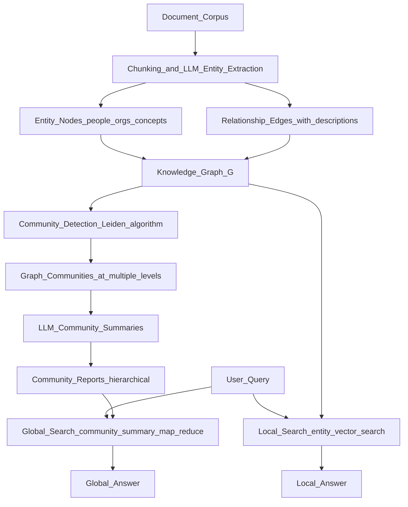

# 🕸️ GraphRAG

> [!abstract] TL;DR
> GraphRAG (Microsoft Research, 2024) builds a knowledge graph from a document corpus — extracting entities and relationships — then uses community detection and hierarchical summaries for retrieval. It dramatically outperforms naive vector RAG on "global" questions that require synthesising information across many documents.

## Intuition — Analogy First

Standard RAG is like searching a filing cabinet by keyword: you find the folders most similar to your query, pull out those pages, and synthesise an answer. This works great when the answer is in one or two specific documents.

But some questions require synthesising across the entire corpus: "What are the major themes across all these research papers?" A keyword search doesn't find "all the papers about theme X" — it finds the papers that contain words similar to your query, which is not the same thing.

GraphRAG's approach: before you get any queries, read the entire filing cabinet and build a **map** of all the entities and how they connect. When a query arrives, use the map to navigate to relevant parts of the corpus rather than just keyword-matching.

Think of the difference between:
- **Standard RAG**: "Find documents about X" → dense vector search → answer
- **GraphRAG**: "Find entities related to X in the knowledge graph → follow edges to related entities → retrieve community summaries → answer"

## How It Works — Mechanics



### Pipeline Phases

**Phase 1 — Indexing (offline, expensive):**
1. **Chunk** documents into overlapping text segments
2. **Extract** entities and relationships from each chunk using an LLM (e.g., "Alice (Person) → WORKS_AT → Acme Corp (Organisation)")
3. **Build** a directed property graph with entities as nodes, relationships as edges
4. **Detect communities** in the graph using the Leiden hierarchical clustering algorithm
5. **Summarise** each community at multiple resolution levels using an LLM
6. **Store** entity embeddings, chunk embeddings, and community report text

**Phase 2 — Local Search (online, fast):**
- For specific factual questions: "Who is the CEO of Acme Corp?"
- Find the most relevant entities via vector similarity to the query
- Expand to adjacent entities in the graph (entity sub-graph)
- Retrieve associated text chunks from the original corpus
- Pass entity context + text to LLM for answer synthesis

**Phase 3 — Global Search (online, map-reduce):**
- For broad thematic questions: "What are the major themes in this document set?"
- Retrieve ALL community reports (no filtering — this is a global query)
- **Map step**: LLM generates intermediate answers for each community report in parallel
- **Reduce step**: LLM aggregates all intermediate answers into a final response

### Why the Knowledge Graph Helps

1. **Explicit relationships**: "Alice works at Acme Corp" is an edge — a vector search on "Alice" might not retrieve Acme Corp documents if they don't contain Alice's name
2. **Entity co-reference**: "the company" and "Acme" and "Acme Corporation" resolve to the same node
3. **Multi-hop reasoning**: query → entity A → related to entity B → entity B appears in chunk C → answer
4. **Global synthesis**: community summaries enable answering questions about the corpus as a whole without scanning every chunk

## The Math

**Community Detection (Leiden Algorithm):**

Leiden is a variant of Louvain that partitions a graph $G = (V, E)$ into communities by maximising **modularity**:

$$Q = \frac{1}{2m} \sum_{ij} \left[A_{ij} - \frac{k_i k_j}{2m}\right] \delta(c_i, c_j)$$

where:
- $A_{ij}$ = adjacency matrix weight
- $k_i, k_j$ = degree of nodes $i, j$
- $m$ = total edge weight
- $\delta(c_i, c_j) = 1$ if $i$ and $j$ are in the same community, else 0

Leiden iterates between refinement phases to avoid the disconnected communities that can arise in Louvain.

**Local search entity ranking** (vector similarity + graph structure):
$$\text{score}(e, q) = \alpha \cdot \cos(\vec{e}, \vec{q}) + (1-\alpha) \cdot \text{PageRank}(e)$$

where entity embedding $\vec{e}$ is compared to query embedding $\vec{q}$, and PageRank captures entity centrality.

**Global search — map step** (per community $c$):
$$a_c = \text{LLM}\!\left(\text{prompt}_\text{map}(q, \text{summary}(c))\right)$$

**Global search — reduce step**:
$$\text{answer} = \text{LLM}\!\left(\text{prompt}_\text{reduce}\!\left(q, \{a_c\}_{c \in C}\right)\right)$$

## Code Demo

```python
# pip install graphrag

# ===== 1. Initialize and configure a GraphRAG project =====
# From command line:
# mkdir my-graphrag && cd my-graphrag
# python -m graphrag init --root .
# (This creates settings.yaml and .env)

# ===== 2. Index a document corpus =====
# Add your .txt files to: ./input/
# Then run:
# python -m graphrag index --root .

# ===== 3. Query: Local search (specific entities) =====
import asyncio
from graphrag.query.cli import run_local_search, run_global_search

async def local_search_example():
    result = await run_local_search(
        config_dir=".",
        data_dir="./output",
        root_dir=".",
        community_level=2,
        response_type="multiple paragraphs",
        query="What did Alice contribute to the Acme Corp project?",
    )
    print("Local Search Result:")
    print(result.response)
    print(f"\nSources used: {len(result.context_data.get('entities', []))} entities")

# ===== 4. Query: Global search (thematic questions) =====
async def global_search_example():
    result = await run_global_search(
        config_dir=".",
        data_dir="./output",
        root_dir=".",
        community_level=2,
        response_type="multiple paragraphs",
        query="What are the main themes and findings across all documents?",
    )
    print("Global Search Result:")
    print(result.response)
    print(f"\nCommunities used: {len(result.context_data.get('reports', []))}")

asyncio.run(local_search_example())
asyncio.run(global_search_example())

# ===== 5. Build a minimal knowledge graph manually (illustrative) =====
import networkx as nx
from openai import OpenAI

def extract_entities_and_relations(text: str, client: OpenAI) -> dict:
    """Use LLM to extract entities and relations from a text chunk."""
    response = client.chat.completions.create(
        model="gpt-4o-mini",
        messages=[{
            "role": "user",
            "content": f"""Extract entities and relationships from the text below.
Return JSON with:
- entities: list of {{name, type, description}}
- relationships: list of {{source, target, relation, description}}

Text: {text}

JSON:"""
        }],
        response_format={"type": "json_object"},
    )
    import json
    return json.loads(response.choices[0].message.content)

def build_knowledge_graph(chunks: list[str], client: OpenAI) -> nx.DiGraph:
    """Build a knowledge graph from document chunks."""
    G = nx.DiGraph()
    for chunk in chunks:
        data = extract_entities_and_relations(chunk, client)
        for entity in data.get("entities", []):
            G.add_node(entity["name"], type=entity["type"], desc=entity["description"])
        for rel in data.get("relationships", []):
            G.add_edge(rel["source"], rel["target"],
                       relation=rel["relation"], desc=rel.get("description", ""))
    return G

def community_summary(G: nx.DiGraph, community_nodes: list[str], query: str, client: OpenAI) -> str:
    """Generate a summary for a graph community using an LLM."""
    subgraph = G.subgraph(community_nodes)
    node_descs = [f"{n}: {G.nodes[n].get('desc', '')}" for n in community_nodes]
    edge_descs = [f"{u} --{d['relation']}--> {v}: {d.get('desc', '')}"
                  for u, v, d in subgraph.edges(data=True)]
    context = "\n".join(node_descs + edge_descs)
    response = client.chat.completions.create(
        model="gpt-4o-mini",
        messages=[{
            "role": "user",
            "content": f"Summarise this community from a knowledge graph:\n{context}\n\nFocus on: {query}"
        }],
    )
    return response.choices[0].message.content

# Example usage
client = OpenAI()
chunks = [
    "Alice Smith is the CEO of Acme Corp. She leads the AI research team.",
    "Bob Jones is the CTO of Acme Corp. He and Alice collaborate on product strategy.",
    "Acme Corp acquired TechStart in 2023. This gave Acme access to TechStart's ML platform.",
]
G = build_knowledge_graph(chunks, client)
print(f"Knowledge graph: {G.number_of_nodes()} nodes, {G.number_of_edges()} edges")
print("Nodes:", list(G.nodes(data=True))[:3])
print("Edges:", list(G.edges(data=True))[:3])
```

## Real-World Example

**Microsoft GraphRAG (open-sourced July 2024)**: Microsoft Research published GraphRAG as an open-source Python library. It was evaluated on the MSMARCO and HotpotQA benchmarks, and on domain-specific corpora (news archives, medical reports). On "sensemaking" queries — questions that require understanding global patterns — GraphRAG outperformed naive RAG by 3–8× in comprehensiveness and diversity scores (as judged by GPT-4).

**Use case — intelligence analysis**: Given a large corpus of news articles about a geopolitical region, GraphRAG can answer "What are the main conflict factions and their key relationships?" — a question no single article answers. Naive RAG would miss cross-document entity connections; GraphRAG's community structure surfaces them.

## Trade-offs

| Property | Naive RAG | GraphRAG Local | GraphRAG Global |
|---|---|---|---|
| Setup cost | Low (just embed) | Very High (LLM-powered extraction) | Very High |
| Query latency | Fast (vector search) | Medium (graph traversal) | Slow (map-reduce) |
| Cost per query | Low | Medium | High (many LLM calls) |
| Specific fact questions | Good | Better (graph context) | Overkill |
| Global/thematic questions | Poor | Poor | Excellent |
| Accuracy on multi-hop QA | Medium | Good | Good |
| Token usage | Low | Medium | Very High |

## When to Use vs Avoid

**Use GraphRAG when:**
- Questions require synthesising across many documents ("what are the major themes?", "how do these entities relate across the corpus?")
- The corpus has dense entity relationships (legal documents, scientific papers, news corpora, narrative fiction)
- The indexing cost is acceptable (one-time offline process)
- Budget for LLM-heavy indexing and querying is available

**Stick with naive RAG when:**
- Questions are specific and answerable from a single document chunk
- The corpus is small (<100 documents) — naive RAG is sufficient
- Latency or cost is a primary constraint
- The corpus is unstructured prose without clear entities (poetry, informal text)

## Common Pitfalls

1. **LLM extraction quality**: the entity extractor runs on every chunk with an LLM — noisy extraction propagates to the graph. Always validate entity quality on a sample before full indexing.
2. **Indexing cost**: GraphRAG indexing can cost $10–$100 for a large corpus (many LLM API calls). Use a cheaper model for extraction; reserve expensive models for query synthesis.
3. **Community level selection**: too few levels → communities are too coarse; too many → fragmented. Tune `community_level` based on query type.
4. **Global search token usage**: global search sends ALL community summaries to the LLM — for large corpora, this can exceed context windows or cost hundreds of API calls per query. Use community-level filtering.
5. **Not a replacement for structured DBs**: GraphRAG builds a soft knowledge graph from unstructured text — it can contain errors. For critical structured data, use a proper knowledge base or database.

## Related Concepts

- [[_MOC_NLP|↑ Section MOC]]

- [[Advanced_RAG]] — query routing, re-ranking, HyDE, and other RAG improvements
- [[RAG_Overview]] — the baseline RAG pipeline (chunking, embedding, retrieval, generation)
- [[Vector_Databases_Overview]] — where GraphRAG stores entity and chunk embeddings

## Review Questions

1. **GraphRAG distinguishes local search from global search. Give a concrete example of a question that each mode handles well, and explain mechanically why the other mode would fail on it.**
2. **Community detection (Leiden algorithm) is used to create community summaries for global search. What would happen to query quality if you skipped community detection and just sent all entity descriptions directly to the LLM?**
3. **GraphRAG's indexing is expensive (LLM calls per chunk for extraction). For a 10,000-document corpus, what design choices would you make to reduce indexing cost while preserving graph quality?**

## Sources

- Edge et al. (2024). *From Local to Global: A Graph RAG Approach to Query-Focused Summarization*. Microsoft Research. [https://arxiv.org/abs/2404.16130](https://arxiv.org/abs/2404.16130)
- GraphRAG GitHub: [https://github.com/microsoft/graphrag](https://github.com/microsoft/graphrag)
- Traag et al. (2019). *From Louvain to Leiden: guaranteeing well-connected communities*. Scientific Reports. [https://arxiv.org/abs/1810.08473](https://arxiv.org/abs/1810.08473)
- GraphRAG documentation: [https://microsoft.github.io/graphrag](https://microsoft.github.io/graphrag)

#rag #knowledge-graph #nlp #graphrag #community-detection #retrieval
