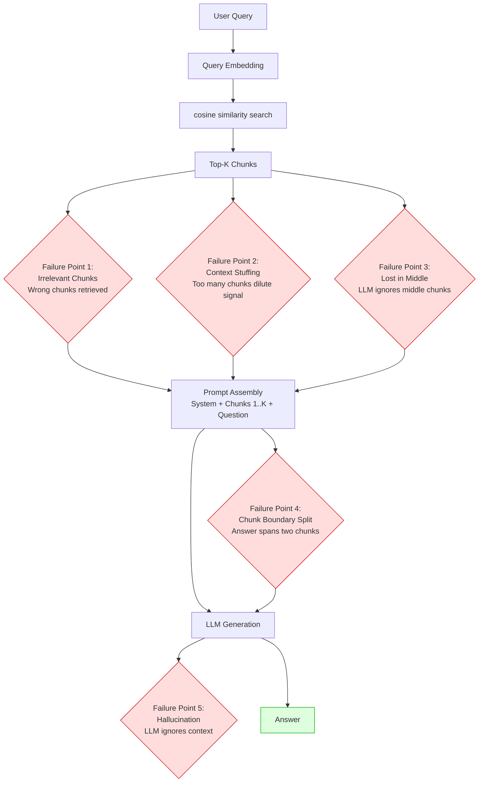

# 🔍 Naive RAG

> [!abstract] TL;DR
> Naive RAG is the baseline RAG implementation: chunk documents by fixed size → embed chunks → store in vector DB → embed query → retrieve top-K by cosine similarity → stuff all K chunks into the context → generate. It works and is quick to build, but has well-understood failure modes: irrelevant retrieval (chunks don't match user intent), context stuffing (K chunks overwhelm the useful signal), and "lost in the middle" (LLMs attend poorly to information in the middle of long contexts). Advanced RAG builds on this baseline.

---

## Intuition — Analogy First

Imagine a student preparing for an exam by **randomly highlighting passages from their textbook based on keyword overlap**. Before answering each question, they scan their highlighted passages and write their answer based on whatever they highlighted. This is better than nothing — at least they've consulted the book — but the approach is clearly suboptimal:

- They might highlight the wrong passages (wrong sections)
- They might highlight too much (can't process it all)
- If they include 10 passages, they'll pay more attention to the first and last ones (lost in the middle)

That's naive RAG. The student is the LLM, the highlighted passages are the retrieved chunks, and the keyword-overlap highlighting is cosine similarity retrieval. It works, but advanced RAG adds smarter highlighting strategies.

---

## How It Works — Mechanics

### The Naive RAG Pipeline

#### Phase 1: Offline Indexing

```
1. Load raw documents (PDF, HTML, text files)
2. Split into fixed-size chunks (typically 500-1500 characters, overlap ~200)
3. Embed each chunk with an embedding model
4. Store (embedding vector, text, metadata) in a vector database
```

**Fixed chunking limitations:**
- Splits may fall mid-sentence or mid-paragraph
- Chunk size is arbitrary — may be too large (includes irrelevant content) or too small (misses context)
- No understanding of document structure

#### Phase 2: Online Retrieval + Generation

```
1. User asks a question
2. Embed the question using the same embedding model
3. Compute cosine similarity between question embedding and all chunk embeddings
4. Return top-K chunks (K = 3-10 typically)
5. Concatenate: [System prompt] + [Chunk 1] + [Chunk 2] + ... + [Chunk K] + [Question]
6. LLM generates response
```

### Known Failure Modes

#### 1. Irrelevant Retrieval
The query embedding doesn't match the chunk that contains the answer. Causes:
- Semantic gap: question phrased differently from document text ("price" vs "cost")
- Short queries: single-word queries have poor embeddings
- Missing keyword matching: "exact model number" queries fail with dense-only retrieval

#### 2. Context Stuffing
Including K large chunks in the prompt dilutes the signal. If only 1 of 5 chunks is relevant, the LLM may give equal weight to all and generate a confused response.

#### 3. Lost in the Middle
Empirically observed: LLMs pay more attention to information at the **beginning and end** of long contexts, with significant attention loss for information in the middle. Top-K chunks stuffed sequentially means middle chunks are under-attended.

#### 4. Chunk Boundary Problem
An answer that spans a chunk boundary is split across two chunks. If only one is retrieved, the answer is incomplete or impossible to reconstruct.

#### 5. Context Staleness
Vector index reflects documents at index time. If a document is updated after indexing, the old chunks are still in the index — stale answers.

### Mermaid: Naive RAG Failure Points



---

## The Math

### Cosine Similarity Retrieval

Given query embedding $\mathbf{q} \in \mathbb{R}^d$ and chunk embeddings $\{\mathbf{c}_i\}$:

$$\text{score}(q, c_i) = \frac{\mathbf{q} \cdot \mathbf{c}_i}{\|\mathbf{q}\| \cdot \|\mathbf{c}_i\|}$$

Retrieve chunks with top-K scores.

### Chunk Count and Context Budget

Maximum prompt tokens: $L_\text{max}$ (e.g., 8192 for GPT-4o-mini)

$$K \leq \frac{L_\text{max} - L_\text{system} - L_\text{question} - L_\text{reserve}}{L_\text{chunk}}$$

Where $L_\text{reserve}$ is tokens reserved for generation. For $L_\text{max}=8192$, $L_\text{system}=200$, $L_\text{question}=50$, $L_\text{reserve}=512$, $L_\text{chunk}=300$:

$$K \leq \frac{8192 - 200 - 50 - 512}{300} = \frac{7430}{300} \approx 24$$

---

## Code Demo

### Complete Naive RAG with LangChain

```python
"""
Complete Naive RAG implementation using:
- PyPDF2 for document loading
- LangChain RecursiveCharacterTextSplitter for chunking
- Chroma for vector storage
- OpenAI embeddings
- RetrievalQA chain
"""

from langchain_community.document_loaders import PyPDFLoader, TextLoader, WebBaseLoader
from langchain.text_splitter import RecursiveCharacterTextSplitter
from langchain_openai import OpenAIEmbeddings, ChatOpenAI
from langchain_chroma import Chroma
from langchain.chains import RetrievalQA
from langchain.prompts import PromptTemplate
import os

# ── 1. Load documents (multiple sources) ──
documents = []

# From PDF
pdf_loader = PyPDFLoader("./data/company_policy.pdf")
documents.extend(pdf_loader.load())

# From plain text
text_loader = TextLoader("./data/faq.txt", encoding="utf-8")
documents.extend(text_loader.load())

# From URL (web page)
web_loader = WebBaseLoader(["https://example.com/docs/api"])
documents.extend(web_loader.load())

print(f"Total documents loaded: {len(documents)}")

# ── 2. Fixed-size chunking (the "naive" part) ──
text_splitter = RecursiveCharacterTextSplitter(
    # Tries to split by these separators in order:
    separators=["\n\n", "\n", ". ", "! ", "? ", " ", ""],
    chunk_size=1000,       # target chunk size in characters
    chunk_overlap=200,     # overlap to avoid boundary issues
    length_function=len,
    is_separator_regex=False,
)

chunks = text_splitter.split_documents(documents)

print(f"Total chunks: {len(chunks)}")
print(f"Sample chunk size: {len(chunks[0].page_content)} chars")
print(f"Sample chunk:\n{chunks[0].page_content[:200]}")

# Chunk size distribution
sizes = [len(c.page_content) for c in chunks]
print(f"Chunk sizes — min: {min(sizes)}, max: {max(sizes)}, avg: {sum(sizes)/len(sizes):.0f}")

# ── 3. Embed and store in Chroma ──
embeddings = OpenAIEmbeddings(
    model="text-embedding-3-small",  # 1536-dim, cheap and good
    # model="text-embedding-3-large",  # 3072-dim, more expensive but better
)

# Create vector store (persists to disk)
vectorstore = Chroma.from_documents(
    documents=chunks,
    embedding=embeddings,
    persist_directory="./naive_rag_chroma",
    collection_name="naive_rag",
    collection_metadata={"hnsw:space": "cosine"},  # use cosine distance
)
print(f"Vector store created with {vectorstore._collection.count()} vectors")

# ── 4. Retriever config ──
retriever = vectorstore.as_retriever(
    search_type="similarity",          # cosine similarity
    search_kwargs={
        "k": 5,                        # retrieve top 5 chunks
        # "score_threshold": 0.7,      # optional: filter by minimum similarity
        # "filter": {"source": "pdf"}, # optional: metadata filter
    },
)

# ── 5. RAG prompt ──
NAIVE_RAG_PROMPT = PromptTemplate(
    template="""You are a helpful assistant answering questions based on the provided documents.

IMPORTANT INSTRUCTIONS:
- Answer ONLY based on the context below
- If the context does not contain enough information, say: "I don't have enough information to answer this question based on the available documents."
- Do not use prior knowledge or make up information
- Be concise and direct

Context:
{context}

Question: {question}

Answer:""",
    input_variables=["context", "question"],
)

# ── 6. Build chain ──
llm = ChatOpenAI(
    model="gpt-4o-mini",
    temperature=0,        # deterministic for RAG
    max_tokens=500,
)

qa_chain = RetrievalQA.from_chain_type(
    llm=llm,
    chain_type="stuff",   # "stuff": all chunks in one prompt
    retriever=retriever,
    chain_type_kwargs={"prompt": NAIVE_RAG_PROMPT},
    return_source_documents=True,
    verbose=True,
)

# ── 7. Query examples ──
test_questions = [
    "What is the refund window after purchase?",
    "How do I contact customer support?",
    "What payment methods are accepted?",
]

for question in test_questions:
    print(f"\n{'='*60}")
    print(f"Q: {question}")
    result = qa_chain.invoke({"query": question})
    print(f"A: {result['result']}")
    print(f"\nRetrieved {len(result['source_documents'])} chunks:")
    for i, doc in enumerate(result["source_documents"]):
        print(f"  [{i+1}] {doc.metadata.get('source', 'unknown')} — {doc.page_content[:100]}...")


# ── 8. Inspect retrieval quality (diagnostic) ──
def inspect_retrieval(query: str, vectorstore: Chroma, k: int = 5):
    """Show retrieved chunks with similarity scores for debugging."""
    results = vectorstore.similarity_search_with_score(query, k=k)
    print(f"\nRetrieval for: '{query}'")
    for i, (doc, score) in enumerate(results):
        print(f"  [{i+1}] Score: {score:.4f} | {doc.metadata}")
        print(f"       {doc.page_content[:150]}...")

inspect_retrieval("What is the refund policy?", vectorstore)
```

### Open-Source Alternative with Local Embeddings

```python
# Use a local embedding model (no API cost) — good for private data
from langchain_huggingface import HuggingFaceEmbeddings

local_embeddings = HuggingFaceEmbeddings(
    model_name="BAAI/bge-small-en-v1.5",  # 384-dim, fast, excellent quality
    model_kwargs={"device": "cpu"},        # or "cuda" for GPU
    encode_kwargs={"normalize_embeddings": True},  # normalise for cosine similarity
)

# Use with same Chroma vectorstore setup
vectorstore_local = Chroma.from_documents(
    documents=chunks,
    embedding=local_embeddings,
    persist_directory="./naive_rag_local",
)
```

---

## Real-World Example

**First-generation enterprise chatbots (2023):** When the "build a chatbot over your documentation" wave hit enterprises after ChatGPT's release, most teams implemented naive RAG: RecursiveCharacterTextSplitter → OpenAI embeddings → Chroma/Pinecone → RetrievalQA chain. These chatbots worked for simple factual questions but consistently failed on:
- Multi-hop questions requiring combining information from 2+ documents
- Questions whose answers spanned chunk boundaries
- Questions using different terminology than the documentation

This led directly to the "Advanced RAG" research wave addressing exactly these failures.

---

## Trade-offs

| Aspect | Advantage | Limitation |
|---|---|---|
| Implementation | Fast to build (< 1 day) | Quality ceiling without tuning |
| Chunking | Simple to implement | Arbitrary boundaries hurt retrieval |
| Retrieval | Robust baseline | Semantic-only, misses keywords |
| Context assembly | Straightforward | Top-K chunks may be irrelevant |
| Cost | Cheap (few embedding calls) | May hallucinate with poor retrieval |
| Interpretability | Source documents visible | Chunk attribution imprecise |

---

## When to Use vs Avoid

**Use naive RAG when:**
- Building an MVP or proof of concept (days, not weeks)
- Document collection is small and internally consistent (terminology doesn't vary much)
- Questions are simple factual lookups (not multi-hop)
- Team is new to RAG and needs a baseline to improve from

**Upgrade to Advanced RAG when:**
- Answer quality is insufficient after tuning chunk size / K
- Retrieval recall is < 70% on your eval set
- Users report "the bot can't find obvious answers in the docs"
- Production deployment requires measurable reliability

---

## Common Pitfalls

1. **Chunk size too large** — chunks > 1500 characters often include irrelevant content that confuses the LLM. Start at 500-1000 chars.
2. **Zero overlap** — adjacent chunks share no content; answers spanning boundaries are invisible. Use 10-20% of chunk size as overlap.
3. **K too large** — retrieving 20 chunks provides too much noise. Most answers are in the top 3. Use K=3-5 initially.
4. **Using the same model for embedding and generation** — embedding model (e.g., `text-embedding-3-small`) and LLM (e.g., `gpt-4o-mini`) are different models. Don't confuse them.
5. **Not persisting the vector store** — `Chroma.from_documents()` without `persist_directory` creates an in-memory store that disappears on restart. Always specify `persist_directory`.
6. **Not preprocessing documents** — HTML noise (nav bars, footers, ads) degrades chunk quality. Strip HTML, remove boilerplate before chunking.

---

## Related Concepts

- [[_MOC_NLP|↑ Section MOC]]

- [[RAG_Overview]] — the broader RAG paradigm and motivation; this note is the implementation baseline
- [[Advanced_RAG]] — improvements over naive RAG: query transformation, reranking, hybrid search
- [[Vector_Databases_Overview]] — Chroma, Pinecone, Weaviate — the storage backends
- [[Embedding_Models]] — the neural models that convert text to vectors; quality determines retrieval ceiling

---

## Review Questions

1. Naive RAG uses `RecursiveCharacterTextSplitter` with `chunk_size=1000, chunk_overlap=200`. If a document has an important policy statement that spans characters 950-1050 of a section, explain how this might be split and whether `chunk_overlap` would help recover it.

2. The "lost in the middle" phenomenon describes LLMs attending poorly to information in the middle of long contexts. Given this limitation, how would you reorder your K retrieved chunks in the prompt to maximise the probability that the LLM uses the most relevant chunk?

3. A naive RAG system has 60% answer accuracy on an evaluation set. You diagnose that 25% of failures are due to retrieval returning wrong chunks, and 75% of failures are correct retrieval but wrong generation. What are the two most likely causes of the retrieval failures, and what changes would you make to the naive pipeline?

---

## Sources

- Lewis et al. (2020). *Retrieval-Augmented Generation for Knowledge-Intensive NLP Tasks*. [arXiv:2005.11401](https://arxiv.org/abs/2005.11401)
- Liu et al. (2023). *Lost in the Middle: How Language Models Use Long Contexts*. [arXiv:2307.03172](https://arxiv.org/abs/2307.03172)
- Gao et al. (2023). *Retrieval-Augmented Generation for Large Language Models: A Survey*. [arXiv:2312.10997](https://arxiv.org/abs/2312.10997)
- LangChain Text Splitters: [python.langchain.com/docs/modules/data_connection/document_transformers](https://python.langchain.com/docs/modules/data_connection/document_transformers)

#rag #naive-rag #retrieval #langchain #chroma #embeddings #nlp #llm
