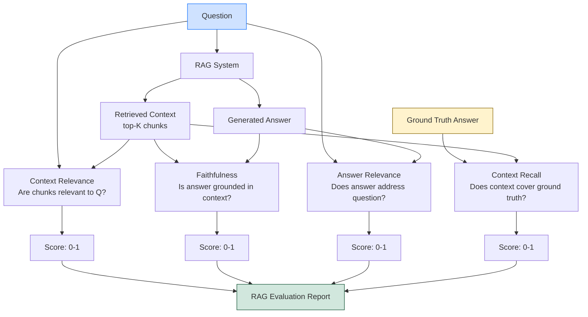

# 📊 RAG Evaluation

> [!abstract] TL;DR
> Evaluating a RAG system requires measuring three components independently: whether the retrieved context is relevant to the question (context relevance), whether the answer is grounded in the retrieved context (faithfulness), and whether the answer is relevant to the question (answer relevance). RAGAS (Retrieval-Augmented Generation Assessment) is the standard framework providing these metrics, all computable without human labels using an LLM-as-judge. Enterprises must establish RAGAS baselines before deploying RAG chatbots to production.

---

## Intuition — Analogy First

Imagine a **fact-checker grading a student's open-book exam**. The fact-checker evaluates three things:

1. **Did the student look up the right pages?** (Context Relevance — were retrieved chunks relevant to the question?)
2. **Is the student's answer actually from the book?** (Faithfulness — is the answer grounded in the retrieved context, not made up?)
3. **Does the answer actually address the question?** (Answer Relevance — is the answer on-topic and complete?)

A student can fail in any of these independently:
- Right pages but ignored them (low faithfulness)
- Wrong pages but answered correctly from memory (low context relevance — suspicious)
- Right pages, used them, but answered a different question (low answer relevance)

RAGAS is that fact-checker — automated, scalable, and language-model-powered.

---

## How It Works — Mechanics

### The RAG Triad

Every RAG evaluation trace has three components:

```
Question (q)
    ↓
Context (c) — chunks retrieved from vector database
    ↓
Answer (a) — generated by the LLM
```

The RAG triad measures the quality of each relationship:

| Metric | Measures | Inputs Needed |
|---|---|---|
| Context Relevance | Are retrieved chunks relevant to the question? | q, c |
| Faithfulness | Is the answer grounded in the context? | c, a |
| Answer Relevance | Does the answer address the question? | q, a |
| Context Recall | Did we retrieve all necessary information? | q, c, ground_truth |
| Context Precision | What fraction of retrieved chunks were useful? | q, c, ground_truth |

### Metric 1: Faithfulness

**Definition**: The answer should be supported by the retrieved context. Every claim in the answer should be verifiable in the context.

**Measurement**:
1. LLM-as-judge decomposes the answer into individual statements
2. For each statement, the judge checks: "Is this claim supported by the context?"
3. Faithfulness = (number of supported statements) / (total statements)

Range: [0, 1]. 1.0 = every statement grounded in context.

**Failure examples**: RAG answer claims a fact that wasn't in any retrieved chunk (hallucination); answer contradicts the context.

### Metric 2: Answer Relevance

**Definition**: The answer should be directly relevant to the question. An answer that's technically correct but doesn't address the question fails this metric.

**Measurement**:
1. LLM generates N hypothetical questions that the given answer would correctly answer
2. Compute cosine similarity between the original question embedding and each generated question embedding
3. Answer Relevance = mean cosine similarity

Range: [0, 1]. 1.0 = answer perfectly targets the question.

**Failure examples**: Answer addresses a related but different question; answer is too generic.

### Metric 3: Context Relevance

**Definition**: Retrieved context should contain the information needed to answer the question. Irrelevant chunks are noise.

**Measurement**:
1. LLM extracts sentences from each retrieved chunk that are relevant to the question
2. Context Relevance = (relevant sentences) / (total sentences in retrieved chunks)

Range: [0, 1]. 1.0 = every retrieved sentence is relevant.

**Failure examples**: Retrieving chunks that share keywords but aren't informationally relevant; chunks about adjacent topics.

### Metric 4: Context Recall

**Definition**: The retrieved context should cover all the information needed to answer the question (requires ground truth answers).

**Measurement**:
1. LLM checks each sentence in the ground-truth answer: "Can this be attributed to the retrieved context?"
2. Context Recall = (sentences attributable to context) / (total sentences in ground truth)

Requires labelled ground truth — more expensive to compute.

### Metric 5: Context Precision

**Definition**: Every retrieved chunk should be useful. Useless chunks consume context window and add noise.

**Measurement**:
1. For each retrieved chunk at position $k$: is it relevant to answering the question?
2. Context Precision = mean precision at each relevant chunk position

Similar to Precision@K in information retrieval.

### TruLens

Alternative to RAGAS — TruLens provides the "RAG Triad" evaluation with a UI for tracking evaluation results over time across RAG experiments.

### LLM-as-Judge for Evaluation

Both RAGAS and TruLens use an LLM (e.g., GPT-4o) as the judge. The key insight: **you don't need human labels for most RAG metrics** — the LLM can assess whether statements are grounded in context much faster and cheaper than humans.

Calibration check: compare LLM-judge scores with 100-200 human-labelled examples to verify the judge correlates with human preferences.

### The RAG Triad Evaluation Flow



---

## The Math

### Faithfulness Score

$$\text{Faithfulness} = \frac{|\{s \in \text{statements}(a) : s \text{ is supported by } c\}|}{|\text{statements}(a)|}$$

### Answer Relevance Score

$$\text{AnswerRelevance} = \frac{1}{N} \sum_{i=1}^{N} \cos(\text{embed}(q), \text{embed}(\hat{q}_i))$$

Where $\hat{q}_i$ are LLM-generated hypothetical questions that the answer addresses.

### Context Relevance Score

$$\text{ContextRelevance} = \frac{|\text{relevant sentences in retrieved context}|}{|\text{total sentences in retrieved context}|}$$

### Context Recall

$$\text{ContextRecall} = \frac{|\{s \in \text{sentences}(a^*) : s \text{ attributable to } c\}|}{|\text{sentences}(a^*)|}$$

Where $a^*$ is the ground truth answer.

### RAG Score Interpretation

| Metric | Score < 0.5 | Score 0.5-0.8 | Score > 0.8 |
|---|---|---|---|
| Faithfulness | Frequent hallucination | Moderate grounding | Well-grounded |
| Answer Relevance | Off-topic answers | Partially relevant | On-target |
| Context Relevance | Poor retrieval | Acceptable retrieval | Precise retrieval |
| Context Recall | Missing key information | Partial coverage | Comprehensive |

---

## Code Demo

### RAGAS Framework Evaluation

```python
# pip install ragas langchain-openai langchain-community

from ragas import evaluate
from ragas.metrics import (
    faithfulness,
    answer_relevancy,
    context_recall,
    context_precision,
    answer_correctness,
)
from ragas.metrics.critique import harmfulness
from datasets import Dataset
from langchain_openai import ChatOpenAI, OpenAIEmbeddings

# ── 1. Collect evaluation data from your RAG system ──
# Build your RAG pipeline (see Naive_RAG.md for setup)
# Then collect traces: for each test question, record the question, context, and answer

def run_rag_and_collect_traces(rag_chain, test_questions: list) -> dict:
    """Run RAG system and collect evaluation data."""
    questions = []
    answers = []
    contexts = []

    for q in test_questions:
        result = rag_chain.invoke({"query": q})
        questions.append(q)
        answers.append(result["result"])
        # Collect retrieved chunk texts
        contexts.append([doc.page_content for doc in result["source_documents"]])

    return {
        "question": questions,
        "answer": answers,
        "contexts": contexts,
    }

# ── 2. Test questions (optionally with ground truth) ──
test_questions = [
    "What is the return window after purchase?",
    "How do I reset my password?",
    "What payment methods are accepted?",
    "Can I change my subscription plan?",
    "What is the data privacy policy?",
]

# Optional: ground truth for context_recall and answer_correctness
ground_truths = [
    "Customers have 30 days to return products for a full refund.",
    "You can reset your password via the login page using your email address.",
    "We accept Visa, Mastercard, PayPal, and bank transfers.",
    "Yes, you can upgrade or downgrade your plan at any time from account settings.",
    "We collect only necessary data and never sell it to third parties.",
]

# Collect traces
traces = run_rag_and_collect_traces(qa_chain, test_questions)

# Add ground truth if available
traces["ground_truth"] = ground_truths

# ── 3. Create RAGAS dataset ──
eval_dataset = Dataset.from_dict(traces)

# ── 4. Configure evaluation LLM (the judge) ──
eval_llm = ChatOpenAI(model="gpt-4o", temperature=0)
eval_embeddings = OpenAIEmbeddings(model="text-embedding-3-small")

# ── 5. Run evaluation ──
results = evaluate(
    dataset=eval_dataset,
    metrics=[
        faithfulness,                  # is answer grounded in context?
        answer_relevancy,              # does answer address question?
        context_precision,             # are retrieved chunks precise?
        context_recall,                # does context cover ground truth?
    ],
    llm=eval_llm,
    embeddings=eval_embeddings,
    raise_exceptions=False,
)

print(results)
# Output:
# {
#   'faithfulness': 0.72,
#   'answer_relevancy': 0.85,
#   'context_precision': 0.65,
#   'context_recall': 0.78,
# }

# ── 6. Detailed per-question analysis ──
results_df = results.to_pandas()
print(results_df[["question", "faithfulness", "answer_relevancy", "context_precision", "context_recall"]])

# Flag problematic questions
low_faithfulness = results_df[results_df["faithfulness"] < 0.5]
print(f"\nQuestions with hallucination (faithfulness < 0.5):")
for _, row in low_faithfulness.iterrows():
    print(f"  Q: {row['question']}")
    print(f"  A: {row['answer'][:200]}")
    print(f"  Faithfulness: {row['faithfulness']:.2f}\n")
```

### LLM-as-Judge — Manual Evaluation

```python
from langchain_openai import ChatOpenAI
from langchain.prompts import PromptTemplate

judge_llm = ChatOpenAI(model="gpt-4o", temperature=0)

FAITHFULNESS_JUDGE_PROMPT = PromptTemplate(
    template="""You are evaluating whether an AI assistant's answer is faithful to the retrieved context.
Faithful means every factual claim in the answer can be directly supported by the context.

Context:
{context}

Answer to evaluate:
{answer}

Instructions:
1. List each factual claim made in the answer
2. For each claim, mark it as "SUPPORTED" or "UNSUPPORTED" based on the context
3. Calculate faithfulness = supported_claims / total_claims
4. Return a JSON with: {{"claims": [...], "supported": N, "total": N, "score": 0.0-1.0, "reasoning": "..."}}

Evaluation:""",
    input_variables=["context", "answer"],
)

ANSWER_RELEVANCE_JUDGE_PROMPT = PromptTemplate(
    template="""You are evaluating whether an AI assistant's answer is relevant to the question.

Question: {question}

Answer: {answer}

Rate the answer relevance from 0 to 1:
- 1.0: Answer directly and completely addresses the question
- 0.7: Answer mostly addresses the question but misses some aspects
- 0.5: Answer is partially relevant but incomplete or tangential
- 0.3: Answer is barely relevant
- 0.0: Answer is completely off-topic

Return JSON: {{"score": 0.0-1.0, "reasoning": "..."}}

Evaluation:""",
    input_variables=["question", "answer"],
)

import json

def evaluate_faithfulness(context: str, answer: str) -> dict:
    result = (FAITHFULNESS_JUDGE_PROMPT | judge_llm).invoke({
        "context": context, "answer": answer
    })
    try:
        return json.loads(result.content)
    except json.JSONDecodeError:
        return {"score": None, "reasoning": result.content}

def evaluate_answer_relevance(question: str, answer: str) -> dict:
    result = (ANSWER_RELEVANCE_JUDGE_PROMPT | judge_llm).invoke({
        "question": question, "answer": answer
    })
    try:
        return json.loads(result.content)
    except json.JSONDecodeError:
        return {"score": None, "reasoning": result.content}


# Evaluate a sample
sample = {
    "question": "What is the return policy?",
    "context": "Our return policy allows customers to return any product within 30 days of purchase for a full refund, provided the item is in original condition.",
    "answer": "You can return products within 30 days for a full refund.",
}

faith_result = evaluate_faithfulness(sample["context"], sample["answer"])
rel_result = evaluate_answer_relevance(sample["question"], sample["answer"])

print(f"Faithfulness: {faith_result['score']} — {faith_result.get('reasoning', '')[:200]}")
print(f"Answer Relevance: {rel_result['score']} — {rel_result.get('reasoning', '')[:200]}")
```

### TruLens Integration

```python
# pip install trulens-eval

from trulens_eval import Tru, TruChain, Feedback
from trulens_eval.feedback import Groundedness
from trulens_eval.feedback.provider import OpenAI as TruOpenAI
import numpy as np

tru = Tru()
tru.reset_database()

provider = TruOpenAI(model_engine="gpt-4o")

# ── Define feedback functions ──
grounded = Groundedness(groundedness_provider=provider)

# Groundedness (faithfulness)
f_groundedness = (
    Feedback(grounded.groundedness_measure_with_cot_reasons, name="Groundedness")
    .on_input_output()
)

# Answer relevance
f_answer_relevance = (
    Feedback(provider.relevance, name="Answer Relevance")
    .on_input_output()
)

# Context relevance (for each retrieved context chunk)
f_context_relevance = (
    Feedback(provider.context_relevance, name="Context Relevance")
    .on_input()
    .on(TruChain.select_context(rag_chain))
    .aggregate(np.mean)
)

# ── Wrap your RAG chain with TruLens tracing ──
tru_chain = TruChain(
    rag_chain,
    app_id="naive_rag_v1",
    feedbacks=[f_groundedness, f_answer_relevance, f_context_relevance],
)

# Run queries (TruLens records traces and computes metrics)
with tru_chain as recording:
    for question in test_questions:
        tru_chain.invoke({"query": question})

# View results
records, feedback = tru.get_records_and_feedback(app_ids=["naive_rag_v1"])
print(records[["input", "output", "Groundedness", "Answer Relevance", "Context Relevance"]])

# Launch TruLens dashboard for visual exploration
tru.run_dashboard()  # opens at http://localhost:8501
```

---

## Real-World Example

**Enterprise RAG Deployment at Financial Services Firms:** Before deploying a RAG chatbot for internal policy Q&A, teams use RAGAS evaluation across 200-500 "golden" question-answer pairs curated by subject matter experts. A typical target: Faithfulness > 0.85 and Context Recall > 0.80 before allowing the chatbot to answer compliance-related queries.

**Perplexity AI's Internal Evaluation:** Perplexity reportedly evaluates both retrieval quality (did the search return pages containing the right answer?) and generation quality (is the answer faithful to those pages?) separately, enabling them to iterate on retrieval and generation independently.

---

## Trade-offs

| Evaluation Method | Cost | Speed | Human Correlation | Requires Labels |
|---|---|---|---|---|
| RAGAS (GPT-4 judge) | Medium (API cost) | Minutes | High | No |
| TruLens | Medium | Minutes | High | No |
| Human evaluation | High | Hours-days | Ground truth | Yes |
| Automated accuracy (exact match) | Low | Seconds | Low | Yes |
| LLM-as-judge (custom) | Low-medium | Minutes | Medium | No |

---

## When to Use vs Avoid

**Run RAGAS evaluation when:**
- Before deploying a RAG system to production
- After any significant change to the pipeline (chunking strategy, embedding model, K, reranking)
- When users report quality issues and you need to diagnose whether retrieval or generation is failing
- Building an A/B comparison between RAG configurations

**Use human evaluation in addition when:**
- Domain requires expert judgment (medical, legal — LLM judge may lack domain expertise)
- Building a calibration set to verify LLM-judge reliability
- Final sign-off for regulated use cases

**Don't skip evaluation because:**
- "It looks good on the demo" — cherry-picked demos mask systematic failures
- "We don't have ground truth" — RAGAS works without ground truth for 3 of the 5 metrics

---

## Common Pitfalls

1. **Evaluating only end-to-end accuracy** — measures whether the final answer is right but can't tell you *why* it's wrong (retrieval failure vs generation failure). Always decompose into retrieval and generation metrics.
2. **Test set contamination** — if your test questions are similar to your indexing strategy's strengths, scores are inflated. Test on questions from real user logs, not curated examples.
3. **LLM-judge model too weak** — using `gpt-3.5-turbo` as judge gives noisy faithfulness scores. Use GPT-4o or Claude Opus for evaluation, even if a smaller model is used for generation.
4. **Not versioning evaluations** — when you change the RAG pipeline, you need to compare to a baseline. Track RAGAS scores per experiment run with experiment tracking (W&B, MLflow).
5. **Ignoring context relevance** — teams often only measure faithfulness and answer relevance. Context relevance diagnoses retrieval problems; without it, you can't tell if low faithfulness comes from poor retrieval or hallucination.

---

## Related Concepts

- [[_MOC_NLP|↑ Section MOC]]

- [[RAG_Overview]] — the full RAG pipeline whose components this note evaluates
- [[Advanced_RAG]] — the optimisations evaluated by RAGAS metrics
- [[LLM_Benchmarks]] — broader LLM evaluation frameworks; RAG evaluation is a subset
- [[Naive_RAG]] — the baseline RAG system that RAGAS scores first reveal the gaps in

---

## Review Questions

1. A RAG system has Faithfulness = 0.9 but Context Recall = 0.4. Diagnose the failure: what does each score tell you independently, and what does the combination tell you about where the pipeline is failing?

2. RAGAS's Answer Relevance metric works by asking the LLM to generate hypothetical questions that the answer would address, then measuring cosine similarity to the original question. Why is this "reverse question generation" approach more reliable than simply asking the LLM to rate relevance on a 1-10 scale?

3. You're evaluating two RAG configurations: Config A has Faithfulness=0.85, Context Relevance=0.70. Config B has Faithfulness=0.75, Context Relevance=0.90. Which configuration would you prefer, and why? What additional information would you want before making a final decision?

---

## Sources

- Es et al. (2023). *RAGAS: Automated Evaluation of Retrieval Augmented Generation*. [arXiv:2309.15217](https://arxiv.org/abs/2309.15217)
- Guo et al. (2024). *TruLens: Evaluation and Tracking for LLM Experiments*. [trulens.org](https://www.trulens.org)
- Zheng et al. (2023). *Judging LLM-as-a-Judge with MT-Bench and Chatbot Arena*. [arXiv:2306.05685](https://arxiv.org/abs/2306.05685)
- RAGAS Documentation: [docs.ragas.io](https://docs.ragas.io)

#rag #evaluation #ragas #faithfulness #answer-relevance #llm-as-judge #nlp #benchmarks
