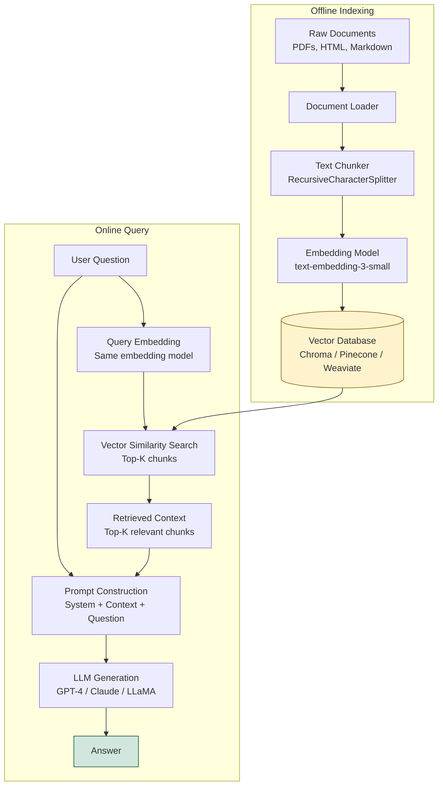

# 📚 RAG — Retrieval-Augmented Generation

> [!abstract] TL;DR
> RAG combines a retrieval system (vector database + embeddings) with a generative LLM. Instead of relying only on the LLM's parametric knowledge (which has a cutoff date and can hallucinate), RAG retrieves relevant documents from an external knowledge base and includes them in the prompt. The LLM generates answers grounded in the retrieved context. This reduces hallucination, enables real-time knowledge updates, and makes LLMs useful over private/proprietary document collections.

---

## Intuition — Analogy First

Imagine an **open-book exam** versus a closed-book exam. In a closed-book exam, the student must rely entirely on memorised knowledge — they might hallucinate facts or have outdated information. In an **open-book exam**, the student can look things up in a textbook before answering.

RAG is the open-book exam for LLMs:
- The LLM is the student
- The vector database is the textbook
- The retrieval step is "looking up relevant passages before answering"
- The LLM then synthesises an answer using both its general knowledge and the retrieved context

The student doesn't copy from the textbook verbatim — they understand the relevant passages and compose a coherent answer. The LLM shouldn't copy the context either — it synthesises it.

---

## How It Works — Mechanics

### Why RAG Exists — The Three Problems It Solves

| Problem | Without RAG | With RAG |
|---|---|---|
| Knowledge cutoff | LLM trained on data up to a date | Retrieve from live/updated index |
| Hallucination | LLM confabulates facts | Answer grounded in retrieved docs |
| Domain specificity | LLM has no proprietary knowledge | Index internal docs, code, policies |

### The RAG Pipeline (High Level)

1. **Indexing** (offline): Chunk documents → embed with an embedding model → store vectors + text in a vector database

2. **Querying** (online):
   a. User submits a question
   b. Embed the question with the same embedding model
   c. Search the vector database for the K most similar chunks (nearest-neighbour search)
   d. Retrieve the top-K chunks
   e. Construct a prompt: `[System instruction] + [Retrieved chunks] + [User question]`
   f. LLM generates a response grounded in the retrieved context

### Retrieval Types

#### Dense Retrieval (Semantic Search)
- Use a neural embedding model (e.g., `text-embedding-3-small`, `bge-m3`) to convert both the query and documents into dense vectors
- Retrieve by cosine similarity or dot product
- **Pros**: captures semantic meaning, handles paraphrase, understands context
- **Cons**: misses exact keyword matches, requires GPU for embedding

#### Sparse Retrieval (Keyword Search — BM25/TF-IDF)
- Classic IR approach: match query terms to document terms with TF-IDF weighting
- BM25 is the gold standard: normalises for document length and term frequency saturation
- **Pros**: exact keyword matching, no embeddings needed, fast
- **Cons**: no semantic understanding ("car" ≠ "automobile")

#### Hybrid Retrieval
- Combine dense + sparse scores (e.g., Reciprocal Rank Fusion)
- Best of both worlds — see [[Advanced_RAG]]

### Chunking Strategy

How documents are split into chunks fundamentally affects retrieval quality:

| Strategy | Description | Best For |
|---|---|---|
| Fixed character/token | Split every 512 tokens | Simple, fast, baseline |
| Recursive character | Split by paragraphs, then sentences, then chars | General documents |
| Semantic chunking | Split at semantic boundaries (sentence embedding similarity) | Long-form text |
| Parent-child | Index small chunks; retrieve parent document | Dense docs with context |
| Sliding window | Overlapping chunks (chunk_overlap=50) | Preserving context at boundaries |

**Retrieval is the bottleneck**: most RAG failures stem from retrieving the wrong chunks, not from LLM generation quality. Invest most optimisation effort in chunking and retrieval.

### Mermaid: RAG Pipeline



---

## The Math

### Cosine Similarity (dense retrieval)

$$\text{sim}(q, d) = \frac{\mathbf{q} \cdot \mathbf{d}}{|\mathbf{q}| \cdot |\mathbf{d}|}$$

Where $\mathbf{q}$ and $\mathbf{d}$ are the embedding vectors of the query and document chunk.

### BM25 Score (sparse retrieval)

$$\text{BM25}(q, d) = \sum_{t \in q} \text{IDF}(t) \cdot \frac{f(t,d) \cdot (k_1 + 1)}{f(t,d) + k_1 \cdot (1 - b + b \cdot \frac{|d|}{\text{avgdl}})}$$

Where:
- $f(t,d)$ = term frequency of term $t$ in document $d$
- $|d|$ = document length
- $k_1 \approx 1.5$, $b \approx 0.75$ (tuning parameters)

### Reciprocal Rank Fusion (hybrid combination)

$$\text{RRF}(d) = \sum_{r \in \text{rankings}} \frac{1}{k + r(d)}$$

Combine rankings from dense and sparse retrieval; $k=60$ is the standard constant.

---

## Code Demo

### Minimal RAG Pipeline — LangChain

```python
from langchain_community.document_loaders import DirectoryLoader, PyPDFLoader
from langchain.text_splitter import RecursiveCharacterTextSplitter
from langchain_openai import OpenAIEmbeddings, ChatOpenAI
from langchain_chroma import Chroma
from langchain.chains import RetrievalQA
from langchain.prompts import PromptTemplate
import os

# ── 1. Load documents ──
loader = DirectoryLoader("./docs", glob="**/*.pdf", loader_cls=PyPDFLoader)
raw_documents = loader.load()
print(f"Loaded {len(raw_documents)} documents")

# ── 2. Chunk documents ──
splitter = RecursiveCharacterTextSplitter(
    chunk_size=1000,          # characters per chunk
    chunk_overlap=200,        # overlap between consecutive chunks
    length_function=len,
    separators=["\n\n", "\n", ". ", " ", ""],
)
chunks = splitter.split_documents(raw_documents)
print(f"Created {len(chunks)} chunks")

# ── 3. Embed and store ──
embedding_model = OpenAIEmbeddings(model="text-embedding-3-small")

vectorstore = Chroma.from_documents(
    documents=chunks,
    embedding=embedding_model,
    persist_directory="./chroma_db",
    collection_name="company_docs",
)
print(f"Indexed {vectorstore._collection.count()} chunks")

# ── 4. Create retriever ──
retriever = vectorstore.as_retriever(
    search_type="similarity",
    search_kwargs={"k": 5},           # retrieve top 5 chunks
)

# ── 5. Define prompt template ──
RAG_PROMPT = PromptTemplate(
    template="""You are a helpful assistant. Answer the question based ONLY on the provided context.
If the context does not contain enough information to answer, say "I don't have enough information to answer that."
Do not make up information not present in the context.

Context:
{context}

Question: {question}

Answer:""",
    input_variables=["context", "question"],
)

# ── 6. Build RAG chain ──
llm = ChatOpenAI(model="gpt-4o-mini", temperature=0)

qa_chain = RetrievalQA.from_chain_type(
    llm=llm,
    chain_type="stuff",                   # "stuff" = pack all chunks into one prompt
    retriever=retriever,
    chain_type_kwargs={"prompt": RAG_PROMPT},
    return_source_documents=True,
)

# ── 7. Query ──
query = "What is the company's refund policy?"
result = qa_chain.invoke({"query": query})

print(f"Answer: {result['result']}")
print(f"\nSources:")
for doc in result["source_documents"]:
    print(f"  - {doc.metadata.get('source', 'unknown')} (page {doc.metadata.get('page', '?')})")
    print(f"    {doc.page_content[:100]}...")
```

### LlamaIndex Alternative

```python
from llama_index.core import VectorStoreIndex, SimpleDirectoryReader, Settings
from llama_index.llms.openai import OpenAI
from llama_index.embeddings.openai import OpenAIEmbedding

# Configure global settings
Settings.llm = OpenAI(model="gpt-4o-mini", temperature=0)
Settings.embed_model = OpenAIEmbedding(model="text-embedding-3-small")
Settings.chunk_size = 1024
Settings.chunk_overlap = 128

# Load and index
documents = SimpleDirectoryReader("./docs").load_data()
index = VectorStoreIndex.from_documents(documents, show_progress=True)

# Query
query_engine = index.as_query_engine(similarity_top_k=5)
response = query_engine.query("What is the company's refund policy?")

print(f"Answer: {response}")
print(f"\nSources:")
for node in response.source_nodes:
    print(f"  Score: {node.score:.3f} | {node.metadata.get('file_name', '?')}")
    print(f"  {node.text[:150]}...")
```

---

## Real-World Example

**Bing AI (Microsoft):** One of the earliest public deployments of RAG at scale. When you ask Bing AI a question, it runs a web search (retrieval step), includes the search results in the context, and then generates a cited answer using a large language model. The cited sources at the bottom of responses are the retrieved documents.

**Perplexity AI:** Built entirely around RAG — every query triggers a web search, result ranking, and then LLM synthesis with inline citations. Their secret sauce is the retrieval quality (hybrid search + reranking) rather than the LLM itself.

**Notion AI:** Uses RAG over your personal Notion workspace. Your notes, databases, and pages are indexed; when you ask a question, Notion retrieves relevant pages from your workspace before generating an answer.

**GitHub Copilot Chat:** Uses RAG over your open files, repository structure, and documentation to provide context-aware code suggestions.

---

## Trade-offs

| Dimension | RAG | Fine-Tuning | Prompting Only |
|---|---|---|---|
| Knowledge freshness | Real-time (update index) | Static (retrain needed) | Static (context window only) |
| Hallucination | Reduced (grounded) | Similar to base | High |
| Domain adaptation | Good (index domain docs) | Better (deep encoding) | Minimal |
| Cost | Index + retrieval + LLM | Fine-tuning + inference | Inference only |
| Latency | +retrieval overhead | Same as base | Lowest |
| Knowledge capacity | Unlimited (external) | Limited (model size) | Context window |
| Interpretability | High (show sources) | Low | Medium |

---

## When to Use vs Avoid

**Use RAG when:**
- Your knowledge base changes frequently (news, documentation updates)
- You need to cite sources and show evidence
- You have private/proprietary documents the LLM wasn't trained on
- Hallucination is unacceptable (legal, medical, financial)
- Knowledge base is too large for the context window

**Avoid or supplement RAG when:**
- The task requires deep reasoning over ALL documents simultaneously (not just top-K)
- Retrieval quality is insufficient (queries are ambiguous, chunks are poor)
- Latency budget doesn't allow retrieval overhead
- Knowledge is primarily about task format, not facts (use fine-tuning)

---

## Common Pitfalls

1. **Poor chunking** — chunks too large (retrieve irrelevant parts) or too small (miss context). Test different sizes; 512-1024 tokens is a good starting range.
2. **Ignoring `chunk_overlap`** — important facts often span chunk boundaries. Set overlap to 10-20% of chunk size.
3. **Not filtering by metadata** — all chunks treated equally. Use metadata filters (document type, date, section) to narrow retrieval to relevant subsets.
4. **Not handling "I don't know"** — without explicit prompting, the LLM will hallucinate when the retrieved chunks don't contain the answer. Explicitly instruct: "If the context doesn't contain the answer, say so."
5. **Single-vector query** — one embedding of the user query misses paraphrases and sub-questions. Multi-query retrieval generates multiple reformulations and merges results — see [[Advanced_RAG]].
6. **Not evaluating retrieval quality separately** — most teams evaluate end-to-end answer quality and miss that retrieval is failing. Evaluate recall@K and MRR on your document collection separately.

---

## Related Concepts

- [[_MOC_NLP|↑ Section MOC]]

- [[Vector_Databases_Overview]] — Chroma, Pinecone, Weaviate, [[Qdrant]] — the storage layer for RAG
- [[Embedding_Models]] — the models that convert text to vectors for semantic search
- [[Naive_RAG]] — the basic RAG implementation; starting point
- [[Advanced_RAG]] — query transformation, reranking, hybrid search improvements over naive RAG
- [[RAG_Evaluation]] — RAGAS framework; how to measure faithfulness, relevance, and recall
- [[LangChain]] — the most popular framework for building RAG pipelines

---

## Review Questions

1. Explain the difference between parametric knowledge (stored in model weights) and non-parametric knowledge (retrieved at inference time). What are the fundamental limitations of each, and why does RAG combine them?

2. A RAG system returns confident-sounding but wrong answers. Diagnose the two most likely failure modes — one in the retrieval step and one in the generation step — and describe how you would detect and fix each.

3. Why is "retrieval is the bottleneck" considered the key insight in RAG system design? Given a fixed LLM, what three changes to the retrieval pipeline would most improve end-to-end answer quality?

---

## Sources

- Lewis et al. (2020). *Retrieval-Augmented Generation for Knowledge-Intensive NLP Tasks*. [arXiv:2005.11401](https://arxiv.org/abs/2005.11401)
- Gao et al. (2023). *Retrieval-Augmented Generation for Large Language Models: A Survey*. [arXiv:2312.10997](https://arxiv.org/abs/2312.10997)
- LangChain Documentation: [python.langchain.com](https://python.langchain.com)
- LlamaIndex Documentation: [docs.llamaindex.ai](https://docs.llamaindex.ai)

#rag #retrieval #nlp #llm #vector-databases #embeddings #langchain #llamaindex
