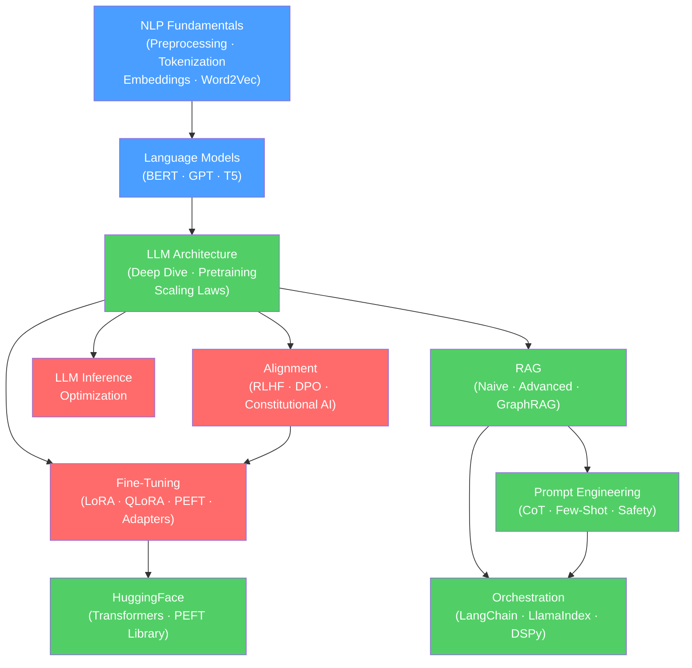

# 🗺️ NLP — Map of Content

> [!info] How to use this map
> Start with Fundamentals, follow the arrows, and use the Learning Path below as your guide.
> Each node links to a full note. Come back here when you feel lost.

---

## Concept Map

*(Blue = fundamental, Green = intermediate, Red = advanced)*

---

## Learning Path

1. [[Text_Preprocessing]] — cleaning, normalization, and pipeline setup; stemming vs lemmatization; why heavy preprocessing hurts transformer models.
2. [[Tokenization]] — splitting text into model-ready units; word, character, and subword tokenization; the token is the atom of NLP.
3. [[Tokenization_Algorithms]] — BPE, WordPiece, SentencePiece; how modern tokenizers build vocabularies and handle out-of-vocabulary words.
4. [[Word_Embeddings]] — distributed vector representations; semantic similarity via cosine distance; the revolution that started modern NLP.
5. [[Word2Vec]] — skip-gram and CBOW training objectives; negative sampling; the first practical large-scale word embedding model.
6. [[Sequence_Labeling]] — NER, POS tagging, chunking; structured prediction where every token gets a label.
7. [[Language_Model_Basics]] — n-gram models, perplexity, pretraining objectives; what it means for a model to "know" language.
8. [[BERT]] — encoder-only transformer; masked language modeling; bidirectional context; foundation of NLU fine-tuning.
9. [[GPT_Family]] — decoder-only transformer; autoregressive language modeling; GPT-2 through GPT-4; in-context learning emerges.
10. [[T5_and_Encoder_Decoder]] — text-to-text framework; encoder-decoder architecture; unified approach to NLP tasks via seq2seq.
11. [[LLM_Architecture_Deep_Dive]] — scaling to billions of parameters; KV cache, grouped query attention, MoE layers, context window tricks.
12. [[Pretraining]] — data curation (The Pile, C4), pretraining objectives, compute requirements; what it takes to train a foundation model.
13. [[Scaling_Laws]] — Chinchilla laws; compute-optimal allocation between model size and tokens; why more data is often better than bigger models.
14. [[Instruction_Tuning]] — supervised fine-tuning (SFT) on instruction-following data; how LLMs learn to be helpful assistants.
15. [[RLHF]] — reward model, PPO, KL penalty; aligning LLMs to human preferences through reinforcement learning.
16. [[DPO]] — direct preference optimization; simpler and more stable than RLHF; eliminates the explicit reward model.
17. [[Constitutional_AI]] — AI feedback as a scalable oversight mechanism; critique and revision loops.
18. [[Full_Fine_Tuning]] — update all model weights; highest expressiveness but requires full GPU memory; when to use it.
19. [[LoRA]] — low-rank updates to weight matrices; train a fraction of parameters at near full fine-tuning quality.
20. [[QLoRA]] — quantize the base model to 4-bit, then apply LoRA; fine-tune 70B+ models on consumer hardware.
21. [[PEFT]] — the umbrella library for parameter-efficient methods; LoRA, prefix tuning, prompt tuning, IA3.
22. [[Adapters]] — small bottleneck layers inserted between transformer blocks; the original PEFT approach.
23. [[LLM_Inference_Optimization]] — KV cache, continuous batching, PagedAttention (vLLM), speculative decoding, quantization (GPTQ/AWQ/GGUF).
24. [[RAG_Overview]] — retrieval-augmented generation; when and why to retrieve instead of rely on parametric knowledge.
25. [[Naive_RAG]] — basic RAG pipeline: chunk → embed → store → retrieve → generate; baseline implementation.
26. [[Advanced_RAG]] — query rewriting, hypothetical document embeddings, re-ranking, hybrid search; improving over naive RAG.
27. [[RAG_Evaluation]] — RAGAS framework; faithfulness, context relevance, answer relevance; how to measure RAG quality.
28. [[GraphRAG]] — knowledge graph-enhanced retrieval; structured reasoning over entity relationships.
29. [[Prompt_Engineering_Basics]] — system vs user prompts, few-shot examples, prompt structure; the craft of talking to LLMs.
30. [[Zero_Shot_and_Few_Shot]] — prompting without examples vs. with in-context demonstrations; when each approach works.
31. [[Chain_of_Thought]] — elicit step-by-step reasoning; emergent at ~100B parameters; zero-shot CoT ("think step by step").
32. [[Structured_Output]] — JSON mode, function calling, output parsers; getting reliable structured data from LLMs.
33. [[Prompt_Injection_and_Safety]] — attack vectors (direct, indirect), defense strategies, jailbreaks, guardrails.
34. [[HuggingFace_Transformers]] — `pipeline`, `AutoModel`, `Trainer`; the standard library for loading and running any transformer model.
35. [[HuggingFace_PEFT_Library]] — `PeftModel`, `LoraConfig`, `get_peft_model`; applying LoRA/QLoRA in 10 lines of code.
36. [[LangChain]] — chains, agents, tools, memory, callbacks; LLM orchestration framework for complex applications.
37. [[LlamaIndex]] — document indexing, vector stores, query engines, RAG pipelines; the leading RAG framework.
38. [[DSPy]] — declarative LLM programming; automatic prompt and weight optimization; compiles prompts instead of writing them.

---

## All Notes in This Section

### Fundamentals

| Note | Core Idea | Difficulty |
|------|-----------|------------|
| [[Text_Preprocessing]] | Cleaning, normalization, stopwords, stemming/lemmatization; the NLP mise en place | Beginner |
| [[Tokenization]] | Splitting text into units; word vs subword; vocabulary trade-offs | Beginner |
| [[Tokenization_Algorithms]] | BPE, WordPiece, SentencePiece; data-driven vocabulary construction | Intermediate |
| [[Word_Embeddings]] | Dense vector representations; semantic similarity via cosine; embedding space geometry | Beginner |
| [[Word2Vec]] | Skip-gram/CBOW with negative sampling; the original neural word embeddings | Intermediate |
| [[Sequence_Labeling]] | Per-token prediction: NER, POS, chunking; CRF and BiLSTM-CRF approaches | Intermediate |

### Language Models

| Note | Core Idea | Difficulty |
|------|-----------|------------|
| [[Language_Model_Basics]] | N-gram models, perplexity, pretraining objectives; what language modeling means | Beginner |
| [[BERT]] | Encoder-only; masked LM + NSP pretraining; bidirectional context; NLU champion | Intermediate |
| [[GPT_Family]] | Decoder-only; causal LM; GPT-1 → GPT-4; emergent in-context learning at scale | Intermediate |
| [[T5_and_Encoder_Decoder]] | Text-to-text; encoder-decoder; unifies classification, translation, summarization | Intermediate |
| [[Tokenization_Algorithms]] | BPE, WordPiece, Unigram LM — how model vocabularies are learned from data | Intermediate |

### LLMs

| Note | Core Idea | Difficulty |
|------|-----------|------------|
| [[LLM_Architecture_Deep_Dive]] | GQA, MoE, RoPE, Flash Attention, context window — engineering modern LLMs | Advanced |
| [[Pretraining]] | Data curation, training objectives, compute budgets — building a foundation model | Advanced |
| [[Scaling_Laws]] | Loss scales predictably with compute; Chinchilla-optimal: more data, smaller model | Advanced |
| [[Instruction_Tuning]] | SFT on instruction datasets; how base models become helpful assistants | Intermediate |
| [[RLHF]] | Reward model + PPO; aligning LLMs to human preferences via RL | Advanced |
| [[DPO]] | Direct preference optimization; no RL, no reward model; simpler alignment | Advanced |
| [[Constitutional_AI]] | AI-generated critique and revision; scalable oversight without human labels | Advanced |
| [[LLM_Inference_Optimization]] | KV cache, continuous batching, vLLM, speculative decoding, quantization | Advanced |

### Fine-Tuning

| Note | Core Idea | Difficulty |
|------|-----------|------------|
| [[Full_Fine_Tuning]] | Update all weights; full GPU memory required; best expressiveness for data-rich tasks | Intermediate |
| [[LoRA]] | Low-rank decomposition of weight updates; train ~1% of parameters, near full performance | Intermediate |
| [[QLoRA]] | 4-bit quantized base + LoRA adapters; fine-tune 70B models on a single GPU | Advanced |
| [[PEFT]] | Umbrella library for LoRA, prefix tuning, prompt tuning, IA3, adapters | Intermediate |
| [[Adapters]] | Bottleneck MLP layers inserted between transformer blocks; the original PEFT approach | Intermediate |

### RAG

| Note | Core Idea | Difficulty |
|------|-----------|------------|
| [[RAG_Overview]] | Retrieve relevant docs + inject into prompt; reduces hallucination, enables live knowledge | Intermediate |
| [[Naive_RAG]] | Chunk → embed → store → retrieve → generate; baseline pipeline in ~50 lines | Intermediate |
| [[Advanced_RAG]] | Query rewriting, HyDE, re-ranking, hybrid search, multi-hop retrieval | Advanced |
| [[RAG_Evaluation]] | RAGAS: faithfulness, context recall, answer relevance — measuring RAG system quality | Advanced |
| [[GraphRAG]] | Extract entities/relations → build KG → retrieve via graph traversal; better for multi-hop QA | Advanced |

### Prompt Engineering

| Note | Core Idea | Difficulty |
|------|-----------|------------|
| [[Prompt_Engineering_Basics]] | System/user turns, formatting, persona, constraints, prompt structure best practices | Beginner |
| [[Zero_Shot_and_Few_Shot]] | Zero-shot: task description only; few-shot: provide examples in context | Beginner |
| [[Chain_of_Thought]] | "Think step by step"; elicits intermediate reasoning; emergent at ~100B scale | Intermediate |
| [[Structured_Output]] | JSON mode, function calling, Pydantic schemas, output parsers | Intermediate |
| [[Prompt_Injection_and_Safety]] | Direct/indirect injection attacks, jailbreaks, input/output guardrails | Advanced |

### Frameworks

| Note | Core Idea | Difficulty |
|------|-----------|------------|
| [[HuggingFace_Transformers]] | `pipeline`, `AutoModel`, `AutoTokenizer`, `Trainer`; the universal transformer library | Beginner |
| [[HuggingFace_PEFT_Library]] | `PeftModel`, `LoraConfig`, `get_peft_model`; applying PEFT methods in code | Intermediate |
| [[LangChain]] | Chains, agents, tools, memory, LCEL; orchestrate LLMs into complex workflows | Intermediate |
| [[LlamaIndex]] | Document indexing, vector store integration, RAG pipelines, query engines | Intermediate |
| [[DSPy]] | Declarative LLM programming; automatic prompt compilation and weight optimization | Advanced |

---

## Key Questions This Section Answers

- What is the fundamental difference between BERT (encoder-only) and GPT (decoder-only), and when do you use each?
- Why is LoRA more parameter-efficient than full fine-tuning, and what does it actually change in the weight matrices?
- When should you use RAG vs fine-tuning to adapt an LLM to a new task or knowledge domain?
- How does RLHF align language models with human preferences, and what are its failure modes?
- What are the key differences between Naive RAG and Advanced RAG, and what problems does Advanced RAG solve?
- How does Chain-of-Thought prompting improve reasoning, and why does it only emerge at large scale?
- What are the main bottlenecks in LLM inference, and how do KV caching and continuous batching address them?

---

## Connections to Other Sections

- [[_MOC_Deep_Learning]] — all modern NLP models are Transformer-based; understanding the Transformer Architecture, Attention Mechanism, and training dynamics from the Deep Learning section is a prerequisite
- [[_MOC_Generative_AI]] — fine-tuned LLMs, RAG systems, and instruction-tuned models are the foundation of all generative AI applications (agents, copilots, chatbots)
- [[_MOC_MLOps]] — deploying fine-tuned models and RAG systems requires model serving, monitoring, evaluation pipelines, and feature store integration covered in MLOps

---

#MOC #AI-ML #NLP
