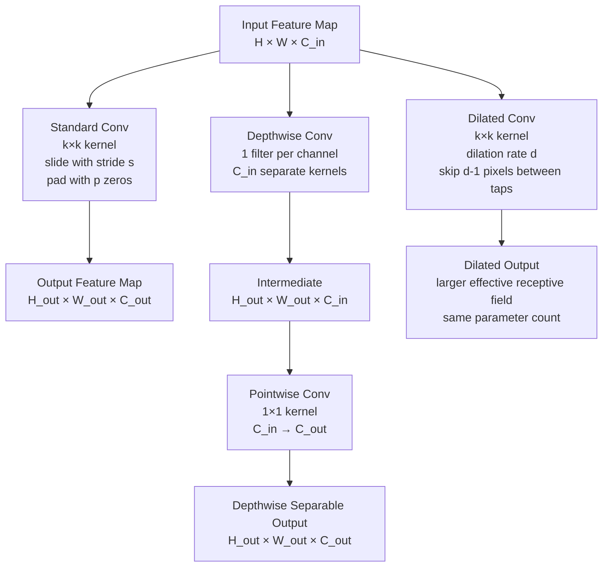

# 🔲 Convolutional Operations

> [!abstract] TL;DR
> Convolutions detect local patterns by sliding a small learnable kernel across an image. Key variants: standard (spatial feature extraction), depthwise separable (fewer params, MobileNet trick), dilated/atrous (larger receptive field without more parameters), 1×1 (channel mixing), transposed (upsampling for segmentation). Output size: `(H + 2p - k) / s + 1`.

## Intuition — Analogy First

Imagine holding a **flashlight in a dark room**. You can only see the small patch of floor your flashlight illuminates at any moment. As you slide the flashlight across the room, you build up a mental map of the entire floor — noticing where the edges of furniture are, where the carpet pattern changes, where light reflects off a surface.

A convolutional kernel is that flashlight. It's a small detector (say 3×3 pixels) that slides across the entire image, responding strongly where its particular pattern (horizontal edge, diagonal line, color gradient) matches the local pixels. Stack many such kernels, and the network builds increasingly complex feature detectors — edges → shapes → parts → objects.

## How It Works — Mechanics



**Standard 2D Convolution** — Slides a `k×k` kernel over the spatial dimensions, computing a dot product at each position. Multiple kernels (filters) produce multiple output channels.

**Padding types:**
- `padding=0` ("valid") — output shrinks: no zeros added around edges
- `padding=k//2` ("same") — output same size as input; standard default
- `padding='same'` — PyTorch handles it automatically since 1.9

**Stride** — Step size of the sliding. `stride=1` moves one pixel at a time; `stride=2` downsamples by 2× spatially and replaces max-pooling in modern nets.

**Depthwise Separable Convolution (MobileNet trick):**
1. **Depthwise**: One `k×k` kernel per input channel — spatial mixing only
2. **Pointwise**: A `1×1` conv mixes channels — cross-channel mixing only

This factorization achieves similar representational power at ~8–9× fewer parameters and operations for `k=3, C=256`.

**Dilated (Atrous) Convolution** — Inserts zeros between kernel taps, creating gaps. A `3×3` kernel with dilation=2 sees a `5×5` area; with dilation=4 it sees `9×9`. The receptive field grows exponentially with stacked dilated convs (rates: 1, 2, 4, 8), critical for semantic segmentation (need large context without spatial resolution loss).

**1×1 Convolution** — A `1×1×C_in` kernel operates across channels at each pixel. Used to: reduce channel count (bottleneck), mix information across channels, apply a per-pixel MLP. Introduced in NIN (Network in Network), popularized by GoogLeNet/Inception.

**Transposed Convolution (deconvolution)** — Learned upsampling. Inserts stride-1 zeros between input pixels then applies a standard conv — effectively "spreads" each input value. Used in segmentation decoders, GANs, and VAEs. Note: causes checkerboard artifacts; often replaced by bilinear upsample + conv.

## The Math

**Output spatial dimensions:**
$$H_{out} = \left\lfloor \frac{H_{in} + 2p - d(k-1) - 1}{s} \right\rfloor + 1$$

$$W_{out} = \left\lfloor \frac{W_{in} + 2p - d(k-1) - 1}{s} \right\rfloor + 1$$

Where: $H_{in}$ = input height, $p$ = padding, $d$ = dilation rate (1 = standard), $k$ = kernel size, $s$ = stride.

**Standard conv parameter count:**
$$\text{params} = k^2 \times C_{in} \times C_{out} + C_{out} \quad \text{(+ bias)}$$

**Depthwise separable parameter count:**
$$\text{params}_{DW} = k^2 \times C_{in} + C_{in} \times C_{out}$$

**Reduction ratio** (k=3):
$$\frac{k^2 C_{in} C_{out}}{k^2 C_{in} + C_{in} C_{out}} = \frac{1}{C_{out}/k^2 + 1/k^2} \approx \frac{1}{8} \text{ for } C_{out} \gg 1$$

**Dilated conv effective receptive field** (kernel k, dilation d):
$$\text{effective kernel size} = d(k - 1) + 1$$

For d=4, k=3: effective size = $4 \times 2 + 1 = 9$

## Code Demo

```python
import torch
import torch.nn as nn
import torch.nn.functional as F

# --- Standard 2D convolution ---
conv_standard = nn.Conv2d(
    in_channels=3,
    out_channels=64,
    kernel_size=3,
    stride=1,
    padding=1,     # "same" padding for k=3
    bias=True
)
x = torch.randn(1, 3, 224, 224)
out = conv_standard(x)   # [1, 64, 224, 224]
print(f"Standard conv output: {out.shape}")
print(f"Parameters: {sum(p.numel() for p in conv_standard.parameters())}")
# 3*3*3*64 + 64 = 1792

# --- Depthwise separable convolution ---
class DepthwiseSeparableConv(nn.Module):
    def __init__(self, in_ch, out_ch, stride=1):
        super().__init__()
        self.depthwise = nn.Conv2d(
            in_ch, in_ch, kernel_size=3, stride=stride,
            padding=1, groups=in_ch, bias=False   # groups=in_ch → depthwise
        )
        self.pointwise = nn.Conv2d(in_ch, out_ch, kernel_size=1, bias=False)
        self.bn1 = nn.BatchNorm2d(in_ch)
        self.bn2 = nn.BatchNorm2d(out_ch)

    def forward(self, x):
        x = F.relu(self.bn1(self.depthwise(x)))
        x = F.relu(self.bn2(self.pointwise(x)))
        return x

dw_sep = DepthwiseSeparableConv(64, 128)
out_dw = dw_sep(torch.randn(1, 64, 56, 56))
print(f"Depthwise sep output: {out_dw.shape}")  # [1, 128, 56, 56]

# Compare parameter counts
standard = nn.Conv2d(64, 128, 3, padding=1)
print(f"Standard params: {sum(p.numel() for p in standard.parameters())}")
print(f"DW-sep params: {sum(p.numel() for p in dw_sep.parameters())}")

# --- Dilated convolution ---
# dilation=1: normal conv (3×3 sees 3×3)
# dilation=2: 3×3 kernel sees 5×5 area
# dilation=4: 3×3 kernel sees 9×9 area
dilated_convs = nn.Sequential(
    nn.Conv2d(64, 64, kernel_size=3, padding=1, dilation=1),   # receptive field += 3
    nn.ReLU(),
    nn.Conv2d(64, 64, kernel_size=3, padding=2, dilation=2),   # += 5
    nn.ReLU(),
    nn.Conv2d(64, 64, kernel_size=3, padding=4, dilation=4),   # += 9
    nn.ReLU(),
)
# With 3 stacked: total receptive field = 3+4+8 = 15, but params same as 3 standard convs

feat = torch.randn(1, 64, 64, 64)
out_dilated = dilated_convs(feat)
print(f"Dilated conv output: {out_dilated.shape}")  # same spatial size

# --- 1×1 convolution (channel mixing / bottleneck) ---
# Reduce 256 channels to 64 (bottleneck)
bottleneck = nn.Conv2d(256, 64, kernel_size=1, bias=False)
# Expand back to 256
expand = nn.Conv2d(64, 256, kernel_size=1, bias=False)

# --- Transposed convolution (upsampling) ---
# Doubles spatial resolution
upsample_conv = nn.ConvTranspose2d(
    in_channels=64,
    out_channels=32,
    kernel_size=2,
    stride=2   # output_size = input_size * stride
)
small = torch.randn(1, 64, 28, 28)
upsampled = upsample_conv(small)
print(f"Transposed conv output: {upsampled.shape}")  # [1, 32, 56, 56]

# Better alternative to transposed conv (avoids checkerboard artifacts)
upsample_clean = nn.Sequential(
    nn.Upsample(scale_factor=2, mode='bilinear', align_corners=False),
    nn.Conv2d(64, 32, kernel_size=3, padding=1),
)

# --- Low-level F.conv2d for custom kernels ---
# Manual edge detection kernel (Sobel)
sobel_x = torch.tensor([[-1, 0, 1], [-2, 0, 2], [-1, 0, 1]], dtype=torch.float32)
sobel_x = sobel_x.view(1, 1, 3, 3)  # [out_ch, in_ch, H, W]
gray = torch.randn(1, 1, 64, 64)
edges = F.conv2d(gray, sobel_x, padding=1)
print(f"Sobel edge output: {edges.shape}")
```

## Real-World Example

**DeepLab (Google)** uses atrous/dilated convolutions for semantic segmentation. The challenge: segmentation needs to classify every pixel at full resolution, but standard convs with pooling reduce spatial resolution. Dilated convs with rates [6, 12, 18, 24] (ASPP module) maintain full resolution while capturing multi-scale context — a car is large, a traffic sign is small, both need different receptive fields. This is why DeepLab achieves state-of-the-art mIoU on Cityscapes.

**MobileNet (Google)** pioneered depthwise separable convolutions for mobile deployment. MobileNetV1 achieves 70.6% ImageNet top-1 with 4.2M parameters (vs ResNet-50's 25.5M), making it fast enough for real-time inference on smartphones at the time.

## Trade-offs

| Operation | Parameters | FLOPs | Receptive Field | Best Use Case |
|---|---|---|---|---|
| Standard Conv k=3 | $9 \cdot C_{in} \cdot C_{out}$ | High | Local | General feature extraction |
| Depthwise Separable | ~8× fewer | ~8× fewer | Local | Mobile/edge deployment |
| Dilated Conv d=2 | Same as standard | Same | 2× larger | Segmentation, large context |
| 1×1 Conv | $C_{in} \cdot C_{out}$ | Very low | 1 pixel | Channel mixing, bottleneck |
| Transposed Conv | Same as standard | Medium | N/A | Upsampling in decoder |
| Bilinear + Conv | Standard | Medium | N/A | Upsampling (no artifacts) |

## When to Use vs Avoid

**Use depthwise separable when:** deploying on mobile/edge (MobileNet, EfficientNet), parameter budget is tight, or you want fast inference.

**Use dilated convolutions when:** segmentation tasks requiring large receptive field at full resolution; avoid for classification where pooling is fine.

**Use 1×1 convolutions when:** building bottleneck blocks (ResNet, Inception), reducing channel count before expensive ops, mixing cross-channel information.

**Avoid transposed convolutions when:** you see checkerboard artifacts in generated images; use bilinear upsample + conv instead.

**Avoid very large kernels** (k=7, k=11) in deep parts of networks — parameters scale quadratically. Use instead: stacked 3×3 convs or dilated convs.

## Common Pitfalls

1. **Padding/size mismatch with dilated convs** — For `dilation=d` and `kernel_size=k`, the required padding to maintain spatial size is `padding = d * (k-1) // 2`. Forgetting this causes unexpected spatial shrinkage.

2. **groups parameter confusion** — `groups=in_channels` gives depthwise conv; `groups=1` is standard. `groups=C` and `out_channels != in_channels` requires pointwise conv to follow.

3. **Checkerboard artifacts from transposed convolutions** — When `kernel_size` is not divisible by `stride`, upsampling creates uneven coverage. Fix: use `kernel_size=2, stride=2` (no overlap) or bilinear upsample + conv.

4. **Forgetting bias=False before BatchNorm** — BatchNorm has its own learnable shift (`beta`). Adding a conv bias before BN wastes parameters and is overridden anyway.

5. **Wrong output size calculation with dilation** — The standard formula `(H+2p-k)/s + 1` doesn't account for dilation. Use the full formula: `(H + 2p - d*(k-1) - 1) / s + 1`.

## Related Concepts

- [[_MOC_Computer_Vision|↑ Section MOC]]

- [[CNN_Fundamentals]] — full architecture context using these operations
- [[Famous_CNN_Architectures]] — ResNet, MobileNet, EfficientNet using these ops
- [[Semantic_Segmentation]] — primary application of dilated convolutions
- [[Image_Preprocessing]] — what feeds into the conv layer
- [[Batch_Normalization]] — always follows conv in modern architectures

## Review Questions

1. A 3×3 conv with dilation=4 has the same number of parameters as a standard 3×3 conv, but what is its effective receptive field size, and why does this matter for segmentation?

2. You replace a `Conv2d(256, 256, 3)` with a depthwise separable equivalent. Calculate the parameter reduction ratio. Why might the model's accuracy drop slightly?

3. You use `ConvTranspose2d(64, 32, kernel_size=3, stride=2)` for upsampling in a U-Net decoder. The output shows checkerboard patterns. What causes this and what is the recommended fix?

## Sources

- [A guide to convolution arithmetic](https://arxiv.org/abs/1603.07285) — Dumoulin & Visin
- [MobileNets (Howard et al., 2017)](https://arxiv.org/abs/1704.04861) — depthwise separable convs
- [DeepLab v3 (Chen et al., 2017)](https://arxiv.org/abs/1706.05587) — dilated/atrous convolutions
- [Distill.pub: Conv arithmetic visualizations](https://distill.pub/2016/deconv-checkerboard/)

#computer-vision #convolution #depthwise-separable #dilated-convolution #fundamentals
