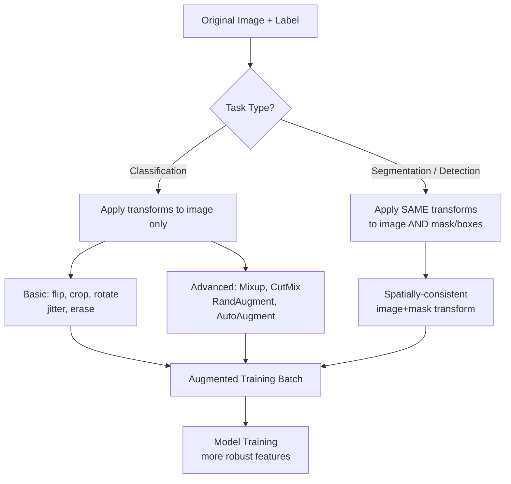

# 🎨 Data Augmentation for Computer Vision

> [!abstract] TL;DR
> Data augmentation artificially expands training diversity by applying label-preserving transformations to images. Basic ops (flip, crop, jitter) prevent overfitting. Advanced techniques (CutMix, Mixup, RandAugment) provide more regularization and are behind many ImageNet SOTA improvements. Segmentation augmentations must always transform the mask identically to the image.

## Intuition — Analogy First

Think about **training a photographer to recognize a golden retriever**. If you only show them photos of golden retrievers in bright sunlight facing right, they'll fail to identify the same dog in dim light, from behind, or mid-run. But if you show them the same dog in different lighting, angles, and weather conditions — the photographer learns the *essential features* (fur texture, body shape, ear shape), not just memorized conditions.

Data augmentation does this programmatically. You have one photo of a cat. You can flip it horizontally, darken it, crop a portion, rotate it slightly — each transformation produces a new training example that teaches the model to be invariant to those conditions. The label stays the same ("cat"), but the pixel pattern is different.

## How It Works — Mechanics



**Basic augmentations (always safe):**
- `RandomHorizontalFlip(p=0.5)` — works for most scenes; avoid for text, OCR, specific orientations
- `RandomCrop(size)` / `RandomResizedCrop(224)` — teaches translation invariance
- `ColorJitter(brightness, contrast, saturation, hue)` — color/lighting invariance
- `RandomRotation(degrees)` — rotation invariance; mild for upright objects
- `GaussianBlur` — blur invariance; simulates defocus

**Advanced augmentations:**

**Mixup** — Blends two images and labels linearly:
- $\tilde{x} = \lambda x_i + (1-\lambda) x_j$, $\tilde{y} = \lambda y_i + (1-\lambda) y_j$
- Creates "ghost images"; soft labels improve calibration

**CutMix** — Cuts a rectangular patch from one image and pastes into another; labels are mixed proportionally to pixel area. Better than Mixup for localization tasks.

**AutoAugment** — Learns optimal augmentation policies via reinforcement learning on a proxy task. Policies are transferable (ImageNet policy works for other datasets).

**RandAugment** — Simpler than AutoAugment: uniformly sample `N` operations from a fixed set, apply with magnitude `M`. Only 2 hyperparameters; near-SOTA performance.

**Test-Time Augmentation (TTA)** — At inference, apply multiple augmentations (flip, multi-scale), average predictions. Free accuracy boost; increases inference time linearly.

## The Math

**Mixup interpolation:**
$$\tilde{x} = \lambda x_i + (1-\lambda) x_j, \quad \lambda \sim \text{Beta}(\alpha, \alpha), \quad \alpha \in [0.1, 0.4]$$

**CutMix area mixing ratio:**
$$\lambda = 1 - \frac{r_W \cdot r_H}{W \cdot H}, \quad r_W, r_H \sim \text{Uniform based on } \text{Beta}(\alpha, \alpha)$$

Soft label for CutMix:
$$\tilde{y} = \lambda y_i + (1-\lambda) y_j$$

**RandAugment** — sample $N$ ops from $\mathcal{K}$ operations, apply with magnitude $M \in [0, 10]$:
$$\text{Total search space}: |\mathcal{K}|^N \times M \rightarrow \text{reduced to just } (N, M)$$

## Code Demo

```python
import torch
import numpy as np
from torchvision import transforms
from PIL import Image
import albumentations as A
from albumentations.pytorch import ToTensorV2

# --- Standard torchvision augmentation pipeline ---
train_transform = transforms.Compose([
    transforms.RandomResizedCrop(224, scale=(0.08, 1.0)),   # simulate crop/zoom
    transforms.RandomHorizontalFlip(p=0.5),
    transforms.ColorJitter(brightness=0.4, contrast=0.4, saturation=0.4, hue=0.1),
    transforms.RandomGrayscale(p=0.2),
    transforms.GaussianBlur(kernel_size=21, sigma=(0.1, 2.0)),
    transforms.ToTensor(),
    transforms.Normalize(mean=[0.485, 0.456, 0.406], std=[0.229, 0.224, 0.225]),
])

# RandAugment (torchvision built-in since 0.11)
rand_aug_transform = transforms.Compose([
    transforms.RandAugment(num_ops=2, magnitude=9),   # N=2, M=9 default
    transforms.ToTensor(),
    transforms.Normalize(mean=[0.485, 0.456, 0.406], std=[0.229, 0.224, 0.225]),
])

# --- Albumentations pipeline (faster, richer) ---
albu_train = A.Compose([
    A.RandomResizedCrop(height=224, width=224, scale=(0.08, 1.0)),
    A.HorizontalFlip(p=0.5),
    A.ColorJitter(brightness=0.4, contrast=0.4, saturation=0.4, hue=0.1, p=0.8),
    A.GaussianBlur(blur_limit=(3, 7), p=0.2),
    A.GridDistortion(p=0.1),        # geometric distortion
    A.CoarseDropout(max_holes=8, max_height=32, max_width=32, p=0.2),  # RandomErasing equivalent
    A.Normalize(mean=[0.485, 0.456, 0.406], std=[0.229, 0.224, 0.225]),
    ToTensorV2(),
])

# For segmentation — Albumentations applies same transform to image AND mask
albu_seg = A.Compose([
    A.RandomResizedCrop(height=512, width=512),
    A.HorizontalFlip(p=0.5),
    A.RandomRotate90(p=0.5),
    A.ElasticTransform(p=0.3),     # elastic deformations for medical images
    A.Normalize(mean=[0.485, 0.456, 0.406], std=[0.229, 0.224, 0.225]),
    ToTensorV2(),
])

import numpy as np
img = np.array(Image.open("image.jpg"))         # HWC uint8
mask = np.array(Image.open("mask.png"))         # HWC uint8
augmented = albu_seg(image=img, mask=mask)       # BOTH transformed identically
aug_img, aug_mask = augmented["image"], augmented["mask"]

# --- Mixup implementation ---
def mixup_data(x, y, alpha=0.4):
    """Returns mixed inputs, pairs of targets, and mixing lambda."""
    if alpha > 0:
        lam = np.random.beta(alpha, alpha)
    else:
        lam = 1.0
    batch_size = x.size(0)
    index = torch.randperm(batch_size)    # random permutation for pairs
    mixed_x = lam * x + (1 - lam) * x[index]
    y_a, y_b = y, y[index]
    return mixed_x, y_a, y_b, lam

def mixup_criterion(criterion, pred, y_a, y_b, lam):
    return lam * criterion(pred, y_a) + (1 - lam) * criterion(pred, y_b)

# Usage in training loop:
# mixed_x, y_a, y_b, lam = mixup_data(images, labels, alpha=0.4)
# outputs = model(mixed_x)
# loss = mixup_criterion(F.cross_entropy, outputs, y_a, y_b, lam)

# --- CutMix implementation ---
def cutmix_data(x, y, alpha=1.0):
    lam = np.random.beta(alpha, alpha)
    batch_size, _, H, W = x.size()
    index = torch.randperm(batch_size)

    # Sample box
    cut_rat = np.sqrt(1. - lam)
    cut_w, cut_h = int(W * cut_rat), int(H * cut_rat)
    cx, cy = np.random.randint(W), np.random.randint(H)
    x1, x2 = max(cx - cut_w // 2, 0), min(cx + cut_w // 2, W)
    y1, y2 = max(cy - cut_h // 2, 0), min(cy + cut_h // 2, H)

    mixed_x = x.clone()
    mixed_x[:, :, y1:y2, x1:x2] = x[index, :, y1:y2, x1:x2]
    lam = 1 - (x2 - x1) * (y2 - y1) / (W * H)   # recompute exact lambda
    return mixed_x, y, y[index], lam

# --- Test-Time Augmentation (TTA) ---
def predict_with_tta(model, image_tensor, n_augments=5):
    model.eval()
    preds = []
    # Original
    preds.append(torch.softmax(model(image_tensor.unsqueeze(0)), dim=1))
    # Horizontal flip
    preds.append(torch.softmax(model(torch.flip(image_tensor, dims=[2]).unsqueeze(0)), dim=1))
    # Average all predictions
    return torch.stack(preds).mean(0)
```

## Real-World Example

**ImageNet top-1 accuracy progression** — The jump from ResNet-50's 76% (2015) to EfficientNet's 85% (2020) was not just architecture: a large fraction came from better augmentation. AutoAugment (2018) added ~1.5% top-1; CutMix and RandAugment added another ~1-2%. The ViT paper showed that with strong augmentation (RandAugment + CutMix + Mixup + label smoothing), even smaller ViT models match or beat CNNs on ImageNet.

In medical imaging (chest X-ray classification), augmentation is especially critical because labeled medical data is scarce. Elastic transforms, random brightness/contrast shifts, and horizontal flips can effectively 10× the training set.

## Trade-offs

| Augmentation | Strength | Training Cost | Best For |
|---|---|---|---|
| Random Flip + Crop | Low-medium | Negligible | Always use as baseline |
| Color Jitter | Medium | Negligible | Color-sensitive tasks |
| RandAugment | High | Minimal | Classification, modern default |
| AutoAugment | High | High (policy search) | When you can afford search |
| Mixup | High | Negligible | Classification, calibration |
| CutMix | Very high | Negligible | Classification + localization |
| Mixup + CutMix | Very high | Negligible | Current best practice |
| TTA | Free at inference | Inference time × N | High-stakes inference |
| Albumentations | Flexible | Faster than torchvision | All CV tasks |

## When to Use vs Avoid

**Always use:** horizontal flip (unless orientation matters), random crop, normalization.

**Use Mixup/CutMix when:** training classification models; they also improve calibration (confidence closer to accuracy).

**Avoid strong geometric augmentations when:** task is sensitive to orientation (satellite image with directional roads, medical scans where orientation carries diagnostic info).

**Avoid color augmentations when:** color IS the signal (skin lesion color, traffic light color).

**Use segmentation-aware augmentations when:** any task with masks — Albumentations `A.Compose` handles image+mask+bbox jointly.

## Common Pitfalls

1. **Augmenting mask separately from image** — Using `torchvision` transforms on image then a different call on mask will give different random crops/rotations. Use Albumentations or explicitly pass the same random state to both transforms.

2. **Applying Mixup after normalization** — Mixup on normalized tensors is fine. But CutMix applied to raw uint8 then normalized can cause subtle numerical issues. Apply augmentations in transform order: raw → basic augs → ToTensor → Normalize → Mixup/CutMix.

3. **Over-augmenting small datasets** — Very strong augmentation (elastic transforms, heavy color jitter) on tiny datasets can make the task harder than the actual test distribution. Start mild.

4. **Using AutoAugment with wrong dataset** — AutoAugment ImageNet policies include operations like Equalize and Posterize that hurt on medical images. Use a dataset-appropriate policy or RandAugment.

5. **TTA in batch norm with train mode** — If you call `model.train()` during TTA, batch norm statistics vary across TTA augmentations. Always use `model.eval()` for inference.

6. **Forgetting to adjust bounding boxes** — For object detection augmentation, the bounding box coordinates must transform along with the image. Albumentations `A.Compose(bbox_params=A.BboxParams(...))` handles this.

## Related Concepts

- [[_MOC_Computer_Vision|↑ Section MOC]]

- [[Image_Preprocessing]] — augmentation builds on top of preprocessing
- [[Image_Classification]] — primary beneficiary of augmentation
- [[Regularization]] — augmentation is a form of implicit regularization
- [[Semantic_Segmentation]] — requires joint image+mask augmentation
- [[Object_Detection]] — requires joint image+bounding box augmentation

## Review Questions

1. You're training a semantic segmentation model. You apply `RandomHorizontalFlip` to images via torchvision but forget to apply the same flip to masks. What exactly goes wrong at training time?

2. Explain the conceptual difference between Mixup and CutMix. When would CutMix outperform Mixup?

3. You run TTA at inference using 8 augmented versions of each image and average softmax probabilities. How does this improve accuracy and what is the cost?

## Sources

- [RandAugment (Cubuk et al., 2019)](https://arxiv.org/abs/1909.13719)
- [CutMix (Yun et al., 2019)](https://arxiv.org/abs/1905.04899)
- [Mixup (Zhang et al., 2017)](https://arxiv.org/abs/1710.09412)
- [AutoAugment (Cubuk et al., 2018)](https://arxiv.org/abs/1805.09501)
- [Albumentations library](https://albumentations.ai/)

#computer-vision #augmentation #mixup #cutmix #randaugment #regularization
