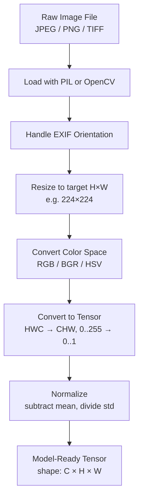

# 📸 Image Preprocessing

> [!abstract] TL;DR
> Image preprocessing standardizes raw pixel data into a form that deep learning models can consume reliably. The key steps are resize, normalize, convert color space, and tensorize. All pretrained PyTorch vision models expect ImageNet normalization: `mean=[0.485, 0.456, 0.406]`, `std=[0.229, 0.224, 0.225]`.

## Intuition — Analogy First

Think of preprocessing like **preparing film for a camera**. A raw piece of photographic film must be cut to the right size, treated for the correct exposure sensitivity, and loaded in the right orientation before it can capture a sharp image. If you skip any step, the resulting photo is blurry, over-exposed, or simply won't develop.

Raw images are messy: they arrive as JPEGs, PNGs, or TIFFs with varying sizes, color formats, and pixel ranges. A neural network, like a precision camera, needs everything in exact spec before it can "see" anything useful.

## How It Works — Mechanics

The standard preprocessing pipeline takes a raw image file through a deterministic sequence of transformations before it enters the model.



**Key steps explained:**

**Resize** — Neural networks require fixed-size inputs. Common targets: 224×224 (classification), 640×640 (YOLO), 512×512 (segmentation). Two strategies: resize directly, or resize the shorter side then center-crop.

**Color spaces:**
- **RGB** — standard for PIL and torchvision; red, green, blue channels
- **BGR** — OpenCV's default; same channels in reversed order; a common bug when mixing libraries
- **HSV** — hue, saturation, value; useful for color-based filtering since hue is isolated
- **Grayscale** — single channel; used for documents, X-rays, MNIST

**Channel order:**
- **HWC (height, width, channels)** — default for PIL, OpenCV, NumPy
- **CHW (channels, height, width)** — required by PyTorch; `torchvision.transforms.ToTensor()` handles this conversion

**Normalization** — Subtracts the dataset mean and divides by the standard deviation per channel. This centers activations near zero and equalizes channel magnitudes, which improves gradient flow.

ImageNet statistics (used for all pretrained models trained on ImageNet):
- `mean = [0.485, 0.456, 0.406]` (R, G, B)
- `std  = [0.229, 0.224, 0.225]`

**EXIF handling** — Smartphone photos embed rotation metadata in EXIF. PIL's `ImageOps.exif_transpose()` applies this rotation so the actual pixels match the intended orientation. Skipping this causes upside-down or sideways training data.

## The Math

For each channel $c$, each pixel value $x$ is transformed to:

$$\hat{x}_c = \frac{x_c - \mu_c}{\sigma_c}$$

Where:
- $x_c \in [0, 1]$ (after dividing raw uint8 pixel by 255)
- $\mu_c$ is the channel mean (e.g. 0.485 for R)
- $\sigma_c$ is the channel standard deviation (e.g. 0.229 for R)

The resulting $\hat{x}_c$ roughly spans $[-2, +2]$ for natural images.

For resize, the output spatial dimension is:
$$H_{out} = \text{target\_size}, \quad W_{out} = \text{target\_size}$$

With aspect-ratio-preserving resize then crop:
$$H_{resize} = \left\lfloor H_{orig} \times \frac{256}{H_{orig}} \right\rfloor, \quad \text{then center-crop to 224}$$

## Code Demo

```python
import torch
from torchvision import transforms
from PIL import Image, ImageOps
import cv2
import numpy as np

# --- torchvision transforms pipeline (standard pretrained model input) ---
preprocess = transforms.Compose([
    transforms.Resize(256),                    # resize shorter side to 256
    transforms.CenterCrop(224),                # center crop to 224×224
    transforms.ToTensor(),                     # HWC uint8 → CHW float [0,1]
    transforms.Normalize(
        mean=[0.485, 0.456, 0.406],
        std=[0.229, 0.224, 0.225]
    ),
])

# Load image with EXIF orientation handling
img = Image.open("photo.jpg").convert("RGB")
img = ImageOps.exif_transpose(img)            # fix smartphone rotation
tensor = preprocess(img)                       # shape: [3, 224, 224]
batch = tensor.unsqueeze(0)                    # shape: [1, 3, 224, 224]

# --- OpenCV basic ops ---
img_bgr = cv2.imread("photo.jpg")             # loads as BGR HWC uint8
img_rgb = cv2.cvtColor(img_bgr, cv2.COLOR_BGR2RGB)
img_hsv = cv2.cvtColor(img_bgr, cv2.COLOR_BGR2HSV)
img_gray = cv2.cvtColor(img_bgr, cv2.COLOR_BGR2GRAY)
resized = cv2.resize(img_bgr, (224, 224), interpolation=cv2.INTER_LINEAR)

# --- Manual normalization (NumPy) ---
img_float = resized.astype(np.float32) / 255.0         # [0, 1]
mean = np.array([0.485, 0.456, 0.406])
std  = np.array([0.229, 0.224, 0.225])
img_norm = (img_float - mean) / std                    # HWC normalized
img_chw = np.transpose(img_norm, (2, 0, 1))            # CHW for PyTorch
tensor_cv = torch.from_numpy(img_chw).float()

# --- Denormalization (for visualization) ---
def denormalize(tensor, mean=[0.485, 0.456, 0.406], std=[0.229, 0.224, 0.225]):
    """Reverse normalization for display."""
    t = tensor.clone()
    for c, (m, s) in enumerate(zip(mean, std)):
        t[c] = t[c] * s + m
    return t.clamp(0, 1)

# --- Batch preprocessing with DataLoader ---
from torch.utils.data import DataLoader
from torchvision.datasets import ImageFolder

train_transform = transforms.Compose([
    transforms.RandomResizedCrop(224),
    transforms.RandomHorizontalFlip(),
    transforms.ToTensor(),
    transforms.Normalize(mean=[0.485, 0.456, 0.406], std=[0.229, 0.224, 0.225]),
])

dataset = ImageFolder("data/train", transform=train_transform)
loader = DataLoader(dataset, batch_size=32, shuffle=True, num_workers=4)
```

## Real-World Example

**PyTorch Hub pretrained models** enforce ImageNet normalization as a contract. The ResNet-50 checkpoint on `torchvision.models` was trained with pixels normalized to ImageNet statistics. If you feed it raw [0, 255] pixels, the first layer activations explode — the model's weight distributions assume zero-centered unit-scale input. Every serious vision pipeline (YOLO, EfficientNet, ViT) follows this same contract for pretrained weights.

Google's production image pipelines add one more step: **lossless EXIF stripping** before storage, so that inference servers never see malformed orientation metadata.

## Trade-offs

| Approach | Pros | Cons |
|---|---|---|
| torchvision transforms | Simple, integrated with DataLoader | CPU-only, no GPU acceleration |
| Albumentations | Faster (OpenCV backend), richer ops | Separate library, slightly different API |
| NVIDIA DALI | GPU-accelerated decoding, fastest | Complex setup, NVIDIA-only |
| OpenCV | Rich ops, production-tested | BGR gotcha, manual tensor conversion |
| PIL | Simplest API | Slow for large batches |
| On-the-fly normalization | No precomputation | Adds CPU overhead each batch |
| Pre-normalized storage | Fast training | Extra disk space, tied to one normalization |

## When to Use vs Avoid

**Use ImageNet normalization when:**
- Loading any pretrained model from `torchvision.models`, HuggingFace, or timm
- Fine-tuning on a new dataset (keep normalization from source domain)
- Using transfer learning

**Avoid / recalculate normalization when:**
- Training from scratch on a domain-specific dataset (satellite imagery, medical scans)
- Your data distribution is very different from natural images (fluorescence microscopy, radar)
- Single-channel inputs (use per-dataset grayscale statistics)

**Use BGR→RGB conversion always when mixing OpenCV with PyTorch/PIL.**

## Common Pitfalls

1. **BGR/RGB mismatch** — OpenCV reads BGR; torchvision expects RGB. Always `cv2.cvtColor(img, cv2.COLOR_BGR2RGB)` before creating a tensor. Blue and red channels swap silently, causing degraded accuracy.

2. **Forgetting EXIF rotation** — Smartphone photos have EXIF orientation tags. Not calling `ImageOps.exif_transpose()` causes 1-in-4 photos to be rotated, creating training/inference distribution mismatch.

3. **Normalizing twice** — `transforms.ToTensor()` already scales to [0, 1]. If you manually divide by 255 *before* passing to `ToTensor()`, you get [0, ~0.004] instead of [0, 1], then normalization produces wrong statistics.

4. **Wrong normalization at inference** — Training with normalization then doing raw inference produces predictions matching a different distribution. Always apply the same `Normalize` transform at test time.

5. **Integer truncation** — Resize with `PIL` defaults to `BILINEAR`, which is fine. But if you accidentally convert to uint8 after normalization, you lose all decimal precision (normalized values are ~[-2, 2], truncated to 0 or 255).

6. **Resize before or after augmentation** — For segmentation, resize must be applied to both image and mask with identical parameters, including the same random seed for random crops.

## Related Concepts

- [[_MOC_Computer_Vision|↑ Section MOC]]

- [[CNN_Fundamentals]] — why normalized inputs are critical for conv layer training
- [[Data_Augmentation_CV]] — augmentations built on top of preprocessing
- [[Image_Classification]] — the task this pipeline feeds into
- [[Convolutional_Operations]] — what happens to the tensor after preprocessing
- [[Regularization]] — normalization as a form of input regularization

## Review Questions

1. Why do all pretrained PyTorch vision models require `mean=[0.485, 0.456, 0.406]` normalization, and what happens if you skip it at inference time?

2. A model trained with torchvision performs poorly on images loaded with OpenCV. What is the most likely cause and how do you fix it?

3. You are training a segmentation model and apply `RandomCrop(224)` only to the image but not the mask. What goes wrong and how do you fix it?

## Sources

- [PyTorch torchvision transforms docs](https://pytorch.org/vision/stable/transforms.html)
- [ImageNet dataset statistics (Krizhevsky 2012)](https://www.cs.toronto.edu/~kriz/imagenet_classification_with_deep_convolutional.pdf)
- [Albumentations documentation](https://albumentations.ai/docs/)
- [PIL EXIF handling](https://pillow.readthedocs.io/en/stable/reference/ImageOps.html#PIL.ImageOps.exif_transpose)

#computer-vision #preprocessing #normalization #torchvision #fundamentals
