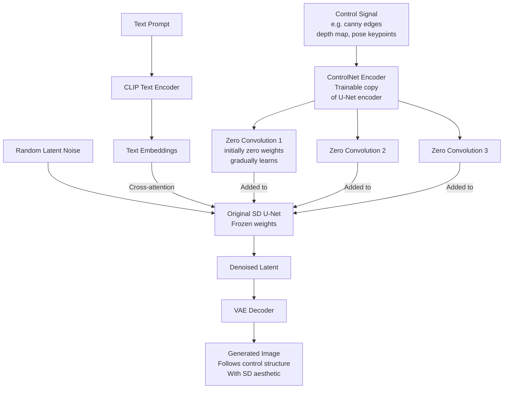

# 🎛️ ControlNet

> [!abstract] TL;DR
> ControlNet (Zhang et al., 2023) adds precise structural conditioning to pretrained diffusion models. A trainable copy of the U-Net encoder is locked to the original weights with zero convolutions (start at zero gradient), then trained to map control signals (pose, canny edges, depth maps, segmentation) into feature space. The original model is frozen. Result: text-to-image generation that obeys structural constraints while retaining all learned aesthetics.

## Intuition — Analogy First

Without ControlNet: you ask an AI artist "paint a portrait of a woman looking right" — they might paint her facing anywhere.

With ControlNet: you give the AI artist a **blueprint** alongside your text instructions. The artist follows the blueprint's structure precisely — the pose, the spatial composition, the depth layout — while still applying their own style and aesthetic from your text prompt.

ControlNet is the **director's storyboard** meets **AI artist**. The director (ControlNet) says: "Character A stands here, facing this direction, arms raised like this." The AI artist interprets the storyboard in their own style. You get structural precision + aesthetic creativity simultaneously.

## How It Works — Mechanics



**Zero convolution** — The key innovation:
- A `1×1` convolution initialized with **weight=0 and bias=0**
- At training start: zero conv outputs zero → original SD model is completely unchanged
- As training proceeds: zero conv learns to pass the right features at the right magnitude
- This prevents "catastrophic shock" to the original model during early training

Without zero convolution, adding random noise features at full magnitude to a pretrained SD model would immediately destroy all learned weights in the first training step.

**Architecture:**
1. **Lock the original SD U-Net** — frozen, no gradient updates
2. **Create a trainable copy of the encoder** (just the encoder, not decoder) — ~0.5× SD parameters
3. **Connect copy to original via zero convolutions** — feature addition at each encoder stage
4. **Train only the copy** on (image, control signal, text) triples

**Conditioning types:**

| ControlNet Type | Input | Controls |
|---|---|---|
| Canny | Edge maps from Canny edge detector | Object outlines, structure |
| Depth | Depth map (MiDaS or real sensor) | 3D spatial layout, perspective |
| HED | Soft edge maps | More flexible than canny |
| OpenPose | 18-keypoint skeleton | Human body pose exactly |
| Segmentation | Semantic segmentation map | Scene layout, region control |
| Scribble | Hand-drawn sketch | Loose composition control |
| Normal maps | Surface normal maps | Lighting and surface detail |
| Line art | Clean line drawings | Illustration/anime style |

**Multiple ControlNets** — Can stack multiple ControlNets simultaneously: Canny + Depth = structural outline AND 3D perspective control. Outputs are added with configurable weights.

## The Math

**ControlNet forward pass:**
$$y_c = \mathcal{F}(x; \Theta) + \mathcal{Z}(\mathcal{F}(x + \mathcal{Z}(c; \Theta_{z1}); \Theta_c); \Theta_{z2})$$

Where:
- $\mathcal{F}(\cdot; \Theta)$ = frozen SD network block
- $\Theta_c$ = trainable copy of encoder weights
- $\mathcal{Z}(\cdot; \Theta_{z})$ = zero convolution (1×1 conv with zero init)
- $c$ = control condition (canny, pose, depth...)

**Zero convolution initialization:**
$$\mathcal{Z}(x; \{W, b\})\big|_{t=0} = W \cdot x + b = 0 \cdot x + 0 = 0$$

So at step 0: $y_c = \mathcal{F}(x; \Theta) + 0 = \mathcal{F}(x; \Theta)$ — identical to original SD.

**Training loss** — Same as Stable Diffusion:
$$\mathcal{L} = \mathbb{E}_{z_t, t, c_{text}, c_{ctrl}, \varepsilon} \left[\|\varepsilon - \varepsilon_\theta(z_t, t, c_{text}, c_{ctrl})\|^2\right]$$

Only $\Theta_c$ and $\Theta_{z1}, \Theta_{z2}$ receive gradient updates. $\Theta$ remains frozen.

## Code Demo

```python
import torch
from diffusers import (
    StableDiffusionControlNetPipeline,
    ControlNetModel,
    UniPCMultistepScheduler,
)
from PIL import Image
import cv2
import numpy as np
from controlnet_aux import OpenposeDetector, HEDdetector

device = "cuda"
dtype = torch.float16

# --- Canny ControlNet ---
def get_canny_image(image, low=100, high=200):
    """Extract canny edges from image."""
    img_array = np.array(image)
    gray = cv2.cvtColor(img_array, cv2.COLOR_RGB2GRAY)
    edges = cv2.Canny(gray, low, high)
    # Canny expects: black background, white edges; convert to 3-channel
    canny_3ch = cv2.cvtColor(edges, cv2.COLOR_GRAY2RGB)
    return Image.fromarray(canny_3ch)

# Load ControlNet model (canny conditioned)
controlnet = ControlNetModel.from_pretrained(
    "lllyasviel/sd-controlnet-canny",
    torch_dtype=dtype
)

pipe = StableDiffusionControlNetPipeline.from_pretrained(
    "runwayml/stable-diffusion-v1-5",
    controlnet=controlnet,
    torch_dtype=dtype,
).to(device)

# Use UniPC scheduler for faster inference (20 steps)
pipe.scheduler = UniPCMultistepScheduler.from_config(pipe.scheduler.config)
pipe.enable_model_cpu_offload()   # reduce VRAM usage

# Generate with canny control
source_image = Image.open("building.jpg").resize((512, 512))
canny_image = get_canny_image(source_image)

result = pipe(
    prompt="a beautiful building in Japan, cherry blossom trees, golden hour",
    negative_prompt="low quality, blurry, watermark",
    image=canny_image,
    num_inference_steps=20,
    guidance_scale=7.5,
    controlnet_conditioning_scale=1.0,   # 0=ignore control, 1=full control
    generator=torch.manual_seed(0),
).images[0]
result.save("building_japan.png")

# --- Pose ControlNet (OpenPose) ---
controlnet_pose = ControlNetModel.from_pretrained(
    "lllyasviel/sd-controlnet-openpose", torch_dtype=dtype
)
pipe_pose = StableDiffusionControlNetPipeline.from_pretrained(
    "runwayml/stable-diffusion-v1-5",
    controlnet=controlnet_pose,
    torch_dtype=dtype,
).to(device)

# Extract pose from source person
pose_detector = OpenposeDetector.from_pretrained("lllyasviel/Annotators")
pose_image = pose_detector(Image.open("person.jpg"))

result_pose = pipe_pose(
    prompt="a superhero in a dramatic pose, comic book style",
    image=pose_image,
    num_inference_steps=20,
    guidance_scale=7.5,
    controlnet_conditioning_scale=1.0,
).images[0]

# --- Multiple ControlNets simultaneously ---
controlnet_canny = ControlNetModel.from_pretrained(
    "lllyasviel/sd-controlnet-canny", torch_dtype=dtype
)
controlnet_depth = ControlNetModel.from_pretrained(
    "lllyasviel/sd-controlnet-depth", torch_dtype=dtype
)

pipe_multi = StableDiffusionControlNetPipeline.from_pretrained(
    "runwayml/stable-diffusion-v1-5",
    controlnet=[controlnet_canny, controlnet_depth],   # list of controlnets
    torch_dtype=dtype,
).to(device)

canny_img = get_canny_image(source_image)

# Depth extraction
from transformers import pipeline as hf_pipeline
depth_pipe = hf_pipeline("depth-estimation", model="Intel/dpt-large")
depth_result = depth_pipe(source_image)
depth_img = depth_result["depth"].convert("RGB").resize((512, 512))

result_multi = pipe_multi(
    prompt="a futuristic cyberpunk city",
    image=[canny_img, depth_img],
    num_inference_steps=25,
    guidance_scale=7.5,
    controlnet_conditioning_scale=[0.8, 0.6],   # per-controlnet weight
).images[0]

# --- ControlNet with IP-Adapter (image + control) ---
from diffusers import StableDiffusionControlNetImg2ImgPipeline

pipe_i2i = StableDiffusionControlNetImg2ImgPipeline.from_pretrained(
    "runwayml/stable-diffusion-v1-5",
    controlnet=controlnet,
    torch_dtype=dtype,
).to(device)

result_i2i = pipe_i2i(
    prompt="an impressionist oil painting",
    image=source_image,     # style reference
    control_image=canny_image,
    strength=0.7,
    num_inference_steps=30,
    guidance_scale=7.5,
).images[0]

# --- Training a custom ControlNet (outline) ---
# from diffusers.training_utils import ...
# dataset: pairs of (original_image, control_image, text_prompt)
# Only train the ControlNet encoder + zero convs on your domain
# Example: train on (architecture photos, segmentation maps, descriptions)
```

## Real-World Example

**Product photography AI** — E-commerce companies use ControlNet to generate consistent product images across different backgrounds, lighting, and environments. A 3D render of a product (or even a real photo) becomes the depth/normal-map control signal; the text prompt specifies "white background studio", "outdoor lifestyle setting", "wooden table". The product geometry stays fixed while the environment transforms.

**Fashion design generation** — Fashion brands use OpenPose ControlNet to generate clothing designs on specific model poses. Designers sketch rough fabric shapes (scribble ControlNet) and generate photorealistic fabric textures matching those shapes, exploring colorways and patterns without physical prototypes.

**Architectural visualization** — Architects provide floor plan diagrams or segmentation maps of room layouts; ControlNet generates photorealistic interior renderings with text-specified style ("modern minimalist", "industrial loft") while the room layout is controlled precisely.

## Trade-offs

| Conditioning Type | Precision | Flexibility | Use Case |
|---|---|---|---|
| Canny edges | High (exact outlines) | Medium | Architecture, rigid objects |
| OpenPose | Very high (exact pose) | Low (human only) | Fashion, character generation |
| Depth map | Medium (spatial layout) | High | Scene composition |
| Segmentation | High (region layout) | High | Scene planning |
| Scribble | Low (loose) | Very high | Creative exploration |
| No ControlNet | None | Full | Pure creative generation |

**Conditioning scale trade-off:**
- `controlnet_conditioning_scale=0.5`: loose control, more creative
- `controlnet_conditioning_scale=1.0`: strict control, follows structure exactly
- `controlnet_conditioning_scale=1.5`: over-controlled, may introduce artifacts

## When to Use vs Avoid

**Use ControlNet when:** you need spatial/structural control over generation (specific pose, composition, layout), retargeting or restyling existing images, consistent product photography.

**Avoid ControlNet when:** pure creative generation is the goal (no specific structural requirement), control signal is not available or impractical to extract.

**Use multiple ControlNets when:** you need both structural outline AND spatial depth, or pose AND background layout.

## Common Pitfalls

1. **Control signal quality matters** — A noisy canny image (too many edges) produces cluttered outputs. Tune the Canny thresholds (low=100, high=200 typical) or use HED for cleaner edges.

2. **Mismatched resolution** — Control image must be the same size as the generated image (512×512 or 768×768). Resizing with wrong interpolation creates artifacts in edge/pose maps.

3. **Wrong ControlNet version for SD version** — ControlNet trained for SD v1.5 won't work correctly with SDXL. Use `lllyasviel/sd-controlnet-*` for SD 1.5, `diffusers/controlnet-canny-sdxl-1.0` for SDXL.

4. **Conditioning scale too high** — `controlnet_conditioning_scale=2.0` makes the model ignore the text prompt and rigidly follow the control, often producing artifacts. Stay in [0.5, 1.2].

5. **Not using the right annotator** — OpenPose requires the OpenPose detector (outputs skeleton visualization). Passing a raw photo as if it were a pose image produces garbage.

## Related Concepts

- [[_MOC_Computer_Vision|↑ Section MOC]]

- [[Stable_Diffusion]] — the backbone that ControlNet extends
- [[Diffusion_Models]] — underlying denoising mechanism
- [[Semantic_Segmentation]] — segmentation maps as ControlNet conditioning
- [[Depth_Estimation]] — depth maps as ControlNet conditioning

## Review Questions

1. ControlNet freezes the original SD U-Net and trains only a copy of the encoder. Why not fine-tune the whole model with the conditioning signal? What specifically would go wrong?

2. What is a "zero convolution" and why is it initialized to zero? What would happen if ControlNet's conditioning features were added at full magnitude from the start of training?

3. You want to generate product photos of furniture in different room settings while keeping the furniture shape identical. Which ControlNet conditioning type(s) would you use, and describe the data pipeline step-by-step.

## Sources

- [Adding Conditional Control to Text-to-Image Diffusion Models (Zhang et al., 2023)](https://arxiv.org/abs/2302.05543)
- [ControlNet GitHub](https://github.com/lllyasviel/ControlNet)
- [HuggingFace Diffusers ControlNet tutorial](https://huggingface.co/docs/diffusers/using-diffusers/controlnet)

#generative-models #controlnet #stable-diffusion #conditioning #zero-convolution #structural-control
