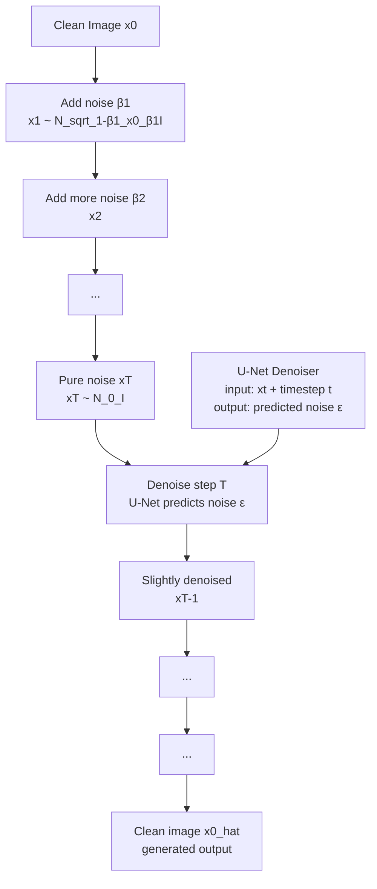

# 🌀 Diffusion Models

> [!abstract] TL;DR
> Diffusion models destroy data by iteratively adding Gaussian noise (forward process) then train a network to reverse this destruction step by step (reverse process). At inference, start from pure noise and denoise T times. The U-Net denoiser predicts the noise (ε-prediction) at each step. DDPM (Ho et al., 2020) established the modern framework; DDIM enables 10-50× faster sampling. Currently the dominant approach for image, audio, and video generation.

## Intuition — Analogy First

Imagine **building a sandcastle on a beach**. Over T days, the tide gradually washes it away, adding more noise each day — at first the castle is slightly eroded; by day T it's just undistinguishable beach sand. **The forward process** is this destruction.

Now imagine you filmed the destruction on a timelapse. A **restoration model** watches this video and learns: "given this almost-flat sand at step T, how would I add one day's worth of structure back?" It learns to reverse the process one step at a time.

At inference time, you start with **pure beach sand (random noise)** and apply the learned reconstruction T times. Each step removes a bit of noise, adds a bit of structure, until a coherent sandcastle (image) emerges. No castle was ever explicitly programmed — the model learned what realistic castles look like from the statistical patterns of noising/denoising.

## How It Works — Mechanics



**Forward process (adding noise):**
- At each step $t$, add a small amount of Gaussian noise controlled by schedule $\beta_t$
- After many steps (T=1000), the image is pure noise $x_T \sim \mathcal{N}(0, I)$
- Key: can sample $x_t$ directly from $x_0$ at any step (closed form), no need to run T steps

**Noise schedules:**
- **Linear**: $\beta_t$ increases linearly from $\beta_1=10^{-4}$ to $\beta_T=0.02$
- **Cosine** (improved DDPM): smoother schedule, doesn't destroy information too quickly early on

**Reverse process (denoising):**
- Train a neural network $\epsilon_\theta(x_t, t)$ to predict the noise $\epsilon$ added at step $t$
- At inference: iteratively remove predicted noise, sample from posterior $p_\theta(x_{t-1}|x_t)$
- Network is conditioned on timestep $t$ (via sinusoidal positional embedding, like transformers)

**U-Net denoiser architecture:**
- Encoder: downsampling blocks with ResNets + self-attention
- Decoder: upsampling blocks with skip connections
- Timestep conditioning: add time embedding to each residual block
- Text/image conditioning: cross-attention in middle and decoder blocks

**DDIM (Denoising Diffusion Implicit Models):**
- DDPM requires all T=1000 steps; very slow inference
- DDIM is a deterministic (non-Markovian) process using the same trained model
- Can skip steps: use 50 steps instead of 1000 with comparable quality
- The "implicit" means samples are deterministic given initial noise — same noise seed = same image

**Classifier-Free Guidance (CFG):**
- Train model both with and without condition (randomly drop condition during training)
- At inference: $\hat{\epsilon} = \epsilon_{uncond} + w \cdot (\epsilon_{cond} - \epsilon_{uncond})$
- $w$ (guidance scale): higher → more condition adherence, less diversity
- Typical: $w=7.5$ for Stable Diffusion text-to-image

## The Math

**Forward process (adding noise):**
$$q(x_t | x_{t-1}) = \mathcal{N}(x_t; \sqrt{1-\beta_t} \, x_{t-1}, \, \beta_t I)$$

**Closed-form: sample $x_t$ from $x_0$ directly:**
Let $\alpha_t = 1 - \beta_t$, $\bar{\alpha}_t = \prod_{s=1}^{t} \alpha_s$ (cumulative product)
$$q(x_t | x_0) = \mathcal{N}(x_t; \sqrt{\bar{\alpha}_t} \, x_0, \, (1 - \bar{\alpha}_t) I)$$
$$x_t = \sqrt{\bar{\alpha}_t} \, x_0 + \sqrt{1 - \bar{\alpha}_t} \, \varepsilon, \quad \varepsilon \sim \mathcal{N}(0, I)$$

**Training objective (ε-prediction / Ho et al. simplified):**
$$\mathcal{L}_{simple} = \mathbb{E}_{t, x_0, \varepsilon} \left[ \| \varepsilon - \varepsilon_\theta(x_t, t) \|^2 \right]$$

Train the network to predict the noise $\varepsilon$ that was added to $x_0$ to get $x_t$.

**Reverse denoising step:**
$$p_\theta(x_{t-1} | x_t) = \mathcal{N}(x_{t-1}; \mu_\theta(x_t, t), \sigma_t^2 I)$$

$$\mu_\theta(x_t, t) = \frac{1}{\sqrt{\alpha_t}} \left( x_t - \frac{1-\alpha_t}{\sqrt{1 - \bar{\alpha}_t}} \varepsilon_\theta(x_t, t) \right)$$

**Classifier-free guidance:**
$$\hat{\varepsilon}_\theta(x_t, t, c) = \varepsilon_\theta(x_t, t, \emptyset) + w \cdot [\varepsilon_\theta(x_t, t, c) - \varepsilon_\theta(x_t, t, \emptyset)]$$

## Code Demo

```python
import torch
import torch.nn as nn
import numpy as np
from diffusers import DDPMScheduler, UNet2DModel, DDIMScheduler
from diffusers import DDPMPipeline
from PIL import Image

# --- Use pretrained DDPM for unconditional generation ---
pipeline = DDPMPipeline.from_pretrained("google/ddpm-celebahq-256")
pipeline = pipeline.to("cuda")
images = pipeline(batch_size=4, num_inference_steps=1000).images   # slow: 1000 steps
images[0].save("ddpm_face.png")

# --- DDIM for fast sampling (same model, fewer steps) ---
from diffusers import DDIMPipeline
pipeline_ddim = DDIMPipeline.from_pretrained("google/ddpm-celebahq-256")
pipeline_ddim.scheduler = DDIMScheduler.from_pretrained("google/ddpm-celebahq-256")
pipeline_ddim = pipeline_ddim.to("cuda")
images_ddim = pipeline_ddim(batch_size=4, num_inference_steps=50).images  # 20x faster

# --- Manual DDPM training loop (simplified) ---
class SimpleUNet(nn.Module):
    """Minimal UNet for demonstration — production uses full attention UNet."""
    def __init__(self, channels=1, time_embed_dim=32):
        super().__init__()
        self.time_embed = nn.Sequential(
            nn.Linear(1, time_embed_dim), nn.SiLU(),
            nn.Linear(time_embed_dim, time_embed_dim),
        )
        self.enc1 = nn.Sequential(nn.Conv2d(channels, 64, 3, padding=1), nn.ReLU())
        self.enc2 = nn.Sequential(nn.Conv2d(64, 128, 3, stride=2, padding=1), nn.ReLU())
        self.mid = nn.Sequential(nn.Conv2d(128 + time_embed_dim, 128, 3, padding=1), nn.ReLU())
        self.dec2 = nn.Sequential(nn.ConvTranspose2d(256, 64, 2, stride=2), nn.ReLU())
        self.dec1 = nn.Sequential(nn.Conv2d(128, channels, 3, padding=1))

    def forward(self, x, t):
        # Sinusoidal time embedding
        t_emb = self.time_embed(t.float().unsqueeze(-1))
        e1 = self.enc1(x)    # H×W×64
        e2 = self.enc2(e1)   # H/2×W/2×128
        # Inject time
        B, C, H, W = e2.shape
        t_spatial = t_emb.view(B, -1, 1, 1).expand(B, -1, H, W)
        e2_t = torch.cat([e2, t_spatial], dim=1)
        m = self.mid(e2_t)
        d = self.dec2(torch.cat([m, e2], dim=1))
        return self.dec1(torch.cat([d, e1], dim=1))

def get_cosine_schedule(T=1000):
    """Cosine noise schedule."""
    t = torch.arange(T + 1)
    s = 0.008
    f = torch.cos((t / T + s) / (1 + s) * np.pi / 2) ** 2
    alphas_bar = f / f[0]
    betas = 1 - alphas_bar[1:] / alphas_bar[:-1]
    return betas.clamp(0, 0.999)

T = 1000
betas = get_cosine_schedule(T)
alphas = 1 - betas
alphas_bar = torch.cumprod(alphas, dim=0)

def q_sample(x0, t, noise=None):
    """Forward process: sample x_t given x_0."""
    if noise is None:
        noise = torch.randn_like(x0)
    sqrt_ab = alphas_bar[t].sqrt().view(-1, 1, 1, 1)
    sqrt_1mab = (1 - alphas_bar[t]).sqrt().view(-1, 1, 1, 1)
    return sqrt_ab * x0 + sqrt_1mab * noise, noise

# Training step
def train_step(model, x0, optimizer):
    t = torch.randint(0, T, (x0.shape[0],))   # random timesteps
    xt, noise = q_sample(x0, t)
    pred_noise = model(xt, t)
    loss = nn.functional.mse_loss(pred_noise, noise)
    optimizer.zero_grad(); loss.backward(); optimizer.step()
    return loss.item()

# Sampling (DDPM)
@torch.no_grad()
def ddpm_sample(model, shape, device):
    x = torch.randn(shape, device=device)
    for t in reversed(range(T)):
        t_batch = torch.full((shape[0],), t, device=device)
        predicted_noise = model(x, t_batch)
        alpha = alphas[t]
        alpha_bar = alphas_bar[t]
        beta = betas[t]
        # DDPM denoising step
        mean = (1 / alpha.sqrt()) * (x - (beta / (1 - alpha_bar).sqrt()) * predicted_noise)
        if t > 0:
            noise = torch.randn_like(x)
            x = mean + beta.sqrt() * noise
        else:
            x = mean
    return x

# --- HuggingFace Diffusers: text-to-image (Stable Diffusion) ---
from diffusers import StableDiffusionPipeline
pipe = StableDiffusionPipeline.from_pretrained(
    "runwayml/stable-diffusion-v1-5",
    torch_dtype=torch.float16
).to("cuda")

image = pipe(
    prompt="a photo of an astronaut riding a horse on mars",
    negative_prompt="blurry, low quality",
    num_inference_steps=50,
    guidance_scale=7.5,
    height=512, width=512,
).images[0]
image.save("astronaut_horse.png")

# --- Understanding guidance scale ---
# guidance_scale=1: no guidance (just noise)
# guidance_scale=7.5: standard, good balance
# guidance_scale=15: very strict prompt adherence, less realistic
for w in [1, 3, 7.5, 15]:
    img = pipe(prompt="a red car", guidance_scale=w).images[0]
    img.save(f"car_guidance_{w}.png")
```

## Real-World Example

**Stable Diffusion, DALL-E 3, Midjourney** all use diffusion model variants for text-to-image generation. DALL-E 3 (OpenAI) operates on a cascaded diffusion model — first generates a 64×64 base image, then upsample diffusion models refine to 256×256 then 1024×1024. Each stage is conditioned on both the text prompt and the lower-resolution image.

**Sora (OpenAI, 2024)** extends the diffusion architecture to video generation using a Diffusion Transformer (DiT) that treats video as spatiotemporal patches. This shows diffusion generalizes beyond images to any continuous data modality.

**Medical image synthesis** — Stanford's research using diffusion models to synthesize MRI/CT scans of rare pathologies enables data augmentation without additional patient scanning. Diffusion models outperform GANs on FID score and generate more diverse/realistic synthetic scans.

## Trade-offs

| Aspect | Diffusion | GAN | VAE |
|---|---|---|---|
| Sample quality | State of art | Very good | Blurry |
| Training stability | Very stable | Unstable | Stable |
| Inference speed | Slow (50-1000 steps) | Fast (1 step) | Fast (1 step) |
| Mode coverage | Excellent | Mode collapse risk | Good |
| Conditioning | Classifier-free guidance | Conditional GAN | Conditional VAE |
| Latent space | Step-wise (not compact) | Compact | Compact, structured |
| Best for | Image/video/audio gen | Fast single-domain | Encoding + gen |

## When to Use vs Avoid

**Use diffusion when:** highest image quality required (product images, creative AI), controllable generation via guidance, diverse outputs.

**Avoid diffusion when:** real-time generation required (interactive apps, streaming), on-device inference on mobile/edge (too slow without major optimization).

**Use DDIM** instead of DDPM for inference — same model, 20× faster.

## Common Pitfalls

1. **Using DDPM inference (1000 steps) in production** — Always use DDIM with 20-50 steps; quality is near-identical at 50× lower latency.

2. **Guidance scale too high** — CFG scale >15 causes oversaturation and artifacts. Start at 7.5 and tune.

3. **Wrong noise schedule at inference** — Training with cosine schedule but using linear schedule at inference degrades quality. Match schedule to what was used in training.

4. **Memory with full precision** — Diffusion models in float32 require ~10GB VRAM for 512px. Always use `torch.float16` or `bfloat16` for inference.

5. **Not seeding for reproducibility** — Diffusion sampling is stochastic. Fix the random seed for reproducible results: `torch.manual_seed(42)` and pass `generator=torch.Generator().manual_seed(42)` to the pipeline.

## Related Concepts

- [[_MOC_Computer_Vision|↑ Section MOC]]

- [[Stable_Diffusion]] — latent diffusion built on these principles
- [[VAE]] — used as encoder in latent diffusion
- [[GAN]] — predecessor, largely superseded for image synthesis
- [[Vision_Transformer_ViT]] — DiT (Diffusion Transformer) extends to transformer denoiser

## Review Questions

1. The forward process adds noise for T=1000 steps, but we can sample $x_t$ directly from $x_0$ without running all T steps. Derive the closed-form formula and explain why this is critical for training efficiency.

2. Classifier-Free Guidance (CFG) with scale $w=7.5$ blends conditional and unconditional noise predictions. What happens at $w=1$ and $w=15$, and why is there a quality-diversity trade-off?

3. DDIM is 20× faster than DDPM but uses the same trained model. What mathematical property of the denoising ODE enables this speed-up?

## Sources

- [DDPM: Denoising Diffusion Probabilistic Models (Ho et al., 2020)](https://arxiv.org/abs/2006.11239)
- [DDIM (Song et al., 2020)](https://arxiv.org/abs/2010.02502)
- [Classifier-Free Diffusion Guidance (Ho & Salimans, 2022)](https://arxiv.org/abs/2207.12598)
- [Score-Based Generative Modeling (Song et al., 2021)](https://arxiv.org/abs/2011.13456)

#generative-models #diffusion #DDPM #DDIM #score-matching #denoising
