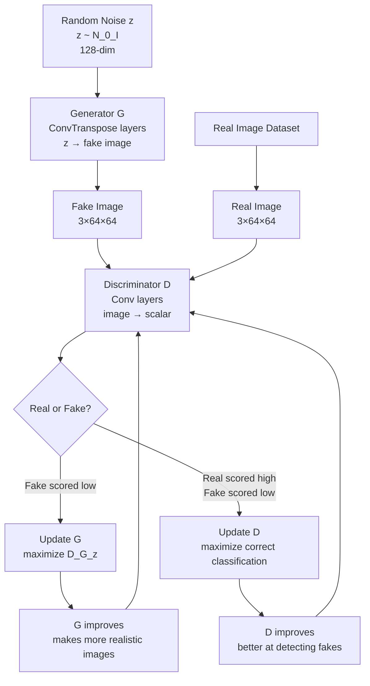

# ⚔️ Generative Adversarial Network (GAN)

> [!abstract] TL;DR
> A GAN trains two networks in competition: a Generator that creates fake images from noise, and a Discriminator that distinguishes real from fake. The generator improves by fooling the discriminator; the discriminator improves by catching the generator. Key problems: mode collapse, training instability. WGAN (Wasserstein distance) makes training more stable. StyleGAN produces photorealistic faces. Largely superseded by diffusion models for image generation.

## Intuition — Analogy First

Imagine a **forger and a detective** locked in an arms race.

The **forger (Generator)** starts by producing terrible fake paintings. The **detective (Discriminator)** easily spots the fakes. The forger studies the detective's feedback and improves — next batch of fakes is slightly better. The detective trains harder to spot the new fakes. Round after round, the forger gets so good that even an expert detective can barely tell the fakes from originals.

At the end of training, you discard the detective and keep the forger — a generator that creates images so realistic they're indistinguishable from real photographs. The quality comes entirely from the adversarial pressure: each network makes the other better.

## How It Works — Mechanics



**Training procedure (alternating steps):**
1. Sample real images from dataset
2. Sample noise $z$ and generate fake images $G(z)$
3. Update **D**: maximize log D(real) + log(1-D(fake)) — distinguish real from fake
4. Update **G**: minimize log(1-D(G(z))) ≡ maximize log D(G(z)) — fool the discriminator

**DCGAN (Deep Convolutional GAN, Radford 2015):**
- Generator: fully-connected → 4×4 → series of transposed convolutions → 64×64 image
- Discriminator: mirror of generator with strided convolutions
- BatchNorm in both; no pooling; ReLU in generator, LeakyReLU in discriminator
- First stable training recipe for high-quality image generation

**Wasserstein GAN (WGAN, Arjovsky 2017):**
- Replaces discriminator with a "Critic" (removes sigmoid)
- Uses Wasserstein distance instead of JS divergence — provides gradients even when distributions don't overlap (vanishing gradient problem in vanilla GAN)
- Weight clipping or gradient penalty (WGAN-GP) enforces Lipschitz constraint
- Training correlation with sample quality makes loss meaningful

**Conditional GAN (cGAN):**
- Feed class label to both G and D
- G generates images of specified class; D also sees the class label
- Applications: text-to-image, image-to-image translation (Pix2Pix)

**StyleGAN (Karras et al., 2019):**
- Progressive growing: start at 4×4, progressively add layers up to 1024×1024
- Style injection via AdaIN (Adaptive Instance Normalization) at each layer
- Separates global style (face structure) from fine-grained style (texture)
- Disentangled latent space W via mapping network $z \rightarrow w$

## The Math

**Minimax objective:**
$$\min_G \max_D V(G,D) = \mathbb{E}_{x \sim p_{data}}[\log D(x)] + \mathbb{E}_{z \sim p_z}[\log(1 - D(G(z)))]$$

At optimality, D(x) = 0.5 for all x, and G matches the data distribution.

**Vanishing gradient problem** — When D is too good (D(G(z)) ≈ 0):
$$\nabla_G \log(1 - D(G(z))) \approx 0 \quad \text{(gradient vanishes)}$$

**Non-saturating generator loss** (practical fix):
$$\mathcal{L}_G = -\mathbb{E}_{z}[\log D(G(z))]$$

Equivalent in expectation but different gradient behavior — gradients don't vanish when D is good.

**Wasserstein distance:**
$$W(p_{data}, p_G) = \sup_{\|f\|_L \leq 1} \mathbb{E}_{x \sim p_{data}}[f(x)] - \mathbb{E}_{x \sim p_G}[f(x)]$$

**WGAN critic loss:**
$$\mathcal{L}_{critic} = \mathbb{E}_{x \sim p_{data}}[D(x)] - \mathbb{E}_{z}[D(G(z))]$$

**WGAN-GP gradient penalty:**
$$\mathcal{L}_{GP} = \lambda \mathbb{E}_{\hat{x}}[(\|\nabla_{\hat{x}} D(\hat{x})\|_2 - 1)^2]$$

where $\hat{x}$ is sampled uniformly between real and fake.

## Code Demo

```python
import torch
import torch.nn as nn
import torch.optim as optim
from torch.utils.data import DataLoader
from torchvision import datasets, transforms
import torchvision.utils as vutils

# --- DCGAN Generator ---
class Generator(nn.Module):
    def __init__(self, latent_dim=100, ngf=64, nc=1):
        super().__init__()
        self.main = nn.Sequential(
            # Input: latent_dim × 1 × 1
            nn.ConvTranspose2d(latent_dim, ngf * 8, 4, 1, 0, bias=False),
            nn.BatchNorm2d(ngf * 8), nn.ReLU(True),    # 512 × 4 × 4
            nn.ConvTranspose2d(ngf * 8, ngf * 4, 4, 2, 1, bias=False),
            nn.BatchNorm2d(ngf * 4), nn.ReLU(True),    # 256 × 8 × 8
            nn.ConvTranspose2d(ngf * 4, ngf * 2, 4, 2, 1, bias=False),
            nn.BatchNorm2d(ngf * 2), nn.ReLU(True),    # 128 × 16 × 16
            nn.ConvTranspose2d(ngf * 2, ngf, 4, 2, 1, bias=False),
            nn.BatchNorm2d(ngf), nn.ReLU(True),         # 64 × 32 × 32
            nn.ConvTranspose2d(ngf, nc, 4, 2, 1, bias=False),
            nn.Tanh()                                    # nc × 64 × 64
        )

    def forward(self, z):
        return self.main(z.unsqueeze(-1).unsqueeze(-1))

# --- DCGAN Discriminator ---
class Discriminator(nn.Module):
    def __init__(self, ndf=64, nc=1):
        super().__init__()
        self.main = nn.Sequential(
            # Input: nc × 64 × 64
            nn.Conv2d(nc, ndf, 4, 2, 1, bias=False), nn.LeakyReLU(0.2, True),     # 64×32×32
            nn.Conv2d(ndf, ndf*2, 4, 2, 1, bias=False),
            nn.BatchNorm2d(ndf*2), nn.LeakyReLU(0.2, True),                        # 128×16×16
            nn.Conv2d(ndf*2, ndf*4, 4, 2, 1, bias=False),
            nn.BatchNorm2d(ndf*4), nn.LeakyReLU(0.2, True),                        # 256×8×8
            nn.Conv2d(ndf*4, ndf*8, 4, 2, 1, bias=False),
            nn.BatchNorm2d(ndf*8), nn.LeakyReLU(0.2, True),                        # 512×4×4
            nn.Conv2d(ndf*8, 1, 4, 1, 0, bias=False),                              # 1×1×1
            nn.Sigmoid()
        )

    def forward(self, x):
        return self.main(x).view(-1)

# Weight initialization (DCGAN recipe)
def weights_init(m):
    classname = m.__class__.__name__
    if classname.find('Conv') != -1:
        nn.init.normal_(m.weight.data, 0.0, 0.02)
    elif classname.find('BatchNorm') != -1:
        nn.init.normal_(m.weight.data, 1.0, 0.02)
        nn.init.constant_(m.bias.data, 0)

# Setup
device = torch.device("cuda" if torch.cuda.is_available() else "cpu")
LATENT_DIM = 100
G = Generator(LATENT_DIM).to(device).apply(weights_init)
D = Discriminator().to(device).apply(weights_init)
criterion = nn.BCELoss()
opt_G = optim.Adam(G.parameters(), lr=2e-4, betas=(0.5, 0.999))   # β₁=0.5 for GAN
opt_D = optim.Adam(D.parameters(), lr=2e-4, betas=(0.5, 0.999))

# --- Training loop (DCGAN) ---
transform = transforms.Compose([transforms.Resize(64), transforms.ToTensor(),
                                  transforms.Normalize((0.5,), (0.5,))])
dataset = datasets.MNIST("data/", train=True, download=True, transform=transform)
loader = DataLoader(dataset, batch_size=128, shuffle=True, num_workers=4)

fixed_noise = torch.randn(64, LATENT_DIM, device=device)

for epoch in range(50):
    for i, (real_imgs, _) in enumerate(loader):
        real_imgs = real_imgs.to(device)
        batch_size = real_imgs.size(0)

        real_labels = torch.ones(batch_size, device=device)
        fake_labels = torch.zeros(batch_size, device=device)

        # --- Train Discriminator ---
        opt_D.zero_grad()
        # Real images
        d_real = D(real_imgs)
        loss_d_real = criterion(d_real, real_labels)
        # Fake images
        z = torch.randn(batch_size, LATENT_DIM, device=device)
        fake_imgs = G(z).detach()    # detach: don't backprop through G
        d_fake = D(fake_imgs)
        loss_d_fake = criterion(d_fake, fake_labels)
        loss_D = (loss_d_real + loss_d_fake) / 2
        loss_D.backward()
        opt_D.step()

        # --- Train Generator ---
        opt_G.zero_grad()
        z = torch.randn(batch_size, LATENT_DIM, device=device)
        fake_imgs = G(z)
        d_fake_for_g = D(fake_imgs)
        # Non-saturating loss: maximize log(D(G(z))) ≡ minimize -log(D(G(z)))
        loss_G = criterion(d_fake_for_g, real_labels)   # label as "real" to fool D
        loss_G.backward()
        opt_G.step()

    if epoch % 10 == 0:
        print(f"Epoch {epoch}: D_loss={loss_D.item():.4f}, G_loss={loss_G.item():.4f}")
        with torch.no_grad():
            samples = G(fixed_noise)
        vutils.save_image(samples, f"samples_epoch{epoch}.png", normalize=True)

# --- WGAN-GP (more stable training) ---
def compute_gradient_penalty(D, real_imgs, fake_imgs, device):
    """WGAN-GP gradient penalty."""
    alpha = torch.rand(real_imgs.size(0), 1, 1, 1, device=device)
    interpolated = (alpha * real_imgs + (1 - alpha) * fake_imgs).requires_grad_(True)
    d_interp = D(interpolated)
    gradients = torch.autograd.grad(
        outputs=d_interp, inputs=interpolated,
        grad_outputs=torch.ones_like(d_interp),
        create_graph=True, retain_graph=True,
    )[0]
    gradient_norm = gradients.view(gradients.size(0), -1).norm(2, dim=1)
    penalty = ((gradient_norm - 1) ** 2).mean()
    return penalty

# WGAN-GP discriminator (no sigmoid)
# WGAN losses:
# critic_loss = D(fake).mean() - D(real).mean() + lambda * gp
# generator_loss = -D(G(z)).mean()
```

## Real-World Example

**StyleGAN** (NVIDIA) can generate photorealistic 1024×1024 faces that don't exist. The website [thispersondoesnotexist.com](https://thispersondoesnotexist.com) serves StyleGAN faces. StyleGAN's W-space allows semantic editing: move in one latent direction → age the face; another → change hair color; another → add glasses. This demonstrated that GANs learn disentangled semantic concepts.

**DeepFake technology** uses face-swapping GANs. The generator learns to map one person's face onto another person's video frame. This prompted major platform policies requiring synthetic media disclosure.

**Data augmentation for rare diseases** — GANs synthesize rare medical images (retinal diseases, rare tumors) to balance training sets. A GAN trained on 500 real diabetic retinopathy images can generate synthetic training images, improving classifier accuracy on underrepresented severity grades.

## Trade-offs

| Aspect | GAN | VAE | Diffusion |
|---|---|---|---|
| Sample quality | Very high (StyleGAN) | Blurry | State of art |
| Training stability | Poor (mode collapse risk) | Stable | Very stable |
| Training speed | Fast | Fast | Slow |
| Inference speed | Fast | Fast | Slow (T steps) |
| Mode coverage | Mode collapse risk | Good | Excellent |
| Latent control | Limited | Structured | Via guidance |
| Current status | Largely superseded | Used as encoder | Dominant |

## When to Use vs Avoid

**Use GANs when:** you need fast inference (one forward pass), working with well-studied tasks (face generation, image-to-image translation), need adversarial loss for perceptual quality (super-resolution, style transfer).

**Avoid GANs for:** tasks requiring diverse output distribution (diffusion handles diversity better), unstable training environments, when you need tractable likelihoods.

**StyleGAN** remains relevant for its disentangled latent space control; use for face editing tasks.

## Common Pitfalls

1. **Mode collapse** — Generator maps all z to a small set of outputs (e.g., only generates "8"s for MNIST). Symptoms: training loss oscillates wildly. Fix: minibatch discrimination, unrolled GANs, or switch to WGAN.

2. **Discriminator too strong too fast** — If D becomes perfect early, G receives zero gradient (vanishing gradients). Fix: train D less frequently, add noise to real images, use WGAN.

3. **Checkerboard artifacts** — From transposed convolutions. Fix: use pixel shuffle or bilinear upsample + conv instead.

4. **Wrong BatchNorm placement** — Don't use BatchNorm in the generator's output layer or discriminator's input layer.

5. **Learning rate balance** — G and D need carefully balanced LRs. DCGAN recipe: Adam with lr=2e-4, β₁=0.5 for both. Using default Adam (β₁=0.9) causes instability.

## Related Concepts

- [[_MOC_Computer_Vision|↑ Section MOC]]

- [[VAE]] — alternative generative approach with structured latent space
- [[Diffusion_Models]] — dominant replacement for GANs in image synthesis
- [[Loss_Functions]] — adversarial loss variants (BCE, WGAN, hinge loss)
- [[Stable_Diffusion]] — uses perceptual/adversarial losses in its decoder VAE

## Review Questions

1. Explain mode collapse in a GAN. Give a concrete example and describe what the generator and discriminator loss curves look like when it occurs.

2. Vanilla GAN uses JS divergence implicitly, which causes vanishing gradients when distributions don't overlap. How does Wasserstein distance (WGAN) solve this problem?

3. StyleGAN uses a mapping network to convert z → w before feeding to the generator. What does this mapping accomplish and why is the W space more useful for image editing than the Z space?

## Sources

- [Generative Adversarial Nets (Goodfellow et al., 2014)](https://arxiv.org/abs/1406.2661)
- [DCGAN (Radford et al., 2015)](https://arxiv.org/abs/1511.06434)
- [Wasserstein GAN (Arjovsky et al., 2017)](https://arxiv.org/abs/1701.07875)
- [StyleGAN2 (Karras et al., 2020)](https://arxiv.org/abs/1912.04958)

#generative-models #GAN #DCGAN #StyleGAN #WGAN #adversarial-training
