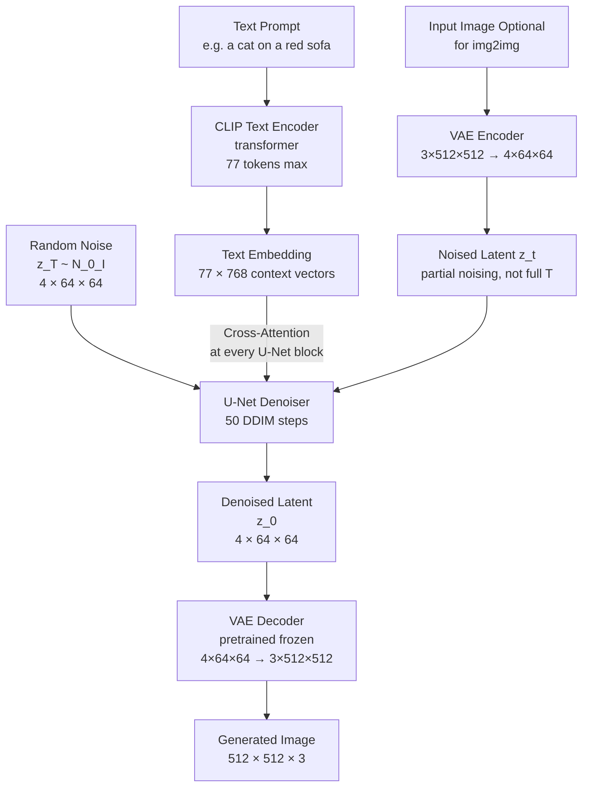

# 🎨 Stable Diffusion

> [!abstract] TL;DR
> Stable Diffusion (Rombach et al., 2022) runs the diffusion process in a compressed **latent space** (not pixel space) using a pretrained VAE, cutting compute by 48×. A CLIP text encoder provides text conditioning via cross-attention in the U-Net denoiser. DDIM sampling with 20-50 steps generates 512px images in <2 seconds on modern GPUs. SDXL (2023) and FLUX (2024) extend quality and resolution further.

## Intuition — Analogy First

Classic DDPM operates directly on pixels — like an artist erasing and redrawing a 512×512 canvas 1000 times. It works, but each "canvas" is enormous (786,432 numbers for 3-channel 512px image).

Stable Diffusion's insight: **compress the canvas first, then paint**. An artist could sketch on a tiny 64×64 notepad (the latent space), then have a high-fidelity printer (the VAE decoder) blow it up to 512×512. The sketch captures the essential composition; the printer adds the fine detail.

The other half: **the CLIP text encoder is the art director**. It converts "an astronaut riding a horse on Mars, golden hour, cinematic" into a vector that guides every denoising step through cross-attention — like whispering style and content directions to the artist at each stage.

## How It Works — Mechanics



**Why latent space?**
- 512×512×3 = 786,432 pixels → each diffusion step operates on this huge tensor
- VAE compresses to 64×64×4 = 16,384 latents → 48× smaller
- VAE is pretrained on natural images; the diffusion model doesn't need to learn low-level pixel statistics
- Quality preserved: VAE encoder captures semantic content, decoder reconstructs fine detail

**CLIP text conditioning:**
- CLIP's text encoder (transformer) maps a text prompt to 77 token embeddings × 768 dimensions
- These are injected into U-Net via **cross-attention** in each residual block of the U-Net decoder
- Cross-attention: Q from U-Net features, K and V from text embeddings
- Every denoising step is guided by the full text context

**U-Net denoiser architecture (SD v1.5):**
- Input: noisy latent (4×64×64) + timestep embedding
- Alternating: ResNet blocks + cross-attention blocks
- Skip connections from encoder to decoder (standard U-Net)
- Output: predicted noise (4×64×64)

**Image-to-image (img2img):**
- Encode input image to latent with VAE encoder
- Add noise only partially (steps 1 to T*strength, e.g., strength=0.7 → 70% of T)
- Denoise from that partially noisy state with text conditioning
- Result: image preserving composition of original but styled by text prompt

**Inpainting** — mask out region, add full noise only to masked latent, denoise with context from unmasked regions.

**SDXL (2023):**
- Two-stage: 1024×1024 base model + refiner model
- Larger U-Net, more parameters, better conditioning
- Aspect-ratio conditioning and multi-crop training for better composition

**FLUX (Black Forest Labs, 2024):**
- Replaces U-Net with a Diffusion Transformer (DiT) architecture
- Flow matching (rectified flows) instead of DDPM
- Better prompt adherence, especially for text rendering in images

## The Math

**Latent diffusion forward:**
$$q(z_t | z_0) = \mathcal{N}(\sqrt{\bar\alpha_t} z_0, (1-\bar\alpha_t) I)$$

where $z_0 = \mathcal{E}(x)$ is the VAE-encoded latent.

**Training objective:**
$$\mathcal{L}_{LDM} = \mathbb{E}_{\mathcal{E}(x), \varepsilon, t, c} \left[ \| \varepsilon - \varepsilon_\theta(z_t, t, \tau_\theta(c)) \|^2 \right]$$

Where $\tau_\theta(c)$ is the CLIP text encoder applied to condition $c$.

**Cross-attention in U-Net:**
$$\text{Attention}(Q, K, V) = \text{softmax}\left(\frac{QK^T}{\sqrt{d}}\right) V$$

- $Q = W_Q \cdot \varphi_i(z_t)$ — query from U-Net spatial features
- $K = W_K \cdot \tau_\theta(c)$ — key from text embeddings
- $V = W_V \cdot \tau_\theta(c)$ — value from text embeddings

**Classifier-Free Guidance (CFG):**
$$\hat\varepsilon = \varepsilon_\theta(z_t, t, \emptyset) + w \cdot [\varepsilon_\theta(z_t, t, c) - \varepsilon_\theta(z_t, t, \emptyset)]$$

## Code Demo

```python
import torch
from diffusers import (
    StableDiffusionPipeline,
    StableDiffusionImg2ImgPipeline,
    StableDiffusionInpaintPipeline,
    DiffusionPipeline,
    AutoPipelineForText2Image,
)
from PIL import Image
import numpy as np

device = "cuda"
dtype = torch.float16

# --- Text-to-image: Stable Diffusion v1.5 ---
pipe = StableDiffusionPipeline.from_pretrained(
    "runwayml/stable-diffusion-v1-5",
    torch_dtype=dtype,
).to(device)

# Optimize memory
pipe.enable_attention_slicing()       # reduce peak VRAM
pipe.enable_vae_slicing()

result = pipe(
    prompt="a photorealistic golden retriever puppy in a flower field, shallow depth of field",
    negative_prompt="cartoon, anime, low quality, blurry, watermark",
    num_inference_steps=50,
    guidance_scale=7.5,
    width=512,
    height=512,
    num_images_per_prompt=4,
    generator=torch.Generator(device).manual_seed(42),   # reproducible
).images

# --- SDXL: higher quality, 1024×1024 ---
sdxl = DiffusionPipeline.from_pretrained(
    "stabilityai/stable-diffusion-xl-base-1.0",
    torch_dtype=dtype,
).to(device)

image_sdxl = sdxl(
    prompt="a majestic mountain at sunrise, golden light, photorealistic, 8k",
    negative_prompt="flat, overexposed",
    num_inference_steps=40,
    guidance_scale=5.0,
    height=1024, width=1024,
).images[0]

# SDXL Refiner (optional second stage)
refiner = DiffusionPipeline.from_pretrained(
    "stabilityai/stable-diffusion-xl-refiner-1.0",
    torch_dtype=dtype,
).to(device)
refined = refiner(
    prompt="a majestic mountain at sunrise",
    image=image_sdxl,
    num_inference_steps=50,
    strength=0.3,   # only refine the last 30% of steps
    denoising_start=0.7,
).images[0]

# --- Image-to-image ---
img2img = StableDiffusionImg2ImgPipeline.from_pretrained(
    "runwayml/stable-diffusion-v1-5", torch_dtype=dtype
).to(device)

init_image = Image.open("sketch.jpg").resize((512, 512))
result_img2img = img2img(
    prompt="a highly detailed oil painting in the style of Vermeer",
    image=init_image,
    strength=0.75,    # 0=no change, 1=ignore input image
    guidance_scale=7.5,
    num_inference_steps=50,
).images[0]

# --- Inpainting ---
inpaint = StableDiffusionInpaintPipeline.from_pretrained(
    "runwayml/stable-diffusion-inpainting", torch_dtype=dtype
).to(device)

image = Image.open("room.jpg").resize((512, 512))
mask = Image.open("mask.png").resize((512, 512))   # white=inpaint, black=keep

result_inpaint = inpaint(
    prompt="a modern minimalist sofa",
    image=image,
    mask_image=mask,
    num_inference_steps=50,
    guidance_scale=7.5,
).images[0]

# --- Access internal components ---
pipe = StableDiffusionPipeline.from_pretrained("runwayml/stable-diffusion-v1-5")

# VAE: encode image to latent
from torchvision import transforms
transform = transforms.Compose([transforms.Resize(512), transforms.CenterCrop(512),
                                  transforms.ToTensor()])
img_t = transform(Image.open("photo.jpg")).unsqueeze(0) * 2 - 1   # [-1, 1]
with torch.no_grad():
    latent = pipe.vae.encode(img_t).latent_dist.sample() * 0.18215
print(f"Latent shape: {latent.shape}")   # [1, 4, 64, 64]

# VAE: decode latent back to image
with torch.no_grad():
    reconstructed = pipe.vae.decode(latent / 0.18215).sample
reconstructed = (reconstructed / 2 + 0.5).clamp(0, 1)

# CLIP: encode text to embeddings
text_inputs = pipe.tokenizer(
    ["a cat", "a dog", "a car"],
    padding="max_length", max_length=77, return_tensors="pt"
)
with torch.no_grad():
    text_embeds = pipe.text_encoder(text_inputs.input_ids)[0]
print(f"Text embedding shape: {text_embeds.shape}")   # [3, 77, 768]

# --- Prompt engineering tips ---
# Style modifiers: "photorealistic", "oil painting", "watercolor", "8k", "cinematic"
# Quality tags: "masterpiece", "best quality", "highly detailed"
# Negative: "cartoon, anime, blurry, low quality, nsfw, watermark, signature"
# Lighting: "golden hour", "studio lighting", "dramatic shadows", "backlit"
```

## Real-World Example

**Adobe Firefly** — Adobe's generative AI suite uses diffusion models trained on licensed content (Adobe Stock + public domain). It integrates into Photoshop as "Generative Fill" and "Generative Expand" — select a region, describe what you want, and the diffusion model inpaints it. Adobe uses their own fine-tuned variant of Stable Diffusion architecture, specifically tuned to avoid copyright concerns and produce commercially safe outputs.

**Canva AI** — Canva's text-to-image and Magic Edit features use Stable Diffusion as the backbone, allowing non-designers to generate images for presentations, social media posts, and marketing materials directly in the design editor.

**Runway ML** — Uses Stable Diffusion and video diffusion models for professional film and video editing workflows, including motion brush, AI rotoscoping, and video generation.

## Trade-offs

| Feature | SD v1.5 | SD v2.1 | SDXL | FLUX.1 |
|---|---|---|---|---|
| Base resolution | 512px | 768px | 1024px | 1024px |
| CLIP backbone | ViT-L | OpenCLIP-H | CLIP-L + OpenCLIP | T5-XXL |
| Params (UNet) | 860M | 865M | 2.6B | 12B |
| Community support | Highest | Moderate | High | Growing |
| Text rendering | Poor | Poor | Moderate | Good |
| Speed (A100) | ~2s/img | ~3s | ~6s | ~10s |

## When to Use vs Avoid

**Use SD when:** open-source control needed, custom fine-tuning (LoRA, DreamBooth), community models needed, resource-constrained (SD v1.5 runs on 4GB VRAM with attention slicing).

**Use SDXL when:** highest quality without custom training, 1024px needed.

**Use FLUX when:** best text rendering quality, latest architecture, fine-tuning for commercial projects.

**Use DALL-E 3 API when:** no GPU available, need safety filters, simplest integration.

## Common Pitfalls

1. **Missing VAE scaling factor** — The latent must be multiplied by 0.18215 after encoding and divided before decoding. This scaling factor is hardcoded in SD to keep latent variance in a good range for diffusion. Skipping it causes very bright or very dark outputs.

2. **Token limit exceeded** — CLIP tokenizer has a 77-token hard limit. Long prompts are silently truncated after token 77. Use prompt weighting or LongCLIP for long prompts.

3. **Wrong negative prompt** — An empty negative prompt means no CFG difference on the unconditioned side. Always include at minimum `"low quality, blurry"` as negative.

4. **Guidance scale too high** — CFG scale >12 causes oversaturation. Scale 6-8 produces the best quality/adherence trade-off for most models.

5. **Not using `enable_attention_slicing()`** — Without memory optimizations, SD v1.5 requires 8GB VRAM. Attention slicing reduces to 4GB with minimal quality impact.

## Related Concepts

- [[_MOC_Computer_Vision|↑ Section MOC]]

- [[Diffusion_Models]] — the underlying DDPM/DDIM mechanism
- [[CLIP]] — the text encoder providing conditioning signals
- [[VAE]] — the image encoder/decoder enabling latent diffusion
- [[ControlNet]] — adds structural conditioning (pose, edges) to SD

## Review Questions

1. Stable Diffusion compresses images to a 64×64 latent before running diffusion. What would happen if you ran diffusion directly on 512×512 pixels instead? What are the two main costs?

2. The CLIP text encoder embeds prompts as 77×768 tensors. How are these tensors used in the U-Net denoiser to condition the generation? What mechanism connects text to image features?

3. CFG with scale w=7.5 blends conditional and unconditional noise predictions. If you set w=1, what does the output look like? Why does setting w=0 produce a completely different result from w=1?

## Sources

- [High-Resolution Image Synthesis with Latent Diffusion Models (Rombach et al., 2022)](https://arxiv.org/abs/2112.10752)
- [SDXL: Improving Latent Diffusion Models (Podell et al., 2023)](https://arxiv.org/abs/2307.01952)
- [FLUX.1 (Black Forest Labs, 2024)](https://github.com/black-forest-labs/flux)
- [HuggingFace Diffusers documentation](https://huggingface.co/docs/diffusers)

#generative-models #stable-diffusion #latent-diffusion #text-to-image #diffusion #SDXL
