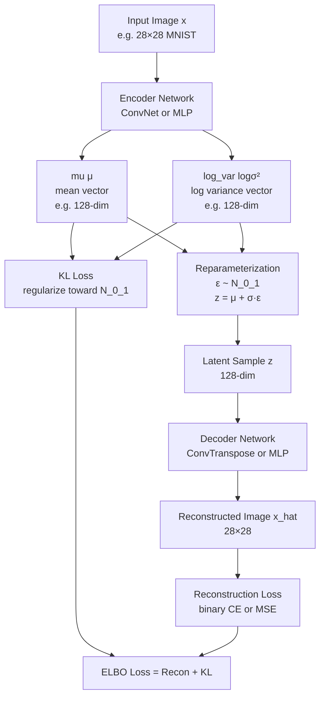

# 🧠 Variational Autoencoder (VAE)

> [!abstract] TL;DR
> A VAE encodes images into a *probability distribution* over latent space (outputting μ and σ, not just a point), then decodes samples from that distribution back to images. The reparameterization trick makes this differentiable: sample z = μ + σ·ε where ε~N(0,1). Trained with ELBO loss = reconstruction quality - KL divergence. The continuous latent space allows interpolation and generation of new samples.

## Intuition — Analogy First

Think of a VAE as a **sophisticated compression algorithm that learns meaningful structure**. A standard autoencoder is like a ZIP file — it compresses the image to a code and decompresses exactly. But ZIP doesn't understand what the image *means*.

A VAE is like a librarian who, instead of giving you a single shelf location (point), says: **"This book is probably somewhere in the Philosophy-Science section, with uncertainty about exactly where."** The uncertainty creates a continuous "meaning space" where nearby points in the latent space correspond to semantically similar images — a face gradually transforming into another as you interpolate.

The key insight: by forcing the encoding to be a *distribution* (not a point), the model must learn a smooth, regular latent space where you can sample anywhere and get a valid image.

## How It Works — Mechanics



**Why map to a distribution?**
- A standard autoencoder maps each input to a single point in latent space
- Points might cluster, leaving gaps where decoding produces garbage
- Forcing a distribution (mean + variance) over each example smooths the latent space
- The KL divergence term pushes all distributions toward N(0,I), filling the space

**Reparameterization trick** — The critical trick that enables backpropagation through sampling:
- Naively: $z \sim \mathcal{N}(\mu, \sigma^2)$ — sampling is not differentiable
- With reparameterization: $z = \mu + \sigma \cdot \varepsilon$, where $\varepsilon \sim \mathcal{N}(0, 1)$
- The stochasticity is "factored out" into $\varepsilon$ (not a parameter)
- Gradients flow through $\mu$ and $\sigma$ unimpeded

**ELBO** (Evidence Lower BOund) — the loss maximized by VAE:
$$\text{ELBO} = \underbrace{\mathbb{E}[\log p(x|z)]}_{\text{reconstruction}} - \underbrace{D_{KL}(q(z|x) \| p(z))}_{\text{regularization}}$$

- Reconstruction term: how well does the decoder reconstruct the input?
- KL term: how close is the posterior $q(z|x)$ to the prior $p(z) = \mathcal{N}(0, I)$?

**KL β-weighting** — A hyperparameter β controls the trade-off. β=1: standard VAE. β>1 (β-VAE): more disentangled latent factors, worse reconstruction quality.

## The Math

**ELBO derivation from marginal likelihood:**
$$\log p(x) \geq \mathbb{E}_{q(z|x)}[\log p(x|z)] - D_{KL}(q(z|x) \| p(z)) = \text{ELBO}$$

**KL divergence (closed form for Gaussians):**
$$D_{KL}(\mathcal{N}(\mu, \sigma^2) \| \mathcal{N}(0, 1)) = \frac{1}{2} \sum_{j=1}^{J} \left(\mu_j^2 + \sigma_j^2 - \log \sigma_j^2 - 1\right)$$

In terms of log-variance $\log\sigma^2 = v$:
$$D_{KL} = \frac{1}{2} \sum_j \left(\mu_j^2 + e^{v_j} - v_j - 1\right)$$

**Reconstruction loss:**
- Binary images (MNIST): Binary cross-entropy
- Natural images: MSE or perceptual loss (VGG features)

**Reparameterization:**
$$z = \mu + \sigma \odot \varepsilon, \quad \varepsilon \sim \mathcal{N}(0, I)$$
$$\sigma = \exp\left(\frac{1}{2} \log\sigma^2\right)$$

## Code Demo

```python
import torch
import torch.nn as nn
import torch.nn.functional as F
from torch.utils.data import DataLoader
from torchvision import datasets, transforms

# --- VAE for MNIST ---
class VAE(nn.Module):
    def __init__(self, input_dim=784, hidden_dim=512, latent_dim=20):
        super().__init__()
        # Encoder
        self.encoder = nn.Sequential(
            nn.Linear(input_dim, hidden_dim),
            nn.ReLU(),
            nn.Linear(hidden_dim, hidden_dim),
            nn.ReLU(),
        )
        self.fc_mu = nn.Linear(hidden_dim, latent_dim)
        self.fc_logvar = nn.Linear(hidden_dim, latent_dim)

        # Decoder
        self.decoder = nn.Sequential(
            nn.Linear(latent_dim, hidden_dim),
            nn.ReLU(),
            nn.Linear(hidden_dim, hidden_dim),
            nn.ReLU(),
            nn.Linear(hidden_dim, input_dim),
            nn.Sigmoid(),   # output in [0,1] for MNIST
        )

    def encode(self, x):
        h = self.encoder(x.view(-1, 784))
        return self.fc_mu(h), self.fc_logvar(h)

    def reparameterize(self, mu, logvar):
        if self.training:
            std = torch.exp(0.5 * logvar)   # σ = exp(logσ²/2)
            eps = torch.randn_like(std)      # ε ~ N(0,1)
            return mu + eps * std            # z = μ + σ·ε
        else:
            return mu   # deterministic at eval time

    def decode(self, z):
        return self.decoder(z)

    def forward(self, x):
        mu, logvar = self.encode(x)
        z = self.reparameterize(mu, logvar)
        recon = self.decode(z)
        return recon, mu, logvar

def vae_loss(recon_x, x, mu, logvar, beta=1.0):
    # Reconstruction: binary cross entropy (per pixel, sum over pixels, mean over batch)
    bce = F.binary_cross_entropy(recon_x, x.view(-1, 784), reduction='sum')
    # KL divergence: closed form for Gaussian q vs N(0,1)
    kl = -0.5 * torch.sum(1 + logvar - mu.pow(2) - logvar.exp())
    return bce + beta * kl

# Training loop
device = torch.device("cuda" if torch.cuda.is_available() else "cpu")
model = VAE(latent_dim=20).to(device)
optimizer = torch.optim.Adam(model.parameters(), lr=1e-3)

transform = transforms.Compose([transforms.ToTensor()])
train_data = datasets.MNIST("data/", train=True, download=True, transform=transform)
loader = DataLoader(train_data, batch_size=128, shuffle=True)

for epoch in range(20):
    model.train()
    total_loss = 0
    for images, _ in loader:
        images = images.to(device)
        optimizer.zero_grad()
        recon, mu, logvar = model(images)
        loss = vae_loss(recon, images, mu, logvar, beta=1.0)
        loss.backward()
        optimizer.step()
        total_loss += loss.item()
    print(f"Epoch {epoch}: loss={total_loss/len(loader):.2f}")

# --- Generation: sample from prior ---
model.eval()
with torch.no_grad():
    z_sample = torch.randn(64, 20).to(device)   # sample from N(0,I)
    generated = model.decode(z_sample)           # decode to images
    generated = generated.view(-1, 1, 28, 28)

# --- Latent space interpolation ---
def interpolate_latent(model, img1, img2, steps=10):
    """Interpolate between two images in latent space."""
    model.eval()
    with torch.no_grad():
        mu1, _ = model.encode(img1)
        mu2, _ = model.encode(img2)
        interpolated = []
        for alpha in torch.linspace(0, 1, steps):
            z = (1 - alpha) * mu1 + alpha * mu2   # linear interpolation
            interpolated.append(model.decode(z).view(1, 28, 28))
    return torch.stack(interpolated)

# --- Convolutional VAE for images ---
class ConvVAE(nn.Module):
    def __init__(self, latent_dim=128):
        super().__init__()
        # Encoder: 3x64x64 → latent
        self.encoder_conv = nn.Sequential(
            nn.Conv2d(3, 32, 4, stride=2, padding=1),   # 32x32
            nn.ReLU(),
            nn.Conv2d(32, 64, 4, stride=2, padding=1),  # 16x16
            nn.ReLU(),
            nn.Conv2d(64, 128, 4, stride=2, padding=1), # 8x8
            nn.ReLU(),
            nn.Conv2d(128, 256, 4, stride=2, padding=1),# 4x4
            nn.ReLU(),
        )
        self.fc_mu = nn.Linear(256 * 4 * 4, latent_dim)
        self.fc_logvar = nn.Linear(256 * 4 * 4, latent_dim)
        self.fc_decode = nn.Linear(latent_dim, 256 * 4 * 4)

        # Decoder: latent → 3x64x64
        self.decoder_conv = nn.Sequential(
            nn.ConvTranspose2d(256, 128, 4, stride=2, padding=1), # 8x8
            nn.ReLU(),
            nn.ConvTranspose2d(128, 64, 4, stride=2, padding=1),  # 16x16
            nn.ReLU(),
            nn.ConvTranspose2d(64, 32, 4, stride=2, padding=1),   # 32x32
            nn.ReLU(),
            nn.ConvTranspose2d(32, 3, 4, stride=2, padding=1),    # 64x64
            nn.Sigmoid(),
        )

    def encode(self, x):
        h = self.encoder_conv(x).view(x.size(0), -1)
        return self.fc_mu(h), self.fc_logvar(h)

    def reparameterize(self, mu, logvar):
        std = torch.exp(0.5 * logvar)
        return mu + std * torch.randn_like(std) if self.training else mu

    def decode(self, z):
        h = F.relu(self.fc_decode(z)).view(-1, 256, 4, 4)
        return self.decoder_conv(h)

    def forward(self, x):
        mu, logvar = self.encode(x)
        return self.decode(self.reparameterize(mu, logvar)), mu, logvar
```

## Real-World Example

**Drug discovery — latent space exploration of molecular structures** — Companies like Insilico Medicine and Recursion Pharmaceuticals use VAE variants (Junction Tree VAE, SMILES-VAE) to map chemical molecules into a continuous latent space. Gradient descent in latent space navigates toward molecules with desired properties (drug-like properties, binding affinity). This is more efficient than exhaustive search over the discrete chemical space of 10^60 possible drug-like molecules.

**Stable Diffusion's image encoding** — Stable Diffusion uses a pretrained VAE to compress 512×512 pixel images to 64×64 latent representations (8× compression per spatial dimension). The diffusion process operates in this latent space — 64× fewer pixels = 64× fewer denoising steps in terms of computational cost. The VAE decoder then converts the denoised latent back to pixels.

## Trade-offs

| Aspect | VAE | GAN | Diffusion |
|---|---|---|---|
| Training stability | Stable (single loss) | Unstable (adversarial) | Very stable |
| Sample quality | Blurry (MSE reconstruction) | Sharp | Sharp |
| Latent space | Continuous, structured | Less structured | N/A (iterative) |
| Generation speed | Fast (1 decode) | Fast (1 forward) | Slow (T steps) |
| Diversity | Good | Mode collapse risk | Excellent |
| Likelihood | Tractable lower bound | No | ELBO form |
| Best for | Encoding, compression | High-fidelity generation | State-of-art generation |

## When to Use vs Avoid

**Use VAE when:** you need a structured, continuous latent space for downstream tasks (interpolation, attribute manipulation, search); when training stability matters; when you need explicit encoding of inputs (like Stable Diffusion's image encoder).

**Avoid VAE when:** output image quality is paramount (use diffusion or GAN); when you only need unconditional generation (diffusion is better); when blurry outputs are unacceptable.

**Use β-VAE (β>1) when:** disentanglement of latent factors is needed (e.g., separate latent dimensions for shape, color, pose).

## Common Pitfalls

1. **KL collapse / posterior collapse** — When the KL term overpowers reconstruction, the encoder maps everything to the prior N(0,I), ignoring the input. Fix: KL annealing (gradually increase β from 0 to 1 during training), free bits, or use LVAE.

2. **Using MSE as reconstruction loss** — MSE treats all pixel errors equally and produces blurry outputs because averaging nearby plausible values is optimal under MSE. Use perceptual loss (VGG features) or combined BCE + perceptual for sharper results.

3. **Not normalizing reconstruction loss** — `reduction='sum'` accumulates over all pixels and batch; `reduction='mean'` averages. Mixing the two makes β meaningless. Be consistent — usually 'sum' over pixels, mean over batch.

4. **Evaluating at μ vs sampling z** — At eval, using μ directly (no noise) gives sharper reconstructions but doesn't test the decoder's ability to handle sampled latents. Test both.

5. **Forgetting to use reparameterization** — Directly sampling z from the distribution breaks backpropagation. The reparameterization trick is essential — z = μ + σ*ε.

## Related Concepts

- [[_MOC_Computer_Vision|↑ Section MOC]]

- [[GAN]] — alternative generative model without latent structure
- [[Diffusion_Models]] — uses VAE as image encoder in Stable Diffusion
- [[Stable_Diffusion]] — latent diffusion built on VAE compression
- [[Attention_Mechanism]] — used in more powerful VAE variants
- [[Loss_Functions]] — ELBO and reconstruction loss details

## Review Questions

1. The reparameterization trick replaces $z \sim \mathcal{N}(\mu, \sigma^2)$ with $z = \mu + \sigma \cdot \varepsilon$, $\varepsilon \sim \mathcal{N}(0,1)$. Why is this trick necessary for training by backpropagation?

2. If you set β=10 in a β-VAE, what happens to reconstruction quality and latent space disentanglement? Why is there a trade-off?

3. Stable Diffusion uses a VAE, but the diffusion process doesn't use the VAE's sampling capability — it only uses encode and decode. What role is the VAE playing and why compress to latent space at all?

## Sources

- [Auto-Encoding Variational Bayes (Kingma & Welling, 2013)](https://arxiv.org/abs/1312.6114)
- [β-VAE: Learning Basic Visual Concepts (Higgins et al., 2017)](https://openreview.net/forum?id=Sy2fchEtm)
- [Tutorial on VAEs (Doersch, 2016)](https://arxiv.org/abs/1606.05908)
- [High-Resolution Image Synthesis with LDM (Rombach et al., 2022)](https://arxiv.org/abs/2112.10752)

#generative-models #VAE #latent-space #reparameterization #ELBO #deep-learning
