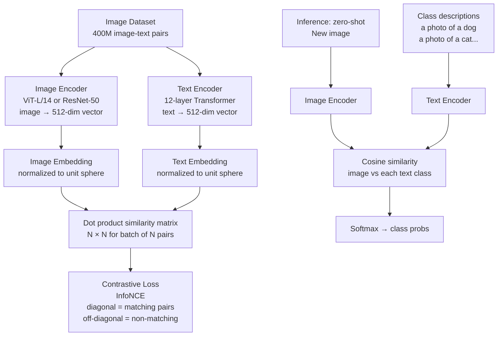

# 🔗 CLIP — Contrastive Language-Image Pretraining

> [!abstract] TL;DR
> CLIP (Radford et al., 2021) trains an image encoder and a text encoder jointly on 400M (image, alt-text) pairs from the internet, using contrastive loss to align their embedding spaces. At inference, no fine-tuning needed: compare image embedding to text embeddings for class descriptions → zero-shot classification. CLIP embeddings are the universal visual-semantic glue used in Stable Diffusion, image search, and multimodal models.

## Intuition — Analogy First

Imagine a student who learned to understand images by reading **photo captions on the internet**. Every time they see "a dog playing in the snow," they see the corresponding photo. Over 400 million such caption-photo pairs, they build an internal understanding of what visual concepts look like.

Ask this student "which of these photos shows a dog?" — they don't need explicit dog-training examples. They match the visual features of each photo against their mental model of "a dog." This is CLIP.

CLIP is a student who learned visual meaning from internet captions — building a shared embedding space where "golden retriever" text and golden retriever photos land in the same neighborhood.

## How It Works — Mechanics



**Contrastive pretraining:**
- Batch of N (image, text) pairs from the internet
- Image encoder produces N image embeddings; text encoder produces N text embeddings
- Compute N×N similarity matrix (dot products)
- Loss: maximize similarity on diagonal (matching pairs), minimize on off-diagonal (non-matching pairs)
- This aligns the two embedding spaces: similar visual content ↔ similar text

**Image encoder:**
- ViT-L/14 (ViT with 14×14 patch, large model) in CLIP's best variant
- Also trained with ResNet variants for efficiency comparison
- Outputs a single 512-dim or 768-dim vector per image

**Text encoder:**
- 12-layer transformer (similar to GPT)
- Maximum 77 token context
- Outputs embedding of [EOS] token as the text representation

**Zero-shot classification:**
1. Define class descriptions: `["a photo of a {classname}" for classname in class_names]`
2. Encode all descriptions with text encoder
3. Encode query image with image encoder
4. Find closest text embedding by cosine similarity → predicted class
5. No task-specific training needed

**CLIP as universal feature extractor:**
- Image embeddings capture semantics beyond class labels
- Used in: Stable Diffusion (text conditioning), image search (embed images + query text), retrieval-augmented generation, VQA, multimodal LLMs (LLaVA)

## The Math

**Contrastive loss (InfoNCE / NT-Xent):**

For a batch of N image-text pairs, let $\{(I_i, T_i)\}_{i=1}^N$:

$$L_I = -\frac{1}{N} \sum_{i=1}^{N} \log \frac{\exp(\text{sim}(I_i, T_i) / \tau)}{\sum_{j=1}^{N} \exp(\text{sim}(I_i, T_j) / \tau)}$$

$$L_T = -\frac{1}{N} \sum_{i=1}^{N} \log \frac{\exp(\text{sim}(T_i, I_i) / \tau)}{\sum_{j=1}^{N} \exp(\text{sim}(T_i, I_j) / \tau)}$$

$$\mathcal{L} = \frac{L_I + L_T}{2}$$

Where $\text{sim}(a, b) = \frac{a \cdot b}{\|a\| \|b\|}$ (cosine similarity) and $\tau$ is a learnable temperature parameter.

The temperature $\tau$ is learned and typically converges to ~0.07.

**Zero-shot classification:**
$$p(y = k | x) = \frac{\exp(\text{sim}(f(x), g(t_k)) / \tau)}{\sum_{j=1}^{C} \exp(\text{sim}(f(x), g(t_j)) / \tau)}$$

Where $f(x)$ = image encoder, $g(t_k)$ = text encoder for class description $t_k$.

## Code Demo

```python
import torch
import torch.nn.functional as F
from transformers import CLIPModel, CLIPProcessor, CLIPTokenizer, CLIPImageProcessor
from PIL import Image
import numpy as np
import requests

device = "cuda" if torch.cuda.is_available() else "cpu"

# --- Load CLIP model ---
model = CLIPModel.from_pretrained("openai/clip-vit-large-patch14")
processor = CLIPProcessor.from_pretrained("openai/clip-vit-large-patch14")
model = model.to(device).eval()

# --- Zero-shot image classification ---
img = Image.open("animal.jpg")

# Define class candidates
class_descriptions = [
    "a photo of a cat",
    "a photo of a dog",
    "a photo of a bird",
    "a photo of a horse",
    "a photo of a fox",
]

inputs = processor(
    text=class_descriptions,
    images=img,
    return_tensors="pt",
    padding=True
).to(device)

with torch.no_grad():
    outputs = model(**inputs)
    logits_per_image = outputs.logits_per_image   # [1, num_classes]
    probs = logits_per_image.softmax(dim=-1)

for desc, prob in zip(class_descriptions, probs[0]):
    print(f"{desc}: {prob.item():.4f}")

# --- Extract image and text embeddings separately ---
img_inputs = processor(images=img, return_tensors="pt").to(device)
text_inputs = processor(text="a golden retriever playing fetch", return_tensors="pt").to(device)

with torch.no_grad():
    image_features = model.get_image_features(**img_inputs)   # [1, 512]
    text_features = model.get_text_features(**text_inputs)    # [1, 512]

# Normalize to unit sphere (important for cosine similarity)
image_features = F.normalize(image_features, dim=-1)
text_features = F.normalize(text_features, dim=-1)

similarity = (image_features @ text_features.T).item()
print(f"Image-text similarity: {similarity:.4f}")

# --- Image-to-image similarity (visual search) ---
img1 = Image.open("cat1.jpg")
img2 = Image.open("cat2.jpg")
img3 = Image.open("dog.jpg")

inputs_batch = processor(images=[img1, img2, img3], return_tensors="pt", padding=True).to(device)
with torch.no_grad():
    features = model.get_image_features(**inputs_batch)
    features = F.normalize(features, dim=-1)

sim_matrix = features @ features.T
print("Similarity matrix:")
print(sim_matrix.cpu().numpy().round(3))
# cat1-cat2 should have high similarity; cat-dog lower

# --- Build image retrieval system ---
from pathlib import Path

def build_image_index(image_paths, model, processor, device, batch_size=32):
    """Embed all images for fast retrieval."""
    all_embeddings = []
    for i in range(0, len(image_paths), batch_size):
        batch_paths = image_paths[i:i+batch_size]
        images = [Image.open(p).convert("RGB") for p in batch_paths]
        inputs = processor(images=images, return_tensors="pt", padding=True).to(device)
        with torch.no_grad():
            embs = model.get_image_features(**inputs)
            embs = F.normalize(embs, dim=-1)
        all_embeddings.append(embs.cpu())
    return torch.cat(all_embeddings, dim=0)

def text_search_images(query_text, embeddings, image_paths, model, processor, device, top_k=5):
    """Find images matching a text query."""
    text_inputs = processor(text=[query_text], return_tensors="pt").to(device)
    with torch.no_grad():
        text_emb = model.get_text_features(**text_inputs)
        text_emb = F.normalize(text_emb, dim=-1)
    similarities = (embeddings.to(device) @ text_emb.T).squeeze()
    top_indices = similarities.topk(top_k).indices
    return [(image_paths[i], similarities[i].item()) for i in top_indices]

# --- OpenCLIP (community extensions with stronger models) ---
import open_clip

# Larger OpenCLIP models (trained on LAION-5B, better than original CLIP)
clip_model, _, preprocess = open_clip.create_model_and_transforms('ViT-H-14', pretrained='laion2b_s32b_b79k')
tokenizer = open_clip.get_tokenizer('ViT-H-14')

with torch.no_grad(), torch.cuda.amp.autocast():
    image_tensor = preprocess(img).unsqueeze(0)
    image_features_oc = clip_model.encode_image(image_tensor)
    image_features_oc = F.normalize(image_features_oc, dim=-1)

    text_tokens = tokenizer(["a photo of a cat", "a photo of a dog"])
    text_features_oc = clip_model.encode_text(text_tokens)
    text_features_oc = F.normalize(text_features_oc, dim=-1)

logits = (image_features_oc @ text_features_oc.T * 100).softmax(dim=-1)
print(f"OpenCLIP predictions: cat={logits[0,0]:.3f}, dog={logits[0,1]:.3f}")

# --- Use CLIP in Stable Diffusion pipeline context ---
# SD uses CLIPTextEncoder to get text conditioning
from diffusers import StableDiffusionPipeline
pipe = StableDiffusionPipeline.from_pretrained("runwayml/stable-diffusion-v1-5")

tokenizer = pipe.tokenizer
text_encoder = pipe.text_encoder

text = "a beautiful sunset over the ocean"
tokens = tokenizer(text, padding="max_length", max_length=77, return_tensors="pt")
with torch.no_grad():
    text_embeddings = text_encoder(tokens.input_ids)[0]   # [1, 77, 768]
print(f"Text embeddings for SD: {text_embeddings.shape}")
```

## Real-World Example

**Stable Diffusion text conditioning** — Every text-to-image generation uses CLIP's text encoder. The text "a golden retriever in a park at sunset" is tokenized (max 77 tokens) and encoded to a 77×768 tensor by the CLIP transformer. This tensor is injected into every U-Net denoising step via cross-attention, making each denoising step "aware" of the text prompt. CLIP's joint training with images means its text embeddings are naturally visual — "sunset" activates visual sunset-like features, not just linguistic ones.

**OpenAI CLIP powers image search** in production at scale. Pinterest Visual Discovery, Bing Image Search, and many product search engines use CLIP embeddings: embed the entire image library once; at query time, encode the text query and find nearest neighbors in embedding space. 100M images searched in <100ms using FAISS or Annoy vector databases.

## Trade-offs

| Model | Zero-shot Top-1 | Embedding Dim | Speed | License |
|---|---|---|---|---|
| CLIP ViT-B/32 | 63.2% | 512 | Fast | OpenAI |
| CLIP ViT-L/14 | 75.3% | 768 | Moderate | OpenAI |
| OpenCLIP ViT-H/14 | 78.0% | 1024 | Slow | CC BY |
| OpenCLIP ViT-G/14 | 80.1% | 1280 | Very slow | CC BY |
| SigLIP ViT-SO/14 | 83.2% | 1152 | Moderate | Apache |

## When to Use vs Avoid

**Use CLIP when:** zero-shot classification without task-specific training; building image search/retrieval; need joint visual-semantic embeddings; text-conditioned generation (SD conditioning).

**Avoid CLIP when:** domain is very different from internet photos (X-ray, satellite, microscopy) — CLIP won't have seen these. Fine-tuned classifiers will outperform zero-shot CLIP on specialized domains.

**Use OpenCLIP** instead of original CLIP for open research — larger models, open weights, stronger performance.

## Common Pitfalls

1. **Template matters for zero-shot** — "dog" vs "a photo of a dog" vs "a photo of a dog, a type of pet" give different results. Use prompt ensembling: average embeddings across multiple templates for +1-2% accuracy.

2. **Not normalizing embeddings** — Cosine similarity requires unit-norm vectors. Always `F.normalize(embeddings, dim=-1)` before computing similarities.

3. **77-token truncation** — Long descriptions are silently truncated. CLIP was trained with short captions — keep descriptions under 50 words.

4. **Temperature misuse** — CLIP's temperature (~0.07) is already applied via `logits_per_image`. If you compute similarities manually, scale by 100 (1/0.01) for comparable magnitudes.

5. **GPU memory for large batches** — Processing 1000 class descriptions simultaneously: 1000×77 tokens through the transformer. Use batching for large class counts.

## Related Concepts

- [[_MOC_Computer_Vision|↑ Section MOC]]

- [[Vision_Transformer_ViT]] — the image encoder backbone in CLIP
- [[Stable_Diffusion]] — uses CLIP text encoder for conditioning
- [[DINO]] — complementary self-supervised approach (no text labels)
- [[Word_Embeddings]] — similar concept of semantic embedding spaces in NLP
- [[Attention_Mechanism]] — cross-attention in SD bridges CLIP to image generation

## Review Questions

1. CLIP is trained with contrastive loss on 400M (image, caption) pairs. Describe exactly what gradient signal the contrastive loss provides for an off-diagonal (mismatched) image-text pair in a batch.

2. For zero-shot classification, you embed the query image and class descriptions into the CLIP embedding space. Why does "a photo of a {classname}" outperform just "{classname}" as the text template?

3. CLIP struggles with medical imaging classification (X-rays, histology). Explain why, and describe a strategy to improve CLIP's performance on medical images.

## Sources

- [Learning Transferable Visual Models From Natural Language Supervision (Radford et al., 2021)](https://arxiv.org/abs/2103.00020)
- [OpenCLIP](https://github.com/mlfoundations/open_clip)
- [SigLIP: Sigmoid Loss for Language Image Pre-Training (Zhai et al., 2023)](https://arxiv.org/abs/2303.15343)
- [CLIP benchmarks (ELEVATER)](https://arxiv.org/abs/2204.08790)

#multimodal #CLIP #contrastive-learning #zero-shot #visual-semantic #modern-architectures
