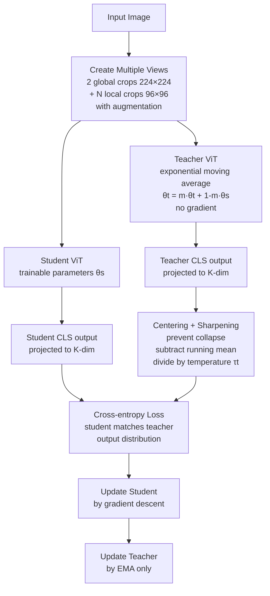

# 🦕 DINO & DINOv2 — Self-Supervised Vision Transformers

> [!abstract] TL;DR
> DINO (Self-**DI**stillation with **NO** Labels) trains ViTs purely from unlabeled images via student-teacher distillation. The teacher is an exponential moving average (EMA) of the student. Remarkably, DINO's attention heads spontaneously learn to segment objects without any segmentation supervision. DINOv2 (2023) trains on 142M curated images with a more stable recipe — its frozen features beat supervised backbones on depth estimation, segmentation, and retrieval tasks without any fine-tuning.

## Intuition — Analogy First

Think of a child learning to see the world **without anyone teaching them labels**. They look at a playground — no one says "that's a slide, that's a child, that's a fence." But they observe consistency: when they look at the same scene from a slightly different angle or after a brief moment, the slide is still the slide, the child is still the child. Objects have consistent identities across views.

DINO teaches a ViT this way. It shows the model two different crops/augmentations of the same image and says: "these should look the same in your representation" — a child recognizing the same slide from two viewpoints. From this consistency constraint alone, across millions of images, the model discovers what makes objects objects.

The magical result: **DINO attention heads autonomously discover object boundaries** — without ever seeing a segmentation mask.

## How It Works — Mechanics



**Why two networks?**

Using the same network as both teacher and student collapses — the trivial solution (output all-zeros for everything) satisfies the loss. Solutions:

1. **EMA teacher**: The teacher is a slowly-updated version of the student — it provides stable, "better-quality" targets that the student tries to match. The student trains by gradient descent; the teacher updates only via moving average.

2. **Centering + Sharpening**: Prevents another collapse mode (all outputs the same):
   - **Centering**: subtract running mean of teacher outputs — no single dimension dominates
   - **Sharpening**: use low temperature $\tau_t = 0.04$ for teacher (sharp distribution), higher $\tau_s = 0.1$ for student

**Multi-crop strategy:**
- 2 global crops (224×224, large crops see most of the image)
- N=6-10 local crops (96×96, small crops see local regions)
- Student processes all crops; teacher processes only global crops
- Loss: student local crop features should match teacher global crop features
- This forces multi-scale representation learning

**Why ViT specifically?**
- CNNs show much weaker emergent properties with DINO
- ViT's self-attention can attend globally → discovers object-level consistency
- ViT's patch tokens are spatially organized → attention maps are interpretable
- The self-attention at the last layer shows semantic segmentation-like maps for free

**DINOv2 improvements over DINO:**
- Curated dataset (LVD-142M): 142M images filtered to high-quality, diverse set using similarity-based curation
- More stable training: adds SwAV regularization, KoLeo regularizer, extra masked image modeling objective
- iBOT objective: predicts masked patches (like BERT for images) in addition to CLS distillation
- Result: dramatically better features — competitive with supervised models on most benchmarks

## The Math

**Loss: cross-entropy between student and teacher distributions:**
$$\mathcal{L}_{DINO} = -\sum_x P_t(x) \log P_s(x)$$

Where:

**Teacher probability (sharpened):**
$$P_t(x) = \text{softmax}\left(\frac{g_{\theta_t}(x) - c}{\tau_t}\right)$$

**Student probability:**
$$P_s(x) = \text{softmax}\left(\frac{g_{\theta_s}(x)}{\tau_s}\right)$$

**EMA teacher update:**
$$\theta_t \leftarrow m \cdot \theta_t + (1-m) \cdot \theta_s, \quad m \in [0.996, 1.0]$$

Momentum $m$ starts at 0.996 and is cosine-annealed toward 1.0 (teacher stabilizes as training progresses).

**Centering update:**
$$c \leftarrow m_c \cdot c + (1-m_c) \cdot \text{mean}(g_{\theta_t}(x_{batch}))$$

**DINOv2 iBOT masked loss:**
$$\mathcal{L}_{iBOT} = -\sum_{i \in M} \sum_x P_t^{patch_i}(x) \log P_s^{patch_i}(x)$$

Where $M$ is the set of masked patch positions.

**k-NN classification (no fine-tuning test):**
$$\hat{y} = \text{argmax}_c \sum_{n \in k\text{-NN}(x)} \mathbf{1}[y_n = c] \cdot \text{sim}(f(x), f(x_n))$$

## Code Demo

```python
import torch
import torch.nn.functional as F
from transformers import AutoImageProcessor, AutoModel
from PIL import Image
import numpy as np
import matplotlib.pyplot as plt

device = "cuda" if torch.cuda.is_available() else "cpu"

# --- DINOv2 feature extraction ---
processor = AutoImageProcessor.from_pretrained("facebook/dinov2-base")
model = AutoModel.from_pretrained("facebook/dinov2-base")   # 86M params
model = model.to(device).eval()

img = Image.open("scene.jpg").convert("RGB")
inputs = processor(images=img, return_tensors="pt").to(device)

with torch.no_grad():
    outputs = model(**inputs)

# last_hidden_state: [1, 257, 768] — 1 CLS + 256 patches for 224px / 14px
cls_token = outputs.last_hidden_state[:, 0, :]     # [1, 768] — global features
patch_tokens = outputs.last_hidden_state[:, 1:, :] # [1, 256, 768] — spatial features
print(f"CLS shape: {cls_token.shape}")
print(f"Patch tokens: {patch_tokens.shape}")

# --- k-NN classification (no fine-tuning) ---
def build_feature_bank(images, labels, model, processor, device):
    """Extract DINOv2 features for a dataset."""
    features, all_labels = [], []
    for img, label in zip(images, labels):
        inputs = processor(images=img, return_tensors="pt").to(device)
        with torch.no_grad():
            feat = model(**inputs).last_hidden_state[:, 0]   # CLS
            feat = F.normalize(feat, dim=-1)
        features.append(feat.cpu())
        all_labels.append(label)
    return torch.cat(features), torch.tensor(all_labels)

def knn_predict(query_features, bank_features, bank_labels, k=20):
    """k-NN classification in feature space."""
    query_features = F.normalize(query_features, dim=-1)
    sims = query_features @ bank_features.T   # [N_query, N_bank]
    top_sims, top_indices = sims.topk(k, dim=-1)
    # Weighted voting
    pred_labels = []
    for i in range(len(query_features)):
        neighbors = bank_labels[top_indices[i]]
        weights = top_sims[i]
        vote = torch.zeros(max(bank_labels).item() + 1)
        for nb, w in zip(neighbors, weights):
            vote[nb] += w
        pred_labels.append(vote.argmax().item())
    return pred_labels

# --- Attention map visualization (emergent segmentation) ---
def get_attention_maps(model, img, processor, device, patch_size=14):
    """Extract last-layer attention maps from DINOv2."""
    # Register hook to get attention weights
    attentions = []
    def hook_fn(module, input, output):
        attentions.append(output)

    # Hook into last transformer block's attention
    handle = model.encoder.layer[-1].attention.attention.register_forward_hook(hook_fn)

    inputs = processor(images=img, return_tensors="pt").to(device)
    h, w = inputs["pixel_values"].shape[-2:]
    n_patches_h = h // patch_size
    n_patches_w = w // patch_size

    with torch.no_grad():
        _ = model(**inputs)
    handle.remove()

    # attentions: [1, num_heads, seq_len, seq_len]
    attn = attentions[0].cpu()    # [1, 12, 257, 257]
    num_heads = attn.shape[1]

    # CLS token attending to all patch tokens
    cls_attn = attn[0, :, 0, 1:]   # [12, 256] — each head's attention from CLS
    cls_attn = cls_attn.reshape(num_heads, n_patches_h, n_patches_w)

    return cls_attn

attn_maps = get_attention_maps(model, img, processor, device)

# Visualize each attention head
fig, axes = plt.subplots(3, 4, figsize=(16, 12))
for i, ax in enumerate(axes.flat):
    if i < attn_maps.shape[0]:
        ax.imshow(attn_maps[i].numpy(), cmap='hot', interpolation='nearest')
        ax.set_title(f"Head {i}")
    ax.axis('off')
plt.suptitle("DINOv2 Attention Maps — Emergent Segmentation")
plt.savefig("dino_attention.png", dpi=150, bbox_inches='tight')

# Average attention map across heads
mean_attn = attn_maps.mean(0).numpy()
# Upsample to image size
import cv2
attn_upsampled = cv2.resize(mean_attn, img.size, interpolation=cv2.INTER_LINEAR)

# Overlay on image
plt.figure(figsize=(12, 5))
plt.subplot(1, 3, 1); plt.imshow(img); plt.title("Original")
plt.subplot(1, 3, 2); plt.imshow(mean_attn, cmap='hot'); plt.title("Avg Attention")
plt.subplot(1, 3, 3)
plt.imshow(img); plt.imshow(attn_upsampled, alpha=0.6, cmap='hot')
plt.title("Attention Overlay")
plt.savefig("dino_overlay.png", dpi=150)

# --- Semantic similarity between images ---
def image_similarity(img1, img2, model, processor, device):
    features = []
    for img in [img1, img2]:
        inputs = processor(images=img, return_tensors="pt").to(device)
        with torch.no_grad():
            feat = model(**inputs).last_hidden_state[:, 0]
            feat = F.normalize(feat, dim=-1)
        features.append(feat)
    return (features[0] @ features[1].T).item()

# --- DINOv2 for dense prediction (depth/segmentation probing) ---
# Patch tokens as spatial feature map
def get_dense_features(model, img, processor, device, patch_size=14):
    """Extract spatial features for dense prediction tasks."""
    inputs = processor(images=img, return_tensors="pt").to(device)
    h, w = inputs["pixel_values"].shape[-2:]

    with torch.no_grad():
        outputs = model(**inputs)
    patch_tokens = outputs.last_hidden_state[:, 1:, :]   # exclude CLS

    n_h, n_w = h // patch_size, w // patch_size
    # Reshape to spatial grid
    spatial_features = patch_tokens.view(1, n_h, n_w, -1).permute(0, 3, 1, 2)
    return spatial_features   # [1, 768, 14, 14] for 224px input

spatial_feat = get_dense_features(model, img, processor, device)
print(f"Dense features for downstream: {spatial_feat.shape}")
# Can upsample and pass to lightweight linear decoder for depth/segmentation
```

## Real-World Example

**Meta's DINOv2 in robotics and 3D reconstruction** — Meta deploys DINOv2 features as the backbone for robot grasping policies (where to grasp novel objects) and 3D reconstruction tasks (consistent features across views for camera pose estimation). Because DINOv2 was trained without task-specific supervision, a single frozen backbone generalizes to all these tasks with minimal task-specific heads.

**Autonomous driving** — DINOv2 features have been shown to enable monocular depth estimation with a simple linear decoder (no U-Net, just one linear layer) that outperforms specialized trained models. The frozen ViT backbone captures enough geometric information from self-supervised training that explicit depth supervision is barely needed.

**Biomedical imaging** — Pathology labs fine-tune DINOv2 on histology images (H&E stained tissue). The self-supervised pretraining provides better initialization than ImageNet supervised pretraining for the visual structure of tissue, resulting in better cancer classification with fewer labeled slides.

## Trade-offs

| Model | ImageNet k-NN | Fine-tuned Top-1 | Params | Training Data |
|---|---|---|---|---|
| DINO ViT-S/16 | 74.5% | 81.1% | 21M | ImageNet-1K |
| DINO ViT-B/8 | 77.3% | 83.1% | 86M | ImageNet-1K |
| DINOv2 ViT-S/14 | 79.0% | 84.1% | 21M | LVD-142M |
| DINOv2 ViT-B/14 | 82.1% | 86.2% | 86M | LVD-142M |
| DINOv2 ViT-L/14 | 83.5% | 87.0% | 307M | LVD-142M |
| DINOv2 ViT-g/14 | 83.5% | 86.5% | 1.1B | LVD-142M |

## When to Use vs Avoid

**Use DINOv2 when:** strong universal features needed without fine-tuning, domain requires spatial features (depth, segmentation), self-supervised pretraining is valuable (limited labels), or attention maps are needed for interpretability.

**Use CLIP when:** cross-modal text-image tasks, zero-shot classification with text descriptions.

**Use supervised ViT when:** large labeled dataset is available in the target domain and maximum accuracy is needed with fine-tuning.

## Common Pitfalls

1. **Using DINO v1 instead of DINOv2** — DINOv2 is dramatically better. Always use `facebook/dinov2-*` models from HuggingFace.

2. **Wrong patch size for attention maps** — DINOv2 models use patch_size=14 (not 16). At 224×224 input: 16×16 = 256 patches, n_h=n_w=16. Calculating wrong spatial grid produces garbled attention maps.

3. **Not normalizing features for k-NN** — k-NN similarity uses dot product; unnormalized features have different magnitudes. Always `F.normalize(features, dim=-1)`.

4. **Expecting text-aligned features** — Unlike CLIP, DINO features are purely visual — you cannot compare DINOv2 image features with text embeddings. For text-image matching, use CLIP.

5. **GPU memory with register tokens** — DINOv2-registers (improved version with register tokens) has 4 extra tokens in the sequence. Account for the extra tokens when indexing patch features.

## Related Concepts

- [[_MOC_Computer_Vision|↑ Section MOC]]

- [[Vision_Transformer_ViT]] — the architecture DINO trains
- [[CLIP]] — complementary self-supervised approach using text supervision
- [[Semantic_Segmentation]] — DINO attention maps provide free segmentation
- [[Depth_Estimation]] — DINOv2 features enable state-of-art depth without labels

## Review Questions

1. DINO uses an exponential moving average (EMA) teacher instead of gradient updates. Why is direct gradient update on the teacher disallowed, and what would happen if both student and teacher were updated by gradient descent?

2. DINO attention maps spontaneously segment objects without any segmentation supervision. What property of the self-supervised training objective causes this emergent behavior?

3. DINOv2 achieves 82.1% k-NN classification on ImageNet — no linear layer, no fine-tuning, just nearest-neighbor search in feature space. What does this tell you about the structure of the DINOv2 feature space compared to a supervised ResNet's feature space?

## Sources

- [Emerging Properties in Self-Supervised Vision Transformers (Caron et al., 2021)](https://arxiv.org/abs/2104.14294)
- [DINOv2: Learning Robust Visual Features without Supervision (Oquab et al., 2023)](https://arxiv.org/abs/2304.07193)
- [Vision Transformers Need Registers (Darcet et al., 2023)](https://arxiv.org/abs/2309.16588)
- [HuggingFace DINOv2 model card](https://huggingface.co/facebook/dinov2-base)

#self-supervised #DINO #DINOv2 #ViT #emergent-segmentation #student-teacher
