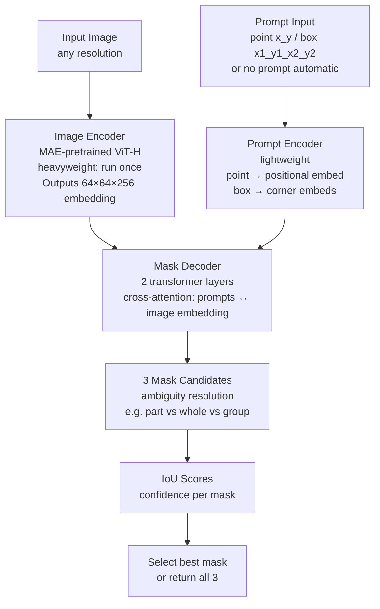

# ✂️ Segment Anything Model (SAM)

> [!abstract] TL;DR
> SAM (Kirillov et al., 2023) is a promptable segmentation foundation model: given an image plus a prompt (point, bounding box, or text), it produces a precise binary mask for the target object — zero-shot, on arbitrary images. The image encoder is a MAE-pretrained ViT; prompts are processed by a lightweight prompt encoder; a mask decoder outputs 3 candidate masks. SAM2 extends this to video. Powers production apps like Meta's Instagram and Adobe Photoshop.

## Intuition — Analogy First

Imagine **universal scissors that understand intent**. Normal scissors cut where you physically move them. These special scissors only need a **tap on the object** — and they trace the exact outline automatically. Tap a dog → scissors trace the dog's silhouette precisely. Tap the background → trace the background. Draw a box around a car → car is perfectly cut out.

SAM is those scissors. It requires only a minimal prompt — a single point, a bounding box, or even nothing (automatic segmentation mode) — and returns a pixel-perfect mask for whatever you indicated. It works on any image: photos, medical scans, satellite imagery, paintings — all zero-shot, with no domain-specific training.

## How It Works — Mechanics



**Three-component architecture:**

**1. Image Encoder (ViT-H):**
- MAE (Masked Autoencoder) pretrained ViT-H (huge)
- Patch size 16; processes images at 1024×1024
- Outputs image embedding: 64×64×256 spatial feature map
- This is the expensive computation — run once, cache for interactive use

**2. Prompt Encoder:**
- **Points**: Each point is encoded as positional embedding + learned embedding for "foreground" or "background"
- **Bounding box**: Encoded as two corner points (top-left + bottom-right)
- **Text**: Originally not in SAM v1; added via CLIP in Grounded-SAM
- **No prompt (automatic mode)**: A regular grid of points as automatic prompt

**3. Mask Decoder:**
- 2 transformer decoder layers
- Prompt tokens attend to image features via cross-attention
- Image features attend to prompt tokens (bidirectional exchange)
- Output tokens decoded to 3 masks (handles ambiguity: a click on a person could mean the face, the torso, or the whole person)
- Plus IoU confidence prediction per mask

**3 mask candidates — ambiguity handling:**
SAM doesn't guess which scale you meant. It returns 3 masks corresponding to different interpretations:
1. Whole object (the person)
2. Part (the shirt)
3. Sub-part or larger group

The IoU score predicts which is "best" but all 3 are available.

**Automatic segmentation mode:**
SAM densely samples a grid of points across the image, generates masks for each, then applies NMS-like deduplication to return a complete segmentation of the entire image — no prompts required.

**SAM2 (2024) — extends to video:**
- Adds a memory module: stores features from previous frames
- Tracks the segmented object across video frames
- Handle object disappearance/reappearance
- Same prompt interface: click once, track through video
- Faster image encoder (Hiera architecture instead of ViT-H)
- Both video and image segmentation in one model

**Training data — SA-1B dataset:**
- Meta created a dataset of 11 million images with 1.1 billion masks
- Semi-automatic annotation: model-assisted labeling loop
- Most diverse segmentation dataset ever created
- Released publicly to enable research

## The Math

**Image encoder (ViT-H):**
$$z_{img} = \text{ViT-H}(x) \in \mathbb{R}^{64 \times 64 \times 256}$$

**Prompt embeddings:**
- Foreground point at $(x, y)$: $e_p = \text{PE}(x, y) + e_{fg}$
- Background point at $(x, y)$: $e_p = \text{PE}(x, y) + e_{bg}$
- Box at $(x_1, y_1, x_2, y_2)$: $e_{box} = [\text{PE}(x_1, y_1) + e_{tl}; \text{PE}(x_2, y_2) + e_{br}]$

**Mask decoder cross-attention (simplified):**
$$Q = \text{tokens} + \text{pos}, \quad K = V = z_{img} + \text{pos}_{img}$$
$$\text{Updated tokens} = Q + \text{Attention}(Q, K, V)$$

Tokens include: prompt embeddings + output mask tokens + IoU token.

**Loss:**
$$\mathcal{L} = \lambda_1 \mathcal{L}_{focal} + \lambda_2 \mathcal{L}_{dice} + \lambda_3 \mathcal{L}_{IoU}$$

- Focal loss on binary mask: handles foreground/background imbalance
- Dice loss: better IoU metric optimization
- MSE on predicted IoU scores vs actual IoU

**Predicted IoU score** guides mask selection:
$$\text{Best mask} = \arg\max_k \hat{\text{IoU}}_k$$

## Code Demo

```python
import torch
import numpy as np
from PIL import Image
from transformers import SamModel, SamProcessor
import matplotlib.pyplot as plt
import cv2

device = "cuda" if torch.cuda.is_available() else "cpu"

# Load SAM
model = SamModel.from_pretrained("facebook/sam-vit-huge").to(device)
processor = SamProcessor.from_pretrained("facebook/sam-vit-huge")
model.eval()

img = Image.open("photo.jpg").convert("RGB")

# --- Point-prompted segmentation ---
# Click at (x=400, y=300) to segment object there
input_points = [[[400, 300]]]   # [[[x, y]]] — 3 levels: batch, objects, points
inputs = processor(
    img,
    input_points=input_points,
    return_tensors="pt"
).to(device)

with torch.no_grad():
    outputs = model(**inputs)

masks = processor.image_processor.post_process_masks(
    outputs.pred_masks.cpu(),
    inputs["original_sizes"].cpu(),
    inputs["reshaped_input_sizes"].cpu(),
)
# masks[0] shape: [1, 3, H, W] — batch 0, 3 candidate masks, full resolution
scores = outputs.iou_scores.cpu()     # [1, 1, 3] — IoU confidence per mask

best_mask_idx = scores[0, 0].argmax().item()
best_mask = masks[0][0, best_mask_idx].numpy()   # [H, W] boolean

# Visualize
def show_mask(mask, image, ax, color=(30/255, 144/255, 255/255, 0.5)):
    h, w = mask.shape
    mask_rgba = np.zeros((h, w, 4))
    mask_rgba[mask] = color
    ax.imshow(image)
    ax.imshow(mask_rgba)

fig, axes = plt.subplots(1, 3, figsize=(18, 6))
for i in range(3):
    show_mask(masks[0][0, i].numpy(), img, axes[i])
    axes[i].set_title(f"Mask {i+1} — IoU: {scores[0,0,i]:.3f}")
    axes[i].axis("off")
plt.savefig("sam_masks.png")

# --- Box-prompted segmentation ---
# Provide bounding box [x1, y1, x2, y2]
input_boxes = [[[75, 275, 1725, 850]]]
inputs_box = processor(img, input_boxes=input_boxes, return_tensors="pt").to(device)
with torch.no_grad():
    outputs_box = model(**inputs_box)
masks_box = processor.image_processor.post_process_masks(
    outputs_box.pred_masks.cpu(),
    inputs_box["original_sizes"].cpu(),
    inputs_box["reshaped_input_sizes"].cpu(),
)
box_mask = masks_box[0][0, 0].numpy()   # take first (best IoU) mask

# --- Multiple points: foreground + background ---
# Foreground point (object): [x, y] with label 1
# Background point (not object): [x, y] with label 0
input_points_multi = [[[400, 300], [100, 100]]]   # 2 points
input_labels = [[1, 0]]   # 1=foreground, 0=background
inputs_multi = processor(
    img,
    input_points=input_points_multi,
    input_labels=input_labels,
    return_tensors="pt"
).to(device)
with torch.no_grad():
    outputs_multi = model(**inputs_multi)

# --- Automatic segmentation (no prompts — segment everything) ---
from transformers import pipeline as hf_pipeline

sam_auto = hf_pipeline(
    "mask-generation",
    model="facebook/sam-vit-base",   # smaller for demo
    device=device,
)

auto_outputs = sam_auto(img, points_per_batch=64)
# Returns list of {"segmentation": np.array, "area": int, "stability_score": float, ...}
masks_auto = auto_outputs["masks"]
print(f"Found {len(masks_auto)} automatic segments")

# Visualize all segments
def show_all_masks(masks, image):
    fig, ax = plt.subplots(figsize=(10, 10))
    ax.imshow(image)
    colors = plt.cm.rainbow(np.linspace(0, 1, len(masks)))
    for mask_info, color in zip(masks, colors):
        mask_np = np.array(mask_info["segmentation"])
        overlay = np.zeros((*mask_np.shape, 4))
        overlay[mask_np] = [*color[:3], 0.5]
        ax.imshow(overlay)
    ax.axis("off")
    plt.savefig("sam_auto_all.png")

show_all_masks(masks_auto, img)

# --- Grounded SAM: text prompt via GroundingDINO + SAM ---
# First: GroundingDINO detects boxes from text
# Then: SAM segments inside those boxes
# (requires additional groundingdino library)
"""
from groundingdino.util.inference import load_model, predict
groundingdino_model = load_model(...)
boxes, logits, phrases = predict(groundingdino_model, img_tensor, "cat . dog .", 0.3, 0.25)
# Then pass boxes to SAM
"""

# --- SAM2 for video segmentation (HuggingFace) ---
from transformers import SAM2VideoPredictor
predictor = SAM2VideoPredictor.from_pretrained("facebook/sam2-hiera-large")

# For video: provide frame paths, click on object in first frame
video_dir = "frames/"
with torch.inference_mode(), torch.autocast("cuda", dtype=torch.bfloat16):
    state = predictor.init_state(video_path=video_dir)
    # Add first-frame click
    _, out_obj_ids, out_mask_logits = predictor.add_new_points_or_box(
        inference_state=state,
        frame_idx=0,
        obj_id=1,                        # track as object 1
        points=np.array([[400, 300]]),
        labels=np.array([1]),            # foreground
    )
    # Propagate through all frames
    for frame_idx, object_ids, mask_logits in predictor.propagate_in_video(state):
        masks = (mask_logits > 0).cpu().numpy()   # [N_objects, 1, H, W]
        # Save tracked mask per frame
```

## Real-World Example

**Meta Instagram — Object Selection** — SAM powers the object selection tool in Instagram Stories. When you tap an object in a photo to add a sticker or cutout, SAM segments it in real-time. Meta runs a compressed SAM variant optimized for mobile inference (MobileSAM, or EfficientSAM) to keep latency under 100ms on device.

**Adobe Photoshop Generative Fill** — Photoshop's AI object removal and generative fill uses a combination of SAM (for precise selection) and diffusion models (for infilling). Select a region with SAM → diffusion inpaints it. The SAM segmentation quality is critical for clean edges in professional photo editing.

**Medical imaging** — SAM has been adapted for medical image segmentation (MedSAM): fine-tuned on 1.5M medical image-mask pairs from CT, MRI, and microscopy. With one click on a tumor, SAM delineates it precisely — providing radiologist-level assistance without per-organ training.

## Trade-offs

| Model | Zero-shot Ability | Speed | Resolution | Video |
|---|---|---|---|---|
| SAM (ViT-H) | Excellent | ~50ms/image GPU | 1024px | No |
| SAM (ViT-B) | Good | ~20ms/image GPU | 1024px | No |
| MobileSAM | Good | ~12ms/image GPU | 1024px | No |
| EfficientSAM | Very good | ~15ms/image GPU | 1024px | No |
| SAM2 | Excellent | ~35ms/frame GPU | 1024px | Yes |
| Mask R-CNN | Supervised only | ~50ms | Full res | No |

## When to Use vs Avoid

**Use SAM when:** interactive or automatic segmentation on arbitrary images, zero-shot domain transfer (medical, satellite), user-controlled object selection, need multiple candidate masks.

**Use Mask R-CNN when:** you have labeled training data for your specific categories, need to segment specific object classes consistently, real-time production where SAM's ViT-H is too slow.

**Use SAM2 when:** video segmentation needed, want to track objects through time after a single click.

**Avoid SAM for:** precise boundary tasks on complex textures (SAM's 256×256 mask output bilinearly upsampled may miss fine details); when class-specific segmentation is needed (SAM is class-agnostic).

## Common Pitfalls

1. **Wrong input_points nesting** — `input_points` must be `[[[x, y]]]` (3 levels: batch × points_per_object × xy). Passing `[[x, y]]` or `[[[x, y, label]]]` causes shape errors.

2. **Not post-processing masks** — `outputs.pred_masks` are at the model's internal resolution (256×256). Must call `processor.image_processor.post_process_masks()` to upsample to original image size.

3. **Using ViT-H for real-time** — SAM ViT-H is too slow for interactive applications. Use MobileSAM or SAM ViT-B for <20ms inference. ViT-H is appropriate for batch processing or when quality matters most.

4. **Confusing SAM with a classifier** — SAM is class-agnostic: it segments "something" at the prompted location. It doesn't know if that something is a cat or a car. Combine with CLIP or a classifier for labeled segmentation.

5. **Not caching the image embedding** — The image encoder (ViT-H) is the expensive part (~45ms). For interactive use, compute and cache the embedding once, then run fast mask decoder for each user prompt (<5ms). The SAM2 predictor handles this automatically.

## Related Concepts

- [[_MOC_Computer_Vision|↑ Section MOC]]

- [[Instance_Segmentation]] — Mask R-CNN: supervised alternative; SAM is zero-shot
- [[Vision_Transformer_ViT]] — SAM's image encoder backbone (MAE-pretrained ViT-H)
- [[Object_Detection]] — Grounded-SAM combines detection + SAM for text-prompted segmentation
- [[Semantic_Segmentation]] — SAM outputs instance masks; combine with class labels for semantic

## Review Questions

1. SAM returns 3 candidate masks per prompt rather than 1. What problem does this solve, and how does the IoU score help users choose the right mask?

2. SAM's image encoder (ViT-H) is run once and cached, while the mask decoder runs per prompt. Why is this design critical for interactive applications, and how does it change the latency calculation?

3. You want to build a medical image segmentation tool for liver tumor delineation. Would you use SAM zero-shot, fine-tune SAM on tumor data (MedSAM approach), or train Mask R-CNN from scratch? Justify your choice.

## Sources

- [Segment Anything (Kirillov et al., 2023)](https://arxiv.org/abs/2304.02643)
- [SAM 2: Segment Anything in Images and Videos (Ravi et al., 2024)](https://arxiv.org/abs/2408.00714)
- [MedSAM (Ma et al., 2024)](https://arxiv.org/abs/2304.12306)
- [Grounded-SAM](https://github.com/IDEA-Research/Grounded-Segment-Anything)

#SAM #segment-anything #foundation-model #zero-shot-segmentation #ViT #promptable
