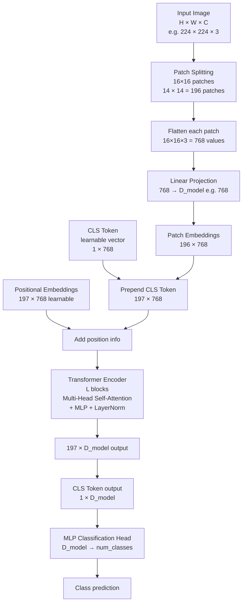

# 🔷 Vision Transformer (ViT)

> [!abstract] TL;DR
> ViT (Dosovitskiy et al., 2020) applies the standard NLP Transformer directly to images by treating non-overlapping 16×16 pixel patches as tokens. A learnable CLS token aggregates global information for classification. ViT needs more training data than CNNs but scales better — ViT-22B outperforms all CNNs on ImageNet. DINOv2 proves ViT features are strong universal visual representations without supervised labels.

## Intuition — Analogy First

Imagine **reading an image as a sequence of words in a sentence**. Cut the image into a grid of small tiles (say 16×16 pixels each). Each tile becomes a "word" — a patch token. The transformer reads the sequence of all these tiles left-to-right, top-to-bottom, attending to relationships between any two tiles regardless of their distance (global attention from tile 1 to tile 196).

A CNN is like reading with **tunnel vision** — the 3×3 kernel only sees 9 pixels at once. A ViT is like reading with **peripheral vision** — it simultaneously sees all tiles and can relate the sky patch to the grass patch at opposite ends of the image from the very first layer.

The trade-off: CNNs have built-in translation invariance (same filter at every position); ViTs must *learn* this from data — which requires much more data but ultimately learns more flexible representations.

## How It Works — Mechanics



**Patch embeddings:**
- Split image into `(H/p) × (W/p)` non-overlapping patches of size `p×p` (default p=16)
- Flatten each patch: `p×p×C` → vector of length `p²C` (16×16×3 = 768)
- Project to model dimension D via linear layer: `768 → D`

**CLS token:**
- A special learnable vector prepended to the patch sequence (position 0)
- After transformer processing, the CLS output represents the whole image
- Used for classification (analogous to BERT's [CLS] token)

**Positional embeddings:**
- Patches have no spatial order for the transformer (it's a set)
- Add learnable positional embeddings (one per position including CLS) to inject spatial information
- Standard: 1D learnable; alternatives: 2D, sinusoidal, RoPE

**Transformer encoder (standard):**
- L identical blocks, each with:
  - Multi-Head Self-Attention (patches attend to all other patches)
  - MLP (two linear layers with GELU)
  - LayerNorm pre-norm (pre-norm ViT is more stable than post-norm)
  - Residual connections

**Why ViT needs more data:**
- CNNs have strong inductive biases: locality (nearby pixels relate), translation equivariance
- ViT has no such biases — must learn them from data
- On ImageNet-21K (14M images), ViT matches or exceeds CNNs
- DINOv2 uses 142M curated images for self-supervised ViT training

**DINO / DINOv2 self-supervised ViT** — Removes the need for labels. Uses a student-teacher distillation framework where both networks are ViTs, the teacher is an exponential moving average of the student. Remarkably, the attention heads learn to segment objects without any segmentation supervision.

## The Math

**Number of patches:**
$$N = \frac{H}{p} \times \frac{W}{p} = \frac{224}{16} \times \frac{224}{16} = 14 \times 14 = 196$$

**Sequence length** (with CLS token):
$$N_{seq} = N + 1 = 197$$

**Patch embedding projection:**
$$\mathbf{e}_i = \mathbf{W}_e \cdot \text{flatten}(\mathbf{p}_i) + \mathbf{b}_e, \quad \mathbf{W}_e \in \mathbb{R}^{D \times p^2 C}$$

**Multi-Head Self-Attention:**
$$\text{MHSA}(X) = \text{Concat}(\text{head}_1, ..., \text{head}_h) W^O$$

$$\text{head}_i = \text{Attention}(XW_i^Q, XW_i^K, XW_i^V)$$

$$\text{Attention}(Q, K, V) = \text{softmax}\left(\frac{QK^T}{\sqrt{d_k}}\right) V$$

**Parameter count (ViT-B/16):**
- Patch embedding: $p^2 C \times D = 768 \times 768 = 590K$
- Per block: MHSA ($4D^2$) + MLP ($8D^2$) ≈ $12D^2 = 7.1M$
- 12 blocks × 7.1M + 590K ≈ **86M parameters total**

## Code Demo

```python
import torch
import torch.nn as nn
from transformers import (
    ViTModel,
    ViTForImageClassification,
    ViTFeatureExtractor,
    AutoFeatureExtractor,
)
from torchvision.models import vit_b_16, ViT_B_16_Weights
from PIL import Image

# --- torchvision ViT (classification) ---
weights = ViT_B_16_Weights.DEFAULT
model = vit_b_16(weights=weights)
model.eval()

preprocess = weights.transforms()
img = Image.open("cat.jpg")
tensor = preprocess(img).unsqueeze(0)

with torch.no_grad():
    logits = model(tensor)   # [1, 1000]
    probs = torch.softmax(logits, dim=-1)
    top5 = probs.topk(5)
print([weights.meta["categories"][i] for i in top5.indices[0]])

# --- HuggingFace ViT (more flexible) ---
feature_extractor = AutoFeatureExtractor.from_pretrained("google/vit-base-patch16-224")
hf_vit = ViTForImageClassification.from_pretrained("google/vit-base-patch16-224")
hf_vit.eval()

inputs = feature_extractor(images=img, return_tensors="pt")
with torch.no_grad():
    outputs = hf_vit(**inputs)
logits = outputs.logits
predicted_class = hf_vit.config.id2label[logits.argmax(-1).item()]
print(f"Predicted: {predicted_class}")

# --- Feature extraction (no classification head) ---
vit_encoder = ViTModel.from_pretrained("google/vit-base-patch16-224")
vit_encoder.eval()

inputs = feature_extractor(images=img, return_tensors="pt")
with torch.no_grad():
    outputs = vit_encoder(**inputs)

# last_hidden_state: [1, 197, 768] — all tokens (CLS + 196 patches)
all_tokens = outputs.last_hidden_state
cls_token = all_tokens[:, 0, :]       # [1, 768] — CLS: global representation
patch_tokens = all_tokens[:, 1:, :]   # [1, 196, 768] — spatial features
print(f"CLS embedding: {cls_token.shape}")
print(f"Patch embeddings: {patch_tokens.shape}")

# Reshape patch tokens to spatial grid
patch_grid = patch_tokens.view(1, 14, 14, 768).permute(0, 3, 1, 2)   # [1, 768, 14, 14]
print(f"Spatial patch features: {patch_grid.shape}")   # can use as CNN feature map

# --- Fine-tuning ViT on custom dataset ---
class ViTClassifier(nn.Module):
    def __init__(self, num_classes, freeze_backbone=False):
        super().__init__()
        self.vit = ViTModel.from_pretrained("google/vit-base-patch16-224")
        if freeze_backbone:
            for p in self.vit.parameters():
                p.requires_grad = False
        self.classifier = nn.Linear(768, num_classes)   # CLS dim → classes

    def forward(self, pixel_values):
        outputs = self.vit(pixel_values=pixel_values)
        cls = outputs.last_hidden_state[:, 0, :]   # CLS token
        return self.classifier(cls)

classifier = ViTClassifier(num_classes=10)

# --- Attention map visualization (DINOv2-style) ---
def visualize_attention_maps(model, img_tensor, patch_size=16):
    """Show self-attention for the CLS token — reveals what ViT focuses on."""
    model.eval()
    hook_output = []

    def hook_fn(module, input, output):
        hook_output.append(output)

    # Register hook on last attention layer
    handle = model.vit.encoder.layer[-1].attention.attention.register_forward_hook(hook_fn)

    with torch.no_grad():
        _ = model(pixel_values=img_tensor)
    handle.remove()

    # attention: [batch, heads, seq_len, seq_len]
    attn = hook_output[0]
    # CLS attention to all patches: [batch, heads, 1, 196]
    cls_attn = attn[:, :, 0, 1:]    # skip CLS attending to itself
    cls_attn_mean = cls_attn.mean(dim=1).squeeze()   # mean over heads: [196]
    attn_map = cls_attn_mean.view(14, 14).cpu().numpy()   # [14, 14] spatial
    return attn_map

# --- ViT from scratch (educational) ---
class ViTScratch(nn.Module):
    def __init__(self, image_size=224, patch_size=16, in_channels=3,
                 embed_dim=768, depth=12, num_heads=12, num_classes=1000):
        super().__init__()
        num_patches = (image_size // patch_size) ** 2
        self.patch_embed = nn.Conv2d(
            in_channels, embed_dim,
            kernel_size=patch_size, stride=patch_size   # equivalent to patch extraction + linear projection
        )
        self.cls_token = nn.Parameter(torch.randn(1, 1, embed_dim))
        self.pos_embed = nn.Parameter(torch.randn(1, num_patches + 1, embed_dim))
        self.dropout = nn.Dropout(0.1)

        encoder_layer = nn.TransformerEncoderLayer(
            d_model=embed_dim, nhead=num_heads, dim_feedforward=embed_dim*4,
            dropout=0.1, activation='gelu', batch_first=True, norm_first=True   # pre-norm
        )
        self.transformer = nn.TransformerEncoder(encoder_layer, num_layers=depth)
        self.norm = nn.LayerNorm(embed_dim)
        self.head = nn.Linear(embed_dim, num_classes)

    def forward(self, x):
        B = x.size(0)
        # Patch embedding: B × C × H × W → B × N × D
        x = self.patch_embed(x)             # B × embed_dim × 14 × 14
        x = x.flatten(2).transpose(1, 2)    # B × 196 × embed_dim
        # Prepend CLS token
        cls = self.cls_token.expand(B, -1, -1)
        x = torch.cat([cls, x], dim=1)      # B × 197 × embed_dim
        # Add positional embedding
        x = self.dropout(x + self.pos_embed)
        # Transformer
        x = self.transformer(x)
        x = self.norm(x)
        # CLS classification
        return self.head(x[:, 0])

model = ViTScratch()
out = model(torch.randn(2, 3, 224, 224))
print(f"ViT output: {out.shape}")   # [2, 1000]
```

## Real-World Example

**Google ViT-22B** (2023) — Google trained a 22-billion parameter ViT on a curated dataset of billions of images. At that scale, ViT outperforms all known CNN architectures. The model demonstrates that transformer scaling laws from NLP carry over to vision: more parameters + more data = better performance, without architectural changes. This model is used in Google Search's visual understanding systems.

**DINOv2 (Meta, 2023)** — A ViT-g trained self-supervised on 142M curated images. DINOv2 features serve as universal visual backbones: frozen DINOv2 features + a linear classifier beat supervised ResNet-50 on ImageNet, depth estimation, segmentation, and many specialized vision tasks — without any task-specific fine-tuning of the backbone.

## Trade-offs

| Model | ImageNet Top-1 | Params | Data Needed | FLOPs |
|---|---|---|---|---|
| ResNet-50 | 76.1% | 25M | Low | 4.1G |
| ViT-B/16 (ImageNet-1K) | 77.9% | 86M | Medium | 17.6G |
| ViT-B/16 (ImageNet-21K) | 81.8% | 86M | High | 17.6G |
| ViT-L/16 (ImageNet-21K) | 85.0% | 307M | Very high | 61.6G |
| DINOv2 ViT-g | 86.5% | 1.1B | Huge | 311G |
| ViT-22B | 89.5% | 22B | Enormous | — |

## When to Use vs Avoid

**Use ViT when:** large training data is available, need maximum accuracy, want universal feature representations (DINOv2), or building multimodal models (CLIP, LLaVA).

**Use CNN when:** limited data, want faster inference, need strong translation equivariance built in, or deploying to mobile/edge.

**Use ViT-B/16 pretrained** as default starting point for new tasks — strong general features, reasonable size (86M), good HuggingFace support.

**Use DINOv2** when you want to extract features without fine-tuning the backbone.

## Common Pitfalls

1. **Training from scratch on small datasets** — ViT requires at least 100K images. With fewer, CNN outperforms ViT. Use pretrained ViT + fine-tuning.

2. **Wrong input resolution** — ViT-B/16 was pretrained at 224×224. Using different resolution at fine-tuning requires interpolating positional embeddings (`interpolate_pos_encoding` flag in HuggingFace).

3. **Forgetting CLS token indexing** — `outputs.last_hidden_state[:, 0]` is CLS; `[:, 1:]` are patch tokens. Accidently using mean of all tokens (including CLS) slightly changes behavior.

4. **Large batch requirement** — ViT trains poorly with tiny batches (unlike CNN + BN). Use at least batch_size=512 or use gradient accumulation.

5. **Slow training without fused attention** — Use `torch.nn.functional.scaled_dot_product_attention` (PyTorch 2.0+ FlashAttention) for 2-4× training speedup.

## Related Concepts

- [[_MOC_Computer_Vision|↑ Section MOC]]

- [[Transformer_Architecture]] — the full attention mechanism ViT uses
- [[Attention_Mechanism]] — self-attention connecting patches globally
- [[DINO]] — self-supervised ViT training
- [[CLIP]] — ViT as image encoder in contrastive learning
- [[CNN_Fundamentals]] — the preceding paradigm; contrast for understanding

## Review Questions

1. ViT-B/16 has no convolutions yet achieves better ImageNet accuracy than ResNet-50 when pretrained on ImageNet-21K. What inductive biases does ResNet have that ViT lacks, and why does scale compensate for their absence?

2. You have a 512×512 image and a ViT pretrained on 224×224. How many patch tokens does the 512×512 image produce with patch_size=16, and what issue does this cause with positional embeddings?

3. ViT's CLS token attends to all 196 patch tokens via self-attention. How does this differ from a CNN classifier's view of the image, and when would ViT's global attention be advantageous?

## Sources

- [An Image is Worth 16×16 Words: Transformers for Image Recognition at Scale (Dosovitskiy et al., 2020)](https://arxiv.org/abs/2010.11929)
- [Scaling Vision Transformers (Zhai et al., 2022 — ViT-22B)](https://arxiv.org/abs/2302.05442)
- [DINOv2: Learning Robust Visual Features without Supervision (Oquab et al., 2023)](https://arxiv.org/abs/2304.07193)
- [How to Train Your ViT (Steiner et al., 2021)](https://arxiv.org/abs/2106.10270)

#vision-transformer #ViT #patch-embeddings #transformers #modern-architectures
