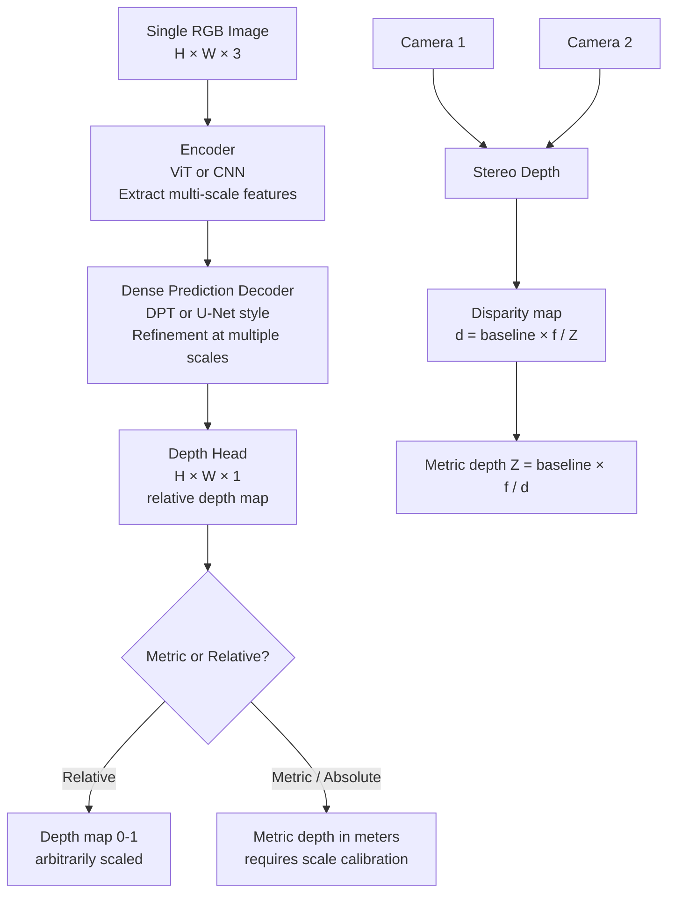

# 📏 Depth Estimation

> [!abstract] TL;DR
> Depth estimation predicts the distance of each pixel from the camera. Monocular depth uses a single image and learned priors (texture, perspective, scale). Stereo depth uses two cameras and geometric triangulation. Modern monocular models (Depth Anything, DPT) use ViT encoders and achieve robust zero-shot depth from arbitrary images. Used in AR, robotics, and autonomous driving.

## Intuition — Analogy First

Close one eye. You can still judge roughly how far objects are — the table edge is a meter away, the far wall is five meters. Your brain uses **monocular cues**: objects farther away appear smaller, texture becomes finer, objects overlap others in front of them, atmospheric haze increases with distance.

**Monocular depth estimation** teaches a neural network exactly these cues. It learns from millions of photos that a road extending to the horizon follows a perspective gradient, that a face texture appears coarser when closer, that a car overlapping another is in front. From a single photo, the model reconstructs the full depth map — a grayscale image where each pixel's value represents its estimated distance.

Open both eyes: with two cameras (stereo), depth becomes geometric — just like your two eyes create binocular disparity for stereo vision. No learned priors needed.

## How It Works — Mechanics



**Monocular depth approaches:**

**Supervised** — Train on dataset with ground-truth depth (from LIDAR or structured light). Models like MiDaS, DPT, and Depth Anything use this. Challenge: depth is relative to scale (network doesn't know absolute camera height).

**Self-supervised** — Use stereo pairs or video sequences as supervision without explicit depth labels. The network learns to predict depth such that one view can be reconstructed from another via a differentiable warp. Methods: SfMLearner, Monodepth2.

**DPT (Dense Prediction Transformer)** — Uses a ViT encoder that captures global context at all depths simultaneously (no inductive locality bias). Multiple feature maps from transformer layers are fused at different scales via a lightweight decoder. Outperforms pure CNN approaches on ambiguous scenes.

**Depth Anything** — Foundation model for monocular depth. Trained on a curated mix of 63.5M labeled and pseudo-labeled images. Zero-shot generalizes to arbitrary images including indoor, outdoor, medical, and artistic scenes. v2 adds metric depth support.

**Stereo depth** — Uses two cameras with known baseline $B$ (distance between cameras). Computes disparity $d$ (pixel shift between left and right image for same point). Depth: $Z = Bf/d$ where $f$ = focal length.

**Depth sensors:**
- **Structured light** (iPhone True Depth, Intel RealSense): project IR pattern, measure deformation
- **Time-of-Flight** (Azure Kinect, LiDAR): measure photon travel time
- **Stereo cameras**: passive geometric triangulation

## The Math

**Pinhole camera projection:**
$$u = f_x \frac{X}{Z} + c_x, \quad v = f_y \frac{Y}{Z} + c_y$$

Where $(X, Y, Z)$ is 3D point, $(u, v)$ is pixel, $(f_x, f_y)$ focal lengths, $(c_x, c_y)$ principal point.

**Stereo disparity to depth:**
$$Z = \frac{B \cdot f}{d}$$

Where $B$ = baseline (meters), $f$ = focal length (pixels), $d$ = disparity (pixels).

**Scale-invariant depth loss (silog — used in most monocular methods):**
$$\mathcal{L}_{silog} = \frac{1}{n} \sum_i d_i^2 - \frac{\lambda}{n^2} \left(\sum_i d_i\right)^2$$

Where $d_i = \log \hat{z}_i - \log z_i$ (log difference between predicted and GT depth).

**Affine-invariant loss (for relative depth without scale):**
$$\mathcal{L}_{a-inv} = \frac{1}{n} \sum_i \left(\frac{\hat{d}_i - \mu(\hat{d})}{\sigma(\hat{d})} - \frac{d_i - \mu(d)}{\sigma(d)}\right)^2$$

Normalizes prediction to zero mean unit variance before comparing — learns ordering without absolute scale.

## Code Demo

```python
import torch
import numpy as np
from PIL import Image
import matplotlib.pyplot as plt
from transformers import pipeline, AutoImageProcessor, AutoModelForDepthEstimation

# --- Depth Anything v2 (HuggingFace) --- easiest approach ---
depth_pipe = pipeline(
    task="depth-estimation",
    model="depth-anything/Depth-Anything-V2-Small-hf"   # Small/Base/Large
)

img = Image.open("scene.jpg")
result = depth_pipe(img)
depth_map = result["depth"]   # PIL Image, grayscale depth
depth_array = np.array(depth_map)   # H × W, values 0-255 (relative depth)

# Visualize
plt.figure(figsize=(12, 5))
plt.subplot(1, 2, 1); plt.imshow(img); plt.title("RGB")
plt.subplot(1, 2, 2); plt.imshow(depth_array, cmap="plasma"); plt.colorbar()
plt.title("Relative Depth"); plt.savefig("depth_output.png")

# --- Metric depth (Depth Anything V2 metric) ---
processor = AutoImageProcessor.from_pretrained("depth-anything/Depth-Anything-V2-Metric-Indoor-Small-hf")
model = AutoModelForDepthEstimation.from_pretrained("depth-anything/Depth-Anything-V2-Metric-Indoor-Small-hf")
model.eval()

inputs = processor(images=img, return_tensors="pt")
with torch.no_grad():
    outputs = model(**inputs)
    predicted_depth = outputs.predicted_depth   # [1, H, W] in meters

# Upsample to original size
h, w = img.size[1], img.size[0]
depth_meters = torch.nn.functional.interpolate(
    predicted_depth.unsqueeze(1),
    size=(h, w),
    mode="bicubic",
    align_corners=False
).squeeze()

print(f"Depth range: {depth_meters.min():.2f}m to {depth_meters.max():.2f}m")

# --- DPT (Dense Prediction Transformer) ---
dpt_processor = AutoImageProcessor.from_pretrained("Intel/dpt-large")
dpt_model = AutoModelForDepthEstimation.from_pretrained("Intel/dpt-large")
dpt_model.eval()

inputs = dpt_processor(images=img, return_tensors="pt")
with torch.no_grad():
    outputs = dpt_model(**inputs)
depth_dpt = outputs.predicted_depth.squeeze()

# --- Self-supervised depth with Monodepth2 (no GT needed) ---
# Example using torch hub
import torch
encoder = torch.hub.load("nianticlabs/monodepth2", "mono_640x192", pretrained=True)
# Trained only on monocular video sequences (no depth annotations)

# --- Depth map to point cloud ---
def depth_to_pointcloud(depth_map, fx, fy, cx, cy):
    """Convert depth map to 3D point cloud.
    depth_map: H×W in meters
    fx, fy: focal lengths
    cx, cy: principal point
    Returns: (H*W, 3) array of (X, Y, Z) coordinates
    """
    H, W = depth_map.shape
    u = np.arange(W)
    v = np.arange(H)
    uu, vv = np.meshgrid(u, v)

    Z = depth_map
    X = (uu - cx) * Z / fx
    Y = (vv - cy) * Z / fy

    points = np.stack([X.ravel(), Y.ravel(), Z.ravel()], axis=-1)
    return points[Z.ravel() > 0]   # filter invalid depths

# iPhone 13 approximate intrinsics
depth_np = depth_meters.numpy()
points = depth_to_pointcloud(depth_np, fx=1000, fy=1000, cx=640, cy=480)
print(f"Point cloud: {points.shape[0]} points")

# --- Stereo depth with OpenCV ---
import cv2

left = cv2.imread("stereo_left.jpg", cv2.IMREAD_GRAYSCALE)
right = cv2.imread("stereo_right.jpg", cv2.IMREAD_GRAYSCALE)

stereo = cv2.StereoSGBM_create(
    minDisparity=0,
    numDisparities=128,      # max disparity range
    blockSize=11,
    P1=8 * 3 * 11**2,        # smoothness penalty
    P2=32 * 3 * 11**2,
    disp12MaxDiff=1,
    uniquenessRatio=10,
    speckleWindowSize=100,
    speckleRange=32,
)

disparity = stereo.compute(left, right).astype(np.float32) / 16.0   # fixed point to float
# Convert to depth: Z = B * f / d
BASELINE = 0.1     # 10cm between cameras
FOCAL_LEN = 700    # pixels
depth_stereo = (BASELINE * FOCAL_LEN) / (disparity + 1e-6)
depth_stereo[disparity <= 0] = 0    # invalid disparities
```

## Real-World Example

**iPhone Portrait Mode** — Apple's iPhone uses a combination of LiDAR (Pro models) and monocular depth estimation for software portrait mode. The depth map is used to blur the background (Gaussian blur scaled by depth). On non-Pro models without LiDAR, the model uses a self-supervised monocular depth network trained on paired LiDAR+camera data as a teacher.

**Robotics obstacle avoidance** — Mobile robots (Spot, warehouse AMRs) use stereo or structured-light depth cameras for real-time obstacle detection. Depth maps at 30fps are converted to 3D point clouds, then fed to a collision-checking planner. Depth Anything v2 enables low-cost robots without dedicated depth sensors to estimate depth from a single RGB camera.

**AR overlays (Google ARCore, Apple ARKit)** — Augmented reality requires accurate scene geometry for occlusion handling (virtual objects hiding behind real ones). ARCore uses both monocular depth ML and device motion (SLAM) to maintain depth maps at 5fps on mobile hardware.

## Trade-offs

| Method | Metric Depth | Zero-shot | Speed | Requires | Best For |
|---|---|---|---|---|---|
| Stereo (OpenCV) | Yes | Yes | Real-time | Two cameras, calibration | Robot navigation |
| LiDAR | Yes | Yes | Real-time | Expensive sensor | AV, surveying |
| Depth Anything v2 | Relative/Metric | Yes | ~30 FPS | GPU | General, no sensor |
| DPT-Large | Relative | Yes | ~15 FPS | GPU | Quality over speed |
| Monodepth2 | Relative | No | Fast | Video for self-sup | Embedded, no GT |
| MiDaS | Relative | Yes | ~20 FPS | GPU | Widely used baseline |

## When to Use vs Avoid

**Use monocular depth when:** only a single camera is available, retrofitting depth to existing photo/video collections, or cost prohibits depth sensors.

**Use stereo depth when:** metric accuracy required, real-time application, reliable geometric baseline available.

**Use LiDAR when:** safety-critical applications (AV), outdoor long-range depth, highest accuracy required.

**Avoid monocular depth for:** precise measurement where errors > 10% are unacceptable, scenes with repetitive textures (floors, ceilings) that fool texture-based cues.

## Common Pitfalls

1. **Confusing relative and metric depth** — Depth Anything v1 outputs relative depth (arbitrary scale, good for visualization). The "metric" variant is needed for actual distance measurements. Applying relative depth in robotics gives meaningless distances.

2. **Depth map resolution mismatch** — Models often output at half or quarter input resolution. Must bilinear-upsample before overlaying on original image or computing point cloud.

3. **Stereo calibration errors** — Stereo depth is only as good as camera calibration. Even 1-pixel rectification error causes depth errors of 10-50cm at 3m range. Run `cv2.stereoCalibrate` rigorously.

4. **Log-scale depth visualization** — Depth values span a large range (0.5m to 50m). Linear colormap makes the foreground indistinguishable. Use log scale or plasma colormap for visualization.

5. **Invalid disparity regions** — Stereo has dead zones (areas not visible in both cameras). Failing to mask `disparity=0` produces infinite depth values that corrupt downstream processing.

## Related Concepts

- [[_MOC_Computer_Vision|↑ Section MOC]]

- [[Vision_Transformer_ViT]] — DPT and Depth Anything use ViT encoders
- [[Semantic_Segmentation]] — similar encoder-decoder architecture
- [[Image_Preprocessing]] — preprocessing pipeline required
- [[Instance_Segmentation]] — depth enables 3D instance lifting

## Review Questions

1. Depth Anything outputs relative depth between 0 and 1. What specific limitation does this create for a robot that needs to avoid obstacles, and how would you address it?

2. Monocular depth estimation relies on learned priors from training data. Give three examples of visual cues a model learns and explain what domain shift scenario would break each.

3. A stereo camera system has baseline B=0.12m and focal length f=600px. An object at disparity d=24px is how far away? What disparity would correspond to 1m distance?

## Sources

- [DPT: Dense Prediction Transformer (Ranftl et al., 2021)](https://arxiv.org/abs/2103.13413)
- [Depth Anything (Yang et al., 2024)](https://arxiv.org/abs/2401.10891)
- [Depth Anything V2 (2024)](https://arxiv.org/abs/2406.09414)
- [Monodepth2 (Godard et al., 2019)](https://arxiv.org/abs/1806.01260)

#computer-vision #depth-estimation #monocular-depth #stereo #DPT #depth-anything
