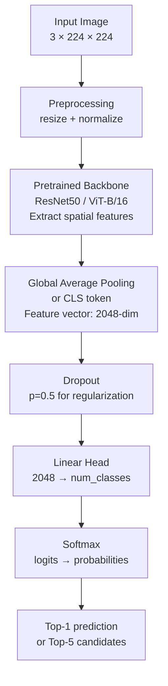

# 🏷️ Image Classification

> [!abstract] TL;DR
> Image classification assigns one (or more) labels to an entire image. The standard pipeline: pretrained backbone (ResNet, ViT) → global average pooling → linear head → softmax → cross-entropy loss. Transfer learning with pretrained ImageNet weights is the universal starting point. Evaluate with top-1/top-5 accuracy; for production use confidence calibration.

## Intuition — Analogy First

Imagine handing a photograph to someone and asking: **"What is this a picture of?"** — they look at the whole image and answer "a cat" or "a dog." That's single-label image classification. The model answers one question: which single class best describes the entire image?

This is the simplest CV task — there's no need to say *where* the object is, just *what* it is. But it forms the backbone of almost everything else in computer vision. Every object detector uses a classifier in its backbone; every image search system compares classification-derived embeddings.

## How It Works — Mechanics



**Single-label classification** — One class per image. Output: softmax over all classes. Loss: cross-entropy.

**Multi-label classification** — Multiple classes per image (a photo of "dog AND beach AND sunset"). Output: sigmoid per class (independent binary decisions). Loss: binary cross-entropy.

**Transfer learning workflow:**
1. Load pretrained backbone (trained on ImageNet-1K or ImageNet-21K)
2. Replace final classification head with new `Linear(features, num_classes)`
3. Option A — **Fine-tune all layers**: better accuracy, risk of overfitting if small dataset
4. Option B — **Freeze backbone, train head only**: faster, better for very small datasets
5. Option C — **Progressive unfreezing**: train head, then unfreeze backbone gradually (ULMFiT approach)

**Confidence calibration** — A model can be confident (90%) but wrong. Temperature scaling post-hoc calibrates the softmax: `p_calibrated = softmax(logits / T)`, where `T > 1` makes the model less confident.

**Top-k accuracy** — Top-1: is the correct class the highest probability? Top-5: is the correct class in the top-5 predictions? Used for ImageNet where some categories are genuinely ambiguous.

## The Math

**Softmax output:**
$$p_i = \frac{e^{z_i}}{\sum_{j=1}^{C} e^{z_j}}$$

**Cross-entropy loss (single label):**
$$\mathcal{L}_{CE} = -\log(p_{y})$$

where $p_y$ is the predicted probability of the true class $y$.

**Label smoothing** (prevents overconfident predictions):
$$\tilde{y}_i = (1 - \epsilon) \cdot y_i + \frac{\epsilon}{C}$$

Common: $\epsilon = 0.1$.

**Multi-label loss (binary cross-entropy per class):**
$$\mathcal{L}_{BCE} = -\frac{1}{C} \sum_{i=1}^{C} \left[ y_i \log \sigma(z_i) + (1-y_i) \log(1 - \sigma(z_i)) \right]$$

**Top-k accuracy:**
$$\text{Top-k Acc} = \frac{1}{N} \sum_{i=1}^{N} \mathbf{1}[y_i \in \text{top-k}(\hat{p}_i)]$$

## Code Demo

```python
import torch
import torch.nn as nn
import torch.optim as optim
from torchvision import models, transforms, datasets
from torch.utils.data import DataLoader

# --- Pretrained ResNet-50 + custom head for transfer learning ---
def build_classifier(num_classes, freeze_backbone=False):
    model = models.resnet50(weights=models.ResNet50_Weights.IMAGENET1K_V2)

    if freeze_backbone:
        for param in model.parameters():
            param.requires_grad = False

    # Replace final fc layer
    in_features = model.fc.in_features   # 2048 for ResNet50
    model.fc = nn.Sequential(
        nn.Dropout(p=0.5),
        nn.Linear(in_features, num_classes)
    )
    return model

model = build_classifier(num_classes=10, freeze_backbone=False)

# --- Training loop ---
device = torch.device("cuda" if torch.cuda.is_available() else "cpu")
model = model.to(device)

criterion = nn.CrossEntropyLoss(label_smoothing=0.1)   # label smoothing
optimizer = optim.AdamW(model.parameters(), lr=1e-4, weight_decay=1e-2)
scheduler = optim.lr_scheduler.CosineAnnealingLR(optimizer, T_max=30)

def train_one_epoch(model, loader, criterion, optimizer):
    model.train()
    total_loss, correct, total = 0, 0, 0
    for images, labels in loader:
        images, labels = images.to(device), labels.to(device)
        optimizer.zero_grad()
        outputs = model(images)
        loss = criterion(outputs, labels)
        loss.backward()
        optimizer.step()
        total_loss += loss.item()
        _, predicted = outputs.max(1)
        correct += predicted.eq(labels).sum().item()
        total += labels.size(0)
    return total_loss / len(loader), 100. * correct / total

def evaluate(model, loader, top_k=(1, 5)):
    model.eval()
    correct_k = {k: 0 for k in top_k}
    total = 0
    with torch.no_grad():
        for images, labels in loader:
            images, labels = images.to(device), labels.to(device)
            outputs = model(images)
            total += labels.size(0)
            for k in top_k:
                _, pred = outputs.topk(k, dim=1, largest=True, sorted=True)
                correct_k[k] += pred.eq(labels.view(-1, 1).expand_as(pred)).any(dim=1).sum().item()
    return {f"top{k}": 100. * correct_k[k] / total for k in top_k}

# --- Multi-label classification ---
class MultiLabelClassifier(nn.Module):
    def __init__(self, num_classes):
        super().__init__()
        backbone = models.efficientnet_b0(weights=models.EfficientNet_B0_Weights.DEFAULT)
        in_features = backbone.classifier[1].in_features
        backbone.classifier = nn.Identity()
        self.backbone = backbone
        self.head = nn.Linear(in_features, num_classes)

    def forward(self, x):
        return self.head(self.backbone(x))   # raw logits; sigmoid at loss

multi_label_model = MultiLabelClassifier(num_classes=80)   # COCO categories
bce_loss = nn.BCEWithLogitsLoss()   # numerically stable sigmoid + BCE

# --- Inference with top-k ---
def classify_image(model, image_path, class_names, top_k=5):
    transform = transforms.Compose([
        transforms.Resize(256),
        transforms.CenterCrop(224),
        transforms.ToTensor(),
        transforms.Normalize([0.485, 0.456, 0.406], [0.229, 0.224, 0.225]),
    ])
    from PIL import Image
    img = transform(Image.open(image_path).convert("RGB")).unsqueeze(0)
    model.eval()
    with torch.no_grad():
        logits = model(img)
        probs = torch.softmax(logits, dim=1)
    top_probs, top_indices = probs.topk(top_k)
    return [(class_names[i], p.item()) for i, p in zip(top_indices[0], top_probs[0])]

# --- HuggingFace: one-liner inference ---
from transformers import pipeline
classifier = pipeline("image-classification", model="microsoft/resnet-50")
results = classifier("photo.jpg")   # returns [{"label": "cat", "score": 0.93}, ...]
```

## Real-World Example

**Pinterest Visual Search** uses image classification embeddings to power visual similarity search. A user points the camera at a piece of furniture; the system extracts a feature vector from a classifier backbone (ViT or ResNet), and nearest-neighbor search over a billion embeddings returns visually similar products. The "classification" head is discarded at inference; only the penultimate layer features are used.

**Google Lens** uses a multi-label classifier to identify dozens of attributes (plant species, animal breed, product type, landmark) from a single photo — this is multi-label classification at scale, combined with text lookup.

**Instagram content moderation** uses image classifiers trained on policy-violating content to route flagged images to human reviewers. Sensitivity/specificity trade-offs are carefully tuned; the system runs on every uploaded image.

## Trade-offs

| Approach | Accuracy | Training Cost | Inference Speed | Best For |
|---|---|---|---|---|
| Linear probe (frozen backbone) | Moderate | Very low | Fast | Small datasets, quick baseline |
| Full fine-tune | High | Medium | Fast | Medium datasets |
| ViT-L fine-tune | Very high | High | Moderate | Large datasets |
| From scratch | Depends | Very high | Fast | Huge datasets only |
| Multi-scale TTA | +1-2% | None | 5-10× slower | Competition |
| Label smoothing | +0.5% | None | None | Always recommended |

## When to Use vs Avoid

**Use classification when:** there is one dominant object/scene per image, or you need a fast first-pass filter before a slower detector.

**Use multi-label when:** images naturally contain multiple categories (social media photos, document image types).

**Avoid classification when:** you need object locations (use detection), pixel-level understanding (use segmentation), or when multiple objects of the same class are present and you need to count them.

**Always use pretrained weights** unless your domain is so far from natural images that random init performs better (rare).

## Common Pitfalls

1. **Class imbalance ignored** — If class A has 10,000 examples and class B has 100, the model ignores B. Fix: weighted `CrossEntropyLoss(weight=...)`, oversampling, or focal loss.

2. **Leaking test data** — Applying `RandomResizedCrop` at test time (should use `CenterCrop`). Or computing normalization statistics on the test set.

3. **Wrong number of output classes** — Off-by-one if you include/exclude background class. Be explicit about `num_classes`.

4. **Multi-label with softmax** — Softmax forces probabilities to sum to 1, so it cannot handle multi-label. Use sigmoid + BCE for multi-label.

5. **Not checking calibration** — A model with 80% test accuracy might have 95% confidence on wrong predictions. Use temperature scaling or Platt scaling before deploying.

6. **Forgetting to call model.eval()** — Batch norm and dropout behave differently in train vs eval mode. Always call `model.eval()` before inference.

## Related Concepts

- [[_MOC_Computer_Vision|↑ Section MOC]]

- [[Famous_CNN_Architectures]] — ResNet, EfficientNet, ViT for classification
- [[Vision_Transformer_ViT]] — current SOTA classification architecture
- [[Data_Augmentation_CV]] — key to competitive classification accuracy
- [[Image_Preprocessing]] — required normalization for pretrained models
- [[Softmax]] — output activation for single-label classification

## Review Questions

1. You have a dataset with 1000 images in class A and 10 in class B. Without modifications, why does the model fail on class B, and what are three ways to address this?

2. Why must multi-label classification use sigmoid + binary cross-entropy instead of softmax + cross-entropy?

3. You deploy a ResNet-50 trained on your company's 50-class product catalog. Users report the model is always confident (~95%), even when they photograph something not in the catalog. What is happening and how do you fix it?

## Sources

- [Deep Residual Learning (He et al., 2016)](https://arxiv.org/abs/1512.03385)
- [ImageNet Large Scale Visual Recognition Challenge (Russakovsky et al., 2015)](https://arxiv.org/abs/1409.0575)
- [On Calibration of Modern Neural Networks (Guo et al., 2017)](https://arxiv.org/abs/1706.04599)
- [torchvision models documentation](https://pytorch.org/vision/stable/models.html)

#computer-vision #classification #transfer-learning #imagenet #softmax
