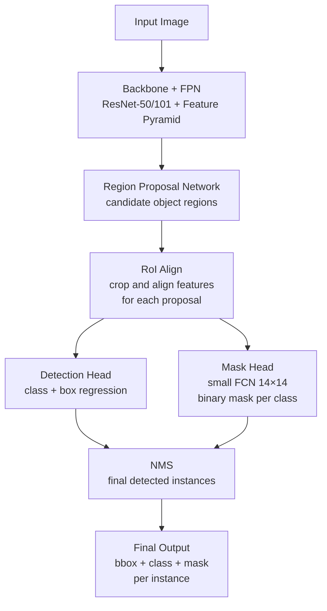

# 🔍 Instance Segmentation

> [!abstract] TL;DR
> Instance segmentation detects each individual object AND produces a precise pixel mask for each instance — unlike semantic segmentation (one mask per class) or detection (bounding boxes only). Mask R-CNN adds a parallel mask head to Faster R-CNN. SAM (Segment Anything) provides promptable, zero-shot instance segmentation. Evaluated with mask mAP (AP@50:95 with IoU on masks).

## Intuition — Analogy First

Imagine a photo of a crowd of people. **Semantic segmentation** would paint all people the same color — "everything that is a person." **Detection** would draw a box around each individual person. **Instance segmentation** traces the exact outline of each individual person with a unique color — "this specific person 1, that specific person 2, this other person 3."

Think of it like a **tailor taking individual measurements**: not "there are 5 people" (classification), not "each person is roughly here" (detection), but drawing a precise silhouette around each person as an individual.

## How It Works — Mechanics



**Mask R-CNN architecture (He et al., 2017):**
1. **Backbone + FPN**: ResNet extracts multi-scale features; FPN builds a feature pyramid (P2-P5)
2. **RPN**: Proposes ~1000 candidate regions per image
3. **RoI Align**: Crops and aligns features to fixed size (7×7 or 14×14) for each proposal — fixes quantization error of RoI Pooling
4. **Detection head**: Classifies region + refines bounding box
5. **Mask head**: Small FCN (4 conv layers) predicts 28×28 binary mask per class, in parallel with detection head — masks are decoupled from classification (each class has its own mask channel)

**Key insight — mask head runs per class**: The mask head produces a `num_classes × 28 × 28` output per instance. At inference, only the mask for the predicted class is used. This decoupling means the mask predictor doesn't need to know which class to segment — the classification head handles that.

**RoI Align vs RoI Pooling:**
- RoI Pooling: quantizes float coordinates to integers → misalignment for masks
- RoI Align: bilinear interpolation at exact float positions → much better mask quality

**Panoptic segmentation** — extends to unify:
- "Things" (countable objects: car, person) — from instance segmentation
- "Stuff" (amorphous regions: sky, road) — from semantic segmentation
- Each pixel gets both a class label AND an instance ID

## The Math

**Mask R-CNN multi-task loss:**
$$\mathcal{L} = \mathcal{L}_{cls} + \mathcal{L}_{box} + \mathcal{L}_{mask}$$

$$\mathcal{L}_{cls} = \text{cross-entropy over classes}$$
$$\mathcal{L}_{box} = \text{smooth-L1 on box offsets}$$
$$\mathcal{L}_{mask} = \text{binary cross-entropy on 28×28 mask}$$

**Mask IoU (used for AP computation):**
$$\text{Mask IoU} = \frac{|\text{pred\_mask} \cap \text{gt\_mask}|}{|\text{pred\_mask} \cup \text{gt\_mask}|}$$

Masks are binarized at threshold 0.5 before IoU computation.

**Mask AP (COCO metric):**
$$\text{mask AP} = \text{mean over IoU thresholds } [0.50, 0.55, ..., 0.95]$$

## Code Demo

```python
import torch
from torchvision.models.detection import (
    maskrcnn_resnet50_fpn,
    MaskRCNN_ResNet50_FPN_Weights
)
from torchvision.models.detection.faster_rcnn import FastRCNNPredictor
from torchvision.models.detection.mask_rcnn import MaskRCNNPredictor
from PIL import Image
import numpy as np

# --- Mask R-CNN inference (torchvision) ---
weights = MaskRCNN_ResNet50_FPN_Weights.DEFAULT
model = maskrcnn_resnet50_fpn(weights=weights)
model.eval()

preprocess = weights.transforms()
img = Image.open("street.jpg").convert("RGB")
img_tensor = preprocess(img)

with torch.no_grad():
    predictions = model([img_tensor])

pred = predictions[0]
print(f"Detected {len(pred['boxes'])} instances")
# Keys: boxes [N,4], labels [N], scores [N], masks [N,1,H,W]

# Visualize instances
import matplotlib.pyplot as plt
import matplotlib.patches as patches

fig, axes = plt.subplots(1, 2, figsize=(16, 8))
axes[0].imshow(img)
axes[1].imshow(img)

colors = plt.cm.rainbow(np.linspace(0, 1, len(pred['boxes'])))
for i, (box, label, score, mask) in enumerate(zip(
        pred['boxes'], pred['labels'], pred['scores'], pred['masks'])):
    if score < 0.5:
        continue
    # Draw box
    x1, y1, x2, y2 = box.tolist()
    rect = patches.Rectangle((x1, y1), x2-x1, y2-y1,
                               linewidth=2, edgecolor=colors[i], facecolor='none')
    axes[1].add_patch(rect)
    # Overlay mask
    mask_np = mask[0].numpy() > 0.5   # binarize
    colored_mask = np.zeros((*mask_np.shape, 4))
    colored_mask[mask_np] = [*colors[i][:3], 0.4]
    axes[1].imshow(colored_mask)

# --- Fine-tune Mask R-CNN on custom dataset ---
def build_instance_segmentor(num_classes):
    """num_classes includes background (class 0)."""
    model = maskrcnn_resnet50_fpn(weights=MaskRCNN_ResNet50_FPN_Weights.DEFAULT)

    # Replace box predictor head
    in_features_box = model.roi_heads.box_predictor.cls_score.in_features
    model.roi_heads.box_predictor = FastRCNNPredictor(in_features_box, num_classes)

    # Replace mask predictor head
    in_features_mask = model.roi_heads.mask_predictor.conv5_mask.in_channels
    hidden_layer = 256
    model.roi_heads.mask_predictor = MaskRCNNPredictor(
        in_features_mask, hidden_layer, num_classes
    )
    return model

model = build_instance_segmentor(num_classes=3)   # background + cat + dog

# Training data format:
# targets = [{"boxes": Tensor[N,4], "labels": Tensor[N], "masks": Tensor[N,H,W]}]

# --- SAM (Segment Anything Model) ---
from transformers import SamModel, SamProcessor

sam_model = SamModel.from_pretrained("facebook/sam-vit-huge")
sam_processor = SamProcessor.from_pretrained("facebook/sam-vit-huge")
device = "cuda" if torch.cuda.is_available() else "cpu"
sam_model = sam_model.to(device)
sam_model.eval()

img = Image.open("photo.jpg").convert("RGB")

# Point-prompted segmentation
input_points = [[[500, 375]]]   # [batch, num_points, [x, y]]
inputs = sam_processor(img, input_points=input_points, return_tensors="pt").to(device)

with torch.no_grad():
    outputs = sam_model(**inputs)

masks = sam_processor.image_processor.post_process_masks(
    outputs.pred_masks.cpu(),
    inputs["original_sizes"].cpu(),
    inputs["reshaped_input_sizes"].cpu(),
)
# masks[0][0] shape: [3, H, W] — 3 mask candidates (ordered by confidence)
best_mask = masks[0][0][0]   # take highest quality mask

# Box-prompted segmentation
input_boxes = [[[75, 275, 1725, 850]]]   # [x1, y1, x2, y2]
inputs = sam_processor(img, input_boxes=input_boxes, return_tensors="pt").to(device)
with torch.no_grad():
    outputs = sam_model(**inputs)
masks_box = sam_processor.image_processor.post_process_masks(
    outputs.pred_masks.cpu(),
    inputs["original_sizes"].cpu(),
    inputs["reshaped_input_sizes"].cpu(),
)

# --- YOLOv8 instance segmentation (simpler API) ---
from ultralytics import YOLO
seg_model = YOLO("yolov8n-seg.pt")
results = seg_model("street.jpg")
for r in results:
    if r.masks is not None:
        masks = r.masks.data   # [N, H, W] float masks
        boxes = r.boxes.xyxy   # [N, 4]
        labels = r.boxes.cls   # [N]
        confs = r.boxes.conf   # [N]
    im_seg = r.plot()   # visualize with masks overlaid
```

## Real-World Example

**Adobe Photoshop AI background removal** — Adobe's "Remove Background" uses instance segmentation to trace the exact outline of the primary subject (usually a person or product). The model must work zero-shot on arbitrary subjects. Adobe likely uses a SAM-like architecture combined with subject detection to identify the primary instance and produce a high-quality cut-out.

**Medical cell counting** — In digital pathology, counting individual cells (tumor cells, immune cells) in H&E stained tissue slides requires instance segmentation. Each cell nucleus must be individually segmented. The Cellpose model (a specialized U-Net variant for cell segmentation) handles cells of varying sizes in densely packed tissue, enabling automated cell counting at scale (millions of cells per slide).

**Instagram/Meta object selection** — Meta's "Object Select" feature in Stories uses SAM under the hood. Tapping an object in a photo segments it precisely for sticker creation, background replacement, or augmented reality effects.

## Trade-offs

| Approach | mask AP (COCO) | Speed | Flexibility | Best For |
|---|---|---|---|---|
| Mask R-CNN R50 | 34.6 | ~10 FPS | Moderate | General purpose |
| Mask R-CNN R101 | 36.1 | ~8 FPS | Moderate | Higher accuracy |
| YOLOv8n-seg | 30.5 | 200+ FPS | Limited | Real-time |
| YOLOv8x-seg | 52.3 | ~30 FPS | Limited | Fast + accurate |
| SAM (ViT-H) | — (promptable) | ~5 FPS | Very high | Zero-shot, interactive |
| Mask2Former | 57.8 | ~10 FPS | High | Research SOTA |

## When to Use vs Avoid

**Use Mask R-CNN when:** supervised training on annotated instance masks, standard COCO-style benchmark, moderate speed requirements.

**Use SAM when:** zero-shot or few-shot segmentation, interactive segmentation (user provides prompts), domain shift is a concern, you don't have mask annotations.

**Use YOLOv8-seg when:** real-time instance segmentation required (video, edge devices).

**Avoid instance segmentation when:** semantic class is all that matters (use semantic segmentation), only bounding boxes needed (use detection), annotation budget is low (pixel masks are expensive to annotate).

## Common Pitfalls

1. **Forgetting background class** — torchvision Mask R-CNN reserves class 0 for background. Custom class mapping must start at 1.

2. **Mask resolution confusion** — Mask R-CNN predicts 28×28 masks per RoI, then resizes to the box area. The final mask matches image resolution only after this resize step.

3. **Not using RoI Align** — Older implementations using RoI Pooling have quantization misalignment that degrades mask quality. Modern torchvision Mask R-CNN uses RoI Align correctly.

4. **SAM with wrong prompt format** — SAM processor expects `input_points` as `[[[x, y]]]` (3 nesting levels: batch × num_objects × num_points). Passing wrong shape causes silent dimension errors.

5. **Evaluating mask AP with box IoU** — COCO mask AP uses mask IoU, not box IoU. Using the wrong metric inflates apparent performance.

## Related Concepts

- [[_MOC_Computer_Vision|↑ Section MOC]]

- [[Object_Detection]] — detection without masks; precursor to instance segmentation
- [[Semantic_Segmentation]] — per-class masks, no instance distinction
- [[Segment_Anything_SAM]] — promptable zero-shot instance segmentation
- [[CNN_Fundamentals]] — backbone for Mask R-CNN
- [[Vision_Transformer_ViT]] — SAM uses ViT encoder (MAE pretrained)

## Review Questions

1. Mask R-CNN decouples mask prediction from classification — the mask head predicts a mask for each class independently. Why is this design choice important?

2. What is the difference between semantic segmentation and instance segmentation for a photo with 5 overlapping cars? What would each output look like?

3. You want to segment arbitrary objects in product photos without training a custom model. Which approach would you use, how would you prompt it, and what are its limitations?

## Sources

- [Mask R-CNN (He et al., 2017)](https://arxiv.org/abs/1703.06870)
- [SAM: Segment Anything (Kirillov et al., 2023)](https://arxiv.org/abs/2304.02643)
- [Panoptic Segmentation (Kirillov et al., 2019)](https://arxiv.org/abs/1801.00868)
- [Cellpose: robust cell segmentation](https://www.nature.com/articles/s41592-020-01018-x)

#computer-vision #instance-segmentation #mask-rcnn #SAM #panoptic #tasks
