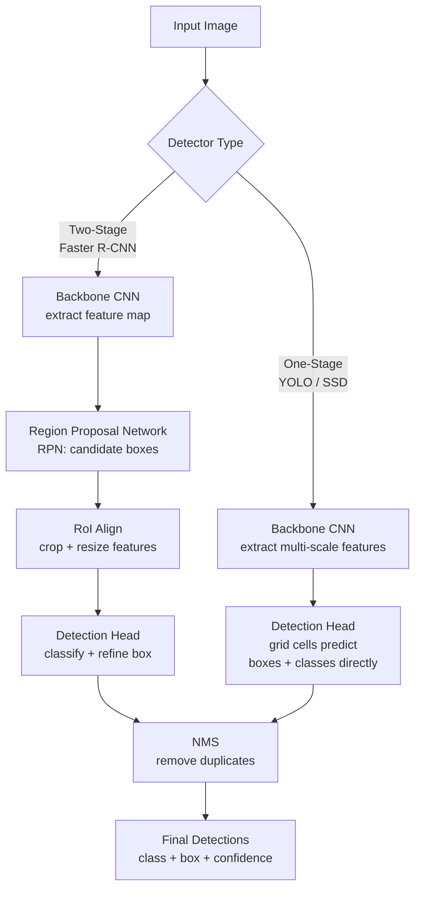

# 📦 Object Detection

> [!abstract] TL;DR
> Object detection simultaneously localizes and classifies multiple objects in one image using bounding boxes. Two-stage detectors (Faster R-CNN) are accurate but slow; one-stage detectors (YOLO) are fast but slightly less precise. Key metrics: IoU for box quality, mAP (mean Average Precision) for overall performance. NMS removes duplicate box predictions.

## Intuition — Analogy First

Classification says: **"There's a cat in this photo."** Detection adds location: **"There's a cat in the top-left (box A), and a dog in the bottom-right (box B)."**

Think of a **security camera operator scanning a room**. They don't just say "there are people here" — they track each person individually, noting their position (bounding box), identifying who they are (class), and estimating how confident they are (confidence score). Object detection is that operator, running frame-by-frame at 30fps.

## How It Works — Mechanics



**Bounding box representation:**
- **[x, y, w, h]** — center x, center y, width, height (YOLO format)
- **[x1, y1, x2, y2]** — top-left and bottom-right corners (PASCAL VOC, torchvision)
- Coordinates are usually normalized to [0, 1] relative to image size

**Anchor boxes** — Pre-defined boxes of various aspect ratios and scales at each grid cell location. The network predicts offsets from these anchors rather than absolute box coordinates. Modern detectors (YOLO v5+, DETR) use anchor-free approaches.

**Two-stage detectors (R-CNN family):**
1. Stage 1 (RPN): Propose candidate object regions (~2000 per image)
2. Stage 2: Classify and refine each proposal with a small head network
- Accurate, flexible, but ~5fps on a GPU

**One-stage detectors (YOLO/SSD):**
1. Divide image into grid (e.g., 13×13)
2. Each cell predicts multiple boxes (objectness + class + box offsets) directly
- Fast (30-100+ fps on GPU), slightly less accurate on small objects

**Non-Maximum Suppression (NMS):**
1. Sort all detections by confidence score
2. Keep the highest-confidence box
3. Suppress all boxes with IoU > threshold (default 0.5) with the kept box
4. Repeat for remaining boxes

## The Math

**Intersection over Union (IoU):**
$$\text{IoU}(A, B) = \frac{|A \cap B|}{|A \cup B|} = \frac{\text{intersection area}}{\text{union area}}$$

IoU thresholds: 0.5 (lenient), 0.75 (strict), 0.5:0.95 (COCO standard, average over thresholds)

**Average Precision (AP) per class:**
$$\text{AP} = \int_0^1 p(r) \, dr \approx \sum_{k} (r_k - r_{k-1}) \cdot p_k$$

Where $p(r)$ is precision at recall $r$ (the precision-recall curve).

**Mean Average Precision (mAP):**
$$\text{mAP} = \frac{1}{|C|} \sum_{c \in C} \text{AP}_c$$

**Box regression** — predict 4 offsets from anchor:
$$t_x = (x - x_a) / w_a, \quad t_y = (y - y_a) / h_a$$
$$t_w = \log(w / w_a), \quad t_h = \log(h / h_a)$$

**Detection loss (YOLO-style):**
$$\mathcal{L} = \lambda_{box} \mathcal{L}_{box} + \lambda_{obj} \mathcal{L}_{obj} + \lambda_{cls} \mathcal{L}_{cls}$$

## Code Demo

```python
import torch
from torchvision import models
from torchvision.models.detection import fasterrcnn_resnet50_fpn, FasterRCNN_ResNet50_FPN_Weights
from torchvision.ops import box_iou, nms
from PIL import Image
import torchvision.transforms.functional as F

# --- Faster R-CNN inference (torchvision) ---
weights = FasterRCNN_ResNet50_FPN_Weights.DEFAULT
model = fasterrcnn_resnet50_fpn(weights=weights)
model.eval()

preprocess = weights.transforms()

img = Image.open("street.jpg").convert("RGB")
img_tensor = preprocess(img)

with torch.no_grad():
    predictions = model([img_tensor])

# predictions[0] contains: boxes [N,4], labels [N], scores [N]
pred = predictions[0]
for box, label, score in zip(pred["boxes"], pred["labels"], pred["scores"]):
    if score > 0.5:
        x1, y1, x2, y2 = box.tolist()
        print(f"Class {label.item()}: [{x1:.0f},{y1:.0f},{x2:.0f},{y2:.0f}] conf={score:.2f}")

# --- Fine-tune Faster R-CNN on custom dataset ---
def build_faster_rcnn(num_classes):
    # num_classes includes background (class 0)
    model = fasterrcnn_resnet50_fpn(weights=FasterRCNN_ResNet50_FPN_Weights.DEFAULT)
    in_features = model.roi_heads.box_predictor.cls_score.in_features
    from torchvision.models.detection.faster_rcnn import FastRCNNPredictor
    model.roi_heads.box_predictor = FastRCNNPredictor(in_features, num_classes)
    return model

# Target format for training:
# targets = [{"boxes": Tensor[N,4], "labels": Tensor[N]}, ...]
# model returns loss dict during training

# --- IoU computation ---
boxes1 = torch.tensor([[100, 100, 200, 200]], dtype=torch.float32)
boxes2 = torch.tensor([[150, 150, 250, 250], [0, 0, 50, 50]], dtype=torch.float32)
iou_matrix = box_iou(boxes1, boxes2)   # [1, 2]
print(f"IoU: {iou_matrix}")

# --- Manual NMS ---
boxes = torch.tensor([[100, 100, 200, 200],
                       [110, 105, 210, 205],   # high overlap with box 0
                       [300, 300, 400, 400]], dtype=torch.float32)
scores = torch.tensor([0.9, 0.8, 0.7])
keep_indices = nms(boxes, scores, iou_threshold=0.5)
print(f"Kept after NMS: {keep_indices}")   # [0, 2] — box 1 suppressed

# --- YOLO v8 (ultralytics) inference ---
from ultralytics import YOLO

yolo = YOLO("yolov8n.pt")   # nano model, fast
results = yolo("street.jpg", conf=0.25, iou=0.45)
for result in results:
    boxes = result.boxes          # Boxes object
    for box in boxes:
        print(f"{result.names[int(box.cls)]}: {box.conf:.2f} @ {box.xyxy[0].tolist()}")

# Save annotated image
results[0].save("output_detected.jpg")

# --- mAP computation (torchmetrics) ---
from torchmetrics.detection.mean_ap import MeanAveragePrecision

metric = MeanAveragePrecision(iou_type="bbox")
preds = [{"boxes": pred["boxes"], "scores": pred["scores"], "labels": pred["labels"]}]
targets = [{"boxes": torch.tensor([[100.,100.,200.,200.]]), "labels": torch.tensor([1])}]
metric.update(preds, targets)
result = metric.compute()
print(f"mAP@50: {result['map_50']:.4f}")
print(f"mAP@50:95: {result['map']:.4f}")
```

## Real-World Example

**Tesla Autopilot** runs 8 surround-view cameras at 36fps per camera. Each frame is processed by a neural network that detects cars, pedestrians, cyclists, lane markings, signs, and traffic lights. The system uses a one-stage detector architecture (similar in spirit to YOLO) because latency must be under 50ms for safety. The detections are fused across cameras and time using a Temporal Transformer to build a bird's-eye-view representation of the scene.

**Amazon Go** stores use ceiling-mounted cameras with object detection to track every item a shopper picks up or puts back, enabling cashier-free checkout. They run detectors on depth cameras (LIDAR + RGB fusion) for robust multi-person tracking.

## Trade-offs

| Architecture | mAP (COCO) | Speed (A100) | Params | Best For |
|---|---|---|---|---|
| Faster R-CNN R50 FPN | 37 | ~20 FPS | 42M | Accuracy-focused |
| YOLO v8n | 37.3 | 200+ FPS | 3.2M | Edge, real-time |
| YOLO v8x | 53.9 | 50 FPS | 68M | Accuracy + speed balance |
| DETR R50 | 42 | ~30 FPS | 41M | No NMS, flexible |
| DINO (DETR variant) | 58.5 | ~10 FPS | 47M | Research/high accuracy |
| RT-DETR | 54 | 100 FPS | 32M | Real-time + accuracy |

## When to Use vs Avoid

**Use two-stage (Faster R-CNN) when:** accuracy is paramount, you have moderate inference time budget, and you need good small-object detection.

**Use one-stage (YOLO) when:** real-time inference is required (robotics, video, edge devices), or you're deploying on mobile/embedded hardware.

**Use anchor-free (DETR, DINO) when:** you want end-to-end training with no NMS tuning, or working on a domain where anchor design is non-obvious.

**Avoid detection when:** objects don't need localization — use classification. **Avoid when** only foreground vs background matters — use segmentation.

## Common Pitfalls

1. **NMS threshold too low** — `iou_threshold=0.3` suppresses valid nearby detections (crowded scenes, rows of products). Use 0.45-0.65 for most cases.

2. **Confidence threshold at 0.5** — Many valid detections have confidence 0.25-0.5. Tune the threshold on your validation set; the default 0.5 may miss detections.

3. **Wrong box format** — mixing (x,y,w,h) and (x1,y1,x2,y2). Be explicit in your dataset loading code. torchvision expects (x1,y1,x2,y2); YOLO uses (cx,cy,w,h) normalized.

4. **Class imbalance in mAP** — mAP averages AP equally across classes. A class with 5 examples and 60% AP weighs the same as one with 5000 examples. Report per-class AP alongside mAP.

5. **Background class off-by-one** — torchvision detection models reserve class 0 for background. Your custom class mapping must start at 1, giving `num_classes = your_classes + 1`.

## Related Concepts

- [[_MOC_Computer_Vision|↑ Section MOC]]

- [[YOLO_Family]] — deep dive into YOLO architecture evolution
- [[Semantic_Segmentation]] — pixel-wise alternative to bounding boxes
- [[Instance_Segmentation]] — detection + per-instance mask
- [[CNN_Fundamentals]] — backbone network providing features
- [[Image_Classification]] — simpler precursor to detection

## Review Questions

1. You run object detection and get 3 overlapping boxes for the same car with scores 0.92, 0.87, 0.81. Explain NMS step-by-step and what the output will be given `iou_threshold=0.5`.

2. Your model achieves mAP@50=0.72 but mAP@50:95=0.41. What does this gap tell you about the model's box localization quality?

3. For a real-time drone navigation system requiring 60fps inference, which detector family would you choose and why? What accuracy trade-off are you accepting?

## Sources

- [Faster R-CNN (Ren et al., 2015)](https://arxiv.org/abs/1506.01497)
- [YOLO original (Redmon et al., 2016)](https://arxiv.org/abs/1506.02640)
- [Microsoft COCO benchmark](https://cocodataset.org/)
- [DETR: End-to-End Object Detection (Carion et al., 2020)](https://arxiv.org/abs/2005.12872)

#computer-vision #object-detection #faster-rcnn #yolo #mAP #bounding-boxes
