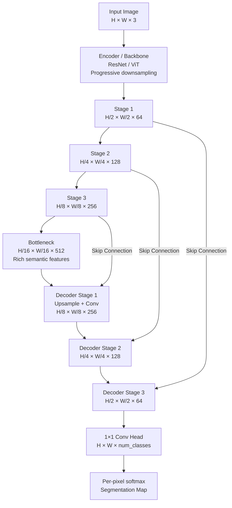

# 🎨 Semantic Segmentation

> [!abstract] TL;DR
> Semantic segmentation assigns a class label to every pixel in an image. The encoder-decoder architecture (U-Net, DeepLab) is the standard: the encoder compresses to extract rich features; the decoder upsamples back to full resolution. Skip connections preserve spatial detail lost during encoding. Evaluate with mIoU. Key challenge: balancing semantic richness (deep encoder) with spatial precision (full resolution output).

## Intuition — Analogy First

Imagine **coloring a line drawing**. You have a black-and-white sketch of a street scene — you grab your colored pencils and fill in every region: sky is blue, road is gray, cars are red, trees are green, people are yellow. Every single centimeter of the drawing gets a color — not just "there's a tree in the top-right," but "these exact 12,000 pixels are tree."

That's semantic segmentation: every pixel gets exactly one class label. Unlike detection (draw a box around the car) or classification (what's in the image), segmentation precisely delineates each region at the pixel level.

## How It Works — Mechanics



**Encoder (downsampling path):**
- Extracts hierarchical features (edges → textures → parts → objects)
- Reduces spatial resolution (1/2, 1/4, 1/8, 1/16, 1/32 of input)
- Increases channel depth

**Decoder (upsampling path):**
- Gradually restores spatial resolution
- Upsampling methods: transposed conv, bilinear upsample + conv, pixel shuffle
- Must recover fine spatial detail lost in encoder

**Skip connections (U-Net innovation):**
- Concatenate encoder feature maps at corresponding resolution into decoder
- Provides high-frequency spatial information the encoder bottleneck loses
- Critical for precise boundary delineation

**DeepLab innovations:**
- **ASPP (Atrous Spatial Pyramid Pooling)**: dilated convolutions at rates [6, 12, 18, 24] in parallel — captures multi-scale context
- **No aggressive downsampling**: dilated convolutions maintain larger feature maps (output_stride=8 or 16 instead of 32)
- Bilinear upsample at end (simpler than full decoder)

**Panoptic segmentation** — unifies semantic (stuff: road, sky) and instance (things: individual cars, people) into one output. Each pixel gets a class + instance ID.

## The Math

**Pixel-wise cross-entropy loss:**
$$\mathcal{L}_{CE} = -\frac{1}{H \cdot W} \sum_{h=1}^{H} \sum_{w=1}^{W} \sum_{c=1}^{C} y_{hwc} \log(\hat{p}_{hwc})$$

**IoU per class:**
$$\text{IoU}_c = \frac{TP_c}{TP_c + FP_c + FN_c} = \frac{|\text{pred}_c \cap \text{gt}_c|}{|\text{pred}_c \cup \text{gt}_c|}$$

**mIoU (Mean IoU) — primary metric:**
$$\text{mIoU} = \frac{1}{C} \sum_{c=1}^{C} \text{IoU}_c$$

**Dice loss** (handles class imbalance, common in medical imaging):
$$\mathcal{L}_{Dice} = 1 - \frac{2 \sum_i p_i g_i}{\sum_i p_i + \sum_i g_i}$$

Dice and IoU are related: $\text{Dice} = \frac{2 \text{IoU}}{1 + \text{IoU}}$

**Class-weighted loss for imbalanced segmentation:**
$$w_c = \frac{\text{total\_pixels}}{\text{num\_classes} \times \text{pixels\_of\_class\_c}}$$

## Code Demo

```python
import torch
import torch.nn as nn
import torch.nn.functional as F
from torchvision import models
from torchvision.models.segmentation import (
    deeplabv3_resnet50, DeepLabV3_ResNet50_Weights
)
import numpy as np

# --- DeepLabV3 inference (torchvision) ---
weights = DeepLabV3_ResNet50_Weights.DEFAULT
model = deeplabv3_resnet50(weights=weights)
model.eval()

preprocess = weights.transforms()
from PIL import Image
img = Image.open("street.jpg").convert("RGB")
img_tensor = preprocess(img).unsqueeze(0)   # [1, 3, 520, 520]

with torch.no_grad():
    output = model(img_tensor)["out"]   # [1, 21, H, W] — 21 PASCAL VOC classes
seg_map = output.argmax(dim=1).squeeze()   # [H, W] class indices

# --- HuggingFace SegFormer (transformer-based, SOTA) ---
from transformers import SegformerFeatureExtractor, SegformerForSemanticSegmentation

feature_extractor = SegformerFeatureExtractor.from_pretrained("nvidia/segformer-b5-finetuned-ade-640-640")
model = SegformerForSemanticSegmentation.from_pretrained("nvidia/segformer-b5-finetuned-ade-640-640")

inputs = feature_extractor(images=img, return_tensors="pt")
with torch.no_grad():
    outputs = model(**inputs)
logits = outputs.logits    # [1, num_classes, H/4, W/4]
seg = logits.argmax(dim=1).squeeze()

# Upsample back to original resolution
upsampled = F.interpolate(logits, size=img.size[::-1], mode='bilinear', align_corners=False)
seg_full_res = upsampled.argmax(dim=1).squeeze()

# --- U-Net implementation from scratch ---
class ConvBlock(nn.Module):
    def __init__(self, in_ch, out_ch):
        super().__init__()
        self.conv = nn.Sequential(
            nn.Conv2d(in_ch, out_ch, 3, padding=1, bias=False),
            nn.BatchNorm2d(out_ch),
            nn.ReLU(inplace=True),
            nn.Conv2d(out_ch, out_ch, 3, padding=1, bias=False),
            nn.BatchNorm2d(out_ch),
            nn.ReLU(inplace=True),
        )
    def forward(self, x): return self.conv(x)

class UNet(nn.Module):
    def __init__(self, in_channels=3, num_classes=21):
        super().__init__()
        # Encoder
        self.enc1 = ConvBlock(in_channels, 64)
        self.enc2 = ConvBlock(64, 128)
        self.enc3 = ConvBlock(128, 256)
        self.enc4 = ConvBlock(256, 512)
        self.pool = nn.MaxPool2d(2)
        # Bottleneck
        self.bottleneck = ConvBlock(512, 1024)
        # Decoder
        self.up4 = nn.ConvTranspose2d(1024, 512, 2, stride=2)
        self.dec4 = ConvBlock(1024, 512)   # 512 from up + 512 skip
        self.up3 = nn.ConvTranspose2d(512, 256, 2, stride=2)
        self.dec3 = ConvBlock(512, 256)
        self.up2 = nn.ConvTranspose2d(256, 128, 2, stride=2)
        self.dec2 = ConvBlock(256, 128)
        self.up1 = nn.ConvTranspose2d(128, 64, 2, stride=2)
        self.dec1 = ConvBlock(128, 64)
        # Head
        self.head = nn.Conv2d(64, num_classes, 1)

    def forward(self, x):
        # Encoder
        e1 = self.enc1(x)
        e2 = self.enc2(self.pool(e1))
        e3 = self.enc3(self.pool(e2))
        e4 = self.enc4(self.pool(e3))
        # Bottleneck
        b = self.bottleneck(self.pool(e4))
        # Decoder with skip connections
        d4 = self.dec4(torch.cat([self.up4(b), e4], dim=1))
        d3 = self.dec3(torch.cat([self.up3(d4), e3], dim=1))
        d2 = self.dec2(torch.cat([self.up2(d3), e2], dim=1))
        d1 = self.dec1(torch.cat([self.up1(d2), e1], dim=1))
        return self.head(d1)

model = UNet(in_channels=3, num_classes=19)   # 19 classes for Cityscapes
x = torch.randn(1, 3, 512, 512)
out = model(x)
print(f"UNet output: {out.shape}")   # [1, 19, 512, 512]

# --- Loss function: CE + Dice combined ---
class SegmentationLoss(nn.Module):
    def __init__(self, num_classes, class_weights=None):
        super().__init__()
        self.ce = nn.CrossEntropyLoss(weight=class_weights, ignore_index=255)

    def dice_loss(self, pred, target, num_classes):
        pred_soft = torch.softmax(pred, dim=1)
        total_loss = 0
        for c in range(num_classes):
            p = pred_soft[:, c]
            g = (target == c).float()
            total_loss += 1 - (2 * (p * g).sum()) / (p.sum() + g.sum() + 1e-6)
        return total_loss / num_classes

    def forward(self, pred, target):
        return self.ce(pred, target) + 0.5 * self.dice_loss(pred, target, pred.shape[1])

# --- mIoU metric computation ---
def compute_miou(pred_masks, gt_masks, num_classes, ignore_index=255):
    ious = []
    pred = pred_masks.view(-1)
    gt = gt_masks.view(-1)
    mask = gt != ignore_index
    pred, gt = pred[mask], gt[mask]
    for cls in range(num_classes):
        tp = ((pred == cls) & (gt == cls)).sum().item()
        fp = ((pred == cls) & (gt != cls)).sum().item()
        fn = ((pred != cls) & (gt == cls)).sum().item()
        denom = tp + fp + fn
        if denom > 0:
            ious.append(tp / denom)
    return np.mean(ious)
```

## Real-World Example

**Waymo / Tesla road segmentation** — Every autonomous vehicle must understand the driveable area, lane lines, sidewalks, curbs, and obstacles at the pixel level. Waymo uses SegFormer and DeepLab variants that run on GPU clusters processing data from 5 cameras simultaneously. The mIoU on their internal driving dataset must exceed 0.90 on the "driveable area" class — a single misclassified patch of road can be safety-critical.

**Medical image analysis** — In radiology, tumor delineation requires semantic segmentation of CT/MRI volumes. U-Net (2015) was originally designed for biomedical image segmentation and remains standard for medical tasks. The nnU-Net framework auto-configures U-Net architectures for medical tasks and won most Medical Segmentation Decathlon challenges.

## Trade-offs

| Architecture | mIoU (Cityscapes) | Speed | Params | Best For |
|---|---|---|---|---|
| U-Net | ~70% | Fast | 31M | Medical, small data |
| DeepLabV3+ R101 | 80.9% | Moderate | 59M | General, accuracy |
| SegFormer-B5 | 84.0% | Moderate | 82M | SOTA accuracy |
| HRNet + OCR | 81.1% | Slow | 70M | High-res detail |
| Mask2Former | 84.3% | Slow | 216M | Panoptic unified |

## When to Use vs Avoid

**Use semantic segmentation when:** you need pixel-level understanding (autonomous driving, medical imaging, satellite analysis), or when bounding boxes are insufficient.

**Use panoptic when:** you need to distinguish individual instances (count cars, track people) while also segmenting background stuff (road, sky).

**Avoid when:** classification or detection is sufficient — segmentation training requires expensive pixel-level annotation (10-40× more costly than bounding boxes).

## Common Pitfalls

1. **Not applying augmentations identically to mask** — `RandomHorizontalFlip` applied to image but not mask gives misaligned supervision. Use Albumentations or PyTorch's `functional` transforms with explicit seed control.

2. **Ignoring class imbalance** — In Cityscapes, roads and sky cover 60%+ of pixels; person class < 2%. Unweighted loss makes the model ignore rare classes. Use `ignore_index=255` for unlabeled pixels, class-weighted loss, or Dice loss.

3. **Output stride confusion** — DeepLab output is H/8 or H/16, not H/1. Must bilinear upsample to full resolution before computing loss or visualizing. Forgetting this evaluates at 1/8 scale.

4. **Using MSE instead of CE** — Segmentation is classification per pixel; use cross-entropy. MSE on class indices treats class 5 as "5× more than class 1."

5. **Evaluating with ignore_index in mIoU** — Many datasets (Cityscapes, ADE20K) have void/ignore pixels. Must exclude them from mIoU computation.

## Related Concepts

- [[_MOC_Computer_Vision|↑ Section MOC]]

- [[Object_Detection]] — bounding box alternative to pixel masks
- [[Instance_Segmentation]] — adds per-instance distinction to semantic masks
- [[Convolutional_Operations]] — dilated convolutions critical for DeepLab
- [[Vision_Transformer_ViT]] — SegFormer uses transformer encoder
- [[CNN_Fundamentals]] — encoder backbone for all segmentation models

## Review Questions

1. U-Net uses skip connections between encoder and decoder. What specific information would be lost without them, and why does this affect segmentation quality more than classification?

2. DeepLab uses dilated convolutions with rates [6, 12, 18, 24] (ASPP). What problem does this solve compared to simply using a larger kernel, and what would happen without ASPP?

3. You train a segmentation model on Cityscapes (19 classes). The model achieves 85% mIoU but fails to detect pedestrians (0.3% of pixels). What are three techniques to fix the class imbalance problem?

## Sources

- [U-Net (Ronneberger et al., 2015)](https://arxiv.org/abs/1505.04597)
- [DeepLab v3+ (Chen et al., 2018)](https://arxiv.org/abs/1802.02611)
- [SegFormer (Xie et al., 2021)](https://arxiv.org/abs/2105.15203)
- [nnU-Net (Isensee et al., 2021)](https://arxiv.org/abs/1904.08128)

#computer-vision #semantic-segmentation #unet #deeplab #miou #pixel-classification
