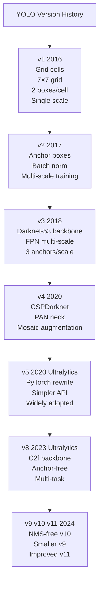

# ⚡ YOLO Family

> [!abstract] TL;DR
> YOLO (You Only Look Once) is a family of single-pass, real-time object detectors. YOLOv8 (Ultralytics, 2023) is the current production standard — anchor-free, C2f backbone, tasks beyond detection (segmentation, pose, OBB). YOLOv10/v11 push further with NMS-free designs. YOLO trades ~5% mAP vs two-stage detectors for 5-10× inference speed advantage.

## Intuition — Analogy First

**Scanning a room in one glance versus checking systematically.** Two-stage detectors are like a methodical detective: first mark all suspicious spots, then investigate each one individually. YOLO is like a seasoned security guard who, in a single sweep of their eyes across the room, instantly notes every person, their position, and what they're doing.

YOLO's speed comes entirely from this single-pass design: one forward pass through the network and you have all boxes and classes — no second stage, no per-region processing.

## How It Works — Mechanics



**YOLOv1 core idea:**
- Divide image into S×S grid (7×7 originally)
- Each cell predicts B bounding boxes + confidence + C class probabilities
- Output tensor: S × S × (B×5 + C), B=2, C=20 → 7×7×30
- Single forward pass, but poor small-object detection

**YOLOv3 improvements:**
- Three detection scales: 13×13 (large objects), 26×26 (medium), 52×52 (small)
- 3 anchors per scale, 9 total anchors (k-means clustered from dataset boxes)
- Feature Pyramid Network (FPN) neck for multi-scale feature fusion

**YOLOv8 architecture (Ultralytics 2023):**
- **Backbone**: C2f (Cross-Stage Partial with 2 bottlenecks) — improved gradient flow
- **Neck**: PANet (Path Aggregation Network) for multi-scale fusion
- **Head**: Anchor-free, decoupled head (separate cls + box branches)
- **Tasks**: Detect, Segment, Classify, Pose, OBB (oriented bounding boxes)
- No anchor clustering needed; predicts directly from grid points

**Anchor-free detection (v8+):**
Instead of predicting offsets from predefined anchors, predict box center directly plus width/height. Simpler, no hyperparameter tuning for anchor sizes.

**YOLOv10 (NMS-free):**
Adds consistent dual assignments (one-to-many for training, one-to-one for inference) — eliminates NMS, reducing end-to-end latency further.

## The Math

**YOLOv1 loss function:**
$$\mathcal{L} = \lambda_{coord} \sum_{i,j} \mathbf{1}_{ij}^{obj} \left[(x_i - \hat{x}_i)^2 + (y_i - \hat{y}_i)^2\right]$$
$$+ \lambda_{coord} \sum_{i,j} \mathbf{1}_{ij}^{obj} \left[(\sqrt{w_i} - \sqrt{\hat{w}_i})^2 + (\sqrt{h_i} - \sqrt{\hat{h}_i})^2\right]$$
$$+ \sum_{i,j} \mathbf{1}_{ij}^{obj} (C_i - \hat{C}_i)^2 + \lambda_{noobj} \sum_{i,j} \mathbf{1}_{ij}^{noobj} (C_i - \hat{C}_i)^2$$
$$+ \sum_{i} \mathbf{1}_{i}^{obj} \sum_{c} (p_i(c) - \hat{p}_i(c))^2$$

Where $\mathbf{1}_{ij}^{obj}=1$ if object's center falls in cell $i$, $\lambda_{coord}=5$, $\lambda_{noobj}=0.5$.

Square root of width/height prevents large box errors dominating over small box errors.

**GIoU loss (v8 box regression):**
$$\mathcal{L}_{GIoU} = 1 - \left(\text{IoU} - \frac{|C \setminus (A \cup B)|}{|C|}\right)$$

Where $C$ is the smallest enclosing box. Better than raw IoU for non-overlapping boxes.

**Objectness / classification loss (v8):** Binary focal loss for class predictions.

## Code Demo

```python
from ultralytics import YOLO
import cv2

# --- Load and use pretrained YOLOv8 ---
# Model sizes: n(ano) s(mall) m(edium) l(arge) x(tra-large)
model = YOLO("yolov8n.pt")    # 3.2M params, fastest
# model = YOLO("yolov8x.pt")  # 68M params, most accurate

# --- Inference on single image ---
results = model("street.jpg", conf=0.25, iou=0.45, verbose=False)
for r in results:
    print(r.boxes.xyxy)       # [N, 4] bounding boxes (x1,y1,x2,y2)
    print(r.boxes.cls)        # [N] class indices
    print(r.boxes.conf)       # [N] confidence scores
    im_annotated = r.plot()   # BGR numpy array with drawn boxes
    cv2.imwrite("detected.jpg", im_annotated)

# --- Batch inference on directory ---
results = model("images/", stream=True)   # generator for memory efficiency
for result in results:
    result.save(filename=f"out_{result.path.split('/')[-1]}")

# --- Training on custom dataset ---
# dataset.yaml format:
# path: /data/my_dataset
# train: images/train
# val: images/val
# names: {0: cat, 1: dog, 2: person}

model = YOLO("yolov8n.pt")    # start from pretrained
results = model.train(
    data="dataset.yaml",
    epochs=100,
    imgsz=640,
    batch=16,
    device=0,                  # GPU 0
    workers=8,
    optimizer="AdamW",
    lr0=1e-3,
    weight_decay=5e-4,
    augment=True,              # built-in mosaic, mixup, copy-paste
    project="runs/train",
    name="my_model",
)

# --- Validation and metrics ---
metrics = model.val(data="dataset.yaml")
print(f"mAP50: {metrics.box.map50:.4f}")
print(f"mAP50-95: {metrics.box.map:.4f}")
print(f"Precision: {metrics.box.mp:.4f}")
print(f"Recall: {metrics.box.mr:.4f}")

# --- Export for deployment ---
model.export(format="onnx", dynamic=True)     # ONNX for cross-platform
model.export(format="tensorrt", half=True)    # TensorRT FP16 for Jetson/GPU
model.export(format="tflite")                 # TFLite for mobile
model.export(format="coreml")                 # CoreML for iOS

# --- Instance segmentation with YOLOv8-seg ---
seg_model = YOLO("yolov8n-seg.pt")
results = seg_model("street.jpg")
for r in results:
    masks = r.masks.data    # [N, H, W] binary masks per instance

# --- Pose estimation ---
pose_model = YOLO("yolov8n-pose.pt")
results = pose_model("person.jpg")
for r in results:
    keypoints = r.keypoints.data   # [N, 17, 3] (x,y,conf) for 17 COCO keypoints

# --- Tracking (multi-object tracking) ---
# YOLO + ByteTrack / BoT-SORT built in
cap = cv2.VideoCapture("video.mp4")
tracker_results = model.track("video.mp4", persist=True, tracker="bytetrack.yaml")
for r in tracker_results:
    if r.boxes.id is not None:
        track_ids = r.boxes.id.int().tolist()    # persistent track IDs

# --- Benchmark different model sizes ---
from ultralytics.utils.benchmarks import benchmark
benchmark(model="yolov8n.pt", data="coco128.yaml", imgsz=640, half=False, device=0)
```

## Real-World Example

**YOLO on edge devices (Jetson Orin)** — YOLO is the go-to detector for embedded AI. NVIDIA Jetson Orin (used in drones, robots, AMRs) runs YOLOv8n at 200+ FPS with TensorRT FP16 quantization. DJI uses YOLO-based detection for obstacle avoidance in their drones. Security camera vendors (Axis, Hikvision) embed YOLO models in camera firmware for on-device detection without cloud roundtrips.

**Retail analytics** — Amazon Go and similar cashier-free stores use YOLO-family models on overhead cameras to detect which products shoppers pick up, tracking hand-product interactions frame-by-frame at retail scale.

## Trade-offs

| Model | mAP@50:95 (COCO) | Speed (T4 GPU) | Params | Memory |
|---|---|---|---|---|
| YOLOv8n | 37.3 | 6.2ms | 3.2M | 8.7MB |
| YOLOv8s | 44.9 | 7.2ms | 11.2M | 28MB |
| YOLOv8m | 50.2 | 9.5ms | 25.9M | 78MB |
| YOLOv8l | 52.9 | 12.4ms | 43.7M | 165MB |
| YOLOv8x | 53.9 | 17.1ms | 68.2M | 258MB |
| YOLOv10n | 38.5 | 1.84ms | 2.3M | 6.5MB |
| Faster R-CNN R50 | 37.0 | ~50ms | 42M | — |

## When to Use vs Avoid

**Use YOLO when:** real-time video (surveillance, robotics, drones), edge deployment, fast prototyping, multi-task (detect + segment + pose in one model).

**Use Faster R-CNN when:** highest accuracy matters more than speed, working with very small or densely-packed objects.

**Use DETR/DINO when:** no NMS tuning desired, transformer-based architecture for research.

**Avoid YOLOv1/v2** in production — many known architectural limitations. Start with v8 or v10.

## Common Pitfalls

1. **Not using streaming for large datasets** — `model("dir/")` loads all images into memory. Use `stream=True` for video or large directories.

2. **Wrong image size at export** — Training at imgsz=640 and exporting with different size breaks the model. Keep consistent.

3. **Forgetting class name remapping** — COCO pretrained classes are 0-79. Fine-tuning on custom data requires careful class index alignment in dataset.yaml.

4. **Using high confidence threshold** — Default 0.25 is appropriate. `conf=0.5` silently misses many valid detections.

5. **Not validating after training** — Always run `model.val()` after training to get proper COCO-style mAP metrics, not just training loss.

## Related Concepts

- [[_MOC_Computer_Vision|↑ Section MOC]]

- [[Object_Detection]] — general detection concepts, IoU, NMS, mAP
- [[Instance_Segmentation]] — YOLOv8-seg extends detection with masks
- [[CNN_Fundamentals]] — backbone architecture used by YOLO
- [[Data_Augmentation_CV]] — mosaic and mixup used heavily in YOLO training

## Review Questions

1. YOLOv1 struggled with small objects and objects close together. What specific architectural changes in YOLOv3 addressed these limitations?

2. YOLOv8 is "anchor-free" while YOLOv3 uses anchor boxes. What does anchor-free mean and what practical advantage does it give practitioners?

3. You need to deploy YOLO on a Raspberry Pi 4. List the steps from training to deployment, including which model size and export format you would use and why.

## Sources

- [YOLOv1 (Redmon et al., 2016)](https://arxiv.org/abs/1506.02640)
- [YOLOv3 (Redmon & Farhadi, 2018)](https://arxiv.org/abs/1804.02767)
- [Ultralytics YOLOv8 docs](https://docs.ultralytics.com/)
- [YOLOv10 (Wang et al., 2024)](https://arxiv.org/abs/2405.14458)

#computer-vision #yolo #object-detection #real-time #ultralytics #edge-ai
