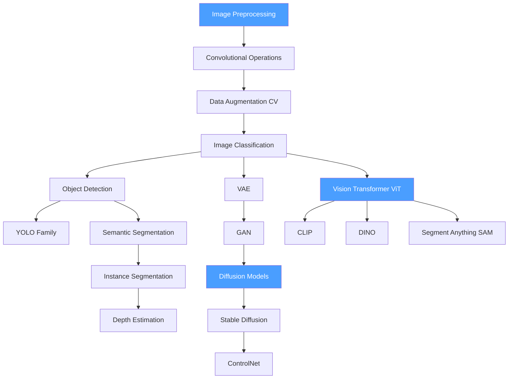

# 🗺️ Computer Vision — Map of Content

> [!info] How to use this map
> Start with Fundamentals, follow the arrows, and use the Learning Path below as your guide.

---

## Concept Map

---

## Learning Path

1. [[Image_Preprocessing]] — foundations of how images are prepared before any model sees them; normalization, resizing, and channel ordering are universal prerequisites
2. [[Convolutional_Operations]] — the core mathematical operation behind nearly all CNN-based vision models; understand conv, pooling, and receptive fields here
3. [[Data_Augmentation_CV]] — techniques that artificially expand training data and improve model generalization; applies to every supervised vision task
4. [[Image_Classification]] — the canonical supervised vision problem; establishes the train/eval loop and backbone concept used everywhere else
5. [[Object_Detection]] — extends classification to localization; introduces anchors, bounding boxes, and detection head architectures
6. [[YOLO_Family]] — real-time single-stage detection; tracks the evolution from YOLOv1 through modern variants
7. [[Semantic_Segmentation]] — per-pixel classification; introduces encoder-decoder architectures and the FCN/UNet lineage
8. [[Instance_Segmentation]] — combines detection and segmentation; covers Mask R-CNN and its successors
9. [[Depth_Estimation]] — monocular and stereo depth; connects geometry and learned representations
10. [[VAE]] — first generative model; establishes the latent-space and reconstruction loss concepts reused by all later generative work
11. [[GAN]] — adversarial training paradigm; generator/discriminator dynamics and training instability
12. [[Diffusion_Models]] — score-based and DDPM approaches; the dominant generative framework as of 2024
13. [[Stable_Diffusion]] — latent diffusion model that made high-quality image synthesis accessible at scale
14. [[ControlNet]] — conditioning mechanism that adds spatial control to diffusion models
15. [[Vision_Transformer_ViT]] — attention replaces convolution; patch embeddings and positional encodings for vision
16. [[CLIP]] — contrastive image-text pretraining; enables zero-shot classification and vision-language grounding
17. [[DINO]] — self-supervised ViT training; emergent segmentation properties without labels
18. [[Segment_Anything_SAM]] — promptable segmentation at scale; foundation model for the segmentation task

---

## All Notes in This Section

| Note | Core Idea | Difficulty |
|------|-----------|------------|
| [[Image_Preprocessing]] | Normalization, resizing, color spaces, and tensor formatting | Beginner |
| [[Convolutional_Operations]] | Convolution, pooling, stride, padding, and receptive field | Beginner |
| [[Data_Augmentation_CV]] | Flips, crops, color jitter, mixup, and CutMix strategies | Beginner |
| [[Image_Classification]] | Backbone architectures, softmax head, and benchmark datasets | Beginner |
| [[Object_Detection]] | Two-stage vs single-stage detectors, IoU, NMS, and anchor design | Intermediate |
| [[YOLO_Family]] | Single-shot detection from YOLOv1 to YOLOv9 and beyond | Intermediate |
| [[Semantic_Segmentation]] | FCN, UNet, DeepLab, and per-pixel cross-entropy loss | Intermediate |
| [[Instance_Segmentation]] | Mask R-CNN, RoI Align, and panoptic segmentation | Intermediate |
| [[Depth_Estimation]] | Monocular depth, stereo matching, and depth-completion | Intermediate |
| [[VAE]] | Encoder-decoder, reparameterization trick, and ELBO | Intermediate |
| [[GAN]] | Generator, discriminator, adversarial loss, and training tricks | Intermediate |
| [[Diffusion_Models]] | DDPM, DDIM, score matching, and noise schedules | Advanced |
| [[Stable_Diffusion]] | Latent diffusion, VQVAE, text conditioning, and CFG | Advanced |
| [[ControlNet]] | Adapter conditioning, trainable copy, zero convolutions | Advanced |
| [[Vision_Transformer_ViT]] | Patch embeddings, CLS token, and attention in vision | Intermediate |
| [[CLIP]] | Contrastive loss, dual encoder, zero-shot transfer | Advanced |
| [[DINO]] | Self-distillation, momentum encoder, emergent features | Advanced |
| [[Segment_Anything_SAM]] | Promptable segmentation, SAM architecture, and SA-1B dataset | Advanced |

---

## Key Questions This Section Answers

- How do convolutional networks learn spatial hierarchies of features?
- What is the difference between semantic and instance segmentation?
- How do single-stage detectors like YOLO achieve real-time inference?
- Why did Vision Transformers eventually outperform CNNs on large datasets?
- How do diffusion models generate images, and why are they more stable than GANs?
- What makes CLIP useful beyond image classification?
- How does ControlNet add spatial conditioning to a pre-trained diffusion model?
- How does SAM achieve generalizable segmentation with simple prompts?

---

## Connections to Other Sections

- [[_MOC_Deep_Learning]] — backbone architectures (ResNet, EfficientNet, ViT) and training fundamentals used throughout Computer Vision
- [[_MOC_Generative_AI]] — diffusion models and latent representations bridge Computer Vision and generative systems
- [[_MOC_Key_Papers]] — seminal papers including AlexNet, VGG, ResNet, Attention is All You Need (ViT precursor), DDPM, and SAM
