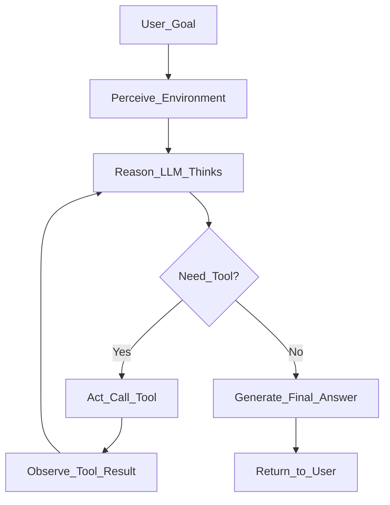

# 🤖 AI Agents Overview

> [!abstract] TL;DR
> An AI agent is an LLM augmented with tools, memory, and a planning loop that lets it autonomously pursue goals across multiple steps. Unlike a single prompt-response, an agent perceives its environment, reasons about what to do, takes actions (calling tools), observes results, and iterates until the goal is achieved.

## Intuition — Analogy First

Think of an AI agent as a **brilliant intern with a computer and internet access**. You give them a goal — "research competitors and write a report" — and they autonomously:
- Search the web for information
- Read and summarize documents
- Write code to analyze data
- Draft and send emails
- Report back when done

You don't hand-hold every step. They decide which tools to use, in what order, and how to handle unexpected results. That's an agent.

A plain LLM is like asking the intern a question verbally — one exchange, one answer. An agent is like giving the intern a workstation and a goal.

## How It Works — Mechanics

An agent has four core components:

| Component | Description |
|-----------|-------------|
| **LLM Brain** | Reasoning engine — decides what to do next |
| **Tools** | Functions the LLM can call (search, code exec, APIs) |
| **Memory** | Short-term (context window) + long-term (vector store) |
| **Planning** | Decomposing goals into sub-tasks (implicit in ReAct, explicit in Plan-and-Execute) |

The agent runs a **perception → reasoning → action → observation** loop until a stopping condition is met (goal achieved, max steps, error):



### Agent Types

**Reactive agents** — no planning, respond directly to observations. Fast but shallow.

**Deliberative agents** — maintain internal world model, plan sequences. Slower but capable of complex tasks.

**Multi-agent systems** — multiple specialized agents collaborate. Best for complex, parallel workloads.

### Popular Frameworks

| Framework | Model | Strengths |
|-----------|-------|-----------|
| LangChain | Any | Mature ecosystem, many integrations |
| LlamaIndex | Any | RAG-first, document-heavy workflows |
| [[AutoGen]] | Any | Multi-agent conversation framework |
| [[CrewAI]] | Any | Role-based agents with goals/backstories |
| Semantic Kernel | Any | Microsoft enterprise, .NET + Python |

## The Math

An agent's behavior at step $t$ can be modeled as a policy $\pi$ mapping history to actions:

$$a_t = \pi(h_t) \quad \text{where} \quad h_t = (o_0, a_0, o_1, a_1, \ldots, o_t)$$

Where:
- $o_t$ = observation at step $t$ (tool results, user input)
- $a_t$ = action at step $t$ (tool call or final response)
- $h_t$ = full history (fits within context window)

The LLM approximates $\pi$ — given history $h_t$, it outputs the next action. The agent loop runs until a terminal condition $T(h_t) = \text{True}$.

**Expected cost** of an agent run:

$$\mathbb{E}[\text{cost}] = \sum_{t=1}^{T} c_{\text{LLM}}(h_t) + \sum_{k} c_{\text{tool}_k}$$

This is why latency and cost explode for long-horizon tasks — each step incurs LLM + tool costs.

## Code Demo

```python
# Simple LangChain agent with search + calculator tools
from langchain.agents import AgentType, initialize_agent, load_tools
from langchain_openai import ChatOpenAI
from langchain.tools import Tool
from langchain_community.tools import DuckDuckGoSearchRun
import os

# LLM backbone
llm = ChatOpenAI(model="gpt-4o-mini", temperature=0)

# Load tools
search = DuckDuckGoSearchRun()
tools = load_tools(["llm-math"], llm=llm)
tools.append(
    Tool(
        name="Search",
        func=search.run,
        description="Useful for searching current information from the web. "
                    "Input should be a search query string.",
    )
)

# Initialize ReAct-style agent
agent = initialize_agent(
    tools=tools,
    llm=llm,
    agent=AgentType.ZERO_SHOT_REACT_DESCRIPTION,
    verbose=True,          # prints Thought/Action/Observation trace
    max_iterations=6,      # prevent runaway loops
    early_stopping_method="generate",
)

# Run the agent
result = agent.invoke({
    "input": "What is the current population of Tokyo, and what is that number divided by 1000?"
})
print(result["output"])

# More modern approach using LangChain Expression Language (LCEL)
from langchain import hub
from langchain.agents import AgentExecutor, create_react_agent

prompt = hub.pull("hwchase17/react")
agent_runnable = create_react_agent(llm, tools, prompt)
agent_executor = AgentExecutor(
    agent=agent_runnable,
    tools=tools,
    verbose=True,
    handle_parsing_errors=True,
    max_iterations=10,
)

result = agent_executor.invoke({"input": "Find the GDP of Germany and compute 10% of it"})
```

## Real-World Example

**Devin (Cognition AI)** — an autonomous software engineering agent:
- Perceives: issue description, codebase, test results
- Plans: breaks the task into subtasks (understand → design → implement → test → PR)
- Tools: shell, code editor, browser, compiler, test runner
- Memory: full repo context + conversation history
- Loop: runs tests, reads errors, fixes code, reruns — autonomously

**GitHub Copilot Agents** extend Copilot to run terminal commands, edit multiple files, and interpret build errors — the same perception-reasoning-action loop applied to IDE workflows.

**Cursor AI** similarly uses an agent loop for multi-file edits: it reads relevant files, plans changes, edits, checks for errors, iterates.

## Trade-offs

| Dimension | Pro | Con |
|-----------|-----|-----|
| **Autonomy** | Handles complex multi-step tasks | Hard to predict or control |
| **Tools** | Extends LLM capabilities massively | Tool errors cascade |
| **Cost** | Solves tasks humans avoid | Multiple LLM calls = expensive |
| **Latency** | Thinks as long as needed | Can take minutes per task |
| **Reliability** | Often correct | Hallucinations in tool calls are dangerous |
| **Flexibility** | Goal-directed, adapts to surprises | Harder to test and debug |

## When to Use vs Avoid

**Use agents when:**
- Task requires multiple steps with unknown intermediate results
- You need to call real APIs, search the web, or execute code
- The goal is high-level ("research and summarize X") not low-level ("format this text")
- Human review of final output is feasible

**Avoid agents when:**
- Task is a single LLM call (use direct completion)
- Latency is critical (< 1s response time)
- Budget is very tight (each step costs tokens)
- Environment is not sandboxed (tool calls could cause harm)
- 100% deterministic/auditable output is required

## Common Pitfalls

1. **Infinite loops** — agent keeps calling tools without converging. Fix: set `max_iterations`.
2. **Hallucinated tool calls** — LLM invents tool arguments that don't match the schema. Fix: strict schema validation, function calling APIs.
3. **Context overflow** — long agent traces overflow the context window. Fix: truncate history, summarize observations.
4. **Tool error propagation** — one tool failure derails the whole chain. Fix: error handling in tool wrappers, retry logic.
5. **Over-agentic solutions** — using an agent where a single prompt would do. Fix: start simple, only add agent loop when necessary.
6. **No stopping condition** — agent never decides it's done. Fix: explicit done/finish tool or termination criteria.

## Related Concepts

- [[_MOC_Generative_AI|↑ Section MOC]]

- [[ReAct_Pattern]] — the dominant reasoning strategy for agents
- [[Tool_Use_and_Function_Calling]] — how agents call external functions
- [[Multi_Agent_Systems]] — multiple agents collaborating
- [[Memory_in_Agents]] — how agents store and retrieve information
- [[Plan_and_Execute]] — explicit planning before execution
- [[LangChain]] — most popular agent framework

## Review Questions

1. What are the four core components of an AI agent, and what role does each play in the perception-reasoning-action loop?
2. Why does agent cost grow super-linearly with task complexity, and what architectural choices can bound it?
3. A production agent keeps hallucinating arguments to your database tool, causing bad queries. What are three concrete mitigations at the framework, prompt, and schema levels?

## Sources

- Yao et al. (2022). *ReAct: Synergizing Reasoning and Acting in Language Models*. https://arxiv.org/abs/2210.03629
- LangChain Agents Documentation. https://python.langchain.com/docs/modules/agents/
- AutoGen: Enabling Next-Gen LLM Applications. https://microsoft.github.io/autogen/
- Chase, H. (2023). *LangChain Expression Language*. LangChain Blog.
- Significant Gravitas (2023). *Auto-GPT*. https://github.com/Significant-Gravitas/AutoGPT

#agents #llm-agents #langchain #autonomous-ai #generative-ai #tool-use #planning
