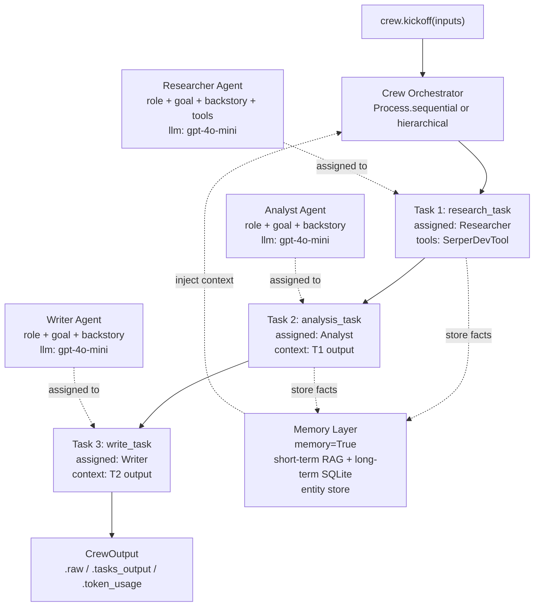

# 🧑‍✈️ CrewAI

> [!abstract] TL;DR
> CrewAI is an open-source Python framework for building multi-agent pipelines where each agent has a **role, goal, and backstory** — turning LLM coordination into an org-chart problem you can reason about in plain English.

---

## Intuition

**Analogy:** Imagine staffing a consulting project. You don't hire one person and ask them to do everything — you hire a **Researcher** to gather facts, an **Analyst** to interpret them, and a **Writer** to produce the deliverable. Each person has a job title (role), a personal objective (goal), and professional experience that shapes how they work (backstory). You, the engagement manager, hand out assignments (tasks) and define whether work is done serially, in parallel, or with a senior manager reviewing each step.

CrewAI maps this directly onto LLM agents: the `Crew` is the engagement, `Agent` objects are the hires, `Task` objects are the assignments, and `Process` decides the workflow pattern. The framework's core insight is that **strong role identity** — encoded in the backstory system prompt — produces more consistent, on-brand agent behavior than generic prompting.

---

## How It Works

### Core Primitives

**Agent** — A single LLM worker with a fixed identity.

| Parameter | Type | Purpose |
|-----------|------|---------|
| `role` | str | Job title used in the system prompt |
| `goal` | str | What this agent is trying to achieve |
| `backstory` | str | Rich persona paragraph — the main system prompt lever |
| `tools` | list[BaseTool] | Functions the agent can call |
| `llm` | str or LLM | Model reference (e.g., `"gpt-4o-mini"`) |
| `max_iter` | int | Max ReAct iterations before forced output (default: 25) |
| `allow_delegation` | bool | Whether the agent can sub-delegate to other crew members |
| `memory` | bool | Per-agent memory toggle |

**Task** — A unit of work assigned to one agent.

| Parameter | Type | Purpose |
|-----------|------|---------|
| `description` | str | What to do — supports `{variable}` interpolation from `kickoff(inputs)` |
| `expected_output` | str | What a correct result looks like (used as the stop condition) |
| `agent` | Agent | Which agent executes this task |
| `context` | list[Task] | Outputs of prior tasks injected into this task's prompt |
| `output_pydantic` | BaseModel | Parse output as a typed Pydantic model |
| `output_json` | BaseModel | Serialize output as JSON with Pydantic schema |
| `callback` | Callable | Function called with `TaskOutput` on completion |

**Crew** — The container that wires agents and tasks together.

| Parameter | Type | Purpose |
|-----------|------|---------|
| `agents` | list[Agent] | All agents in the crew |
| `tasks` | list[Task] | All tasks, in declaration order |
| `process` | Process | Execution strategy (see below) |
| `verbose` | bool | Print step-by-step reasoning trace |
| `memory` | bool | Enable shared memory layer |
| `manager_llm` | str | LLM for the auto-generated manager (hierarchical only) |
| `step_callback` | Callable | Hook called after every agent step |

---

### Process Types

**`Process.sequential`** (default)
Tasks execute in declaration order. The output of Task N is automatically available in the context of Task N+1. Predictable, easy to debug. Best for linear pipelines.

**`Process.hierarchical`**
CrewAI generates a **Manager Agent** automatically using `manager_llm`. The manager reads all task descriptions, decides which agent to dispatch, reviews the output, and either accepts it or sends it back for revision. Closer to dynamic orchestration — the manager can re-order or re-assign tasks. More capable but significantly more expensive (every task incurs an extra manager LLM call).

**`Process.consensual`**
An experimental mode where agents vote on task outputs before they are accepted. As of mid-2025 this process type is defined in the `Process` enum but has limited documentation and production usage — treat it as a research preview.

---

### Built-in Tools (crewai-tools package)

| Tool | What It Does |
|------|-------------|
| `SerperDevTool` | Google search via Serper API |
| `WebsiteSearchTool` | Semantic search over a scraped URL |
| `FileReadTool` | Read local files (txt, pdf, csv) |
| `CodeInterpreterTool` | Execute Python in a sandboxed subprocess |
| `ScrapeWebsiteTool` | Full-page HTML scrape |
| `DirectoryReadTool` | List and read a local directory tree |

---

### Custom Tool Creation

Two patterns: lightweight `@tool` decorator for functions, and `BaseTool` subclass for tools that need their own state or schema validation.

```python
from crewai.tools import tool, BaseTool
from pydantic import BaseModel, Field

# Pattern 1 — @tool decorator (simplest)
@tool("Stock Price Lookup")
def get_stock_price(ticker: str) -> str:
    """Fetches the current stock price for a given ticker symbol."""
    # replace with real API call
    prices = {"AAPL": 189.50, "GOOGL": 175.25, "MSFT": 420.10}
    price = prices.get(ticker.upper(), "unknown")
    return f"{ticker.upper()}: ${price}"


# Pattern 2 — BaseTool subclass (full control over schema)
class SearchInput(BaseModel):
    query: str = Field(description="The search query to look up")
    max_results: int = Field(default=5, description="Maximum number of results")

class CustomSearchTool(BaseTool):
    name: str = "Custom Web Search"
    description: str = "Searches the web and returns structured results."
    args_schema: type[BaseModel] = SearchInput

    def _run(self, query: str, max_results: int = 5) -> str:
        # implement actual search logic here
        return f"Top {max_results} results for '{query}': [result1, result2, ...]"
```

---

### Output Objects

```python
result = crew.kickoff(inputs={"topic": "quantum computing"})

result.raw            # str — final task output as plain text
result.tasks_output   # list[TaskOutput] — per-task results
result.token_usage    # TokenUsage — total prompt + completion tokens

# Per-task output
task_out = result.tasks_output[0]
task_out.raw          # str output
task_out.pydantic     # typed model if output_pydantic was set
task_out.agent        # agent role that produced this
```

---

### Memory System

When `memory=True` on the Crew, CrewAI activates three memory stores that persist across tasks and even across crew runs:

| Memory Type | Storage | When Used |
|-------------|---------|-----------|
| **Short-term** | In-memory RAG (ChromaDB) | Recent task outputs; injected into the current task's prompt via semantic retrieval |
| **Long-term** | SQLite on disk | Persisted facts extracted after each task; survives restarts |
| **Entity memory** | In-memory key-value | Named entities (people, companies, concepts) extracted from outputs |

Mechanically: after each task completes, CrewAI uses an extractor LLM call to pull discrete facts from the output and writes them to the appropriate store. Before each task starts, a retrieval step fetches relevant stored facts and injects them into the task description. This means later agents benefit from earlier agents' findings without requiring explicit `context=[...]` wiring.

> [!note] 2025 Memory API Redesign
> CrewAI rebuilt the memory subsystem in 2025 under a unified `Memory` class. The conceptual types (short-term, long-term, entity) remain, but configuration now goes through `memory_config` on the Crew. Check the current docs for the exact API if you are on CrewAI >= 0.80.

---

### Flows (v0.9+)

Flows are an event-driven layer **above** Crews — a state machine where each node can contain a full Crew, a direct LLM call, or any Python code.

```python
from crewai.flow.flow import Flow, listen, router, start
from pydantic import BaseModel

class ResearchState(BaseModel):
    topic: str = ""
    research_done: bool = False
    report: str = ""

class ResearchFlow(Flow[ResearchState]):

    @start()
    def gather_topic(self):
        self.state.topic = "quantum computing breakthroughs 2025"

    @listen(gather_topic)
    def run_research_crew(self):
        # kick off a full Crew from within a Flow node
        result = research_crew.kickoff(inputs={"topic": self.state.topic})
        self.state.report = result.raw
        self.state.research_done = True

    @router(run_research_crew)
    def check_quality(self):
        if len(self.state.report) < 200:
            return "retry"   # route to retry branch
        return "publish"     # route to publish branch

    @listen("retry")
    def retry_with_more_depth(self):
        self.state.topic += " — provide more technical depth"
        self.run_research_crew()

    @listen("publish")
    def finalize(self):
        print(f"Final report ({len(self.state.report)} chars):\n{self.state.report}")

flow = ResearchFlow()
flow.kickoff()
```

Key Flow decorators:

| Decorator | Role |
|-----------|------|
| `@start()` | Entry point; runs when `flow.kickoff()` is called |
| `@listen(method)` | Runs when the specified method completes |
| `@router(method)` | Runs after method, returns a string that routes to matching `@listen` branches |

Flows also support `or_(a, b)` and `and_(a, b)` combiners on `@listen` for fan-in logic.

---

### Flow / Architecture



---

## Code Demo

```python
# 3-agent research crew: Researcher → Analyst → Writer
# Install: pip install crewai crewai-tools

import os
from crewai import Agent, Task, Crew, Process
from crewai_tools import SerperDevTool, WebsiteSearchTool

os.environ["OPENAI_API_KEY"] = "your-openai-api-key"
os.environ["SERPER_API_KEY"] = "your-serper-api-key"

# ── Tools ─────────────────────────────────────────────────────────────────
web_search = SerperDevTool()
site_search = WebsiteSearchTool()

# ── Agents ────────────────────────────────────────────────────────────────
researcher = Agent(
    role="Senior Research Analyst",
    goal="Find comprehensive, accurate, up-to-date information on the given topic",
    backstory=(
        "You are a veteran research analyst with 15 years of experience in technology domains. "
        "You are known for finding authoritative primary sources, cross-validating claims across "
        "multiple outlets, and clearly distinguishing facts from opinions. You always cite sources."
    ),
    tools=[web_search, site_search],
    llm="gpt-4o-mini",
    verbose=True,
    max_iter=5,
    allow_delegation=False,
)

analyst = Agent(
    role="Data Analyst and Synthesizer",
    goal="Distill raw research into structured key insights with supporting evidence",
    backstory=(
        "You are a data analyst with a background in consulting. You are skilled at identifying "
        "patterns across disparate sources, weighting evidence by credibility, and producing "
        "concise executive summaries. You never introduce facts not present in the source material."
    ),
    llm="gpt-4o-mini",
    verbose=True,
    allow_delegation=False,
)

writer = Agent(
    role="Technical Report Writer",
    goal="Produce a clear, well-structured technical report from analyzed findings",
    backstory=(
        "You are a technical writer with experience producing reports for engineering and product "
        "audiences. You write in active voice, use concrete examples, and structure content with "
        "clear headings. You never fabricate details — you only write what the analyst provided."
    ),
    llm="gpt-4o-mini",
    verbose=True,
    allow_delegation=False,
)

# ── Tasks ─────────────────────────────────────────────────────────────────
research_task = Task(
    description=(
        "Research the topic: '{topic}'. "
        "Find at least 4 credible sources. Extract: key facts, recent statistics, "
        "major trends (last 12 months), and 3 expert opinions. Cite all sources with URLs."
    ),
    expected_output=(
        "A structured research brief (500-700 words) with: "
        "Executive Summary, Key Facts (bulleted), Recent Trends, Expert Opinions, Sources."
    ),
    agent=researcher,
)

analysis_task = Task(
    description=(
        "Analyze the research brief for '{topic}'. "
        "Identify the 3 most important insights, rank them by significance, "
        "and explain the reasoning behind each ranking. "
        "Flag any contradictions or gaps in the research."
    ),
    expected_output=(
        "An analytical memo (300-400 words) with: "
        "Top 3 Insights (ranked with justification), Contradictions/Gaps, Confidence Assessment."
    ),
    agent=analyst,
    context=[research_task],  # analysis sees the full research output
)

write_task = Task(
    description=(
        "Write a professional technical report on '{topic}' using the research brief and analysis. "
        "The report should be suitable for a senior engineering audience. "
        "Include: Executive Summary, Background, Key Findings (3 sections), Implications, Conclusion. "
        "Do not introduce any facts not present in the provided materials."
    ),
    expected_output=(
        "A polished technical report in Markdown format, 600-800 words, "
        "with proper headings (##), bullet points where appropriate, and a references section."
    ),
    agent=writer,
    context=[analysis_task],  # writer sees the analyst's synthesized memo
)

# ── Crew ──────────────────────────────────────────────────────────────────
crew = Crew(
    agents=[researcher, analyst, writer],
    tasks=[research_task, analysis_task, write_task],
    process=Process.sequential,
    verbose=True,
    memory=True,            # enables short-term + long-term + entity memory
)

# ── Execute ───────────────────────────────────────────────────────────────
result = crew.kickoff(inputs={"topic": "production LLM inference optimization in 2025"})

print("=== FINAL REPORT ===")
print(result.raw)

print("\n=== TOKEN USAGE ===")
print(result.token_usage)

# Access per-task outputs
for i, task_output in enumerate(result.tasks_output):
    print(f"\n--- Task {i+1} ({task_output.agent}) ---")
    print(task_output.raw[:200], "...")
```

---

## Real-World Example

> **Example:** Cisco's security operations team built a CrewAI pipeline where a **Threat Intelligence Researcher** agent (with web search tools) ingests CVE feeds and dark-web indicators, an **Analyst** agent correlates them against internal asset inventory, and a **Report Writer** agent produces structured incident briefs — replacing a workflow that previously required 3-4 human analyst-hours per brief. The key advantage over a single-agent approach was role isolation: the researcher's backstory specifically prevents it from drawing conclusions (reducing hallucinated threat assessments), while the analyst's backstory prevents it from going back to search sources (preventing scope creep). The `context=[...]` wiring ensures each stage only sees the outputs it needs, keeping prompts focused.

---

## Trade-offs

### Framework Comparison: CrewAI vs LangGraph vs AutoGen

| Dimension | CrewAI | LangGraph | AutoGen |
|-----------|--------|-----------|---------|
| **Ease of use** | High — role/task/crew maps to human intuition | Moderate — requires graph thinking, TypedDict state | Moderate — conversation-centric, less workflow structure |
| **Flexibility** | Medium — opinionated role model, less control over exact prompt | Very High — every node, edge, and state field is explicit | High — any two agents can converse; supports group chat |
| **Observability** | `verbose=True`, basic step logs; LangSmith integration via LangChain | First-class: LangSmith traces, checkpoints, time-travel debug | Built-in conversation logs; less structured tracing |
| **Code execution** | Via `CodeInterpreterTool` (subprocess sandbox) | User-defined tool nodes; integrates with E2B sandboxes | Native: `UserProxyAgent` executes code in Docker or local shell |
| **Human-in-the-loop** | Limited — requires custom callback hooks | First-class: `interrupt_before/after` at any node | First-class: `human_input_mode` on every agent |
| **Production readiness** | High — Crew+ enterprise tier, YAML config, deployment CLI | High — used in production at LangChain partners | Moderate — strong research base, enterprise adoption growing |
| **Best for** | Structured role-based pipelines, content creation, research workflows | Complex stateful agents, loops, conditional branching, HITL | Conversational multi-agent, code generation, research prototypes |

---

## When to Use vs Avoid

**Use CrewAI when:**
- Your workflow maps naturally to distinct specialist roles (researcher, coder, reviewer)
- You want a readable, auditable pipeline definition rather than a state machine graph
- Tasks are mostly sequential with clear handoffs and defined expected outputs
- You want built-in memory without wiring it manually
- Your team is non-expert in graph theory or state machines

**Avoid CrewAI when:**
- You need tight loops where an agent revisits earlier tasks based on new information (use LangGraph's cyclic graphs instead)
- You need the agent to execute code autonomously and iterate on test failures (AutoGen's `UserProxyAgent` is purpose-built for this)
- Exact prompt control matters — CrewAI's backstory injection can be hard to override precisely
- Budget is very tight: `Process.hierarchical` adds a manager LLM call per task

---

## Common Pitfalls

- **Vague backstories causing role drift** — A backstory like "You are a helpful AI assistant" gives the agent no identity to hold onto. When tasks get complex, the agent drifts toward generic responses. Fix: write backstories with specific experience, named constraints ("you never fabricate statistics"), and concrete behavioral guidance. At least 3-4 sentences.

- **Missing `context` links between tasks** — Agents don't automatically see prior task outputs unless you wire `context=[prior_task]`. Without this, your Analyst has no research to analyze and will hallucinate content. Fix: always trace the dependency graph of your tasks and add `context` for every upstream dependency.

- **Tool hallucination without output validation** — An agent may claim to have called `SerperDevTool` and invent search results rather than actually calling it. This happens when `max_iter` is too low or the tool schema is ambiguous. Fix: use `output_pydantic` or `output_json` on critical tasks to force structured, validatable output; increase `max_iter` if agents are forced to conclude early.

- **Hierarchical process manager costs exploding** — `Process.hierarchical` generates a manager agent call for every task dispatch and every output review. For a 5-task crew with GPT-4o, this can be 10+ extra LLM calls. Fix: use hierarchical only when you genuinely need dynamic task routing; profile token usage with `result.token_usage` first.

- **Overloading one agent with too many tools** — An agent given 10+ tools spends reasoning budget deciding which tool to use. Fix: keep each agent's tool list to 3-5 tools tightly relevant to its role; create a separate agent for tasks requiring different tools rather than one Swiss-army agent.

---

## Related Concepts

- [[_MOC_Generative_AI|Section MOC — Generative AI]]

- [[Multi_Agent_Systems]] — the broader category CrewAI belongs to; covers AutoGen, MetaGPT, and orchestration patterns
- [[AI_Agents_Overview]] — single-agent fundamentals (ReAct loop, tools, memory) that each CrewAI Agent uses internally
- [[Memory_in_Agents]] — deep dive into short-term, long-term, and episodic memory — directly maps to CrewAI's `memory=True` system
- [[Tool_Use_and_Function_Calling]] — how tool schemas are defined and called by LLMs — underlies every `@tool` and `BaseTool` in CrewAI
- [[ReAct_Pattern]] — the reasoning strategy each Agent uses internally during task execution
- [[Plan_and_Execute]] — CrewAI's hierarchical process is a productionized version of the plan-and-execute pattern
- [[LangGraph]] — the primary architectural alternative: stateful cyclic graphs vs CrewAI's role-based sequential pipelines
- [[LangChain]] — CrewAI wraps LangChain's LLM integrations and tool ecosystem; many LangChain tools work in CrewAI
- [[Model_Context_Protocol]] — MCP tools can be registered with CrewAI agents as first-class `BaseTool` wrappers

---

## Review Questions

1. Explain the purpose of each of the three core CrewAI primitives — Agent, Task, and Crew. What happens at `crew.kickoff()` for a `Process.sequential` crew with three tasks where Task 2 has `context=[task_1]`?

2. A colleague proposes using `Process.hierarchical` for a 6-task content pipeline to make it "smarter." What are the concrete cost and complexity trade-offs they should consider before switching from `Process.sequential`?

3. Your CrewAI pipeline has a Researcher agent producing a 1,000-word research brief, but the Analyst agent in the next task seems to be ignoring half the content and producing shallow analysis. What are two structural fixes you would apply — one using Task parameters, one using Agent configuration?

4. You need to build an agent that, after writing a report, checks whether it meets a minimum quality bar and loops back to the researcher if not. Should you use CrewAI Flows or a standard Crew with `Process.sequential`? Justify your choice and sketch the key code structure.

---

## Sources

- [CrewAI Official Documentation](https://docs.crewai.com/)
- [CrewAI Flows — Official Docs](https://docs.crewai.com/en/concepts/flows)
- [CrewAI Memory — Official Docs](https://docs.crewai.com/en/concepts/memory)
- [CrewAI GitHub Repository](https://github.com/crewaiinc/crewai)
- [DigitalOcean — CrewAI Crash Course: Role-Based Agent Orchestration](https://www.digitalocean.com/community/tutorials/crewai-crash-course-role-based-agent-orchestration)
- [CrewAI Flows: Production Multi-Agent Guide 2026](https://www.jahanzaib.ai/blog/crewai-flows-production-multi-agent-guide)

---

#ai-agents #multi-agent #crewai #llm #orchestration #generative-ai
