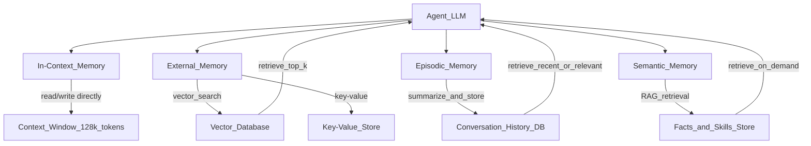

# 🧠 Memory in Agents

> [!abstract] TL;DR
> Agents need memory to function beyond a single context window. There are four types: **in-context** (current conversation, fast but limited), **external/long-term** (vector DB or key-value store, unlimited but slower), **episodic** (past conversation summaries), and **semantic** (facts and skills). Production agents combine multiple types, deciding what to store, when to retrieve, and how to compress old information.

## Intuition — Analogy First

Human memory maps almost exactly onto agent memory types:

| Human Memory | Agent Memory | Description |
|-------------|--------------|-------------|
| **Working memory** | In-context window | What you're actively thinking about right now — limited, cleared when you sleep (session ends) |
| **Long-term episodic** | Conversation history store | "Last Tuesday I met Alice at the coffee shop" — specific past events |
| **Semantic memory** | Knowledge / facts store | "Paris is the capital of France" — general facts you just know |
| **Procedural** | Skills store (few-shot examples) | "How to ride a bike" — remembered as action sequences |

A pure in-context LLM has only working memory. Every time you start a new conversation, it forgets everything. Production agents need the other three types to be useful over time.

## How It Works — Mechanics

### The Four Memory Types



### Memory 1: In-Context (Working Memory)

The context window itself — system prompt, conversation history, retrieved memories, tool results.

- Capacity: 8K–1M tokens depending on model
- Speed: instantaneous (already in memory)
- Persistence: none — cleared when session ends
- Use: current task, immediate conversation, reasoning scratch pad

### Memory 2: External Long-Term Memory

A vector database (Chroma, Pinecone, Weaviate) or KV store that persists between sessions.

- **Write**: embed important information → upsert into vector DB
- **Read**: embed query → ANN search → retrieve top-k relevant chunks
- Capacity: unlimited (disk/cloud)
- Speed: 10-100ms retrieval
- Use: user preferences, past decisions, domain knowledge

### Memory 3: Episodic Memory

Summaries of past conversations or task executions, stored and retrieved by session/time.

- **Write**: at end of conversation, LLM summarizes key events → store with timestamp
- **Read**: retrieve N most recent summaries, or search by relevance
- Capacity: unlimited with compression
- Use: remembering what was discussed in previous sessions

### Memory 4: Semantic Memory

Structured facts, user profile data, or learned skills stored as retrievable documents or structured records.

- **Write**: extract facts from conversations ("User prefers Python over JavaScript")
- **Read**: query when relevant ("What are this user's coding preferences?")
- Use: personalization, accumulated domain knowledge

### Memory Management Strategies

| Challenge | Strategy |
|-----------|---------|
| Context overflow | Sliding window, summarization, selective retention |
| Relevance decay | Time-weighted retrieval; recency bonus in scoring |
| Memory conflicts | Versioned facts; LLM judges conflicting memories |
| Privacy | Explicit memory controls; per-user namespaces |

## The Math

**Memory retrieval** is a similarity search:

$$\text{retrieved} = \text{top-}k\left\{ m_i \mid \text{sim}(\text{embed}(q), \text{embed}(m_i)) \right\}$$

Where $q$ is the query and $m_i$ are stored memory chunks.

**Compression**: when context fills up, summarize old messages:

$$\text{summary} = \text{LLM}\left(\text{"Summarize this conversation: "} + h_{1..t}\right)$$

Replace $h_{1..t}$ with summary, freeing $|h_{1..t}| - |\text{summary}|$ tokens.

**MemGPT model**: treats context window as RAM and external storage as disk. Pages memories in and out:

$$\text{context} = \text{system} + \text{paged-in memories} + \text{recent messages}$$

Main memory (context): ~4K tokens
External memory: unlimited
Page-in cost: 1 LLM call to decide what to load

## Code Demo

```python
# ── LangChain Memory Types ─────────────────────────────────────────────────
from langchain.memory import (
    ConversationBufferMemory,        # keeps full history
    ConversationSummaryMemory,       # LLM-summarizes when too long
    ConversationBufferWindowMemory,  # sliding window of last K turns
    ConversationSummaryBufferMemory, # hybrid: buffer recent, summarize old
)
from langchain_openai import ChatOpenAI
from langchain.chains import ConversationChain

llm = ChatOpenAI(model="gpt-4o-mini", temperature=0)

# Simple buffer memory — good for short conversations
buffer_memory = ConversationBufferMemory(return_messages=True)

# Summary memory — compresses when history gets long
summary_memory = ConversationSummaryMemory(llm=llm, return_messages=True)

# Hybrid — buffer last 2000 tokens, summarize the rest
hybrid_memory = ConversationSummaryBufferMemory(
    llm=llm,
    max_token_limit=2000,
    return_messages=True,
)

chain = ConversationChain(llm=llm, memory=hybrid_memory, verbose=True)
chain.invoke({"input": "My name is Alex and I'm building a RAG system"})
chain.invoke({"input": "What's the best vector database for production?"})
chain.invoke({"input": "What's my name and what am I building?"})  # tests memory


# ── Long-term Vector Memory with Chroma ─────────────────────────────────────
import chromadb
from sentence_transformers import SentenceTransformer
import uuid
from datetime import datetime

class AgentMemory:
    """Long-term agent memory backed by Chroma vector store."""
    
    def __init__(self, agent_id: str):
        self.agent_id = agent_id
        self.client = chromadb.PersistentClient(path=f"./memory/{agent_id}")
        self.model = SentenceTransformer("all-MiniLM-L6-v2")
        
        # Separate collections for different memory types
        self.episodic = self.client.get_or_create_collection("episodic")
        self.semantic = self.client.get_or_create_collection("semantic")
    
    def store_episodic(self, summary: str, session_id: str):
        """Store a conversation summary (episodic memory)."""
        embedding = self.model.encode([summary])[0].tolist()
        self.episodic.add(
            ids=[str(uuid.uuid4())],
            embeddings=[embedding],
            documents=[summary],
            metadatas=[{"session_id": session_id, "timestamp": datetime.now().isoformat()}],
        )
    
    def store_fact(self, fact: str, category: str = "general"):
        """Store a semantic fact."""
        embedding = self.model.encode([fact])[0].tolist()
        self.semantic.add(
            ids=[str(uuid.uuid4())],
            embeddings=[embedding],
            documents=[fact],
            metadatas=[{"category": category, "timestamp": datetime.now().isoformat()}],
        )
    
    def retrieve_relevant(self, query: str, n_results: int = 5) -> dict:
        """Retrieve relevant memories from both episodic and semantic stores."""
        query_embedding = self.model.encode([query])[0].tolist()
        
        episodic_results = self.episodic.query(
            query_embeddings=[query_embedding],
            n_results=min(n_results, self.episodic.count()),
        )
        semantic_results = self.semantic.query(
            query_embeddings=[query_embedding],
            n_results=min(n_results, self.semantic.count()),
        )
        
        return {
            "episodic": episodic_results["documents"][0] if episodic_results["documents"] else [],
            "semantic": semantic_results["documents"][0] if semantic_results["documents"] else [],
        }
    
    def build_memory_context(self, query: str) -> str:
        """Build a context string to inject into the LLM prompt."""
        memories = self.retrieve_relevant(query)
        context_parts = []
        
        if memories["episodic"]:
            context_parts.append("## Past Conversations\n" + "\n".join(memories["episodic"]))
        if memories["semantic"]:
            context_parts.append("## Known Facts\n" + "\n".join(memories["semantic"]))
        
        return "\n\n".join(context_parts) if context_parts else ""

# Usage
memory = AgentMemory("user-123")
memory.store_fact("User prefers Python over JavaScript", "preferences")
memory.store_fact("User is building a RAG system for legal documents", "project")
memory.store_episodic(
    "Session 2026-07-20: User asked about chunking strategies for PDFs. "
    "Decided to use recursive character text splitter with 512 token chunks.",
    session_id="session-001",
)

context = memory.build_memory_context("How should I chunk my documents?")
print(context)
```

## Real-World Example

**ChatGPT Memory** (OpenAI, 2024) is the canonical example: the model extracts facts from conversations ("User has a dog named Max", "User prefers concise answers"), stores them in a per-user semantic store, and retrieves them in future sessions. Users can view and delete stored memories.

**MemGPT** (Stanford, 2023) showed that LLMs can manage their own memory like an OS manages RAM — deciding what to page in and out of context to handle conversations longer than their context window, using the LLM itself to make eviction decisions.

**Cursor AI** maintains semantic memory of your codebase (an index of function signatures, class definitions, docstrings) and retrieves relevant code chunks into context when you ask about unfamiliar parts of a large repo.

## Trade-offs

| Dimension | In-Context | External Vector | Episodic | Semantic |
|-----------|-----------|-----------------|----------|---------|
| Speed | Instant | 10-100ms | 10-100ms | 10-100ms |
| Capacity | ~1M tokens | Unlimited | Unlimited | Unlimited |
| Relevance | Always relevant | Retrieval quality varies | Depends on summaries | Depends on extraction |
| Privacy | Session only | Persistent | Persistent | Persistent |
| Cost | Token cost | Storage + retrieval | Storage + LLM summarizer | Storage + LLM extractor |

## When to Use vs Avoid

**Use long-term memory when:**
- Agent needs to remember user preferences across sessions
- Building a personal assistant or ongoing task manager
- Conversation history is too long to fit in context

**Avoid or be cautious when:**
- Storing PII without explicit user consent
- Memory retrieval latency would break user experience
- Task is fully self-contained and stateless

## Common Pitfalls

1. **Memory hallucination** — LLM generates false memories it believes are real. Fix: ground facts in tool-verified sources before storing.
2. **Stale memories** — stored facts become outdated ("User lives in London" — they moved). Fix: timestamp memories, allow explicit updates/deletions.
3. **Too much retrieved** — dumping 10 retrieved memories into context adds noise. Fix: rank by relevance + recency, inject only top 3-5.
4. **No privacy controls** — all users share a memory namespace. Fix: per-user collection namespaces; memory access control.
5. **Compressing too aggressively** — summary loses critical details. Fix: preserve key entities, decisions, and action items explicitly.

## Related Concepts

- [[_MOC_Generative_AI|↑ Section MOC]]

- [[AI_Agents_Overview]] — memory is one of the four agent components
- [[RAG_Overview]] — memory retrieval uses the same embedding + search pipeline
- [[Vector_Databases_Overview]] — backing store for external agent memory
- [[Multi_Agent_Systems]] — shared memory enables agent coordination

## Review Questions

1. Explain the "LLM as OS" metaphor in MemGPT: what corresponds to RAM, disk, page-in, and page-out in the agent memory model?
2. A user's AI coding assistant remembers 6 months of coding sessions. Describe a memory architecture (storage format, retrieval strategy, compression policy) that keeps it responsive and useful.
3. When a long-term memory conflicts with information in the current conversation context (e.g., stored fact says "user uses Flask" but current message says "I switched to FastAPI last month"), how should an agent resolve this conflict?

## Sources

- Packer, C. et al. (2023). *MemGPT: Towards LLMs as Operating Systems*. https://arxiv.org/abs/2310.08560
- OpenAI (2024). *Memory and New Controls for ChatGPT*. https://openai.com/blog/memory-and-new-controls-for-chatgpt
- Zhong, W. et al. (2024). *MemoryBank: Enhancing Large Language Models with Long-Term Memory*. https://arxiv.org/abs/2305.10250
- LangChain Memory Docs. https://python.langchain.com/docs/modules/memory/

#agent-memory #memgpt #rag #vector-database #langchain #episodic-memory #semantic-memory
