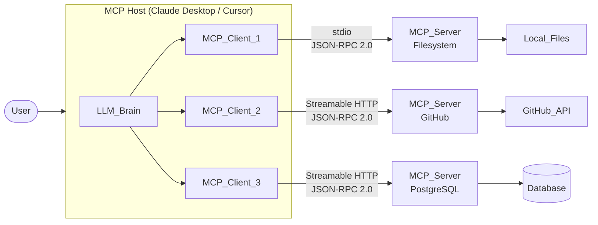
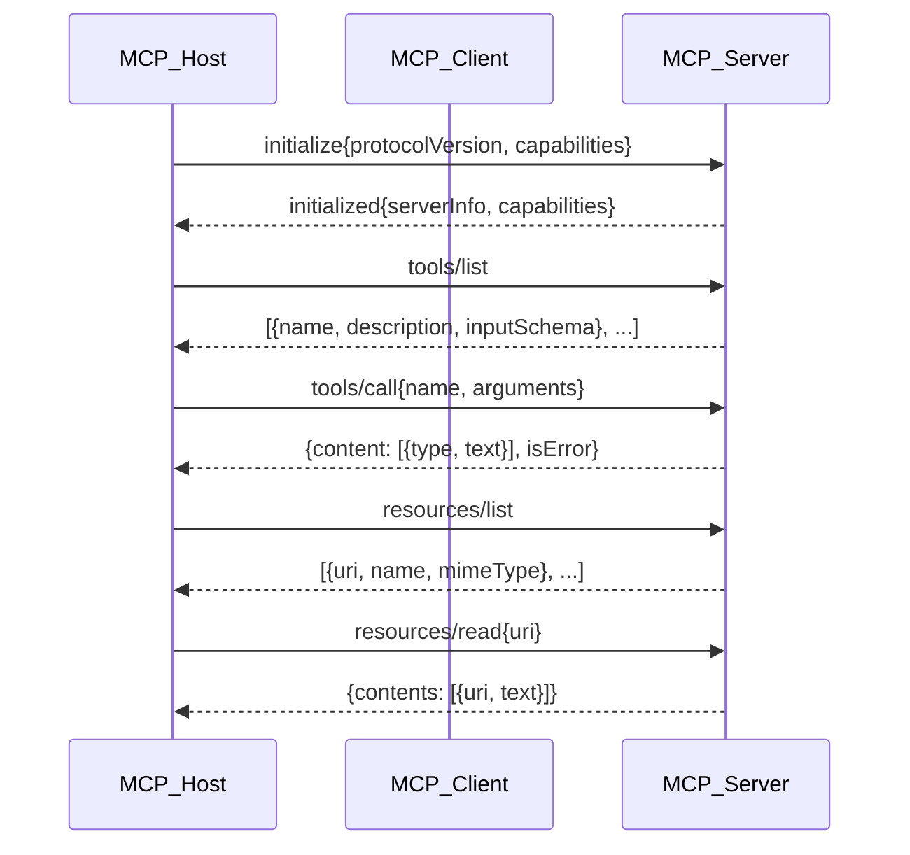

# Model Context Protocol (MCP)

> [!abstract] TL;DR
> MCP is Anthropic's open standard (launched November 2024) that gives every LLM a universal plug for connecting to external tools and data — replacing hundreds of bespoke integrations with a single protocol so that M models + N tools require only M+N adapters instead of M×N.

---

## Intuition — Analogy First

**Analogy:** Before USB, every peripheral (keyboard, mouse, printer, camera) needed its own proprietary port on the computer, and every computer maker had to build a custom connector for each device. USB replaced that chaos with one standard — any device, any computer, one cable.

MCP is the USB standard for AI agents. Before MCP, connecting Claude to a database required one integration, connecting GPT-4 to the same database required another, and adding a third model meant a third custom adapter for every tool. MCP defines a universal protocol: any model that speaks MCP can plug into any tool that speaks MCP — no bespoke wiring required.

---

## How It Works — Mechanics

### The M×N Problem

In a world without a standard protocol, every combination of model and tool requires its own custom integration:

```
M models × N tools = M×N integrations

5 models × 20 tools = 100 custom adapters to build and maintain
```

With MCP, each model implements the MCP client protocol once, and each tool implements the MCP server protocol once:

```
M models + N tools = M+N adapters total

5 models + 20 tools = 25 adapters
```

This is the same economics that made HTTP, TCP/IP, and USB transformative — standardize the interface, commoditize the implementations.

### The Three Roles

| Role | What It Is | Examples |
|------|-----------|---------|
| **MCP Host** | The application the user interacts with — owns the UI, spawns clients | Claude Desktop, Cursor, Claude Code, VS Code |
| **MCP Client** | Protocol layer embedded in the host — maintains one connection per server, sends JSON-RPC requests | Built into the host; one client per server session |
| **MCP Server** | Lightweight process that exposes capabilities through the MCP protocol | Filesystem server, GitHub server, PostgreSQL server |

The host creates one MCP client per server. Each client maintains an isolated, stateful JSON-RPC 2.0 channel with its server. Servers never communicate with each other — all routing goes through the host.

### The Three Primitives

**Tools** — Functions the LLM can call (analogous to POST endpoints).
- The LLM decides when to invoke a tool and provides arguments.
- Execution happens server-side; results are returned to the LLM.
- Example: `create_file(path, content)`, `query_database(sql)`, `send_email(to, body)`

**Resources** — Data the LLM can read (analogous to GET endpoints).
- Addressed by URI: `file:///home/user/notes.txt`, `github://repo/main/README.md`
- The LLM or host can request any resource URI; the server fetches and returns its content.
- Resources are passive — they don't trigger side effects.

**Prompts** — Reusable prompt templates defined by the server.
- The server exposes pre-built prompt templates that users can invoke.
- Templates can accept arguments to parametrize context.
- Example: a database MCP server exposes a `summarize_table` prompt template.

### Transport Layers

| Transport | Use Case | How It Works |
|-----------|---------|-------------|
| **stdio** | Local servers (desktop tools, IDE extensions) | Host spawns server as subprocess; communicate over stdin/stdout |
| **HTTP + SSE** (legacy) | Remote servers before Nov 2025 spec | Separate POST endpoint + SSE stream; two connections |
| **Streamable HTTP** (current) | Remote/cloud servers (MCP 2025-11 spec) | Single endpoint; short calls return JSON, long calls upgrade to SSE stream |

Streamable HTTP is the recommended transport for production remote servers. It uses a single POST endpoint for all JSON-RPC messages, eliminating the dual-connection complexity of the SSE approach.

### Security Model

**Permission scoping** — each MCP server declares what capabilities it exposes. Hosts enforce which servers a user can connect to, and users approve server connections before they activate.

**Sandboxing** — servers run as isolated processes. A filesystem MCP server can only read files; it cannot call network APIs unless it separately implements that capability.

**OAuth 2.1** (MCP June 2025 spec) — remote MCP servers are treated as protected OAuth resource servers. Clients obtain tokens through standard OAuth flows; the server validates tokens on every request. This enables enterprise SSO and fine-grained access control for cloud-hosted MCP servers.

### Architecture Flow



### MCP Lifecycle



---

## Code Demo

```python
# Building a minimal MCP server with FastMCP (official Python SDK)
# Install: pip install "mcp[cli]"

from mcp.server.fastmcp import FastMCP

# FastMCP handles all protocol boilerplate — declare name, describe version
mcp = FastMCP("code-tools-server", version="1.0.0")


# ── TOOL: something the LLM can call to trigger side effects ──────────────
@mcp.tool()
def run_linter(file_path: str, fix: bool = False) -> dict:
    """
    Lint a Python file using flake8 and optionally auto-fix issues.
    Use this when the user wants to check or fix code quality.
    """
    import subprocess
    cmd = ["flake8", file_path]
    result = subprocess.run(cmd, capture_output=True, text=True)
    return {
        "file": file_path,
        "issues": result.stdout.splitlines(),
        "exit_code": result.returncode,
        "fixed": fix,  # a real implementation would call autopep8
    }


@mcp.tool()
def search_codebase(query: str, file_pattern: str = "*.py") -> dict:
    """
    Search for a pattern across the codebase using ripgrep.
    Use this to find function definitions, usages, or text in code files.
    """
    import subprocess, json
    result = subprocess.run(
        ["rg", "--json", "-g", file_pattern, query, "."],
        capture_output=True, text=True
    )
    matches = []
    for line in result.stdout.splitlines():
        try:
            obj = json.loads(line)
            if obj.get("type") == "match":
                matches.append({
                    "file": obj["data"]["path"]["text"],
                    "line": obj["data"]["line_number"],
                    "text": obj["data"]["lines"]["text"].strip(),
                })
        except Exception:
            pass
    return {"query": query, "matches": matches[:20]}  # cap at 20 results


# ── RESOURCE: data the LLM can read passively ─────────────────────────────
@mcp.resource("project://readme")
def get_readme() -> str:
    """Expose the project README as a readable resource."""
    try:
        with open("README.md", "r") as f:
            return f.read()
    except FileNotFoundError:
        return "No README.md found in the current directory."


@mcp.resource("project://structure")
def get_project_structure() -> str:
    """Return a tree representation of the project's Python files."""
    import subprocess
    result = subprocess.run(
        ["find", ".", "-name", "*.py", "-not", "-path", "*/.git/*"],
        capture_output=True, text=True
    )
    return result.stdout


# ── PROMPT: a reusable prompt template the host can surface to users ───────
@mcp.prompt()
def code_review_prompt(file_path: str, focus: str = "general") -> str:
    """
    Generate a structured code review prompt for a specific file.
    Focus can be: 'security', 'performance', 'readability', or 'general'.
    """
    focus_instructions = {
        "security": "Focus on: input validation, SQL injection, auth bypasses, secrets in code.",
        "performance": "Focus on: O(n^2) loops, N+1 queries, memory leaks, blocking I/O.",
        "readability": "Focus on: naming clarity, function length, comments, code duplication.",
        "general": "Cover correctness, edge cases, error handling, and overall design.",
    }
    instruction = focus_instructions.get(focus, focus_instructions["general"])
    return (
        f"Please review the code in `{file_path}`.\n"
        f"{instruction}\n"
        f"Structure your review as: Summary | Issues (severity + line) | Suggestions."
    )


# ── Entry point ───────────────────────────────────────────────────────────
if __name__ == "__main__":
    # stdio transport: host spawns this script as a subprocess
    mcp.run()

    # For a remote HTTP server (Streamable HTTP transport):
    # mcp.run(transport="streamable-http", host="0.0.0.0", port=8000)
```

---

## MCP vs Direct Function Calling

| Dimension | MCP | Direct Function Calling | OpenAI Function Calling |
|-----------|-----|------------------------|------------------------|
| **Scope** | Universal protocol; any model, any tool | Per-model, per-app custom integration | OpenAI API only |
| **Discoverability** | Server announces tools at runtime via `tools/list` | Hardcoded at app build time | Hardcoded in API call |
| **Portability** | Same MCP server works with Claude, GPT-4, Gemini | Must rewrite for each model's API | Locked to OpenAI |
| **Integration count** | M+N (models + tools) | M×N custom integrations | M×N (within OpenAI) |
| **Latency** | Thin JSON-RPC hop (~1ms local, ~10ms remote) | Zero-hop (in-process function) | Zero-hop |
| **Composability** | Any host can use any server; servers reusable | Not reusable across apps | Not portable |
| **Security boundary** | Protocol-enforced; server is isolated process | No enforced boundary | No enforced boundary |
| **Ecosystem** | 3,000+ community MCP servers (2025) | Must build every integration yourself | OpenAI plugin ecosystem |

**When to use direct function calling instead of MCP:**
- You need sub-millisecond latency (high-frequency trading, real-time gaming)
- Tools are stateless pure functions with no external dependencies
- Your stack is 100% OpenAI and portability is not a concern
- You're prototyping and don't need reusable server infrastructure

---

## Real-World Example

> **Example:** The **GitHub MCP Server** (maintained by GitHub/Microsoft) exposes tools like `create_pull_request`, `list_issues`, `get_file_contents`, `push_files`, and `search_code`. Any MCP-compatible host (Claude Desktop, Cursor, VS Code with Copilot) connects to it without writing a single line of GitHub API integration. Before MCP, each IDE had to build and maintain its own GitHub connector. With MCP, GitHub builds it once and every host gets it for free.

Other production MCP servers in wide use:
- **Filesystem MCP** (official) — reads/writes local files; used by Claude Desktop for file editing tasks
- **PostgreSQL MCP** — executes SQL, reads schema; LLM can query databases conversationally
- **Brave Search MCP** — web search without a custom API wrapper
- **Slack MCP** — reads channels, posts messages; enables AI agents that monitor and respond to Slack
- **Sentry MCP** — fetches error traces; lets the LLM diagnose production bugs from within the IDE

---

## A2A: Agent-to-Agent Protocol

MCP solves the agent-to-tool problem. **A2A (Agent-to-Agent)**, announced by Google in April 2025 and donated to the Linux Foundation in June 2025, solves the agent-to-agent problem.

| Protocol | Relationship | Transport | Discovery Mechanism |
|----------|-------------|-----------|-------------------|
| **MCP** | Agent ↔ Tool/Data | stdio, Streamable HTTP | `tools/list`, `resources/list` |
| **A2A** | Agent ↔ Agent | HTTP, SSE, JSON-RPC 2.0 | Agent Cards (machine-readable capability docs) |

**How they compose:** An orchestrator agent discovers peer agents via A2A Agent Cards, delegates subtasks to them over A2A, and each peer agent uses MCP to access its own tools and data. MCP is the leaf-level protocol; A2A is the coordination layer above it.

---

## Deployment Modes

**Local desktop (stdio):**
- Host spawns server as a subprocess on the user's machine
- Zero network latency; no authentication needed
- Suitable for: filesystem, local databases, local dev tools
- User manages server installation (e.g., via `npx`, `uvx`, or binary)

**Remote/cloud (Streamable HTTP + OAuth 2.1):**
- Server runs as a persistent HTTPS endpoint
- Host authenticates via OAuth 2.1 before first request
- Suitable for: SaaS APIs, shared enterprise tools, multi-tenant deployments
- Server can scale horizontally (stateless session design in MCP 2026 spec)

---

## Trade-offs

| Aspect | Pro | Con |
|--------|-----|-----|
| **Standardization** | One protocol for all integrations; reusable servers | Adds protocol overhead vs in-process calls |
| **Portability** | Any MCP-compatible model can use any server | Requires both sides to implement the spec |
| **Security** | Servers are isolated processes; OAuth 2.1 for remote | Misconfigured servers can still over-scope permissions |
| **Ecosystem** | 3,000+ community servers; growing rapidly | Quality varies widely across community servers |
| **Latency** | Local stdio is near-zero; minimal vs custom | Remote Streamable HTTP adds one network hop |
| **Discoverability** | Dynamic tool discovery at runtime | LLM still needs good tool descriptions to choose correctly |

---

## When to Use vs Avoid

**Use MCP when:**
- Building agents that need to connect to multiple tools or data sources
- You want tool implementations to be reusable across models and apps
- Your team ships an API or service and wants AI agents to discover it automatically
- You need a security boundary between the LLM host and tool execution
- Building for Claude Desktop, Claude Code, Cursor, or any MCP-compatible host

**Avoid MCP when:**
- You need in-process function calls with minimal latency overhead
- You are 100% locked into one model vendor and need no portability
- The tool is a trivial pure function (no external I/O, no isolation needed)
- You are still prototyping and don't need the operational overhead of a server process

---

## Common Pitfalls

- **Poor tool descriptions** — MCP servers inherit the same problem as raw function calling: if `description` and `inputSchema` descriptions are vague, the LLM picks the wrong tool or passes wrong arguments. Treat every description as a doc string the LLM will use to make routing decisions.
- **Overloading one server** — stuffing 50 tools into a single MCP server floods the LLM's tool list. Group logically related tools into separate servers; hosts can load only the servers relevant to the task.
- **Skipping OAuth for remote servers** — shipping a remote MCP server without authentication means any MCP client that knows the URL can access it. Always implement OAuth 2.1 for cloud-hosted servers.
- **Mutable resource URIs** — if a resource URI changes between requests (e.g., includes a timestamp), the LLM cannot cache or reliably re-request it. Use stable, addressable URIs.
- **No error structure in tool responses** — returning an unstructured string error instead of `{"isError": true, "content": [{"type": "text", "text": "..."}]}` prevents the LLM from understanding that the call failed and reasoning about recovery.
- **Ignoring the stdio vs HTTP distinction** — local stdio servers block on startup in the host process; if the subprocess crashes, the client silently loses the connection. Implement health-check logic and reconnection in the host.
- **Trusting MCP server claims blindly** — a malicious MCP server can describe itself with misleading tool names to perform prompt injection. Hosts should only connect to servers from trusted, verified sources.

---

## Related Concepts

- [[_MOC_Generative_AI|Section MOC]]

- [[Tool_Use_and_Function_Calling]] — MCP builds on function calling semantics; understanding raw tool use explains why MCP's protocol layer adds value
- [[AI_Agents_Overview]] — MCP is the integration layer that makes real-world agents practical; agents use MCP servers as their tool ecosystem
- [[Multi_Agent_Systems]] — MCP tools can themselves be agents; A2A complements MCP at the agent-to-agent coordination layer
- [[ReAct_Pattern]] — the reasoning loop inside the host LLM that decides which MCP tool to call and when
- [[LangChain]] — LangChain supports MCP servers as tool providers; `langchain-mcp-adapters` bridges LCEL chains to any MCP server
- [[LlamaIndex]] — LlamaIndex exposes MCP server support for tool use in query pipelines and agents

---

## Review Questions

1. Explain the M×N integration problem that MCP solves. If a team has 8 models and 30 tools, how many integrations does MCP require versus a bespoke approach — and what organizational benefit does this create beyond the arithmetic?
2. A user asks you to build a production MCP server that gives Claude access to your company's internal HR database. Which transport would you use, what authentication mechanism is required by the 2025 spec, and what permission scoping decisions must you make before shipping?
3. MCP Tools, Resources, and Prompts are three distinct primitives. For each of the following, identify which primitive is most appropriate and why: (a) reading a customer's order history, (b) placing a new order, (c) generating a structured customer support reply.

---

## Sources

- [Anthropic: Introducing the Model Context Protocol](https://www.anthropic.com/news/model-context-protocol)
- [MCP Official Specification (2025-06-18)](https://modelcontextprotocol.io/specification/2025-06-18)
- [MCP Python SDK — Official Repository](https://github.com/modelcontextprotocol/python-sdk)
- [MCP Python SDK Documentation](https://py.sdk.modelcontextprotocol.io/)
- [Complete Guide to MCP in 2026 — DEV Community](https://dev.to/x4nent/complete-guide-to-mcp-model-context-protocol-in-2026-architecture-implementation-and-4a11)
- [MCP vs Function Calling: How They Differ — Descope](https://www.descope.com/blog/post/mcp-vs-function-calling)
- [Google A2A Protocol: How Agent-to-Agent Coordination Works — Atlan](https://atlan.com/know/google-a2a-protocol/)
- [Google A2A and Anthropic MCP Comparison — Gravitee](https://www.gravitee.io/blog/googles-agent-to-agent-a2a-and-anthropics-model-context-protocol-mcp)
- [MCP 2025-06-18 Spec Update: Security and Structured Output — ForgeCode](https://forgecode.dev/blog/mcp-spec-updates/)

---

#mcp #model-context-protocol #agents #tool-use #anthropic #protocol #agentic-ai #generative-ai
